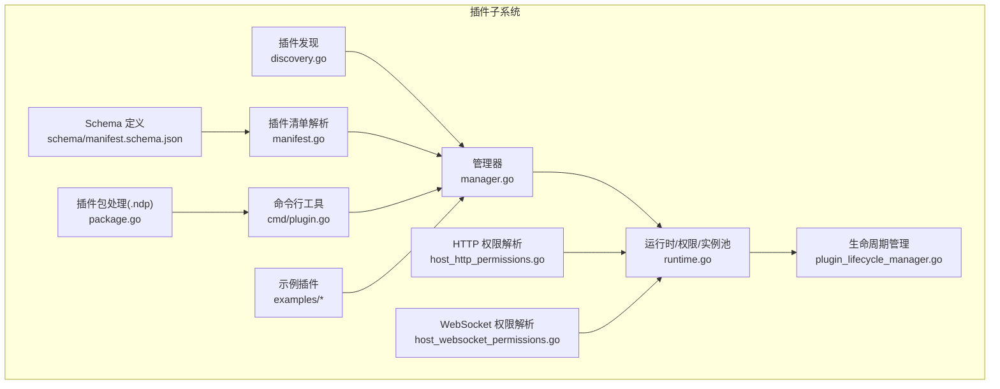
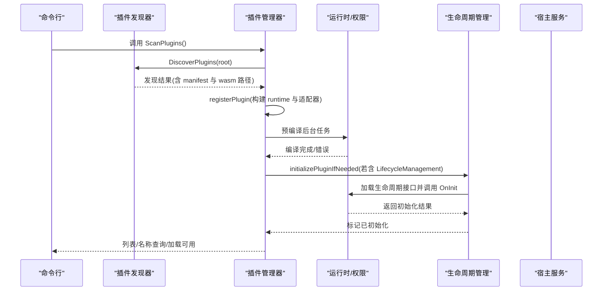
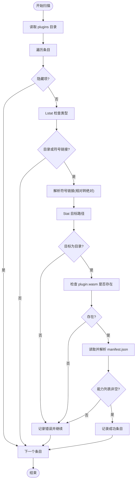
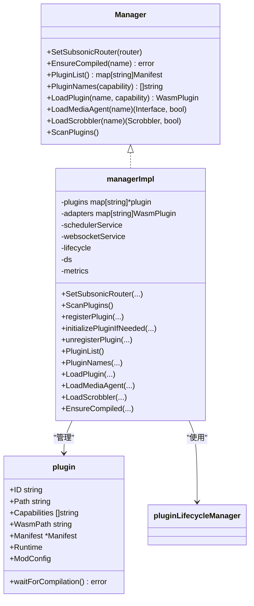
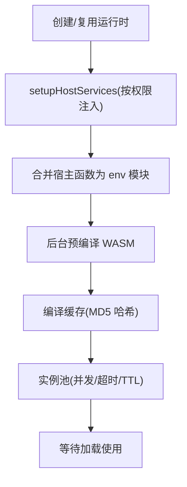
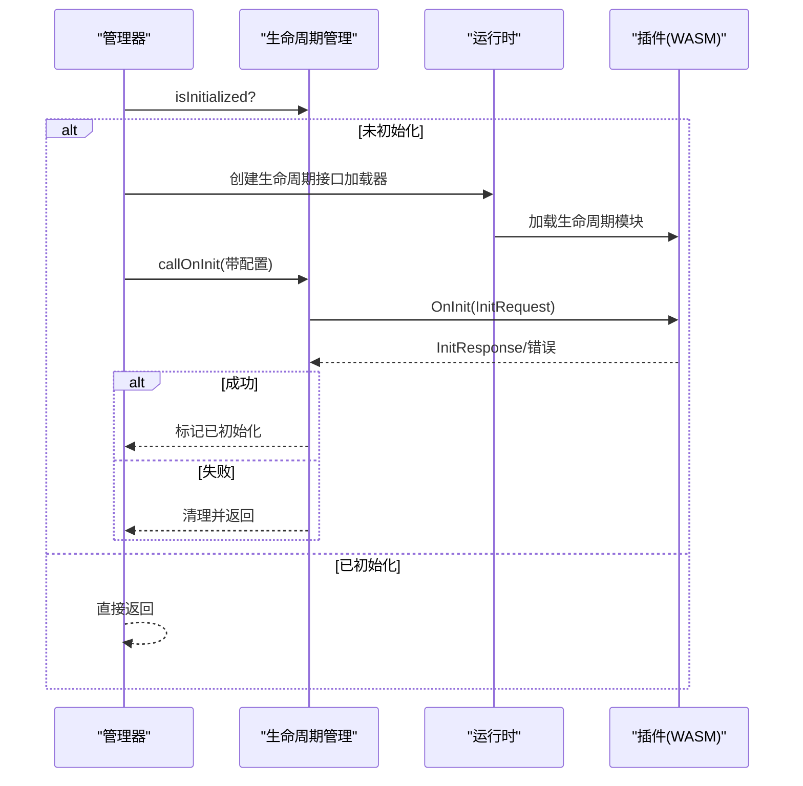
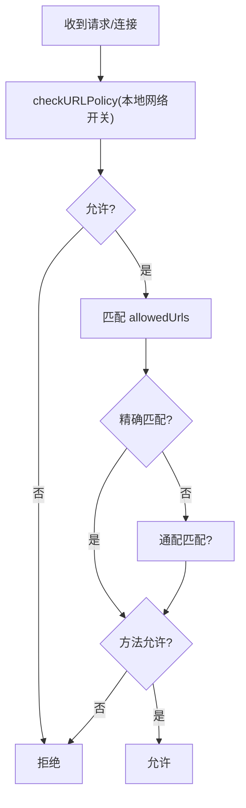
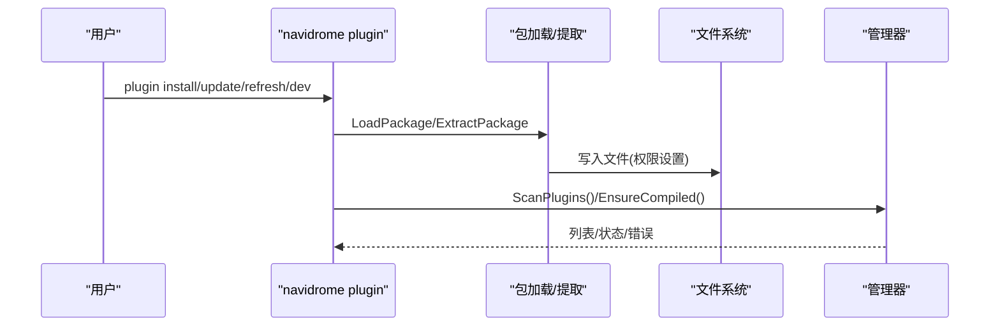
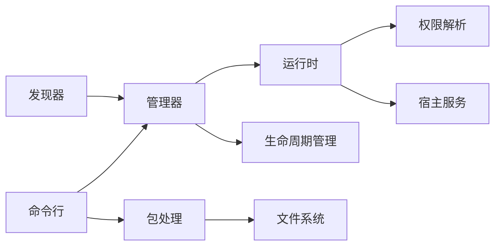

# 插件管理

<cite>
**本文引用的文件**
- [manager.go](file://plugins/manager.go)
- [discovery.go](file://plugins/discovery.go)
- [manifest.go](file://plugins/manifest.go)
- [package.go](file://plugins/package.go)
- [runtime.go](file://plugins/runtime.go)
- [plugin_lifecycle_manager.go](file://plugins/plugin_lifecycle_manager.go)
- [host_http_permissions.go](file://plugins/host_http_permissions.go)
- [host_websocket_permissions.go](file://plugins/host_websocket_permissions.go)
- [plugin.go](file://cmd/plugin.go)
- [manifest.schema.json](file://plugins/schema/manifest.schema.json)
- [plugin.go（示例：crypto-ticker）](file://plugins/examples/crypto-ticker/plugin.go)
- [manifest.json（示例：crypto-ticker）](file://plugins/examples/crypto-ticker/manifest.json)
- [plugin.go（示例：discord-rich-presence）](file://plugins/examples/discord-rich-presence/plugin.go)
- [manifest.json（示例：discord-rich-presence）](file://plugins/examples/discord-rich-presence/manifest.json)
</cite>

## 目录
1. [简介](#简介)
2. [项目结构](#项目结构)
3. [核心组件](#核心组件)
4. [架构总览](#架构总览)
5. [详细组件分析](#详细组件分析)
6. [依赖关系分析](#依赖关系分析)
7. [性能考量](#性能考量)
8. [故障排查指南](#故障排查指南)
9. [结论](#结论)
10. [附录](#附录)

## 简介
本文件面向系统管理员与开发者，全面阐述 Navidrome 插件管理系统的实现与使用方法。内容涵盖：
- 插件发现机制：如何扫描 plugins 目录并识别有效插件包
- 插件管理器工作流：加载、验证、启动与卸载
- 插件状态与生命周期：激活、停用、错误处理与优雅关闭
- 元数据解析与权限校验：manifest.json 的结构与权限策略
- 生命周期管理细节：启动前检查、运行时监控与刷新
- 最佳实践：安全、性能与故障排查建议

## 项目结构
Navidrome 插件子系统位于 plugins 目录，包含以下关键部分：
- 管理层：插件发现、注册、加载与生命周期管理
- 运行时：WASM 编译缓存、实例池、权限注入与宿主服务绑定
- 命令行工具：安装、更新、移除、刷新与信息展示
- 示例插件：演示能力与权限配置
- Schema：manifest.json 的 JSON Schema 定义

图表来源
- [discovery.go](file://plugins/discovery.go#L1-L146)
- [manifest.go](file://plugins/manifest.go#L1-L31)
- [package.go](file://plugins/package.go#L1-L178)
- [manager.go](file://plugins/manager.go#L1-L422)
- [runtime.go](file://plugins/runtime.go#L1-L627)
- [plugin_lifecycle_manager.go](file://plugins/plugin_lifecycle_manager.go#L1-L96)
- [host_http_permissions.go](file://plugins/host_http_permissions.go#L1-L91)
- [host_websocket_permissions.go](file://plugins/host_websocket_permissions.go#L1-L77)
- [plugin.go](file://cmd/plugin.go#L1-L717)
- [manifest.schema.json](file://plugins/schema/manifest.schema.json#L1-L200)

章节来源
- [manager.go](file://plugins/manager.go#L1-L120)
- [discovery.go](file://plugins/discovery.go#L1-L146)
- [manifest.go](file://plugins/manifest.go#L1-L31)
- [package.go](file://plugins/package.go#L1-L178)
- [runtime.go](file://plugins/runtime.go#L1-L120)
- [plugin_lifecycle_manager.go](file://plugins/plugin_lifecycle_manager.go#L1-L96)
- [host_http_permissions.go](file://plugins/host_http_permissions.go#L1-L91)
- [host_websocket_permissions.go](file://plugins/host_websocket_permissions.go#L1-L77)
- [plugin.go](file://cmd/plugin.go#L1-L120)
- [manifest.schema.json](file://plugins/schema/manifest.schema.json#L1-L200)

## 核心组件
- 插件发现器：遍历 plugins 目录，识别目录或符号链接，校验 plugin.wasm 存在性，读取并校验 manifest.json，收集能力列表
- 插件管理器：注册插件、构建运行时、适配器映射、并发编译预热、初始化生命周期
- 运行时与权限：基于 manifest 权限动态注入宿主函数，限制网络访问，缓存编译模块与实例池
- 生命周期管理：按版本标记初始化状态，调用 OnInit 并记录指标
- 命令行工具：安装/更新/移除/刷新插件，显示清单与权限详情
- 示例插件：展示能力与权限配置的实际用法

章节来源
- [manager.go](file://plugins/manager.go#L121-L210)
- [runtime.go](file://plugins/runtime.go#L121-L210)
- [plugin_lifecycle_manager.go](file://plugins/plugin_lifecycle_manager.go#L1-L96)
- [plugin.go](file://cmd/plugin.go#L400-L580)

## 架构总览
下图展示了从发现到运行时注入、再到生命周期初始化的整体流程。

图表来源
- [manager.go](file://plugins/manager.go#L235-L300)
- [discovery.go](file://plugins/discovery.go#L21-L146)
- [runtime.go](file://plugins/runtime.go#L266-L303)
- [plugin_lifecycle_manager.go](file://plugins/plugin_lifecycle_manager.go#L51-L96)

## 详细组件分析

### 插件发现机制
- 扫描策略：读取 plugins 目录，跳过隐藏项；支持目录与符号链接；对符号链接解析目标路径并校验为目录
- 必备文件：每个插件目录必须存在 plugin.wasm；manifest.json 必须可读且通过 schema 校验
- 能力要求：manifest 中至少包含一个能力枚举
- 结果聚合：返回包含 ID、路径、WASM 路径、清单与是否为符号链接的条目；失败项携带错误

图表来源
- [discovery.go](file://plugins/discovery.go#L21-L146)

章节来源
- [discovery.go](file://plugins/discovery.go#L21-L146)

### 插件管理器（Manager）
- 单例模式：根据配置启用/禁用插件功能，返回空操作实现或真实管理器
- 注册流程：为每个能力构造适配器，建立 pluginID + 能力 -> 适配器 映射；记录开发模式（符号链接）
- 初始化触发：若插件声明生命周期能力，则在后台预编译完成后尝试 OnInit
- 查询接口：列出清单、按能力筛选插件名、按能力加载适配器实例
- 卸载清理：清除初始化状态、注销适配器、删除插件登记

图表来源
- [manager.go](file://plugins/manager.go#L87-L210)

章节来源
- [manager.go](file://plugins/manager.go#L111-L210)

### 运行时与权限注入
- 运行时创建：按插件 ID 复用运行时，避免重复初始化；结合 WASI 预览模块
- 权限注入：仅注入 manifest 中允许的服务与方法；HTTP/WebSocket 权限进行 URL 匹配与本地网络开关控制
- 编译缓存：全局编译缓存目录，按大小清理；并发编译信号量限制
- 实例池：每插件维护实例池，限制最大并发与 TTL，降低实例创建开销
- 预编译：后台读取 WASM 字节并编译，超时与错误记录，通道通知等待方

图表来源
- [runtime.go](file://plugins/runtime.go#L42-L163)
- [runtime.go](file://plugins/runtime.go#L242-L303)
- [runtime.go](file://plugins/runtime.go#L515-L627)

章节来源
- [runtime.go](file://plugins/runtime.go#L42-L163)
- [runtime.go](file://plugins/runtime.go#L242-L303)
- [runtime.go](file://plugins/runtime.go#L515-L627)

### 生命周期管理
- 初始化标记：以插件 ID + 版本为键，避免重复初始化
- OnInit 调用：通过生命周期接口加载插件，传入插件配置，记录耗时指标
- 错误处理：初始化失败则注销插件，清理适配器与初始化状态

图表来源
- [plugin_lifecycle_manager.go](file://plugins/plugin_lifecycle_manager.go#L32-L96)
- [manager.go](file://plugins/manager.go#L197-L210)

章节来源
- [plugin_lifecycle_manager.go](file://plugins/plugin_lifecycle_manager.go#L1-L96)
- [manager.go](file://plugins/manager.go#L197-L210)

### 权限验证机制
- HTTP 权限：必须提供 allowedUrls，支持精确与通配匹配；区分方法；可选择允许本地网络
- WebSocket 权限：必须提供 allowedUrls，支持精确与通配匹配；可选择允许本地网络
- 策略执行：请求前检查 URL 与本地网络策略，再匹配允许列表与方法

图表来源
- [host_http_permissions.go](file://plugins/host_http_permissions.go#L1-L91)
- [host_websocket_permissions.go](file://plugins/host_websocket_permissions.go#L1-L77)

章节来源
- [host_http_permissions.go](file://plugins/host_http_permissions.go#L1-L91)
- [host_websocket_permissions.go](file://plugins/host_websocket_permissions.go#L1-L77)

### 插件包与命令行管理
- .ndp 包：包含 manifest.json 与 plugin.wasm，可选文档文件；提取时进行路径校验与权限设置
- 命令行：
  - list/info/install/remove/update/refresh/dev
  - 支持开发模式：创建符号链接指向源目录
  - 刷新：扫描目录、等待编译完成、输出结果

图表来源
- [package.go](file://plugins/package.go#L1-L178)
- [plugin.go](file://cmd/plugin.go#L400-L717)

章节来源
- [package.go](file://plugins/package.go#L1-L178)
- [plugin.go](file://cmd/plugin.go#L1-L120)
- [plugin.go](file://cmd/plugin.go#L400-L717)

### 示例插件参考
- crypto-ticker：演示 WebSocketCallback、LifecycleManagement、SchedulerCallback 能力与 HTTP/WebSocket 权限
- discord-rich-presence：演示 Scrobbler、WebSocketCallback、SchedulerCallback 能力与多类权限

章节来源
- [plugin.go（示例：crypto-ticker）](file://plugins/examples/crypto-ticker/plugin.go#L1-L305)
- [manifest.json（示例：crypto-ticker）](file://plugins/examples/crypto-ticker/manifest.json#L1-L26)
- [plugin.go（示例：discord-rich-presence）](file://plugins/examples/discord-rich-presence/plugin.go#L1-L187)
- [manifest.json（示例：discord-rich-presence）](file://plugins/examples/discord-rich-presence/manifest.json#L1-L36)

## 依赖关系分析
- 组件耦合
  - 管理器依赖发现器、运行时、生命周期管理器与宿主服务
  - 运行时依赖权限解析与宿主服务生成器
  - 命令行工具依赖包处理与管理器
- 外部依赖
  - wazero 用于 WASM 编译与实例化
  - JSON Schema 用于 manifest 校验
- 循环依赖
  - 通过接口与单例避免循环导入

图表来源
- [manager.go](file://plugins/manager.go#L121-L210)
- [runtime.go](file://plugins/runtime.go#L96-L163)
- [host_http_permissions.go](file://plugins/host_http_permissions.go#L1-L91)
- [host_websocket_permissions.go](file://plugins/host_websocket_permissions.go#L1-L77)
- [plugin.go](file://cmd/plugin.go#L1-L120)
- [package.go](file://plugins/package.go#L1-L178)

章节来源
- [manager.go](file://plugins/manager.go#L121-L210)
- [runtime.go](file://plugins/runtime.go#L96-L163)
- [plugin.go](file://cmd/plugin.go#L1-L120)
- [package.go](file://plugins/package.go#L1-L178)

## 性能考量
- 并发编译限制：通过信号量限制同时编译数量，避免资源争用
- 编译缓存：基于目录与 MD5 哈希缓存编译产物，减少重复编译
- 实例池：复用模块实例，限制最大并发与 TTL，降低创建/销毁成本
- 预编译：后台预热，缩短首次使用延迟
- 日志与指标：记录初始化耗时与请求耗时，便于性能分析

章节来源
- [runtime.go](file://plugins/runtime.go#L33-L41)
- [runtime.go](file://plugins/runtime.go#L242-L303)
- [runtime.go](file://plugins/runtime.go#L515-L627)
- [plugin_lifecycle_manager.go](file://plugins/plugin_lifecycle_manager.go#L51-L96)

## 故障排查指南
- 插件未被发现
  - 检查 plugins 目录权限与可见性
  - 确认目录内存在 plugin.wasm
  - 确认 manifest.json 可读且能力列表非空
- 启动后无法加载
  - 使用刷新命令重新扫描并等待编译完成
  - 查看日志中的编译超时与错误
- 权限被拒
  - 检查 manifest 中的 http/websocket 权限配置
  - 确认 URL 模式与方法匹配，本地网络开关符合预期
- 生命周期初始化失败
  - 查看 OnInit 输出与错误日志
  - 确认插件配置已正确传递
- 开发模式问题
  - 确认符号链接指向有效目录
  - 使用刷新命令观察后台编译状态

章节来源
- [discovery.go](file://plugins/discovery.go#L21-L146)
- [runtime.go](file://plugins/runtime.go#L266-L303)
- [host_http_permissions.go](file://plugins/host_http_permissions.go#L1-L91)
- [host_websocket_permissions.go](file://plugins/host_websocket_permissions.go#L1-L77)
- [plugin_lifecycle_manager.go](file://plugins/plugin_lifecycle_manager.go#L51-L96)
- [plugin.go](file://cmd/plugin.go#L542-L576)

## 结论
Navidrome 插件系统通过清晰的发现、注册、运行时注入与生命周期管理，实现了安全可控的扩展能力。权限模型与编译/实例池优化确保了性能与稳定性。管理员可通过命令行工具高效管理插件，配合示例插件快速理解能力与权限配置。

## 附录

### 插件清单字段与权限说明
- 必填字段：name、author、version、description、website、capabilities、permissions
- capabilities：枚举值包括 MetadataAgent、Scrobbler、SchedulerCallback、LifecycleManagement、WebSocketCallback
- permissions：按需声明 http、config、scheduler、websocket、cache、artwork、subsonicapi
- subsonicapi 权限：可限定允许用户名与管理员权限

章节来源
- [manifest.schema.json](file://plugins/schema/manifest.schema.json#L1-L200)

### 插件能力与适配器映射
- MetadataAgent -> 新建媒体代理适配器
- Scrobbler -> 新建 Scrobbler 适配器
- SchedulerCallback -> 新建调度回调适配器
- WebSocketCallback -> 新建 WebSocket 回调适配器
- LifecycleManagement -> 生命周期管理（无专用适配器）

章节来源
- [manager.go](file://plugins/manager.go#L42-L51)

### 命令行最佳实践
- 安装/更新：优先使用 .ndp 包，自动设置权限
- 移除：开发模式下移除符号链接保留源目录
- 刷新：无需重启，后台重新扫描与编译
- 信息：使用 info 查看清单与权限详情

章节来源
- [plugin.go](file://cmd/plugin.go#L400-L717)