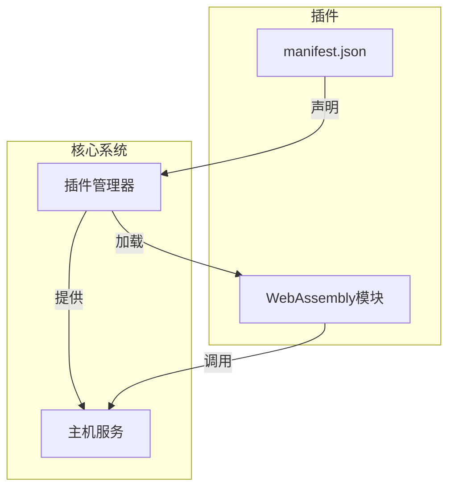
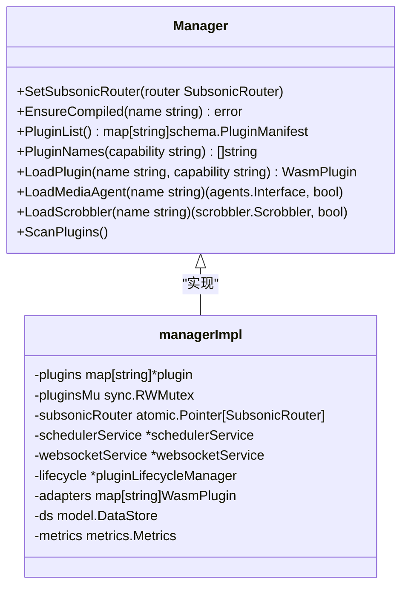
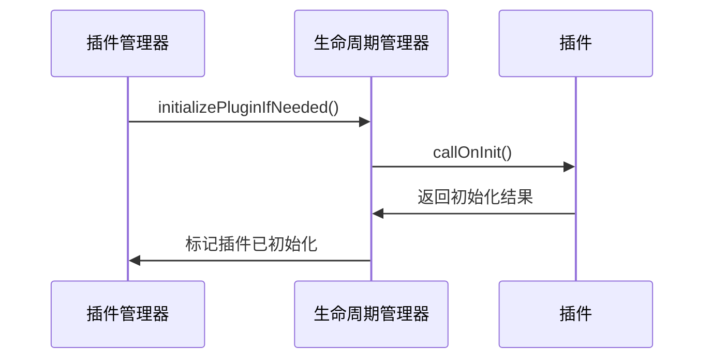

# 插件系统

<cite>
**本文档引用的文件**   
- [README.md](file://plugins/README.md)
- [manager.go](file://plugins/manager.go)
- [runtime.go](file://plugins/runtime.go)
- [discovery.go](file://plugins/discovery.go)
- [manifest.go](file://plugins/manifest.go)
- [plugin_lifecycle_manager.go](file://plugins/plugin_lifecycle_manager.go)
- [api.proto](file://plugins/api/api.proto)
- [adapter_media_agent.go](file://plugins/adapter_media_agent.go)
- [adapter_scrobbler.go](file://plugins/adapter_scrobbler.go)
- [host_http_permissions.go](file://plugins/host_http_permissions.go)
- [host_websocket_permissions.go](file://plugins/host_websocket_permissions.go)
- [host_network_permissions_base.go](file://plugins/host_network_permissions_base.go)
- [wasm_instance_pool.go](file://plugins/wasm_instance_pool.go)
- [schema/manifest.schema.json](file://plugins/schema/manifest.schema.json)
- [examples/coverartarchive/manifest.json](file://plugins/examples/coverartarchive/manifest.json)
- [examples/discord-rich-presence/manifest.json](file://plugins/examples/discord-rich-presence/manifest.json)
</cite>

## 目录
1. [简介](#简介)
2. [架构概述](#架构概述)
3. [插件开发流程](#插件开发流程)
4. [插件生命周期管理](#插件生命周期管理)
5. [权限控制与安全沙箱](#权限控制与安全沙箱)
6. [实际插件示例](#实际插件示例)
7. [插件与核心系统集成](#插件与核心系统集成)
8. [开发者指南与调试技巧](#开发者指南与调试技巧)

## 简介

Navidrome的插件系统是一个基于WebAssembly（WASM）的扩展机制，允许开发者在不修改核心代码库的情况下扩展Navidrome的功能。该系统通过Protocol Buffers（protobuf）协议与WASM运行时进行通信，为插件提供了多种能力，包括元数据获取、播放记录、定时任务和WebSocket通信等。

插件系统的设计遵循安全优先原则，通过权限系统严格控制插件对主机服务的访问。每个插件在独立的沙箱环境中运行，确保了系统的安全性和稳定性。此外，系统还实现了WASM模块的预编译和缓存，以减少启动时间并提高性能。

**Section sources**
- [README.md](file://plugins/README.md#L1-L80)

## 架构概述

Navidrome插件系统的架构由多个关键组件构成，包括插件管理器、插件协议、适配器和主机服务。这些组件协同工作，确保插件能够安全、高效地与核心系统交互。



**Diagram sources **
- [manager.go](file://plugins/manager.go#L34-L40)
- [runtime.go](file://plugins/runtime.go#L42-L70)

### 插件管理器

插件管理器是插件系统的核心组件，负责扫描、加载和管理插件。它通过`GetManager`函数返回一个单例实例，确保在整个应用程序中只有一个管理器实例。管理器的主要职责包括：

- 扫描配置的插件目录，发现所有有效的插件。
- 加载和编译插件的WASM模块。
- 提供对已加载插件的访问，通过能力特定的接口。



**Diagram sources **
- [manager.go](file://plugins/manager.go#L87-L96)

### 插件协议

插件与Navidrome之间的通信基于Protocol Buffers（protobuf）协议。该协议定义了插件可以实现的各种能力，如元数据代理、播放记录器、定时回调和WebSocket回调等。协议文件`api.proto`详细描述了这些能力的接口和消息类型。

**Section sources**
- [api.proto](file://plugins/api/api.proto#L1-L246)

### 适配器

适配器桥接了插件API和Navidrome的内部接口。例如，`wasmMediaAgent`将`MetadataAgent`适配到内部的`agents.Interface`，而`wasmScrobblerPlugin`将`Scrobbler`适配到内部的`scrobbler.Scrobbler`。这些适配器确保了插件能够无缝地与核心系统集成。

**Section sources**
- [adapter_media_agent.go](file://plugins/adapter_media_agent.go#L1-L167)
- [adapter_scrobbler.go](file://plugins/adapter_scrobbler.go#L1-L137)

### 主机服务

Navidrome提供了多种主机服务，插件可以通过这些服务访问外部功能，如HTTP请求、定时任务和WebSocket通信。这些服务在`plugins/host/`目录下定义，并在相应的主机文件中实现。例如，HTTP服务允许插件发起外部请求，而缓存服务则提供了基于TTL的缓存机制。

**Section sources**
- [runtime.go](file://plugins/runtime.go#L97-L163)

## 插件开发流程

开发Navidrome插件需要遵循一系列步骤，从创建`manifest.json`文件到实现插件逻辑。以下是详细的开发流程。

### 创建manifest.json

`manifest.json`文件是插件的配置文件，包含了插件的基本信息和所需权限。以下是一个典型的`manifest.json`文件示例：

```json
{
  "$schema": "https://raw.githubusercontent.com/navidrome/navidrome/refs/heads/master/plugins/schema/manifest.schema.json",
  "name": "coverartarchive",
  "author": "Navidrome",
  "version": "1.0.0",
  "description": "Album cover art from the Cover Art Archive",
  "website": "https://coverartarchive.org",
  "capabilities": ["MetadataAgent"],
  "permissions": {
    "http": {
      "reason": "To fetch album cover art from the Cover Art Archive API",
      "allowedUrls": {
        "https://coverartarchive.org": ["GET"],
        "https://*.archive.org": ["GET"]
      },
      "allowLocalNetwork": false
    }
  }
}
```

该文件定义了插件的名称、作者、版本、描述、网站、能力以及权限。权限部分特别重要，因为它决定了插件可以访问哪些主机服务。

**Section sources**
- [examples/coverartarchive/manifest.json](file://plugins/examples/coverartarchive/manifest.json#L1-L20)

### 实现插件逻辑

插件逻辑的实现依赖于WASM运行时和protobuf协议。开发者需要使用支持WASM的编程语言（如Go、Rust等）编写插件代码，并将其编译为WASM模块。插件代码应实现`api.proto`中定义的相应接口。

例如，对于`MetadataAgent`能力，插件需要实现`GetArtistInfo`、`GetAlbumInfo`等方法。这些方法通过HTTP请求从外部API获取数据，并返回给核心系统。

**Section sources**
- [api.proto](file://plugins/api/api.proto#L8-L20)

## 插件生命周期管理

插件的生命周期管理由`pluginLifecycleManager`负责，它跟踪哪些插件已被初始化，并管理其生命周期。当插件实现`LifecycleManagement`能力时，`OnInit`方法会在插件加载时被调用一次。



**Diagram sources **
- [plugin_lifecycle_manager.go](file://plugins/plugin_lifecycle_manager.go#L51-L95)

### 初始化过程

插件的初始化过程包括以下几个步骤：

1. **检查是否已初始化**：通过`isInitialized`方法检查插件是否已经初始化过。
2. **调用OnInit方法**：如果插件实现了`LifecycleManagement`能力，则调用`OnInit`方法进行初始化。
3. **标记已初始化**：成功初始化后，通过`markInitialized`方法标记插件为已初始化状态。

**Section sources**
- [plugin_lifecycle_manager.go](file://plugins/plugin_lifecycle_manager.go#L32-L49)

## 权限控制与安全沙箱

Navidrome的权限系统确保了插件只能访问其声明的主机服务，从而实现了安全沙箱机制。该系统在加载时强制执行，只有在插件的权限列表中明确声明的服务才会被加载到其WASM运行时环境中。

### 权限声明

权限在`manifest.json`文件中声明，每个权限都必须包含一个`reason`字段，解释为什么需要该权限。例如，HTTP权限需要指定允许的URL模式和HTTP方法。

```json
{
  "permissions": {
    "http": {
      "reason": "To fetch metadata from external APIs",
      "allowedUrls": {
        "https://api.musicbrainz.org": ["GET"],
        "https://coverartarchive.org": ["GET"]
      },
      "allowLocalNetwork": false
    }
  }
}
```

**Section sources**
- [host_http_permissions.go](file://plugins/host_http_permissions.go#L14-L18)

### 安全模型

权限系统提供了多层安全保障：

- **最小权限原则**：插件从零权限开始，仅能访问明确请求的服务。
- **加载时强制执行**：未经授权的服务不会被加载到WASM运行时中，无法在运行时绕过限制。
- **服务隔离**：每个插件都有独立的服务实例，防止相互干扰。

**Section sources**
- [host_http_permissions.go](file://plugins/host_http_permissions.go#L47-L90)

## 实际插件示例

### coverartarchive插件

`coverartarchive`插件是一个典型的元数据代理插件，用于从Cover Art Archive API获取专辑封面。它声明了HTTP权限，允许向特定URL发起GET请求。

```json
{
  "permissions": {
    "http": {
      "reason": "To fetch album cover art from the Cover Art Archive API",
      "allowedUrls": {
        "https://coverartarchive.org": ["GET"],
        "https://*.archive.org": ["GET"]
      },
      "allowLocalNetwork": false
    }
  }
}
```

**Section sources**
- [examples/coverartarchive/manifest.json](file://plugins/examples/coverartarchive/manifest.json#L1-L20)

### discord-rich-presence插件

`discord-rich-presence`插件集成了Discord的Rich Presence功能，允许用户在Discord中显示正在播放的音乐信息。它声明了多种权限，包括HTTP、WebSocket、缓存和定时任务。

```json
{
  "permissions": {
    "http": {
      "reason": "To communicate with Discord API for gateway discovery and image uploads",
      "allowedUrls": {
        "https://discord.com/api/*": ["GET", "POST"]
      },
      "allowLocalNetwork": false
    },
    "websocket": {
      "reason": "To maintain real-time connection with Discord gateway",
      "allowedUrls": ["wss://gateway.discord.gg"],
      "allowLocalNetwork": false
    },
    "config": {
      "reason": "To access plugin configuration (client ID and user tokens)"
    },
    "cache": {
      "reason": "To store connection state and sequence numbers"
    },
    "scheduler": {
      "reason": "To schedule heartbeat messages and activity clearing"
    },
    "artwork": {
      "reason": "To get track artwork URLs for rich presence display"
    }
  }
}
```

**Section sources**
- [examples/discord-rich-presence/manifest.json](file://plugins/examples/discord-rich-presence/manifest.json#L1-L36)

## 插件与核心系统集成

插件通过主机服务与核心系统集成，利用这些服务访问外部资源和执行定时任务。例如，`HttpService`允许插件发起HTTP请求，而`SchedulerService`则用于安排定时任务。

### 事件监听

插件可以通过`WebSocketCallback`接口监听WebSocket事件，处理文本消息、二进制数据、错误和连接关闭等事件。这使得插件能够实时响应外部系统的状态变化。

**Section sources**
- [api.proto](file://plugins/api/api.proto#L205-L217)

### API调用

插件可以通过`SubsonicAPIService`调用Navidrome的Subsonic API端点，查询和操作音乐库数据。此服务自动处理身份验证，确保插件以正确的用户上下文执行操作。

**Section sources**
- [runtime.go](file://plugins/runtime.go#L136-L143)

## 开发者指南与调试技巧

### 开发最佳实践

- **请求最小权限**：仅请求插件实际需要的权限，避免过度授权。
- **编写清晰的权限理由**：提供具体、描述性的理由，帮助用户理解权限需求。
- **优雅处理缺失权限**：在权限缺失时提供清晰的错误信息，指导用户如何解决问题。

**Section sources**
- [README.md](file://plugins/README.md#L641-L726)

### 调试技巧

- **检查manifest**：确保`manifest.json`文件包含所有必需字段。
- **验证权限**：确认权限键名拼写正确，并包含所有必需字段。
- **逐步测试**：逐个添加权限，识别插件所需的特定服务。

**Section sources**
- [README.md](file://plugins/README.md#L749-L777)