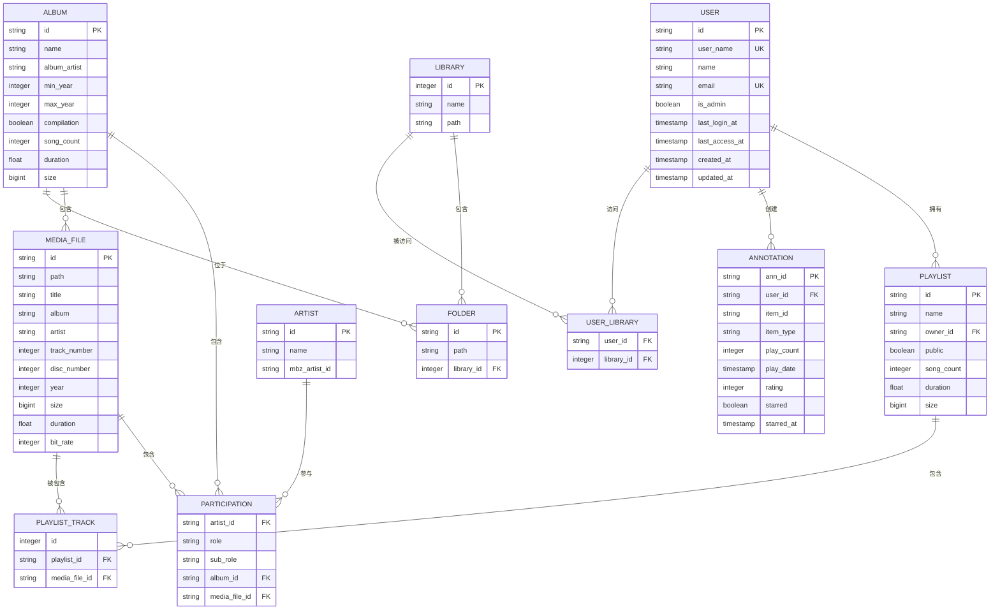

# 数据模型

<cite>
**本文档引用的文件**   
- [album.go](file://model/album.go)
- [artist.go](file://model/artist.go)
- [mediafile.go](file://model/mediafile.go)
- [user.go](file://model/user.go)
- [playlist.go](file://model/playlist.go)
- [annotation.go](file://model/annotation.go)
- [datastore.go](file://model/datastore.go)
- [tag.go](file://model/tag.go)
- [participants.go](file://model/participants.go)
- [library.go](file://model/library.go)
- [persistence.go](file://persistence/persistence.go)
- [20200130083147_create_schema.go](file://db/migrations/20200130083147_create_schema.go)
- [20200608153717_referential_integrity.go](file://db/migrations/20200608153717_referential_integrity.go)
- [20201021085410_add_mbids.go](file://db/migrations/20201021085410_add_mbids.go)
- [20231208182311_add_discs_to_album.go](file://db/migrations/20231208182311_add_discs_to_album.go)
</cite>

## 目录
1. [简介](#简介)
2. [核心实体](#核心实体)
   1. [专辑](#专辑)
   2. [艺术家](#艺术家)
   3. [媒体文件](#媒体文件)
   4. [用户](#用户)
   5. [播放列表](#播放列表)
3. [数据库模式设计](#数据库模式设计)
4. [实体关系图](#实体关系图)
5. [数据库模式图](#数据库模式图)
6. [数据访问模式和持久化策略](#数据访问模式和持久化策略)
7. [数据生命周期和保留策略](#数据生命周期和保留策略)
8. [开发者最佳实践](#开发者最佳实践)

## 简介

Navidrome 是一个音乐服务器和流媒体应用程序，其数据模型设计用于高效地组织和管理音乐库。本数据模型文档详细描述了 Navidrome 的主要实体（专辑、艺术家、媒体文件、用户、播放列表）及其关系，解释了数据库模式设计和迁移策略，并提供了实体关系图和数据库模式图。文档还详细说明了每个字段的定义、数据类型和约束，解释了数据访问模式和持久化策略，包括数据生命周期、保留策略和归档规则，并为开发者提供了数据查询和操作的最佳实践。

Navidrome 的数据模型基于关系型数据库（SQLite），通过 Go 语言的结构体（struct）来表示数据库中的表和字段。模型设计遵循了规范化原则，同时为了性能考虑，在某些地方也进行了适当的反规范化。数据模型的核心是媒体文件（MediaFile），它与专辑（Album）、艺术家（Artist）等实体建立了关系。用户（User）可以创建和管理播放列表（Playlist），并对媒体内容进行评分、标记和播放计数等操作。

**Section sources**
- [model/album.go](file://model/album.go#L12-L67)
- [model/artist.go](file://model/artist.go#L9-L39)
- [model/mediafile.go](file://model/mediafile.go#L22-L95)
- [model/user.go](file://model/user.go#L7-L28)
- [model/playlist.go](file://model/playlist.go#L11-L30)

## 核心实体

### 专辑

专辑（Album）实体代表音乐专辑，是组织媒体文件的主要容器。一个专辑包含一个或多个媒体文件，并与一个或多个艺术家相关联。

**字段定义：**

| 字段名 | 数据类型 | 约束 | 描述 |
| :--- | :--- | :--- | :--- |
| `ID` | string | 主键 | 专辑的唯一标识符 |
| `Name` | string | 非空 | 专辑名称 |
| `AlbumArtist` | string | 非空 | 专辑艺术家的显示名称 |
| `AlbumArtistID` | string | 外键 | 专辑艺术家的ID（已弃用，使用Participants） |
| `MinYear` / `MaxYear` | int | 非空 | 专辑中歌曲的最小和最大年份 |
| `Compilation` | bool | 非空 | 是否为合辑 |
| `SongCount` | int | 非空 | 专辑中的歌曲数量 |
| `Duration` | float32 | 非空 | 专辑总时长（秒） |
| `Size` | int64 | 非空 | 专辑总大小（字节） |
| `Discs` | map[int]string | | 包含的光盘及其副标题的映射 |
| `MbzAlbumID` | string | | MusicBrainz 专辑ID |
| `Participants` | Participants | | 参与该专辑的所有艺术家及其角色 |

专辑实体通过 `Participants` 字段与艺术家建立多对多关系，取代了旧的 `AlbumArtistID` 字段。`Discs` 字段是一个映射，用于存储专辑中每张光盘的编号和副标题。专辑的统计信息（如歌曲数、时长、大小）是根据其包含的媒体文件计算得出的。

**Section sources**
- [model/album.go](file://model/album.go#L12-L67)

### 艺术家

艺术家（Artist）实体代表音乐艺术家或乐队。一个艺术家可以参与多个专辑和媒体文件。

**字段定义：**

| 字段名 | 数据类型 | 约束 | 描述 |
| :--- | :--- | :--- | :--- |
| `ID` | string | 主键 | 艺术家的唯一标识符 |
| `Name` | string | 非空 | 艺术家名称 |
| `MbzArtistID` | string | | MusicBrainz 艺术家ID |
| `Stats` | map[Role]ArtistStats | | 按角色统计的艺术家信息（如作为主唱、作曲等的作品数量） |
| `Size` | int64 | | 艺术家所有作品的总大小 |
| `AlbumCount` | int | | 艺术家参与的专辑数量 |
| `SongCount` | int | | 艺术家参与的歌曲数量 |
| `Biography` | string | | 艺术家传记 |
| `ExternalInfoUpdatedAt` | *time.Time | | 外部信息（如传记、图片）最后更新时间 |

艺术家实体通过 `Participants` 字段与专辑和媒体文件建立多对多关系。`Stats` 字段是一个映射，键为艺术家的角色（如主唱、作曲），值为该角色下的统计信息。艺术家的统计信息（如专辑数、歌曲数）是根据其参与的作品计算得出的。

**Section sources**
- [model/artist.go](file://model/artist.go#L9-L39)

### 媒体文件

媒体文件（MediaFile）实体是数据模型的核心，代表单个音频文件。它包含了从音频文件标签中提取的元数据。

**字段定义：**

| 字段名 | 数据类型 | 约束 | 描述 |
| :--- | :--- | :--- | :--- |
| `ID` | string | 主键 | 媒体文件的唯一标识符 |
| `Path` | string | 非空 | 文件在库中的相对路径 |
| `Title` | string | 非空 | 歌曲标题 |
| `Album` | string | 非空 | 所属专辑名称 |
| `Artist` | string | 非空 | 艺术家显示名称 |
| `AlbumID` | string | 外键 | 所属专辑ID |
| `ArtistID` | string | 外键 | 艺术家ID（已弃用，使用Participants） |
| `TrackNumber` | int | 非空 | 音轨编号 |
| `DiscNumber` | int | 非空 | 光盘编号 |
| `Year` | int | 非空 | 年份 |
| `Size` | int64 | 非空 | 文件大小（字节） |
| `Duration` | float32 | 非空 | 时长（秒） |
| `BitRate` | int | 非空 | 比特率（kbps） |
| `Genre` | string | | 主要流派 |
| `Participants` | Participants | | 参与该媒体文件的所有艺术家及其角色 |
| `Tags` | Tags | | 从文件中提取的所有标签 |

媒体文件实体通过 `AlbumID` 字段与专辑建立一对多关系，通过 `Participants` 字段与艺术家建立多对多关系。`Tags` 字段存储了所有非标准的元数据标签。

**Section sources**
- [model/mediafile.go](file://model/mediafile.go#L22-L95)

### 用户

用户（User）实体代表 Navidrome 应用程序的用户。用户可以访问音乐库、创建播放列表并对内容进行交互。

**字段定义：**

| 字段名 | 数据类型 | 约束 | 描述 |
| :--- | :--- | :--- | :--- |
| `ID` | string | 主键 | 用户的唯一标识符 |
| `UserName` | string | 非空，唯一 | 用户名 |
| `Name` | string | 非空 | 用户全名 |
| `Email` | string | 非空，唯一 | 电子邮件地址 |
| `IsAdmin` | bool | 非空 | 是否为管理员 |
| `Password` | string | | 加密后的密码（后端专用） |
| `LastLoginAt` | *time.Time | | 最后登录时间 |
| `LastAccessAt` | *time.Time | | 最后访问时间 |
| `Libraries` | Libraries | | 用户有权访问的音乐库列表 |

用户实体与播放列表、注解（Annotation）等实体建立关系。`IsAdmin` 字段决定了用户的权限级别。`Libraries` 字段表示用户可以访问的音乐库，实现了多库支持。

**Section sources**
- [model/user.go](file://model/user.go#L7-L28)

### 播放列表

播放列表（Playlist）实体代表用户创建的歌曲集合。播放列表可以是手动创建的，也可以是基于规则的智能播放列表。

**字段定义：**

| 字段名 | 数据类型 | 约束 | 描述 |
| :--- | :--- | :--- | :--- |
| `ID` | string | 主键 | 播放列表的唯一标识符 |
| `Name` | string | 非空 | 播放列表名称 |
| `OwnerID` | string | 外键 | 所有者用户ID |
| `Public` | bool | 非空 | 是否为公开播放列表 |
| `SongCount` | int | 非空 | 播放列表中的歌曲数量 |
| `Duration` | float32 | 非空 | 总时长（秒） |
| `Size` | int64 | 非空 | 总大小（字节） |
| `Rules` | *criteria.Criteria | | 智能播放列表的规则 |
| `EvaluatedAt` | *time.Time | | 规则最后评估时间 |

播放列表通过 `OwnerID` 字段与用户建立一对多关系。播放列表中的歌曲通过 `PlaylistTrack` 关联表与媒体文件建立多对多关系。`Rules` 字段用于定义智能播放列表的动态内容。

**Section sources**
- [model/playlist.go](file://model/playlist.go#L11-L30)

## 数据库模式设计

Navidrome 的数据库模式设计遵循了逐步演进的原则，通过一系列迁移脚本（migration scripts）来管理和更新数据库结构。这种设计允许在不丢失数据的情况下安全地进行模式变更。

初始的数据库模式在 `20200130083147_create_schema.go` 文件中定义，创建了核心表如 `album`、`artist`、`media_file`、`playlist` 和 `user`。随着功能的增加，后续的迁移脚本不断修改和扩展这些表。

**关键设计决策：**

1.  **ID 生成**：所有实体的 `ID` 字段都是字符串类型，而非自增整数。这提供了更好的灵活性，尤其是在分布式或需要合并数据的场景下。
2.  **外键约束**：早期版本的 SQLite 模式可能没有强制外键约束。在 `20200608153717_referential_integrity.go` 迁移中，通过重建表的方式添加了外键约束（如 `player` 表的 `user_name` 外键），以确保数据完整性。
3.  **数据类型演进**：一些字段的数据类型在迁移中被优化。例如，`20200220143731_change_duration_to_float.go` 迁移将 `duration` 字段从整数改为浮点数，以支持更精确的时长。
4.  **MusicBrainz 集成**：`20201021085410_add_mbids.go` 迁移为 `media_file`、`album` 和 `artist` 表添加了 MusicBrainz ID 字段（如 `mbz_track_id`, `mbz_album_id`），以便与外部音乐数据库集成。
5.  **多光盘支持**：`20231208182311_add_discs_to_album.go` 迁移为 `album` 表添加了 `discs` 字段，以更好地支持包含多张光盘的专辑。
6.  **注解（Annotation）表**：`annotation` 表是一个通用表，用于存储用户对任何项目（专辑、艺术家、媒体文件）的评分、播放计数和收藏状态。它通过 `item_id` 和 `item_type` 实现了多态关联。

**Section sources**
- [db/migrations/20200130083147_create_schema.go](file://db/migrations/20200130083147_create_schema.go#L17-L178)
- [db/migrations/20200608153717_referential_integrity.go](file://db/migrations/20200608153717_referential_integrity.go#L14-L50)
- [db/migrations/20201021085410_add_mbids.go](file://db/migrations/20201021085410_add_mbids.go#L14-L53)
- [db/migrations/20231208182311_add_discs_to_album.go](file://db/migrations/20231208182311_add_discs_to_album.go)

## 实体关系图



**Diagram sources**
- [model/user.go](file://model/user.go#L7-L28)
- [model/playlist.go](file://model/playlist.go#L11-L30)
- [model/annotation.go](file://model/annotation.go#L5-L12)
- [model/artist.go](file://model/artist.go#L9-L39)
- [model/album.go](file://model/album.go#L12-L67)
- [model/mediafile.go](file://model/mediafile.go#L22-L95)
- [model/participants.go](file://model/participants.go#L78-L82)
- [model/folder.go](file://model/folder.go)
- [model/library.go](file://model/library.go#L9-L28)

## 数据库模式图

```mermaid
erDiagram
user ||--o{ playlist : "拥有"
user ||--o{ annotation : "创建"
album ||--o{ media_file : "包含"
playlist ||--o{ playlist_tracks : "包含"
media_file ||--o{ playlist_tracks : "被包含"
album ||--o{ folder : "位于"
library ||--o{ folder : "包含"
user ||--o{ user_library : "访问"
library ||--o{ user_library : "被访问"
user {
varchar id PK
varchar user_name UK
varchar name
varchar email UK
varchar password
boolean is_admin
datetime last_login_at
datetime last_access_at
datetime created_at
datetime updated_at
}
playlist {
varchar id PK
varchar name
varchar owner varchar FK
boolean public
real duration
integer song_count
datetime created_at
datetime updated_at
}
annotation {
varchar ann_id PK
varchar user_id FK
varchar item_id
varchar item_type
integer play_count
datetime play_date
integer rating
boolean starred
datetime starred_at
}
album {
varchar id PK
varchar name
varchar artist_id
varchar artist
varchar album_artist
integer year
boolean compilation
integer song_count
integer duration
varchar genre
datetime created_at
datetime updated_at
}
media_file {
varchar id PK
varchar path
varchar title
varchar album
varchar artist
varchar artist_id
varchar album_artist
varchar album_id
boolean has_cover_art
integer track_number
integer disc_number
integer year
integer size
varchar suffix
integer duration
integer bit_rate
varchar genre
boolean compilation
datetime created_at
datetime updated_at
}
playlist_tracks {
integer id
varchar playlist_id FK
varchar media_file_id
}
folder {
varchar id PK
varchar path
integer library_id FK
}
library {
integer id PK
varchar name
varchar path
}
user_library {
varchar user_id FK
integer library_id FK
}
```

**Diagram sources**
- [db/migrations/20200130083147_create_schema.go](file://db/migrations/20200130083147_create_schema.go#L17-L178)

## 数据访问模式和持久化策略

Navidrome 使用一个基于接口的持久化层来抽象数据库操作。`DataStore` 接口是所有数据访问的入口点，它为每个实体（如 `AlbumRepository`, `ArtistRepository`）提供了工厂方法。

**数据访问模式：**

1.  **Repository 模式**：每个实体都有一个对应的 Repository 接口（如 `AlbumRepository`），定义了对该实体的 CRUD 操作。这提供了清晰的职责分离。
2.  **事务管理**：`DataStore` 接口提供了 `WithTx` 和 `WithTxImmediate` 方法，用于在事务中执行一系列操作，确保数据一致性。例如，在扫描音乐库时，会使用事务来批量更新专辑和媒体文件。
3.  **查询选项**：`QueryOptions` 结构体允许对查询进行排序、分页和过滤，支持灵活的数据检索。
4.  **扫描专用方法**：许多 Repository 接口包含仅由扫描器（scanner）使用的专用方法，如 `Touch`、`MarkMissing` 和 `RefreshStats`。这些方法优化了库扫描过程中的性能。

**持久化策略：**

1.  **对象-关系映射 (ORM)**：Navidrome 使用 `dbx` 库进行轻量级的 ORM 操作。实体的 Go 结构体通过标签（如 `structs:"id"`）映射到数据库列。
2.  **数据完整性**：通过外键约束和应用层逻辑（如 `GC` 方法）来维护数据完整性。垃圾回收（GC）过程会清理孤立的记录和空的实体。
3.  **性能优化**：大量使用数据库索引（如 `album_name`, `media_file_album_id`）来加速查询。统计信息（如歌曲数、大小）是预先计算并存储的，避免了运行时的昂贵聚合操作。

**Section sources**
- [model/datastore.go](file://model/datastore.go#L23-L48)
- [persistence/persistence.go](file://persistence/persistence.go#L16-L204)
- [model/album.go](file://model/album.go#L127-L144)
- [model/artist.go](file://model/artist.go#L74-L89)

## 数据生命周期和保留策略

Navidrome 的数据生命周期管理主要通过库扫描（library scanning）和垃圾回收（garbage collection）机制来实现。

**数据生命周期：**

1.  **创建**：当扫描器首次发现一个媒体文件时，会创建相应的 `MediaFile`、`Album` 和 `Artist` 实体。
2.  **更新**：如果文件的元数据发生变化（如标签修改），扫描器会更新相应的实体。`UpdatedAt` 字段会反映最新的修改时间。
3.  **标记为丢失**：如果文件从文件系统中被删除或移动，扫描器会将 `MediaFile` 的 `Missing` 字段标记为 `true`。相关的 `Album` 如果所有文件都丢失，其 `Missing` 字段也会被标记。
4.  **删除**：孤立的或空的实体（如没有歌曲的专辑）会在垃圾回收过程中被删除。

**保留策略：**

1.  **用户生成内容**：用户的播放列表、评分、收藏和播放历史等数据会被永久保留，除非用户主动删除。
2.  **元数据缓存**：从外部服务（如 Last.fm, Deezer）获取的艺术家传记、图片等信息会被缓存，并通过 `ExternalInfoUpdatedAt` 字段管理其新鲜度。
3.  **日志和临时数据**：某些日志和临时数据（如 `property` 表中的标志）可能会在特定条件下被清理或覆盖。

**Section sources**
- [model/mediafile.go](file://model/mediafile.go#L91-L94)
- [model/album.go](file://model/album.go#L63-L64)
- [persistence/persistence.go](file://persistence/persistence.go#L164-L196)

## 开发者最佳实践

为了高效地与 Navidrome 的数据模型交互，请遵循以下最佳实践：

1.  **使用 DataStore 接口**：始终通过 `DataStore` 接口获取 Repository 实例，而不是直接创建它们。这确保了依赖注入和事务的一致性。
2.  **在事务中执行批量操作**：当需要执行多个相关的数据库操作时，使用 `WithTx` 方法将它们包装在一个事务中，以保证原子性。
3.  **利用查询选项**：使用 `QueryOptions` 来实现分页和排序，避免一次性加载过多数据。
4.  **避免直接操作已弃用字段**：不要使用 `ArtistID` 或 `AlbumArtistID` 等已弃用的字段。应使用 `Participants` 字段来处理艺术家关系。
5.  **正确处理时间**：注意 `CreatedAt`、`UpdatedAt` 和 `BirthTime` 字段的区别。`BirthTime` 是文件的创建时间，而 `CreatedAt`/`UpdatedAt` 是数据库记录的创建/更新时间。
6.  **使用 GC 清理数据**：在执行可能产生孤立数据的操作后，考虑调用 `GC` 方法来清理数据库。
7.  **遵循迁移约定**：当需要修改数据库模式时，创建一个新的迁移脚本，遵循现有的命名和结构约定。

**Section sources**
- [model/datastore.go](file://model/datastore.go#L23-L48)
- [persistence/persistence.go](file://persistence/persistence.go#L125-L162)
- [model/mediafile.go](file://model/mediafile.go#L91-L94)
- [model/participants.go](file://model/participants.go#L97-L134)