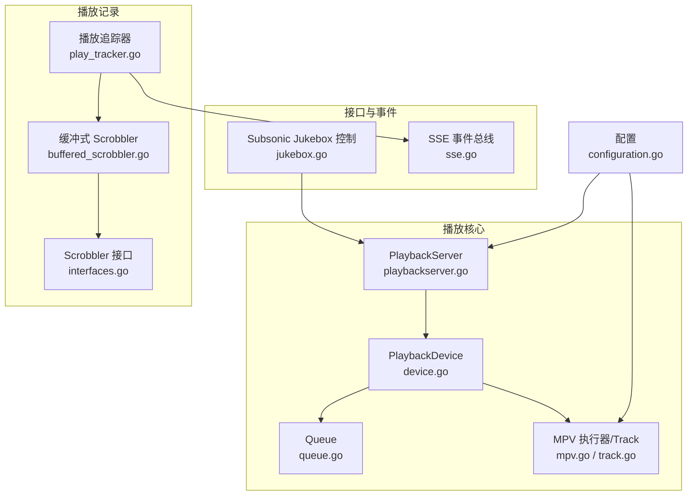
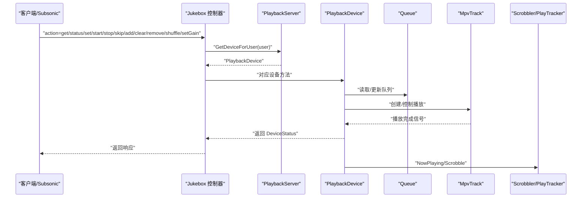
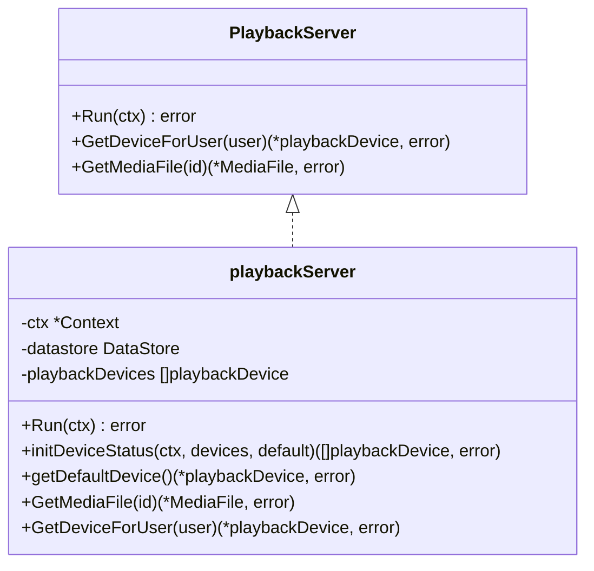
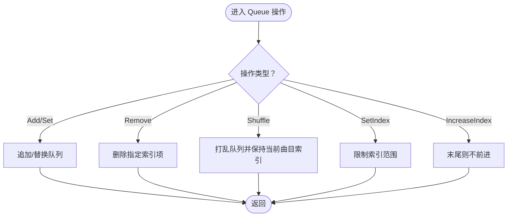
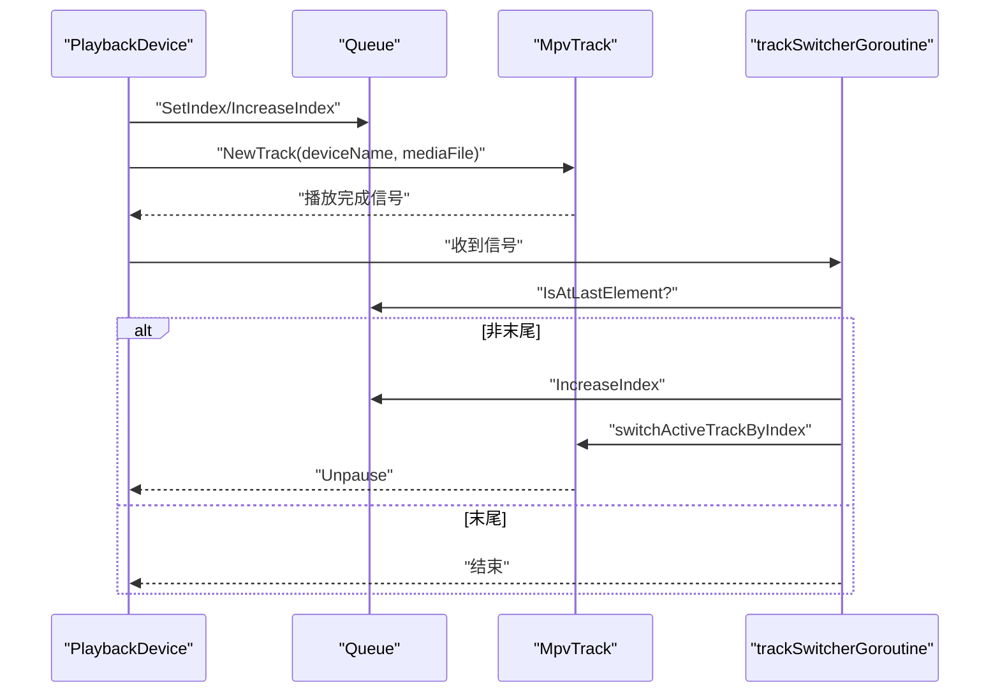
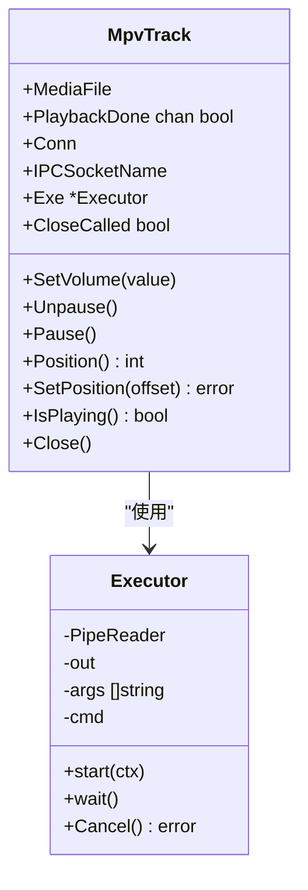
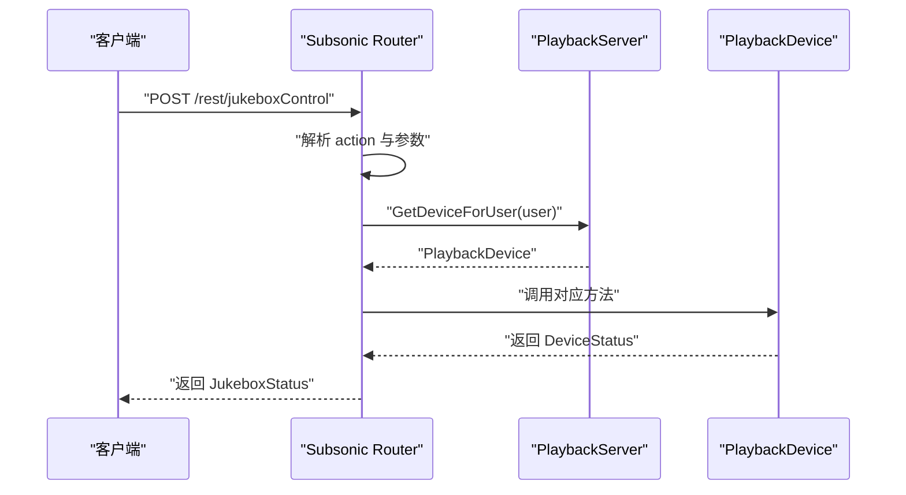
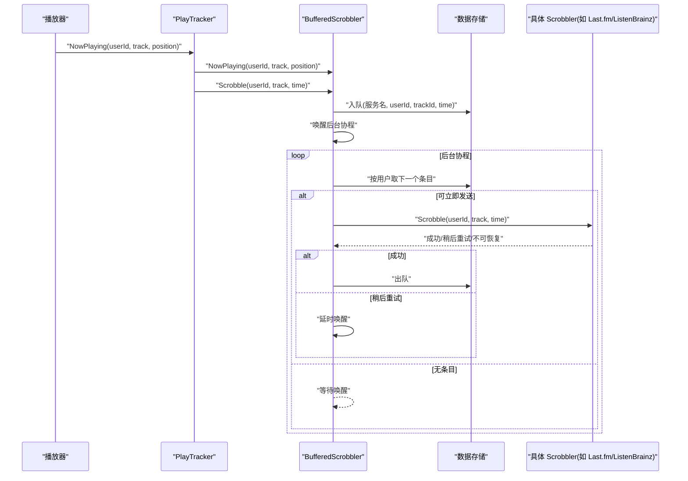
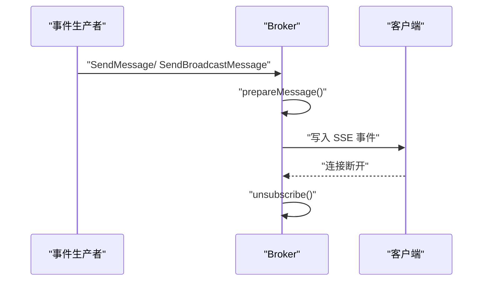
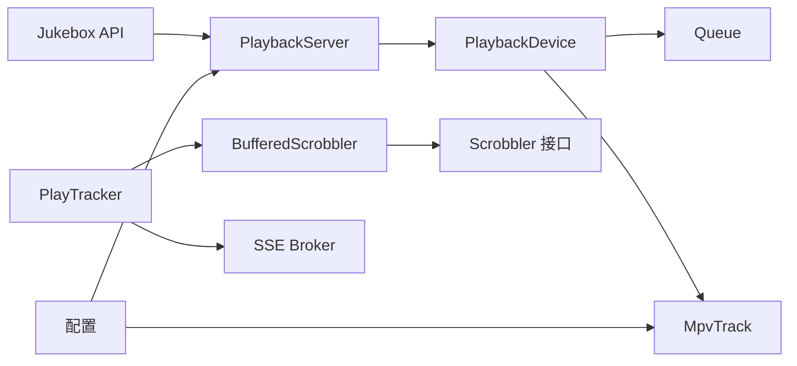

# 播放管理

<cite>
**本文引用的文件**
- [playbackserver.go](file://core/playback/playbackserver.go)
- [queue.go](file://core/playback/queue.go)
- [device.go](file://core/playback/device.go)
- [jukebox.go](file://server/subsonic/jukebox.go)
- [buffered_scrobbler.go](file://core/scrobbler/buffered_scrobbler.go)
- [interfaces.go](file://core/scrobbler/interfaces.go)
- [play_tracker.go](file://core/scrobbler/play_tracker.go)
- [mpv.go](file://core/playback/mpv/mpv.go)
- [track.go](file://core/playback/mpv/track.go)
- [sse.go](file://server/events/sse.go)
- [configuration.go](file://conf/configuration.go)
- [queue_test.go](file://core/playback/queue_test.go)
</cite>

## 目录
1. [简介](#简介)
2. [项目结构](#项目结构)
3. [核心组件](#核心组件)
4. [架构总览](#架构总览)
5. [详细组件分析](#详细组件分析)
6. [依赖关系分析](#依赖关系分析)
7. [性能考量](#性能考量)
8. [故障排查指南](#故障排查指南)
9. [结论](#结论)
10. [附录](#附录)

## 简介
本文件系统性阐述 Navidrome 的播放管理能力，覆盖以下主题：
- 播放队列管理：顺序、随机、循环、跳转、移除、清空等操作的算法与边界条件
- 播放设备控制：基于 MPV 的音频设备抽象、播放/暂停/跳转/音量控制、播放完成事件
- 播放记录（Scrobbling）：缓冲机制、与 Last.fm、ListenBrainz 等外部服务的同步流程
- Subsonic 点唱机 API：Jukebox 控制接口的实现与响应映射
- 实时通信：通过 Server-Sent Events 向前端推送播放状态
- 用户交互：播放模式、播放速度控制、音量管理
- 复杂场景：播放中断恢复、网络切换处理

本指南既面向初学者提供直观理解，也为高级用户提供可追溯到源码的实现细节与调用路径。

## 项目结构
播放管理相关代码主要分布在以下模块：
- 核心播放层：playbackserver、queue、device、mpv
- 播放记录层：scrobbler（包含缓冲、接口定义、播放追踪）
- 接口层：Subsonic Jukebox API
- 实时事件：SSE 广播
- 配置：MPV 路径、命令模板、Jukebox 开关等

图表来源
- [playbackserver.go](file://core/playback/playbackserver.go#L1-L128)
- [queue.go](file://core/playback/queue.go#L1-L137)
- [device.go](file://core/playback/device.go#L1-L300)
- [mpv.go](file://core/playback/mpv/mpv.go#L1-L132)
- [track.go](file://core/playback/mpv/track.go#L1-L224)
- [interfaces.go](file://core/scrobbler/interfaces.go#L1-L29)
- [buffered_scrobbler.go](file://core/scrobbler/buffered_scrobbler.go#L1-L134)
- [play_tracker.go](file://core/scrobbler/play_tracker.go#L1-L392)
- [jukebox.go](file://server/subsonic/jukebox.go#L1-L137)
- [sse.go](file://server/events/sse.go#L1-L292)
- [configuration.go](file://conf/configuration.go#L1-L200)

章节来源
- [playbackserver.go](file://core/playback/playbackserver.go#L1-L128)
- [queue.go](file://core/playback/queue.go#L1-L137)
- [device.go](file://core/playback/device.go#L1-L300)
- [mpv.go](file://core/playback/mpv/mpv.go#L1-L132)
- [track.go](file://core/playback/mpv/track.go#L1-L224)
- [interfaces.go](file://core/scrobbler/interfaces.go#L1-L29)
- [buffered_scrobbler.go](file://core/scrobbler/buffered_scrobbler.go#L1-L134)
- [play_tracker.go](file://core/scrobbler/play_tracker.go#L1-L392)
- [jukebox.go](file://server/subsonic/jukebox.go#L1-L137)
- [sse.go](file://server/events/sse.go#L1-L292)
- [configuration.go](file://conf/configuration.go#L1-L200)

## 核心组件
- 播放服务器（PlaybackServer）：负责设备初始化、默认设备选择、媒体文件查询
- 播放设备（PlaybackDevice）：封装设备状态、队列、当前播放曲目、音量、播放控制
- 播放队列（Queue）：顺序索引、添加/移除/清空、随机化、边界校验
- MPV 集成：进程启动、IPC 控制、播放完成事件、位置/音量控制
- 播放记录（Scrobbler）：NowPlaying/Scrobble 缓冲、重试策略、插件扩展
- Subsonic Jukebox API：统一入口，路由 action 到设备操作
- SSE 事件总线：向客户端广播播放状态与心跳

章节来源
- [playbackserver.go](file://core/playback/playbackserver.go#L1-L128)
- [queue.go](file://core/playback/queue.go#L1-L137)
- [device.go](file://core/playback/device.go#L1-L300)
- [mpv.go](file://core/playback/mpv/mpv.go#L1-L132)
- [track.go](file://core/playback/mpv/track.go#L1-L224)
- [interfaces.go](file://core/scrobbler/interfaces.go#L1-L29)
- [buffered_scrobbler.go](file://core/scrobbler/buffered_scrobbler.go#L1-L134)
- [play_tracker.go](file://core/scrobbler/play_tracker.go#L1-L392)
- [jukebox.go](file://server/subsonic/jukebox.go#L1-L137)
- [sse.go](file://server/events/sse.go#L1-L292)

## 架构总览
播放管理采用“服务器-设备-队列-驱动”的分层设计：
- PlaybackServer 维护设备集合与默认设备，提供媒体文件查询
- PlaybackDevice 封装单个音频设备的状态与操作，内部持有 Queue
- Queue 提供播放序列管理；设备在需要时从 PlaybackServer 获取媒体文件
- MPV 驱动负责实际播放，通过 IPC 与 mpv 进程交互
- Scrobbler 层负责记录播放历史与外部服务同步，支持内置与插件扩展
- Subsonic Jukebox API 将外部请求映射为设备操作
- SSE 事件总线向前端推送播放状态变化

图表来源
- [jukebox.go](file://server/subsonic/jukebox.go#L1-L137)
- [playbackserver.go](file://core/playback/playbackserver.go#L1-L128)
- [device.go](file://core/playback/device.go#L1-L300)
- [queue.go](file://core/playback/queue.go#L1-L137)
- [track.go](file://core/playback/mpv/track.go#L1-L224)
- [play_tracker.go](file://core/scrobbler/play_tracker.go#L1-L392)
- [buffered_scrobbler.go](file://core/scrobbler/buffered_scrobbler.go#L1-L134)

## 详细组件分析

### 播放状态机（PlaybackServer）
- 单例模式：通过 GetInstance 返回全局实例，避免重复初始化
- 设备初始化：根据配置加载多个音频设备，支持默认设备选择与校验
- 媒体文件查询：通过数据存储接口按 ID 获取媒体文件
- 默认设备选择：若未显式指定，默认设备必须存在且唯一

图表来源
- [playbackserver.go](file://core/playback/playbackserver.go#L1-L128)

章节来源
- [playbackserver.go](file://core/playback/playbackserver.go#L1-L128)

### 播放队列管理（Queue）
- 数据结构：维护当前索引与媒体文件列表
- 关键操作：
  - 添加/设置/清空：支持在无当前曲目时自动定位到首曲
  - 移除：删除指定索引项，并尝试保持当前曲目的索引不变
  - 随机化：打乱队列，但保留当前曲目索引
  - 边界保护：越界访问时记录错误日志并安全返回
  - 索引推进：到达末尾时停止前进
- 复杂度：随机化使用标准库洗牌，时间复杂度 O(n)，其余操作多为 O(n)（数组切片）

图表来源
- [queue.go](file://core/playback/queue.go#L1-L137)

章节来源
- [queue.go](file://core/playback/queue.go#L1-L137)
- [queue_test.go](file://core/playback/queue_test.go#L1-L60)

### 播放设备控制（PlaybackDevice）
- 设备状态：包含当前索引、播放状态、音量、播放进度
- 主要方法：
  - Get/Status：返回队列与设备状态
  - Set/Add/Clear：批量设置与追加，清空时关闭当前曲目
  - Start/Stop：开始/暂停当前曲目或启动新曲
  - Skip：跳转到指定曲目并设置偏移，必要时重启播放
  - Remove：移除指定索引曲目，若正在播放则先暂停
  - Shuffle：对队列进行随机化
  - SetGain：设置音量并应用到当前曲目
- 播放完成事件：trackSwitcherGoroutine 监听播放完成通道，自动切换到下一曲
- 曲目切换：switchActiveTrackByIndex 创建新的 MpvTrack，设置音量并解封

图表来源
- [device.go](file://core/playback/device.go#L1-L300)
- [queue.go](file://core/playback/queue.go#L1-L137)
- [track.go](file://core/playback/mpv/track.go#L1-L224)

章节来源
- [device.go](file://core/playback/device.go#L1-L300)
- [track.go](file://core/playback/mpv/track.go#L1-L224)

### MPV 音频驱动
- 进程启动：解析命令模板，替换占位符，查找可执行文件，启动子进程并建立管道
- IPC 控制：通过 socket 与 mpv 通信，支持 pause/unpause、volume、time-pos 等属性
- 生命周期：等待连接关闭触发播放完成信号；关闭时优先发送 quit，失败则取消执行器并清理 socket
- 位置与音量：位置读取带重试；音量转换为 0-100 的整数

图表来源
- [mpv.go](file://core/playback/mpv/mpv.go#L1-L132)
- [track.go](file://core/playback/mpv/track.go#L1-L224)

章节来源
- [mpv.go](file://core/playback/mpv/mpv.go#L1-L132)
- [track.go](file://core/playback/mpv/track.go#L1-L224)

### Subsonic 点唱机 API（Jukebox）
- 支持动作：get、status、set、start、stop、skip、add、clear、remove、shuffle、setGain
- 权限控制：可配置是否启用、是否仅管理员可用
- 参数解析：从请求中提取 action 与参数，调用设备对应方法
- 响应映射：将 DeviceStatus 映射为 JukeboxStatus 返回给客户端

图表来源
- [jukebox.go](file://server/subsonic/jukebox.go#L1-L137)
- [playbackserver.go](file://core/playback/playbackserver.go#L1-L128)
- [device.go](file://core/playback/device.go#L1-L300)

章节来源
- [jukebox.go](file://server/subsonic/jukebox.go#L1-L137)

### 播放记录（Scrobbling）与缓冲机制
- 接口定义：Scrobbler 定义授权检查、NowPlaying、Scrobble 三类能力
- 缓冲式实现：bufferedScrobbler 将 Scrobble 入队到数据存储，后台协程周期性出队并调用具体服务
- 重试策略：遇到“稍后重试”错误时延迟唤醒，继续处理；其他错误丢弃并记录
- 播放追踪：play_tracker 统一管理 NowPlaying/Scrobble 流程，聚合内置与插件 Scrobbler，支持 TTL 清理与事件广播

图表来源
- [interfaces.go](file://core/scrobbler/interfaces.go#L1-L29)
- [buffered_scrobbler.go](file://core/scrobbler/buffered_scrobbler.go#L1-L134)
- [play_tracker.go](file://core/scrobbler/play_tracker.go#L1-L392)

章节来源
- [interfaces.go](file://core/scrobbler/interfaces.go#L1-L29)
- [buffered_scrobbler.go](file://core/scrobbler/buffered_scrobbler.go#L1-L134)
- [play_tracker.go](file://core/scrobbler/play_tracker.go#L1-L392)

### 实时通信（SSE）
- Broker：维护订阅者集合，发布消息到各客户端通道，支持广播与定向过滤
- 写入策略：设置写超时，Flush 强制输出，定期发送心跳包
- 事件类型：包括服务器启动、心跳、NowPlaying 数量变化等

图表来源
- [sse.go](file://server/events/sse.go#L1-L292)

章节来源
- [sse.go](file://server/events/sse.go#L1-L292)

### 用户交互：播放模式、速度、音量
- 播放模式：队列支持随机化（Shuffle），但未见全局“单曲循环/列表循环”标志位；可通过外部 UI 或扩展实现
- 播放速度：未在设备层暴露速度控制接口；可在 MPV 层通过属性扩展
- 音量管理：设备 SetGain 应用到当前曲目，曲目层 SetVolume 将 0-1 的值转换为 0-100

章节来源
- [device.go](file://core/playback/device.go#L1-L300)
- [track.go](file://core/playback/mpv/track.go#L1-L224)

### 复杂场景：播放中断恢复、网络切换
- 中断恢复：trackSwitcherGoroutine 在播放完成后自动切换到下一曲；若队列未达末尾，会继续 Unpause 新曲
- 网络切换：SSE 通过 Flush 保证低延迟；播放记录缓冲在服务端持久化，网络恢复后继续出队发送
- 设备切换：PlaybackServer 支持多设备定义与默认设备选择，便于多扬声器场景

章节来源
- [device.go](file://core/playback/device.go#L1-L300)
- [buffered_scrobbler.go](file://core/scrobbler/buffered_scrobbler.go#L1-L134)
- [playbackserver.go](file://core/playback/playbackserver.go#L1-L128)

## 依赖关系分析
- 组件耦合：
  - PlaybackServer 依赖 DataStore 查询媒体文件，依赖配置决定设备集合
  - PlaybackDevice 依赖 Queue 与 MPV 驱动，向上暴露 DeviceStatus
  - Scrobbler 通过 PlayTracker 聚合，支持内置与插件扩展
  - Subsonic Jukebox API 依赖 PlaybackServer 获取设备
  - SSE 作为事件总线被 PlayTracker 使用
- 外部依赖：
  - MPV 可执行文件与命令模板由配置控制
  - Last.fm、ListenBrainz 等服务通过 Scrobbler 接口注入

图表来源
- [playbackserver.go](file://core/playback/playbackserver.go#L1-L128)
- [device.go](file://core/playback/device.go#L1-L300)
- [queue.go](file://core/playback/queue.go#L1-L137)
- [track.go](file://core/playback/mpv/track.go#L1-L224)
- [buffered_scrobbler.go](file://core/scrobbler/buffered_scrobbler.go#L1-L134)
- [interfaces.go](file://core/scrobbler/interfaces.go#L1-L29)
- [play_tracker.go](file://core/scrobbler/play_tracker.go#L1-L392)
- [jukebox.go](file://server/subsonic/jukebox.go#L1-L137)
- [sse.go](file://server/events/sse.go#L1-L292)
- [configuration.go](file://conf/configuration.go#L1-L200)

章节来源
- [playbackserver.go](file://core/playback/playbackserver.go#L1-L128)
- [device.go](file://core/playback/device.go#L1-L300)
- [queue.go](file://core/playback/queue.go#L1-L137)
- [track.go](file://core/playback/mpv/track.go#L1-L224)
- [buffered_scrobbler.go](file://core/scrobbler/buffered_scrobbler.go#L1-L134)
- [interfaces.go](file://core/scrobbler/interfaces.go#L1-L29)
- [play_tracker.go](file://core/scrobbler/play_tracker.go#L1-L392)
- [jukebox.go](file://server/subsonic/jukebox.go#L1-L137)
- [sse.go](file://server/events/sse.go#L1-L292)
- [configuration.go](file://conf/configuration.go#L1-L200)

## 性能考量
- 队列操作：随机化与切片操作为 O(n)，建议在大批量操作时合并批量请求以减少上下文切换
- MPV IPC：位置读取带重试，避免频繁轮询；音量设置为整型转换，开销极小
- 缓冲式 Scrobbler：后台协程周期性处理，遇“稍后重试”延迟唤醒，降低瞬时压力
- SSE：设置写超时并 Flush，确保低延迟；心跳定时器避免连接空闲断开
- 配置优化：MPV 命令模板与可执行路径由配置控制，建议预热查找结果以减少启动时开销

## 故障排查指南
- 设备初始化失败：检查配置中的音频设备定义数量与默认设备是否匹配
- 播放无声音：确认 MPV 命令模板与设备名称正确，音量设置是否生效
- 播放记录未上报：检查 Scrobbler 授权状态与“稍后重试”错误，查看缓冲队列是否堆积
- SSE 无法接收：确认客户端支持流式传输，Nginx 等代理需禁用缓冲
- 队列越界：关注日志中“当前曲目索引越界”提示，检查 Remove/SetIndex 的调用顺序

章节来源
- [playbackserver.go](file://core/playback/playbackserver.go#L1-L128)
- [device.go](file://core/playback/device.go#L1-L300)
- [buffered_scrobbler.go](file://core/scrobbler/buffered_scrobbler.go#L1-L134)
- [track.go](file://core/playback/mpv/track.go#L1-L224)
- [sse.go](file://server/events/sse.go#L1-L292)

## 结论
Navidrome 的播放管理以清晰的分层设计实现了从设备抽象、队列管理到外部服务同步的完整链路。PlaybackServer 与 PlaybackDevice 提供稳定的设备与队列控制；MPV 驱动确保跨平台播放一致性；Scrobbler 的缓冲机制与 PlayTracker 的聚合能力保障了播放记录的可靠性与扩展性；Subsonic API 与 SSE 则打通了前后端交互。对于更复杂的播放模式与速度控制，可在现有接口基础上扩展实现。

## 附录
- 关键实现路径参考
  - 播放队列操作：[queue.go](file://core/playback/queue.go#L1-L137)
  - 设备控制与播放完成事件：[device.go](file://core/playback/device.go#L1-L300)
  - MPV 驱动与 IPC：[track.go](file://core/playback/mpv/track.go#L1-L224)
  - 播放记录缓冲与重试：[buffered_scrobbler.go](file://core/scrobbler/buffered_scrobbler.go#L1-L134)
  - 播放追踪与聚合：[play_tracker.go](file://core/scrobbler/play_tracker.go#L1-L392)
  - Subsonic Jukebox API：[jukebox.go](file://server/subsonic/jukebox.go#L1-L137)
  - SSE 事件总线：[sse.go](file://server/events/sse.go#L1-L292)
  - 配置项（MPV/命令模板/Jukebox）：[configuration.go](file://conf/configuration.go#L1-L200)