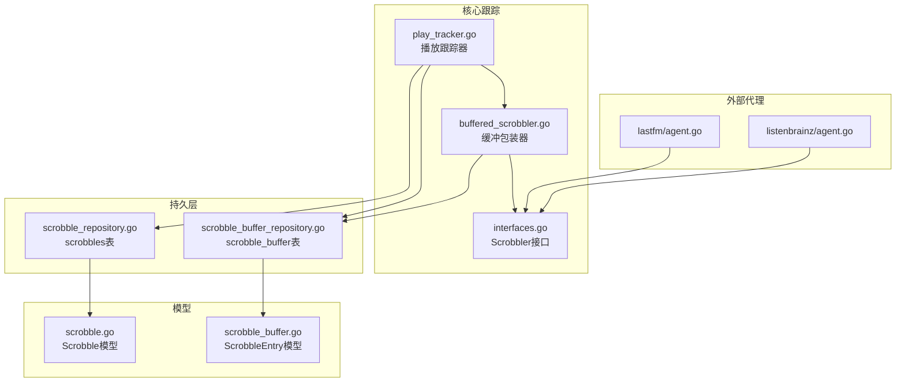
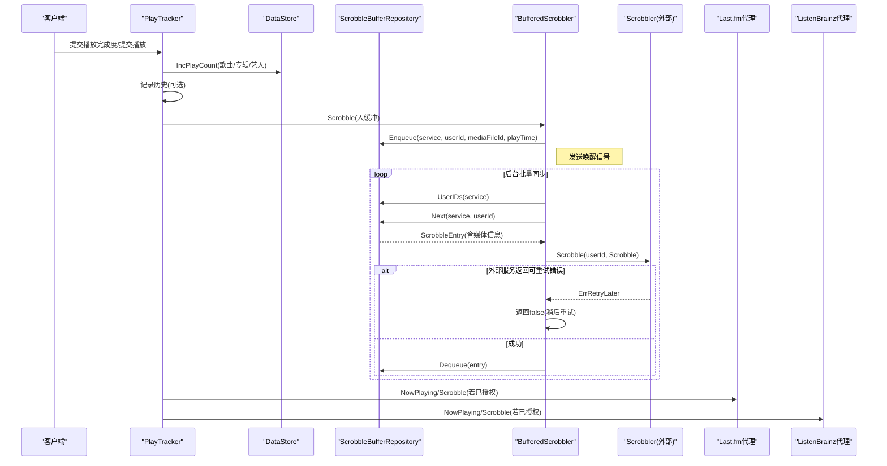
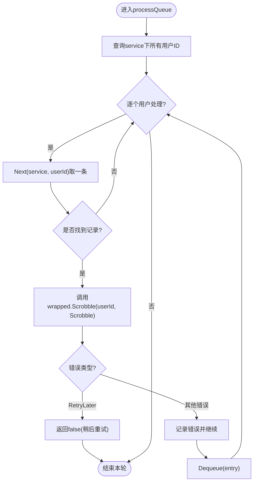
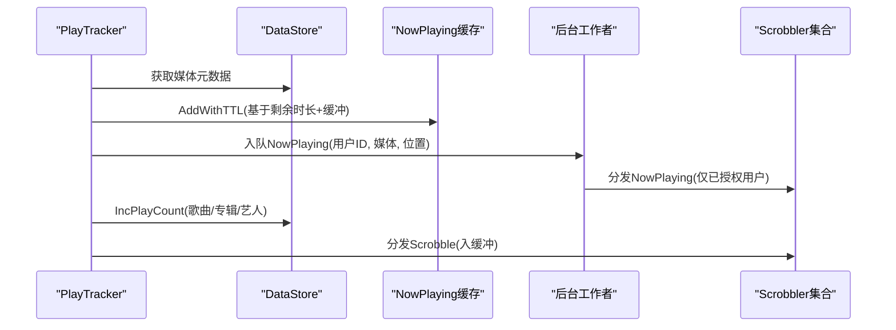
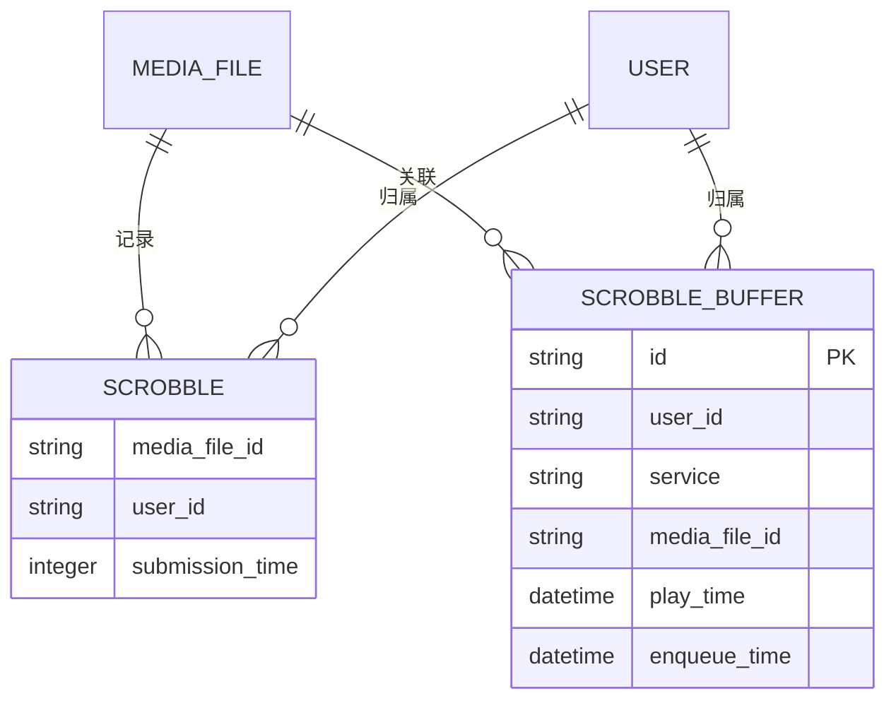
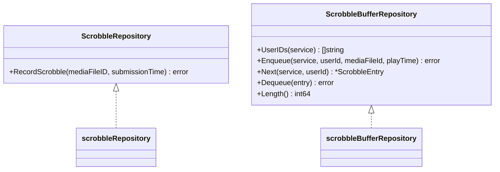
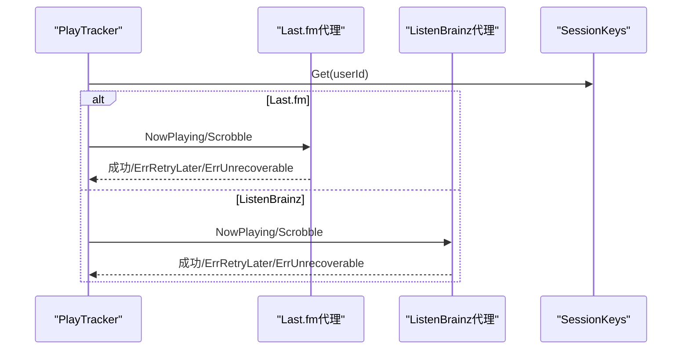
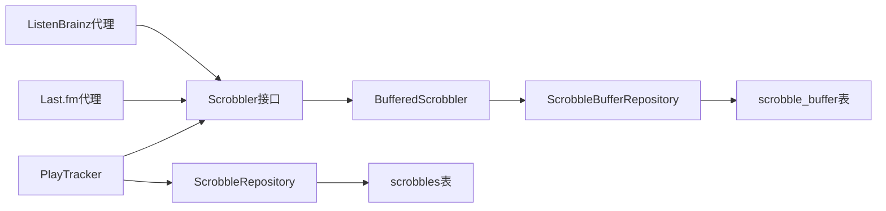

# 播放记录

<cite>
**本文引用的文件列表**
- [buffered_scrobbler.go](file://core/scrobbler/buffered_scrobbler.go)
- [play_tracker.go](file://core/scrobbler/play_tracker.go)
- [interfaces.go](file://core/scrobbler/interfaces.go)
- [scrobble.go](file://model/scrobble.go)
- [scrobble_buffer.go](file://model/scrobble_buffer.go)
- [scrobble_repository.go](file://persistence/scrobble_repository.go)
- [scrobble_buffer_repository.go](file://persistence/scrobble_buffer_repository.go)
- [agent.go](file://core/agents/lastfm/agent.go)
- [agent.go](file://core/agents/listenbrainz/agent.go)
- [20210626213026_add_scrobble_buffer.go](file://db/migrations/20210626213026_add_scrobble_buffer.go)
- [20251206013022_create_scrobbles_table.sql](file://db/migrations/20251206013022_create_scrobbles_table.sql)
</cite>

## 目录
1. [简介](#简介)
2. [项目结构](#项目结构)
3. [核心组件](#核心组件)
4. [架构总览](#架构总览)
5. [详细组件分析](#详细组件分析)
6. [依赖关系分析](#依赖关系分析)
7. [性能考量](#性能考量)
8. [故障排查指南](#故障排查指南)
9. [结论](#结论)
10. [附录](#附录)

## 简介
本文件围绕“播放记录（Scrobbling）”功能进行系统性技术文档整理，重点覆盖以下方面：
- 缓冲与批量同步：解析 buffered_scrobbler 的缓冲队列、唤醒信号、批量出队与重试策略。
- 播放行为跟踪：解析 play_tracker 的 NowPlaying 跟踪、提交流程、完成度判断、防作弊与时间窗口管理。
- 数据模型与规则：解析 model 层 Scrobble 与 ScrobbleEntry 的字段与业务约束。
- 存储与同步：解析 persistence 层对 scrobble 与 scrobble_buffer 的增删查与事务一致性。
- 外部服务集成：解析 Last.fm 与 ListenBrainz 的认证、API 调用与错误分类处理。
- 高级能力：网络异常处理、离线记录同步、隐私控制与性能优化建议。

## 项目结构
播放记录相关代码主要分布在如下模块：
- 核心跟踪与调度：core/scrobbler
- 模型定义：model
- 持久层：persistence
- 外部代理：core/agents/{lastfm,listenbrainz}
- 数据库迁移：db/migrations

图表来源
- [play_tracker.go](file://core/scrobbler/play_tracker.go#L1-L392)
- [buffered_scrobbler.go](file://core/scrobbler/buffered_scrobbler.go#L1-L134)
- [interfaces.go](file://core/scrobbler/interfaces.go#L1-L29)
- [scrobble.go](file://model/scrobble.go#L1-L14)
- [scrobble_buffer.go](file://model/scrobble_buffer.go#L1-L24)
- [scrobble_repository.go](file://persistence/scrobble_repository.go#L1-L35)
- [scrobble_buffer_repository.go](file://persistence/scrobble_buffer_repository.go#L1-L101)
- [agent.go](file://core/agents/lastfm/agent.go#L1-L384)
- [agent.go](file://core/agents/listenbrainz/agent.go#L1-L130)

章节来源
- [play_tracker.go](file://core/scrobbler/play_tracker.go#L1-L392)
- [buffered_scrobbler.go](file://core/scrobbler/buffered_scrobbler.go#L1-L134)
- [interfaces.go](file://core/scrobbler/interfaces.go#L1-L29)
- [scrobble.go](file://model/scrobble.go#L1-L14)
- [scrobble_buffer.go](file://model/scrobble_buffer.go#L1-L24)
- [scrobble_repository.go](file://persistence/scrobble_repository.go#L1-L35)
- [scrobble_buffer_repository.go](file://persistence/scrobble_buffer_repository.go#L1-L101)
- [agent.go](file://core/agents/lastfm/agent.go#L1-L384)
- [agent.go](file://core/agents/listenbrainz/agent.go#L1-L130)

## 核心组件
- Scrobbler 接口：统一 NowPlaying 与 Scrobble 的授权检查与调用入口。
- PlayTracker：负责 NowPlaying 缓存、提交计数更新、Scrobble 入缓冲与广播事件。
- BufferedScrobbler：在 Scrobbler 基础上增加缓冲队列与后台批量同步。
- Scrobble/ScrobbleEntry：记录模型与缓冲条目模型。
- ScrobbleRepository/ScrobbleBufferRepository：分别对接 scrobbles 与 scrobble_buffer 表。
- Last.fm/ListenBrainz 代理：实现外部服务认证、NowPlaying/Scrobble API 调用与错误分类。

章节来源
- [interfaces.go](file://core/scrobbler/interfaces.go#L1-L29)
- [play_tracker.go](file://core/scrobbler/play_tracker.go#L1-L392)
- [buffered_scrobbler.go](file://core/scrobbler/buffered_scrobbler.go#L1-L134)
- [scrobble.go](file://model/scrobble.go#L1-L14)
- [scrobble_buffer.go](file://model/scrobble_buffer.go#L1-L24)
- [scrobble_repository.go](file://persistence/scrobble_repository.go#L1-L35)
- [scrobble_buffer_repository.go](file://persistence/scrobble_buffer_repository.go#L1-L101)
- [agent.go](file://core/agents/lastfm/agent.go#L1-L384)
- [agent.go](file://core/agents/listenbrainz/agent.go#L1-L130)

## 架构总览
播放记录从客户端触发 NowPlaying/Scrobble，经 PlayTracker 更新本地计数与事件，再通过 Scrobbler 接口写入缓冲或直接调用外部服务；后台由 BufferedScrobbler 批量从缓冲表拉取并发送至各外部服务，处理重试与丢弃逻辑。

图表来源
- [play_tracker.go](file://core/scrobbler/play_tracker.go#L280-L382)
- [buffered_scrobbler.go](file://core/scrobbler/buffered_scrobbler.go#L67-L131)
- [scrobble_buffer_repository.go](file://persistence/scrobble_buffer_repository.go#L40-L94)
- [agent.go](file://core/agents/lastfm/agent.go#L300-L355)
- [agent.go](file://core/agents/listenbrainz/agent.go#L76-L114)

## 详细组件分析

### 组件A：缓冲式播放记录器（BufferedScrobbler）
- 职责
  - 将 Scrobble 请求写入缓冲表，避免阻塞主流程。
  - 后台循环消费缓冲，按用户聚合出队，调用底层 Scrobbler 发送。
  - 对外部服务返回“稍后再试”的错误进行降级处理，保留记录等待后续重试。
- 关键点
  - 唤醒信号：使用无阻塞通道，避免频繁唤醒导致的抖动。
  - 用户维度遍历：先获取所有用户ID，再逐个用户出队，降低锁粒度。
  - 错误分类：区分 ErrRetryLater 与不可恢复错误，前者保留记录，后者记录错误并丢弃。
  - 去重与顺序：按 play_time 与 rowid 排序，确保先进先出与时间有序。

图表来源
- [buffered_scrobbler.go](file://core/scrobbler/buffered_scrobbler.go#L83-L131)
- [scrobble_buffer_repository.go](file://persistence/scrobble_buffer_repository.go#L66-L94)

章节来源
- [buffered_scrobbler.go](file://core/scrobbler/buffered_scrobbler.go#L1-L134)
- [scrobble_buffer_repository.go](file://persistence/scrobble_buffer_repository.go#L1-L101)

### 组件B：播放行为跟踪器（PlayTracker）
- NowPlaying 跟踪
  - 从 DataStore 获取媒体元数据并计算 TTL（剩余时长+缓冲），缓存当前播放信息。
  - 若启用 NowPlaying 广播，向事件总线发送 NowPlaying 数量变化。
  - 若播放器允许外部记录，将 NowPlaying 入队到后台工作者，异步分发给所有已激活的 Scrobbler。
- 提交流程
  - 校验播放器是否允许外部记录；若允许则递增播放计数（歌曲、专辑、艺人），并记录历史（可配置）。
  - 触发事件以刷新资源统计。
  - 若播放器允许外部记录，则将 Scrobble 入缓冲，交由 BufferedScrobbler 批量同步。
- 完成度判断与防作弊
  - 通过位置与时长计算剩余时间，设置 TTL，避免过期后仍上报 NowPlaying。
  - 忽略未知艺术家的 NowPlaying/Scrobble，减少无效上报。
- 时间窗口管理
  - 使用 TTL 控制 NowPlaying 缓存生命周期，避免长时间滞留。
  - 后台工作者周期性扫描队列，合并同批请求，降低锁竞争。

图表来源
- [play_tracker.go](file://core/scrobbler/play_tracker.go#L193-L382)

章节来源
- [play_tracker.go](file://core/scrobbler/play_tracker.go#L1-L392)

### 组件C：数据模型与业务规则
- Scrobble（持久化记录）
  - 字段：媒体文件ID、用户ID、提交时间。
  - 用途：记录播放历史，支持按时间索引查询。
- ScrobbleEntry（缓冲条目）
  - 字段：服务名、用户ID、播放时间、入队时间、媒体文件ID及完整媒体信息。
  - 用途：缓冲队列中的单条记录，包含关联媒体元数据以便直接发送。

图表来源
- [scrobble.go](file://model/scrobble.go#L1-L14)
- [scrobble_buffer.go](file://model/scrobble_buffer.go#L1-L24)
- [20251206013022_create_scrobbles_table.sql](file://db/migrations/20251206013022_create_scrobbles_table.sql#L1-L21)
- [20210626213026_add_scrobble_buffer.go](file://db/migrations/20210626213026_add_scrobble_buffer.go#L1-L40)

章节来源
- [scrobble.go](file://model/scrobble.go#L1-L14)
- [scrobble_buffer.go](file://model/scrobble_buffer.go#L1-L24)
- [20251206013022_create_scrobbles_table.sql](file://db/migrations/20251206013022_create_scrobbles_table.sql#L1-L21)
- [20210626213026_add_scrobble_buffer.go](file://db/migrations/20210626213026_add_scrobble_buffer.go#L1-L40)

### 组件D：存储与同步实现
- ScrobbleRepository
  - 在 scrobbles 表插入一条记录，字段包含媒体文件ID、用户ID与提交时间戳。
- ScrobbleBufferRepository
  - Enqueue：插入一条缓冲记录，包含服务名、用户ID、媒体文件ID、播放时间与入队时间。
  - Next：按服务与用户聚合，优先取最早播放时间与最小 rowid 的记录，联表加载媒体元数据。
  - Dequeue：删除对应缓冲记录。
  - UserIDs：按服务分组统计用户ID，用于批量同步调度。

图表来源
- [scrobble_repository.go](file://persistence/scrobble_repository.go#L1-L35)
- [scrobble_buffer_repository.go](file://persistence/scrobble_buffer_repository.go#L1-L101)

章节来源
- [scrobble_repository.go](file://persistence/scrobble_repository.go#L1-L35)
- [scrobble_buffer_repository.go](file://persistence/scrobble_buffer_repository.go#L1-L101)

### 组件E：外部服务集成（Last.fm 与 ListenBrainz）
- Last.fm
  - 认证：通过 SessionKeys 获取用户会话密钥，未授权则返回 ErrNotAuthorized。
  - NowPlaying：调用外部 API 更新当前播放，错误标记为不可恢复。
  - Scrobble：短曲（≤30秒）跳过；否则调用外部 API；根据错误码分类 ErrRetryLater 或 ErrUnrecoverable。
- ListenBrainz
  - 认证：通过 SessionKeys 获取用户会话密钥，未授权则返回 ErrNotAuthorized。
  - NowPlaying：格式化播放元信息并调用外部 API，错误标记为不可恢复。
  - Scrobble：格式化播放元信息并调用外部 API；HTTP 500/503 视为可重试。

图表来源
- [agent.go](file://core/agents/lastfm/agent.go#L300-L355)
- [agent.go](file://core/agents/listenbrainz/agent.go#L76-L114)

章节来源
- [agent.go](file://core/agents/lastfm/agent.go#L1-L384)
- [agent.go](file://core/agents/listenbrainz/agent.go#L1-L130)

## 依赖关系分析
- PlayTracker 依赖 DataStore、事件总线与 Scrobbler 接口；Scrobbler 可能被 BufferedScrobbler 包装。
- BufferedScrobbler 依赖 ScrobbleBufferRepository 进行入队/出队。
- ScrobbleRepository 与 ScrobbleBufferRepository 分别操作 scrobbles 与 scrobble_buffer 表。
- Last.fm/ListenBrainz 代理实现 Scrobbler 接口，依赖 SessionKeys 与 HTTP 客户端。

图表来源
- [play_tracker.go](file://core/scrobbler/play_tracker.go#L1-L392)
- [buffered_scrobbler.go](file://core/scrobbler/buffered_scrobbler.go#L1-L134)
- [interfaces.go](file://core/scrobbler/interfaces.go#L1-L29)
- [scrobble_repository.go](file://persistence/scrobble_repository.go#L1-L35)
- [scrobble_buffer_repository.go](file://persistence/scrobble_buffer_repository.go#L1-L101)
- [agent.go](file://core/agents/lastfm/agent.go#L1-L384)
- [agent.go](file://core/agents/listenbrainz/agent.go#L1-L130)

章节来源
- [play_tracker.go](file://core/scrobbler/play_tracker.go#L1-L392)
- [buffered_scrobbler.go](file://core/scrobbler/buffered_scrobbler.go#L1-L134)
- [interfaces.go](file://core/scrobbler/interfaces.go#L1-L29)
- [scrobble_repository.go](file://persistence/scrobble_repository.go#L1-L35)
- [scrobble_buffer_repository.go](file://persistence/scrobble_buffer_repository.go#L1-L101)
- [agent.go](file://core/agents/lastfm/agent.go#L1-L384)
- [agent.go](file://core/agents/listenbrainz/agent.go#L1-L130)

## 性能考量
- 缓冲与批量：通过缓冲队列与后台批量同步，降低外部服务调用频率与瞬时压力。
- 唤醒信号：无阻塞通道避免重复唤醒造成的上下文切换开销。
- 用户维度遍历：按用户聚合出队，减少锁持有时间与并发冲突。
- TTL 管理：NowPlaying 缓存基于剩余时长设置 TTL，避免过期数据占用内存。
- 数据库排序：Next 查询按 play_time 与 rowid 排序，保证公平与有序。
- 事务一致性：提交播放计数与历史记录在事务中执行，保证原子性。

[本节为通用性能讨论，不直接分析具体文件]

## 故障排查指南
- 外部服务返回“稍后再试”
  - 现象：Scrobble 返回 ErrRetryLater，记录保留在缓冲队列。
  - 处理：等待下次批量同步或网络恢复后自动重试。
- 认证失败
  - 现象：返回 ErrNotAuthorized，不会发送 NowPlaying/Scrobble。
  - 处理：检查用户会话密钥配置与授权状态。
- 短曲跳过（Last.fm）
  - 现象：时长≤30秒的曲目 Scrobble 被跳过。
  - 处理：调整播放器设置或忽略该行为。
- 数据库异常
  - 现象：缓冲表/历史表写入失败。
  - 处理：检查数据库连接、权限与迁移脚本是否执行成功。

章节来源
- [buffered_scrobbler.go](file://core/scrobbler/buffered_scrobbler.go#L112-L131)
- [agent.go](file://core/agents/lastfm/agent.go#L322-L355)
- [agent.go](file://core/agents/listenbrainz/agent.go#L91-L114)
- [scrobble_buffer_repository.go](file://persistence/scrobble_buffer_repository.go#L66-L94)
- [scrobble_repository.go](file://persistence/scrobble_repository.go#L24-L34)

## 结论
本方案通过“前台即时反馈 + 后台批量同步”的设计，在保证用户体验的同时，兼顾了外部服务的稳定性与数据一致性。缓冲队列与错误分类机制有效提升了离线场景下的可靠性；NowPlaying TTL 与未知艺术家过滤等策略增强了防作弊与资源利用率。结合事务与索引，整体具备良好的扩展性与可维护性。

[本节为总结性内容，不直接分析具体文件]

## 附录
- 数据库迁移要点
  - scrobble_buffer：新增 scrobble_buffer 表，包含用户、服务、媒体文件、播放时间与入队时间等字段。
  - scrobbles：新增 scrobbles 表，包含媒体文件ID、用户ID与提交时间戳，并建立日期索引。
- 配置与启用
  - Last.fm/ListenBrainz 代理需在配置中启用并提供必要参数，PlayTracker 会在启动时注册内置与插件 Scrobbler，并包裹为 BufferedScrobbler。

章节来源
- [20210626213026_add_scrobble_buffer.go](file://db/migrations/20210626213026_add_scrobble_buffer.go#L1-L40)
- [20251206013022_create_scrobbles_table.sql](file://db/migrations/20251206013022_create_scrobbles_table.sql#L1-L21)
- [play_tracker.go](file://core/scrobbler/play_tracker.go#L97-L111)