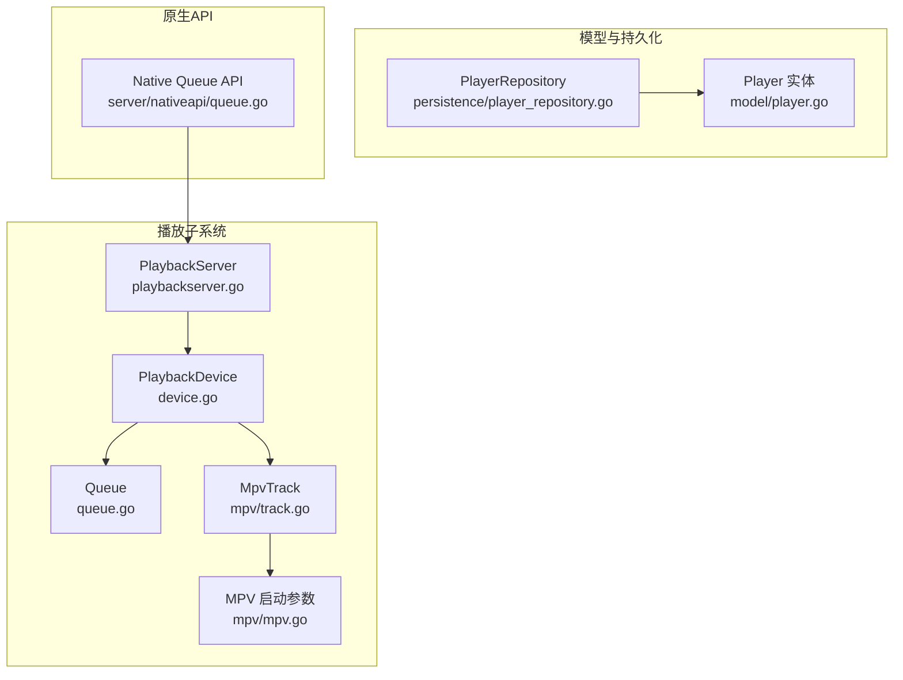
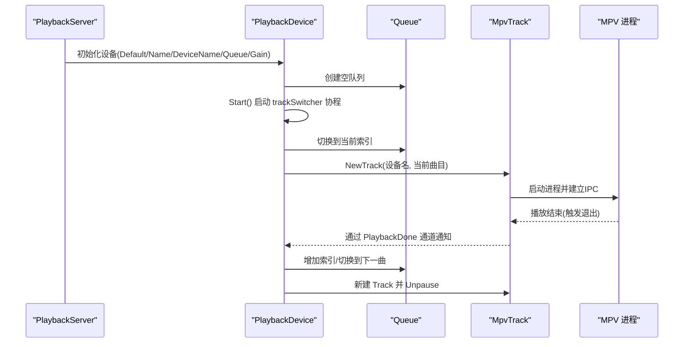
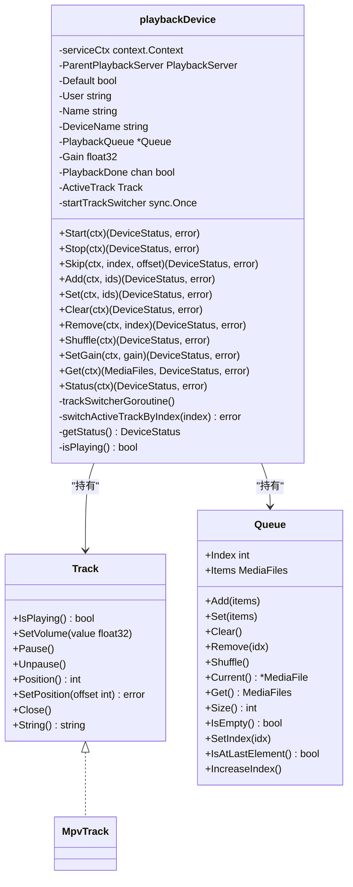
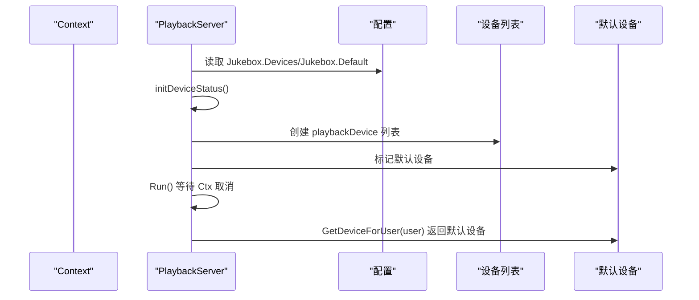
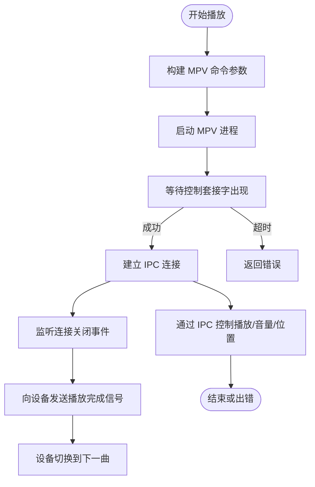
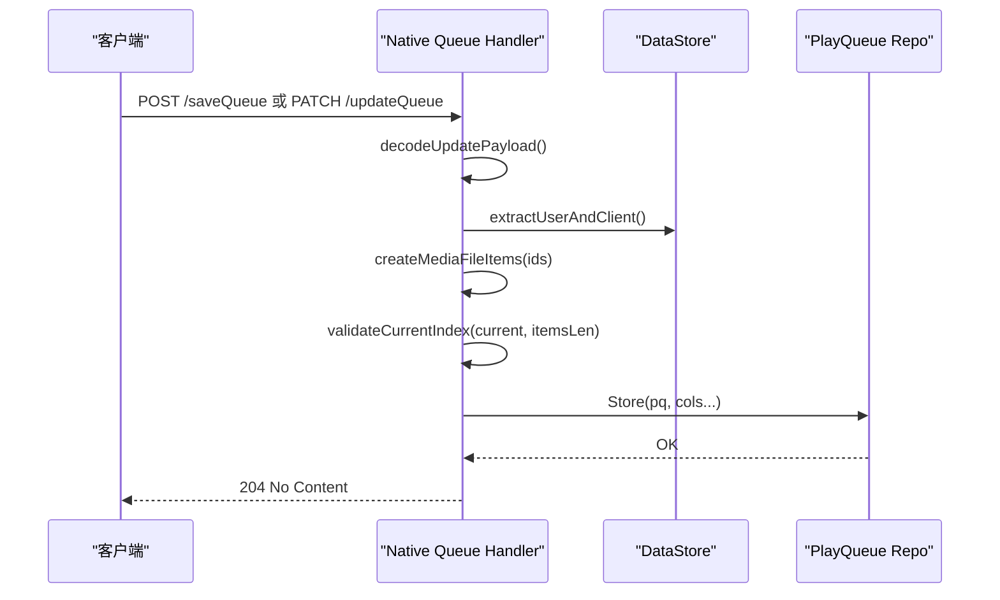
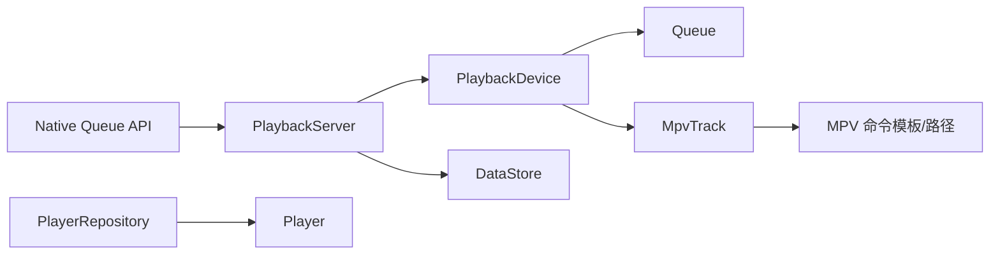

# 播放设备

<cite>
**本文引用的文件**
- [core/playback/device.go](file://core/playback/device.go)
- [core/playback/playbackserver.go](file://core/playback/playbackserver.go)
- [core/playback/queue.go](file://core/playback/queue.go)
- [core/playback/mpv/track.go](file://core/playback/mpv/track.go)
- [core/playback/mpv/mpv.go](file://core/playback/mpv/mpv.go)
- [model/player.go](file://model/player.go)
- [persistence/player_repository.go](file://persistence/player_repository.go)
- [server/nativeapi/queue.go](file://server/nativeapi/queue.go)
</cite>

## 目录
1. [简介](#简介)
2. [项目结构](#项目结构)
3. [核心组件](#核心组件)
4. [架构总览](#架构总览)
5. [详细组件分析](#详细组件分析)
6. [依赖关系分析](#依赖关系分析)
7. [性能考量](#性能考量)
8. [故障排查指南](#故障排查指南)
9. [结论](#结论)
10. [附录](#附录)

## 简介
本文件系统化阐述播放设备管理功能，围绕以下目标展开：
- 设备抽象模型与管理机制：设备注册、状态监控、控制命令（开始、停止、跳转、增删改查队列、音量调节等）。
- 设备与播放会话的关联：如何在服务启动时初始化设备、默认设备选择策略、用户到设备的映射。
- 播放器模型与持久化：播放器实体字段、能力描述、存储与查询接口。
- 原生队列API：设备相关API的使用示例与流程。
- 高级功能：心跳检测、离线处理、多设备同步等实践建议。
- 面向不同读者：为初学者提供直观理解，为高级用户提供能力协商与跨平台兼容性处理思路。

## 项目结构
播放设备相关代码主要分布在 playback 子系统与原生API层，并通过 MPV 进程进行实际音频播放。核心文件如下：
- 设备与队列：device.go、queue.go
- 播放服务器：playbackserver.go
- MPV 驱动：mpv/track.go、mpv/mpv.go
- 播放器模型与持久化：model/player.go、persistence/player_repository.go
- 原生队列API：server/nativeapi/queue.go

图表来源
- [core/playback/playbackserver.go](file://core/playback/playbackserver.go#L1-L128)
- [core/playback/device.go](file://core/playback/device.go#L1-L300)
- [core/playback/queue.go](file://core/playback/queue.go#L1-L137)
- [core/playback/mpv/track.go](file://core/playback/mpv/track.go#L1-L224)
- [core/playback/mpv/mpv.go](file://core/playback/mpv/mpv.go#L1-L132)
- [model/player.go](file://model/player.go#L1-L32)
- [persistence/player_repository.go](file://persistence/player_repository.go#L1-L170)
- [server/nativeapi/queue.go](file://server/nativeapi/queue.go#L1-L215)

章节来源
- [core/playback/device.go](file://core/playback/device.go#L1-L300)
- [core/playback/playbackserver.go](file://core/playback/playbackserver.go#L1-L128)
- [core/playback/queue.go](file://core/playback/queue.go#L1-L137)
- [core/playback/mpv/track.go](file://core/playback/mpv/track.go#L1-L224)
- [core/playback/mpv/mpv.go](file://core/playback/mpv/mpv.go#L1-L132)
- [model/player.go](file://model/player.go#L1-L32)
- [persistence/player_repository.go](file://persistence/player_repository.go#L1-L170)
- [server/nativeapi/queue.go](file://server/nativeapi/queue.go#L1-L215)

## 核心组件
- 播放服务器 PlaybackServer：负责设备生命周期管理、默认设备选择、媒体文件解析。
- 播放设备 playbackDevice：封装单个音频设备的状态与操作，包含队列、音量、当前播放曲目、状态通道等。
- 队列 Queue：维护播放列表索引与条目集合，支持增删改查、洗牌、边界校验等。
- MPV 驱动 MpvTrack：通过 MPV 进程与 IPC 控制播放，提供暂停/恢复、音量、位置、关闭等能力。
- 播放器模型 Player 与持久化 PlayerRepository：记录客户端信息、能力描述、最后在线时间等，提供匹配与计数查询。

章节来源
- [core/playback/playbackserver.go](file://core/playback/playbackserver.go#L1-L128)
- [core/playback/device.go](file://core/playback/device.go#L1-L300)
- [core/playback/queue.go](file://core/playback/queue.go#L1-L137)
- [core/playback/mpv/track.go](file://core/playback/mpv/track.go#L1-L224)
- [model/player.go](file://model/player.go#L1-L32)
- [persistence/player_repository.go](file://persistence/player_repository.go#L1-L170)

## 架构总览
播放设备管理采用“服务-设备-队列-驱动”的分层架构：
- PlaybackServer 在运行期初始化设备，选择默认设备，并为用户分配设备实例。
- playbackDevice 维护设备状态与队列，通过 trackSwitcher 协程自动推进下一曲。
- Queue 提供播放列表的增删改查与索引管理。
- MpvTrack 通过 MPV 进程与 IPC 控制播放，监听结束事件并通过通道通知设备切换。

图表来源
- [core/playback/playbackserver.go](file://core/playback/playbackserver.go#L37-L128)
- [core/playback/device.go](file://core/playback/device.go#L103-L177)
- [core/playback/device.go](file://core/playback/device.go#L254-L299)
- [core/playback/queue.go](file://core/playback/queue.go#L11-L137)
- [core/playback/mpv/track.go](file://core/playback/mpv/track.go#L28-L73)

## 详细组件分析

### 设备抽象与管理（device.go）
- 设备接口与实现
  - Track 接口：定义播放控制能力（播放/暂停/恢复/位置/音量/关闭/字符串化）。
  - playbackDevice 结构体：包含服务上下文、父服务器、默认标记、用户、名称、设备名、队列、音量、播放完成通道、当前曲目、一次启动开关等。
- 设备状态 DeviceStatus：包含当前索引、是否播放、音量、当前位置。
- 关键方法
  - NewPlaybackDevice：创建设备并初始化队列与通道。
  - Start/Stop/Skip/Add/Clear/Remove/Shuffle/SetGain：实现 Jukebox 模式命令语义；Start 仅在首次调用时启动 trackSwitcher 协程。
  - trackSwitcherGoroutine：监听 PlaybackDone 通道，自动切换到下一曲并恢复播放；收到服务上下文取消信号后退出。
  - switchActiveTrackByIndex：根据队列当前项创建 MpvTrack，设置音量并开始播放。
- 状态监控
  - getStatus：汇总队列索引、播放状态、音量、当前位置。
  - isPlaying：基于 ActiveTrack 的播放状态判断。

图表来源
- [core/playback/device.go](file://core/playback/device.go#L1-L300)
- [core/playback/queue.go](file://core/playback/queue.go#L1-L137)
- [core/playback/mpv/track.go](file://core/playback/mpv/track.go#L1-L224)

章节来源
- [core/playback/device.go](file://core/playback/device.go#L1-L300)
- [core/playback/queue.go](file://core/playback/queue.go#L1-L137)

### 播放服务器与设备关联（playbackserver.go）
- PlaybackServer 接口：Run、GetDeviceForUser、GetMediaFile。
- playbackServer 实现
  - Run：接收上下文，初始化设备列表，记录默认设备，等待上下文取消。
  - initDeviceStatus：解析配置中的音频设备定义，校验默认设备是否存在，生成设备实例。
  - getDefaultDevice：返回默认设备。
  - GetDeviceForUser：当前实现返回默认设备并标注用户；未来可扩展为按用户映射设备。
  - GetMediaFile：从 DataStore 获取媒体文件。

图表来源
- [core/playback/playbackserver.go](file://core/playback/playbackserver.go#L37-L128)

章节来源
- [core/playback/playbackserver.go](file://core/playback/playbackserver.go#L1-L128)

### 队列管理（queue.go）
- Queue 结构：维护 Index 与 Items，提供 Current、Get、Size、IsEmpty、Set、Add、Clear、Remove、Shuffle、SetIndex、IsAtLastElement、IncreaseIndex 等方法。
- 行为要点
  - Add：当为空且未设置索引时，默认将索引置为 0。
  - Remove：删除指定索引项后尝试恢复当前曲目索引，若找不到则清空索引。
  - Shuffle：保持当前曲目不变的前提下随机打乱列表，并恢复当前曲目索引。
  - 边界保护：SetIndex 将索引限制在有效范围内；IsAtLastElement 判断是否到达末尾。

章节来源
- [core/playback/queue.go](file://core/playback/queue.go#L1-L137)

### MPV 驱动（mpv/track.go、mpv/mpv.go）
- MpvTrack
  - NewTrack：解析 MPV 命令模板，启动进程，等待控制套接字出现，建立 IPC 连接；后台监听连接关闭并向设备发送播放完成信号。
  - SetVolume：将 0~1 映射到 0~100 设置 MPV 音量。
  - Pause/Unpause：通过 IPC 设置 pause 属性。
  - Position/SetPosition：通过 IPC 读取/设置 time-pos；对“属性不可用”错误进行有限重试。
  - Close：优先通过 IPC quit，失败则取消执行器；清理套接字文件。
- mpv.go
  - createMPVCommand：解析模板参数，替换占位符并修正可执行路径。
  - mpvCommand/start：查找可执行文件、启动进程、等待退出并处理错误。

图表来源
- [core/playback/mpv/track.go](file://core/playback/mpv/track.go#L28-L73)
- [core/playback/mpv/track.go](file://core/playback/mpv/track.go#L143-L204)
- [core/playback/mpv/mpv.go](file://core/playback/mpv/mpv.go#L76-L104)

章节来源
- [core/playback/mpv/track.go](file://core/playback/mpv/track.go#L1-L224)
- [core/playback/mpv/mpv.go](file://core/playback/mpv/mpv.go#L1-L132)

### 播放器模型与持久化（model/player.go、persistence/player_repository.go）
- Player 实体字段
  - 用户标识：用户名、用户ID
  - 客户端信息：客户端名称、User-Agent、IP
  - 能力描述：最大比特率、转码ID、报告真实路径、Scrobble 开关
  - 最后在线时间：LastSeen
- PlayerRepository 接口
  - Get、FindMatch、Put、CountAll、CountByClient
- playerRepository 实现
  - FindMatch：按用户ID、客户端、User-Agent 匹配唯一播放器
  - CountByClient：统计各客户端数量（区分 UI 名称）
  - 权限控制：非管理员仅能访问自身数据

章节来源
- [model/player.go](file://model/player.go#L1-L32)
- [persistence/player_repository.go](file://persistence/player_repository.go#L1-L170)

### 原生队列API（server/nativeapi/queue.go）
- 功能概览
  - 获取队列：按用户检索 PlayQueue 并返回 JSON
  - 保存队列：将传入的 ids/current/position 写入数据库
  - 更新队列：支持部分更新（items/current/position），并在更新前进行索引有效性校验
  - 清空队列：按用户清空
- 关键流程
  - decodeUpdatePayload：解码 JSON 负载
  - validateCurrentIndex：校验 current 是否在 items 长度范围内
  - retrieveExistingQueue：读取现有队列用于校验
  - createMediaFileItems：将 ID 列表转换为 MediaFile 列表
  - extractUserAndClient：从请求上下文中提取用户与客户端信息

图表来源
- [server/nativeapi/queue.go](file://server/nativeapi/queue.go#L94-L201)

章节来源
- [server/nativeapi/queue.go](file://server/nativeapi/queue.go#L1-L215)

## 依赖关系分析
- 组件耦合
  - playbackDevice 依赖 Queue 与 MpvTrack；通过 PlaybackServer 获取媒体文件。
  - playbackServer 依赖配置与 DataStore；负责设备初始化与默认设备选择。
  - MpvTrack 依赖 MPV 进程与 IPC；通过通道通知设备播放完成。
  - PlayerRepository 依赖 DataStore 与权限上下文，提供播放器实体的 CRUD 与统计。
- 外部依赖
  - MPV 命令模板与可执行文件路径由配置决定。
  - 日志模块贯穿各层，便于调试与追踪。

图表来源
- [core/playback/playbackserver.go](file://core/playback/playbackserver.go#L37-L128)
- [core/playback/device.go](file://core/playback/device.go#L103-L177)
- [core/playback/queue.go](file://core/playback/queue.go#L1-L137)
- [core/playback/mpv/track.go](file://core/playback/mpv/track.go#L28-L73)
- [core/playback/mpv/mpv.go](file://core/playback/mpv/mpv.go#L76-L104)
- [persistence/player_repository.go](file://persistence/player_repository.go#L1-L170)
- [server/nativeapi/queue.go](file://server/nativeapi/queue.go#L94-L201)

章节来源
- [core/playback/playbackserver.go](file://core/playback/playbackserver.go#L1-L128)
- [core/playback/device.go](file://core/playback/device.go#L1-L300)
- [core/playback/queue.go](file://core/playback/queue.go#L1-L137)
- [core/playback/mpv/track.go](file://core/playback/mpv/track.go#L1-L224)
- [core/playback/mpv/mpv.go](file://core/playback/mpv/mpv.go#L1-L132)
- [persistence/player_repository.go](file://persistence/player_repository.go#L1-L170)
- [server/nativeapi/queue.go](file://server/nativeapi/queue.go#L1-L215)

## 性能考量
- 队列操作
  - Add/Set/Clear/Remove/Shuffle：均以数组切片为基础，时间复杂度 O(n)，其中 n 为条目数；Remove/Shuffle 含索引查找 O(n)。
  - 建议：批量更新时尽量合并操作，避免频繁切换曲目导致 MPV 进程反复启动/关闭。
- MPV 启动与 IPC
  - 启动开销：每次切换曲目都会新建 MpvTrack，启动新进程并等待套接字；可通过减少不必要的切换降低开销。
  - IPC 重试：Position 获取失败时有限重试，避免瞬时错误影响体验。
- 并发与协程
  - trackSwitcher 协程独立运行，避免阻塞主流程；注意上下文取消时及时退出。
- 数据持久化
  - PlayerRepository 的 CountByClient 使用分组聚合，适合统计维度；查询时注意权限过滤带来的额外开销。

[本节为通用指导，不直接分析具体文件]

## 故障排查指南
- 设备初始化失败
  - 检查配置中的音频设备定义格式与默认设备名称是否一致；确认 initDeviceStatus 的错误提示。
- MPV 启动失败
  - 查看 createMPVCommand 的日志与返回值；确认 mpvCommand 能找到可执行文件；检查命令模板占位符替换是否正确。
- IPC 连接问题
  - 等待套接字超时：检查等待逻辑与超时参数；确认 MPV 进程已正常启动。
  - 位置/暂停状态获取失败：查看 Position 的重试逻辑与错误日志。
- 队列索引越界
  - validateCurrentIndex 会在索引越界时返回错误；确保在更新 items 或 current 时进行一致性校验。
- 权限与数据隔离
  - PlayerRepository 的 isPermitted 仅允许管理员或本人访问；如遇权限错误，检查登录用户与目标实体的归属关系。

章节来源
- [core/playback/playbackserver.go](file://core/playback/playbackserver.go#L58-L101)
- [core/playback/mpv/mpv.go](file://core/playback/mpv/mpv.go#L76-L104)
- [core/playback/mpv/track.go](file://core/playback/mpv/track.go#L143-L204)
- [server/nativeapi/queue.go](file://server/nativeapi/queue.go#L22-L30)
- [persistence/player_repository.go](file://persistence/player_repository.go#L128-L131)

## 结论
播放设备管理通过清晰的分层设计实现了设备注册、状态监控与控制命令的统一抽象。PlaybackServer 负责设备生命周期与默认设备选择，playbackDevice 将队列与 MPV 驱动结合，形成稳定的播放会话。配合原生队列 API 与播放器模型持久化，系统既满足基础 Jukebox 场景，也为高级功能（如心跳、离线处理、多设备同步）提供了扩展点。建议在生产环境中关注 MPV 启动开销、队列批量更新与权限控制，以获得更佳的稳定性与性能。

[本节为总结性内容，不直接分析具体文件]

## 附录

### 设备与播放会话关联流程（补充）
- 服务启动时，PlaybackServer 读取配置并初始化设备列表，标记默认设备。
- 用户发起播放请求时，PlaybackServer.GetDeviceForUser 返回默认设备并绑定用户。
- 设备内部通过 Queue 管理播放列表，trackSwitcher 协程监听播放完成事件，自动切换到下一曲。
- MPV 驱动负责实际播放与 IPC 控制，异常时通过日志与错误返回便于定位。

章节来源
- [core/playback/playbackserver.go](file://core/playback/playbackserver.go#L37-L128)
- [core/playback/device.go](file://core/playback/device.go#L103-L177)
- [core/playback/queue.go](file://core/playback/queue.go#L11-L137)
- [core/playback/mpv/track.go](file://core/playback/mpv/track.go#L28-L73)

### 高级功能建议
- 心跳检测与离线处理
  - 可在 PlaybackServer 中引入定时任务，周期性检查设备可用性（如通过 IPC 查询状态）；若检测失败，标记设备离线并降级到备用设备。
- 多设备同步
  - 在 PlaybackServer 层维护设备状态广播，客户端订阅 SSE 或 WebSocket；设备切换时推送状态变更，保证多端一致。
- 跨平台兼容
  - MPV 命令模板与可执行文件路径通过配置注入；在 Windows/Linux/macOS 上分别提供合适的模板与路径解析逻辑，确保兼容性。

[本节为通用建议，不直接分析具体文件]