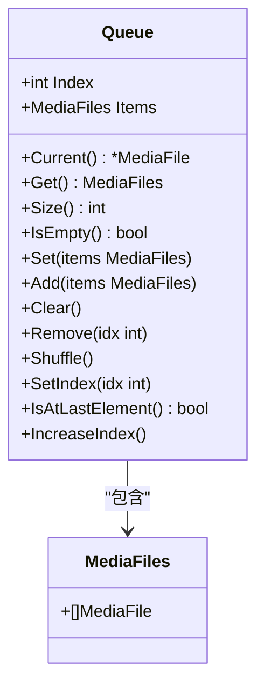
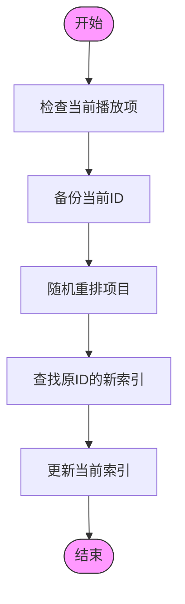
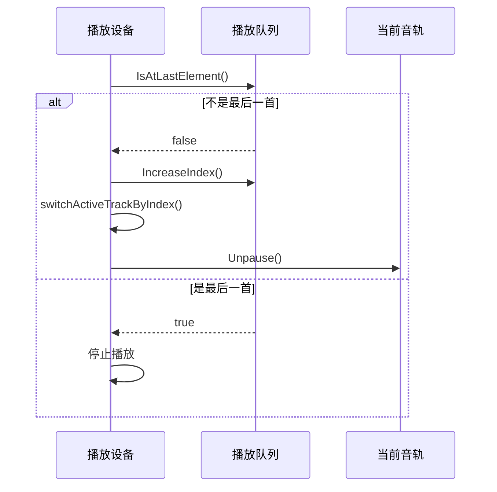
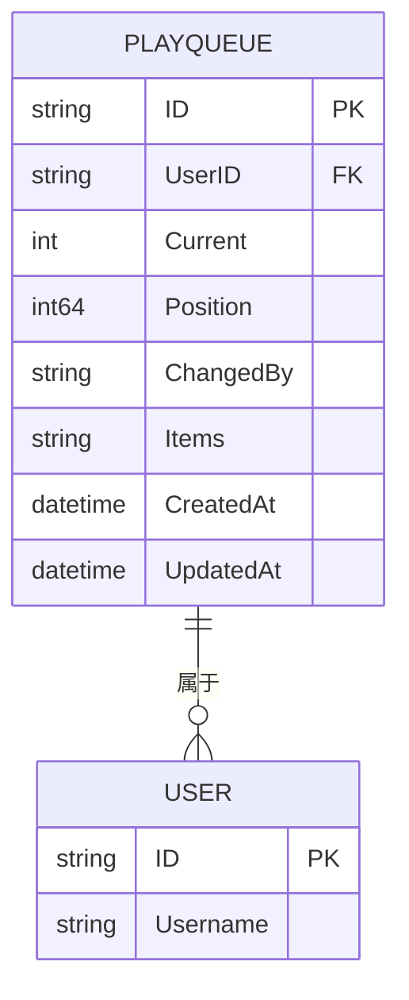
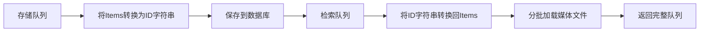
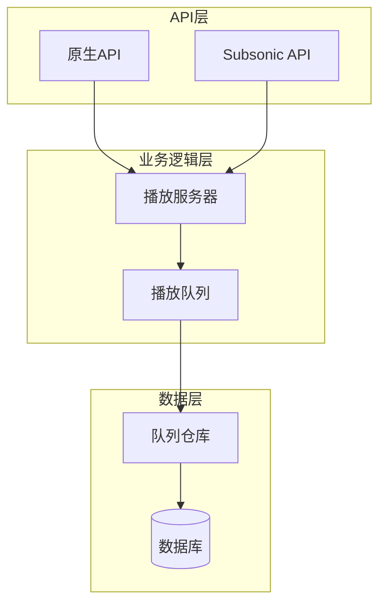
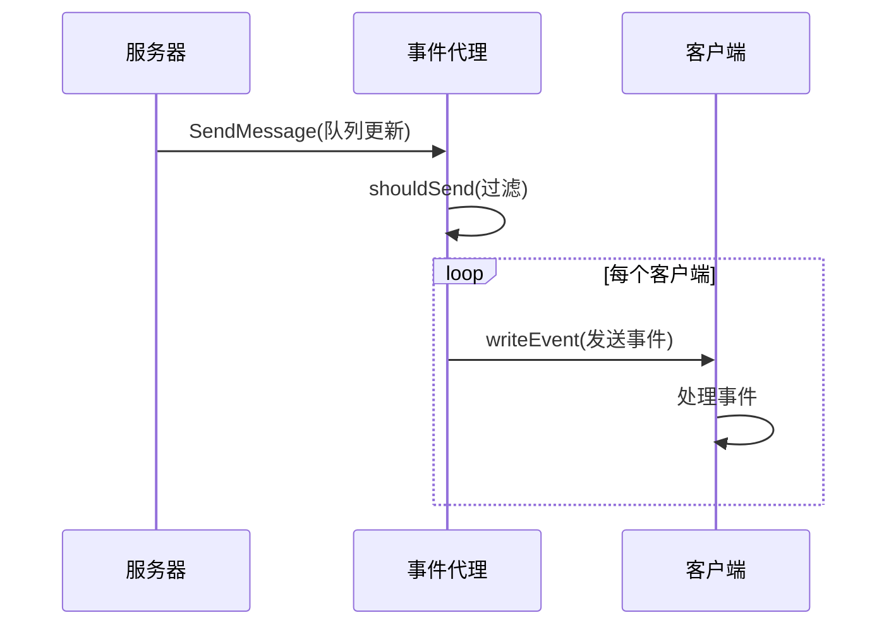

# 播放队列

<cite>
**本文档引用的文件**  
- [queue.go](file://core/playback/queue.go)
- [playbackserver.go](file://core/playback/playbackserver.go)
- [playqueue.go](file://model/playqueue.go)
- [playqueue_repository.go](file://persistence/playqueue_repository.go)
- [queue.go](file://server/nativeapi/queue.go)
- [jukebox.go](file://server/subsonic/jukebox.go)
- [device.go](file://core/playback/device.go)
- [sse.go](file://server/events/sse.go)
</cite>

## 目录
1. [播放队列数据结构设计](#播放队列数据结构设计)
2. [播放队列操作算法实现](#播放队列操作算法实现)
3. [播放队列状态管理机制](#播放队列状态管理机制)
4. [播放队列模型定义](#播放队列模型定义)
5. [队列数据持久化策略](#队列数据持久化策略)
6. [API端点实现示例](#api端点实现示例)
7. [事件广播与前端同步](#事件广播与前端同步)

## 播放队列数据结构设计

播放队列的核心数据结构在 `core/playback/queue.go` 文件中定义，主要由 `Queue` 结构体实现。该结构体包含两个关键字段：`Index` 表示当前播放位置的索引，`Items` 存储媒体文件列表。索引从0开始，当队列为空时，索引值为-1。这种设计确保了对播放位置的精确控制。

**Diagram sources**
- [queue.go](file://core/playback/queue.go#L11-L14)

**Section sources**
- [queue.go](file://core/playback/queue.go#L11-L14)

## 播放队列操作算法实现

播放队列实现了多种操作算法，包括添加、删除、移动和清空等。`Add` 方法将媒体文件追加到队列末尾，并在队列为空时自动设置当前索引为0。`Remove` 方法删除指定索引的项目，并智能地重新定位当前播放索引，确保播放连续性。`Shuffle` 方法使用随机洗牌算法重新排列队列，同时保持当前播放项的位置不变。

**Diagram sources**
- [queue.go](file://core/playback/queue.go#L95-L109)

**Section sources**
- [queue.go](file://core/playback/queue.go#L64-L93)

## 播放队列状态管理机制

播放队列的状态管理通过 `playbackDevice` 结构体实现，该结构体在 `core/playback/device.go` 中定义。它维护了播放队列、当前音轨、音量增益等状态信息。`trackSwitcherGoroutine` 协程监控播放完成事件，自动切换到下一首歌曲，实现了无缝播放体验。

**Diagram sources**
- [device.go](file://core/playback/device.go#L254-L283)

**Section sources**
- [device.go](file://core/playback/device.go#L24-L37)

## 播放队列模型定义

播放队列的持久化模型在 `model/playqueue.go` 中定义，包含用户ID、当前索引、播放位置、变更者等字段。该模型通过 `PlayQueueRepository` 接口提供存储和检索功能，支持完整队列和仅ID列表的两种检索模式，优化了不同场景下的性能表现。

**Diagram sources**
- [playqueue.go](file://model/playqueue.go#L7-L16)

**Section sources**
- [playqueue.go](file://model/playqueue.go#L7-L29)

## 队列数据持久化策略

队列数据的持久化通过 `playqueue_repository.go` 实现，采用关系型数据库存储。队列项目以逗号分隔的ID字符串形式存储，避免了复杂的关联查询。`loadTracks` 方法分批加载媒体文件，防止SQL参数数量超限，体现了对大规模数据处理的优化考虑。

**Diagram sources**
- [playqueue_repository.go](file://persistence/playqueue_repository.go#L39-L77)

**Section sources**
- [playqueue_repository.go](file://persistence/playqueue_repository.go#L1-L179)

## API端点实现示例

播放队列通过多种API协议提供服务。`server/nativeapi/queue.go` 实现了原生API，支持JSON格式的队列更新。`server/subsonic/jukebox.go` 实现了Subsonic协议的Jukebox控制，兼容多种音乐客户端。两种实现都通过数据存储层与核心逻辑解耦，确保了API的灵活性和可维护性。

**Diagram sources**
- [queue.go](file://server/nativeapi/queue.go#L69-L215)
- [jukebox.go](file://server/subsonic/jukebox.go#L29-L137)

**Section sources**
- [queue.go](file://server/nativeapi/queue.go#L1-L215)
- [jukebox.go](file://server/subsonic/jukebox.go#L1-L137)

## 事件广播与前端同步

队列变更通过SSE（Server-Sent Events）机制广播给前端。`server/events/sse.go` 实现了事件代理，当队列状态改变时，向所有连接的客户端发送更新事件。前端通过事件流实时同步播放状态，确保了多设备间的播放一致性。

**Diagram sources**
- [sse.go](file://server/events/sse.go#L86-L90)

**Section sources**
- [sse.go](file://server/events/sse.go#L1-L292)