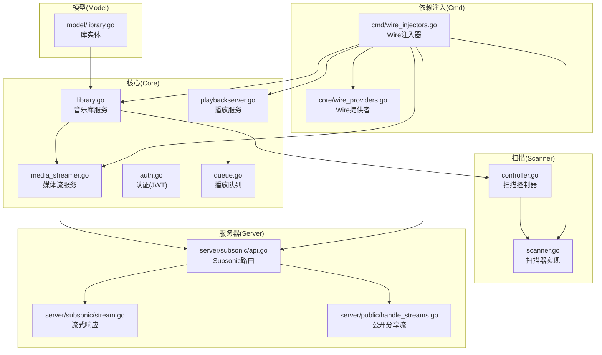
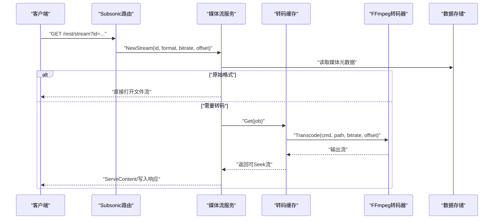
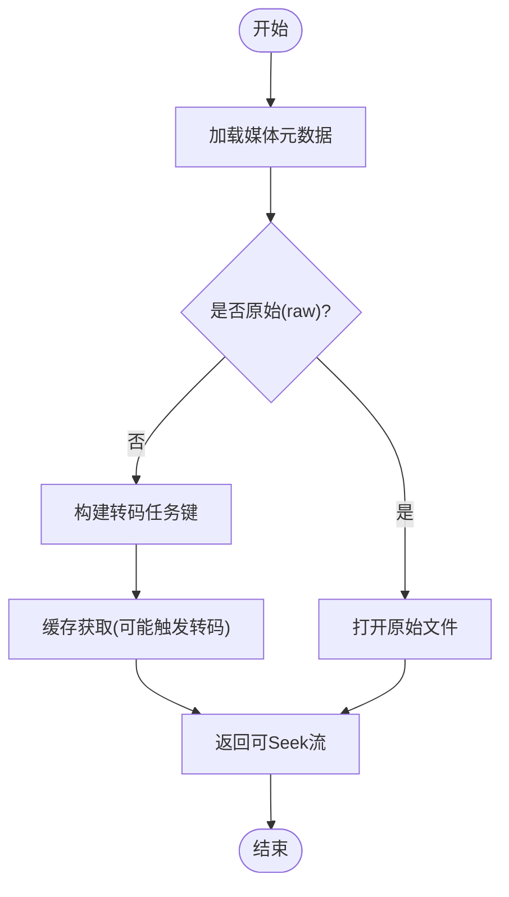
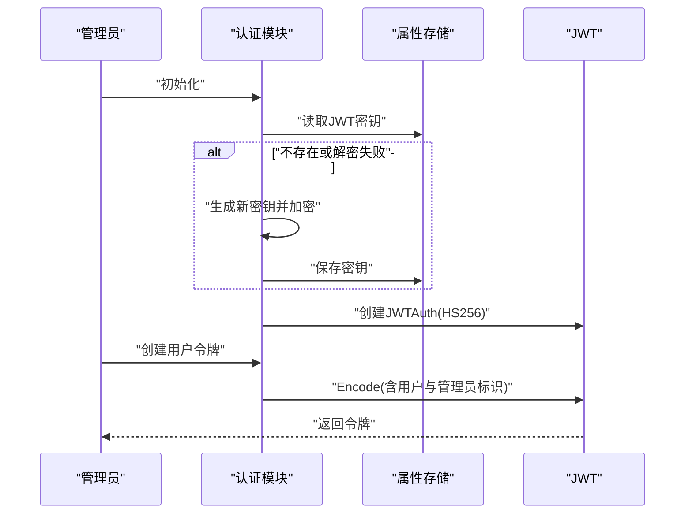
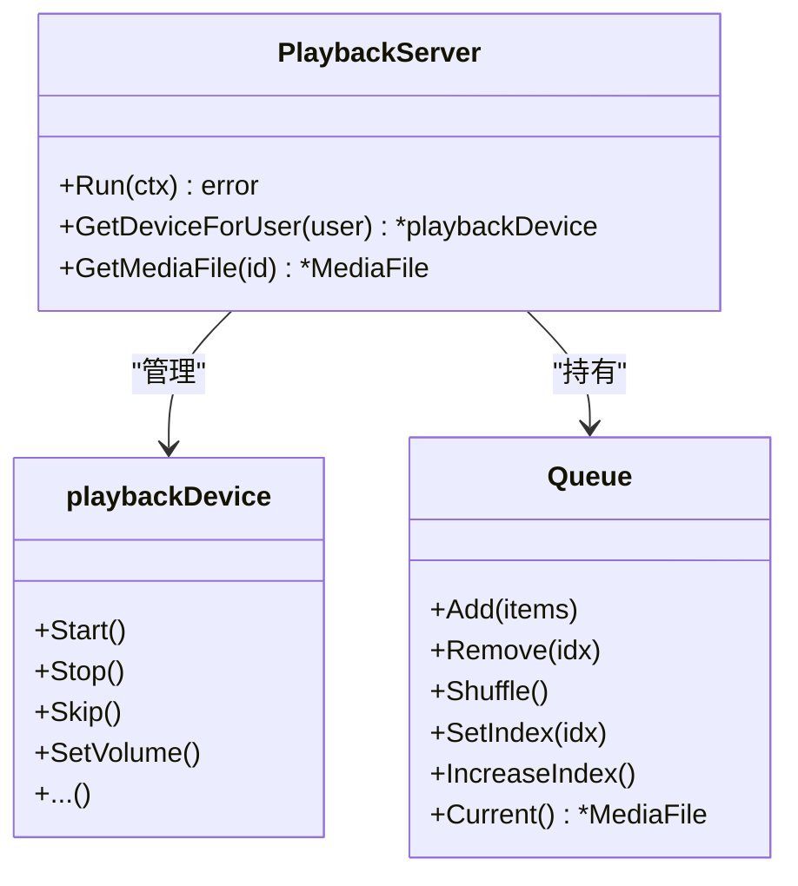
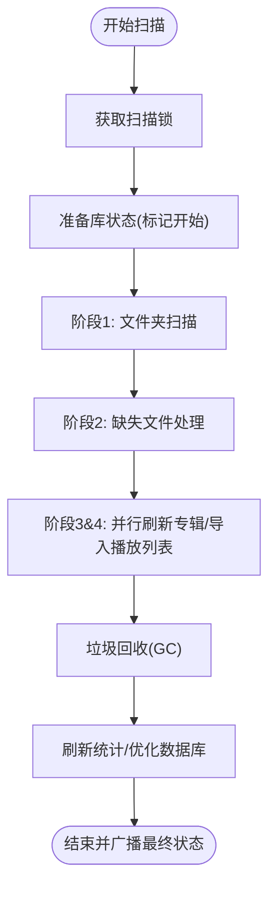
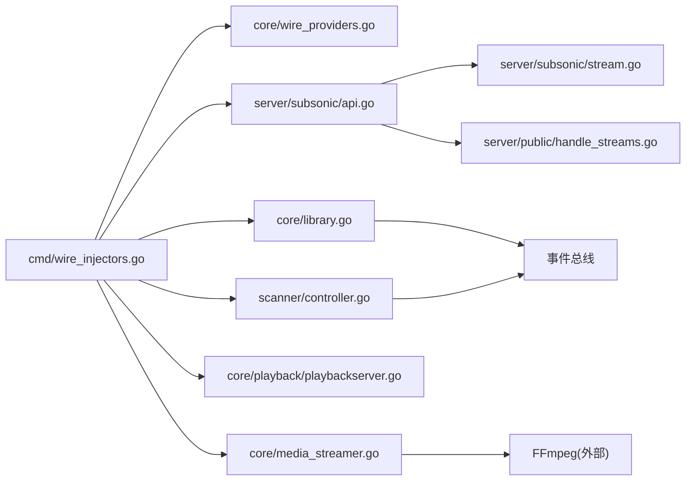

# 核心功能

<cite>
**本文引用的文件**
- [core/library.go](file://core/library.go)
- [core/media_streamer.go](file://core/media_streamer.go)
- [core/auth/auth.go](file://core/auth/auth.go)
- [core/playback/playbackserver.go](file://core/playback/playbackserver.go)
- [core/playback/queue.go](file://core/playback/queue.go)
- [scanner/controller.go](file://scanner/controller.go)
- [scanner/scanner.go](file://scanner/scanner.go)
- [server/subsonic/stream.go](file://server/subsonic/stream.go)
- [server/public/handle_streams.go](file://server/public/handle_streams.go)
- [server/subsonic/api.go](file://server/subsonic/api.go)
- [model/library.go](file://model/library.go)
- [cmd/wire_injectors.go](file://cmd/wire_injectors.go)
- [core/wire_providers.go](file://core/wire_providers.go)
</cite>

## 目录
1. [简介](#简介)
2. [项目结构](#项目结构)
3. [核心组件](#核心组件)
4. [架构总览](#架构总览)
5. [详细组件分析](#详细组件分析)
6. [依赖分析](#依赖分析)
7. [性能考量](#性能考量)
8. [故障排查指南](#故障排查指南)
9. [结论](#结论)
10. [附录](#附录)

## 简介
本文件面向Navidrome的核心功能，围绕“音乐库管理”“流媒体服务”“用户认证”“播放管理”四大模块进行系统化梳理。内容涵盖：
- 架构设计与组件关系
- 实现细节与关键流程
- 配置项、参数与返回值说明
- 常见使用模式与最佳实践
- 初学者概念理解与进阶开发者技术深度兼顾

## 项目结构
Navidrome采用分层与模块化组织：核心业务在core目录，扫描器在scanner目录，子sonic接口在server/subsonic，公共接口在server/public，数据模型在model目录，依赖注入通过Wire在cmd目录完成。

图表来源
- [core/library.go](file://core/library.go#L1-L120)
- [core/media_streamer.go](file://core/media_streamer.go#L1-L120)
- [core/auth/auth.go](file://core/auth/auth.go#L1-L120)
- [core/playback/playbackserver.go](file://core/playback/playbackserver.go#L1-L120)
- [core/playback/queue.go](file://core/playback/queue.go#L1-L120)
- [scanner/controller.go](file://scanner/controller.go#L1-L120)
- [scanner/scanner.go](file://scanner/scanner.go#L1-L120)
- [server/subsonic/api.go](file://server/subsonic/api.go#L1-L120)
- [server/subsonic/stream.go](file://server/subsonic/stream.go#L1-L120)
- [server/public/handle_streams.go](file://server/public/handle_streams.go#L1-L100)
- [model/library.go](file://model/library.go#L1-L62)
- [cmd/wire_injectors.go](file://cmd/wire_injectors.go#L1-L120)
- [core/wire_providers.go](file://core/wire_providers.go#L1-L30)

章节来源
- [core/library.go](file://core/library.go#L1-L120)
- [scanner/controller.go](file://scanner/controller.go#L1-L120)
- [server/subsonic/api.go](file://server/subsonic/api.go#L1-L120)
- [cmd/wire_injectors.go](file://cmd/wire_injectors.go#L1-L120)
- [core/wire_providers.go](file://core/wire_providers.go#L1-L30)

## 核心组件
- 音乐库管理：负责库的增删改查、用户权限校验、路径验证、自动扫描触发与事件广播。
- 流媒体服务：根据请求选择原始或转码流，支持缓存与可寻址流，处理HTTP Range与长度估算。
- 用户认证：基于JWT的会话令牌生成、刷新与校验，支持UI会话与公开令牌。
- 播放管理：播放服务单例、设备初始化、队列操作（添加、移除、洗牌、索引控制）。

章节来源
- [core/library.go](file://core/library.go#L1-L120)
- [core/media_streamer.go](file://core/media_streamer.go#L1-L120)
- [core/auth/auth.go](file://core/auth/auth.go#L1-L120)
- [core/playback/playbackserver.go](file://core/playback/playbackserver.go#L1-L120)
- [core/playback/queue.go](file://core/playback/queue.go#L1-L120)

## 架构总览
Navidrome通过Wire进行依赖注入，将核心服务（媒体流、扫描、播放、分享等）与服务器路由绑定。Subsonic路由统一接入，内部调用核心服务完成鉴权、扫描状态查询、流式传输与下载打包等。

图表来源
- [server/subsonic/stream.go](file://server/subsonic/stream.go#L1-L120)
- [core/media_streamer.go](file://core/media_streamer.go#L1-L120)
- [core/wire_providers.go](file://core/wire_providers.go#L1-L30)
- [cmd/wire_injectors.go](file://cmd/wire_injectors.go#L1-L120)

## 详细组件分析

### 音乐库管理
职责与流程
- 用户库关联：管理员可获取所有库；普通用户必须至少分配一个库；设置时进行存在性校验与权限检查。
- 库仓库包装：Save/Create时启动文件系统监听并触发快速扫描；Update/删除时重启监听并触发相应扫描；删除后清理孤儿数据。
- 路径验证：绝对路径、可访问性、目录存在性、权限检查；错误映射为REST验证错误。
- 事件广播：库变更后向所有客户端发送资源刷新事件。

关键实现要点
- 用户库权限校验与事件广播
- 库路径合法性与存储抽象适配
- 保存/更新/删除后的扫描触发与缓存事件

章节来源
- [core/library.go](file://core/library.go#L1-L200)
- [core/library.go](file://core/library.go#L200-L408)
- [model/library.go](file://model/library.go#L1-L62)

### 流媒体服务
职责与流程
- NewStream/DoStream：根据请求参数与默认策略选择是否转码与目标码率；原始流直接打开文件，转码流通过缓存获取。
- 转码缓存：按媒体ID、更新时间、目标码率、格式与偏移构建键；支持可取消/不可取消两种上下文模式。
- Stream对象：封装ReadCloser/Seeker、内容类型、名称、修改时间、时长与估算长度。
- 选择策略：优先请求格式/码率，其次默认转码配置，再次降采样格式；当目标格式等于原格式且码率不更低时回退到原始流。

图表来源
- [core/media_streamer.go](file://core/media_streamer.go#L1-L120)
- [core/media_streamer.go](file://core/media_streamer.go#L120-L228)

章节来源
- [core/media_streamer.go](file://core/media_streamer.go#L1-L228)

### 用户认证
职责与流程
- 初始化JWT密钥：从数据库读取或生成新密钥并加密存储；使用HS256签名算法。
- 令牌生成：用户令牌包含用户信息与管理员标识；公开令牌用于UI会话与分享链接。
- 令牌刷新：延长过期时间并重新编码；支持带过期时间的公开令牌。
- 管理员上下文：在无管理员时提供空用户上下文以便初始化。

图表来源
- [core/auth/auth.go](file://core/auth/auth.go#L1-L120)

章节来源
- [core/auth/auth.go](file://core/auth/auth.go#L1-L148)

### 播放管理
职责与流程
- 播放服务单例：初始化音频设备列表，记录默认设备；运行期间监听上下文取消。
- 设备初始化：支持多设备定义与默认设备校验；若未指定默认设备则自动生成“auto”设备。
- 队列管理：支持添加、移除、清空、洗牌、索引移动与边界保护；当前曲目定位与越界错误日志。

图表来源
- [core/playback/playbackserver.go](file://core/playback/playbackserver.go#L1-L120)
- [core/playback/queue.go](file://core/playback/queue.go#L1-L120)

章节来源
- [core/playback/playbackserver.go](file://core/playback/playbackserver.go#L1-L128)
- [core/playback/queue.go](file://core/playback/queue.go#L1-L137)

### 扫描器与音乐库导入
职责与流程
- 控制器：全局扫描锁避免并发冲突；跟踪进度并通过事件总线广播；统计计数器与最后扫描时间。
- 扫描器：按阶段流水线执行（文件夹扫描、缺失文件处理、专辑刷新、播放列表导入），随后GC、统计刷新、库状态更新与数据库优化。
- 外部扫描：可通过配置切换外部扫描实现。

图表来源
- [scanner/controller.go](file://scanner/controller.go#L1-L200)
- [scanner/scanner.go](file://scanner/scanner.go#L1-L200)

章节来源
- [scanner/controller.go](file://scanner/controller.go#L1-L311)
- [scanner/scanner.go](file://scanner/scanner.go#L1-L375)

### Subsonic流式与下载
职责与流程
- 流式响应：支持Range与Content-Length；非可寻址流时可选估算长度；关闭时确保资源释放。
- 下载：根据配置决定是否允许下载；支持对媒体文件直接下载与对专辑/艺术家/播放列表打包下载。

章节来源
- [server/subsonic/stream.go](file://server/subsonic/stream.go#L1-L164)
- [server/subsonic/api.go](file://server/subsonic/api.go#L1-L200)

### 公开分享流
职责与流程
- 解析共享令牌：从JWT中提取媒体ID、格式与码率；校验必填声明。
- 启动流：调用媒体流服务并以HTTP方式返回。

章节来源
- [server/public/handle_streams.go](file://server/public/handle_streams.go#L1-L106)

## 依赖分析
- 依赖注入：通过Wire在cmd/wire_injectors.go中聚合所有提供者，并在core/wire_providers.go中导出核心服务绑定。
- 组件耦合：Subsonic路由聚合多个核心服务（媒体流、扫描、播放、分享、指标等），通过Router字段注入；播放服务与队列通过单例管理。
- 外部依赖：FFmpeg用于转码；事件总线用于扫描与库变更通知；存储抽象用于库路径验证与文件系统访问。

图表来源
- [cmd/wire_injectors.go](file://cmd/wire_injectors.go#L1-L120)
- [core/wire_providers.go](file://core/wire_providers.go#L1-L30)
- [server/subsonic/api.go](file://server/subsonic/api.go#L1-L120)
- [core/media_streamer.go](file://core/media_streamer.go#L1-L120)
- [scanner/controller.go](file://scanner/controller.go#L1-L120)

章节来源
- [cmd/wire_injectors.go](file://cmd/wire_injectors.go#L1-L120)
- [core/wire_providers.go](file://core/wire_providers.go#L1-L30)

## 性能考量
- 流媒体
  - 使用转码缓存减少重复转码；可配置是否允许转码取消以平衡延迟与资源占用。
  - 对非可寻址流提供估算长度，有助于客户端预估下载时间。
- 扫描
  - 分阶段流水线并行处理，减少整体扫描时间；GC与统计刷新仅在检测到变更时执行。
  - 进度事件节流，避免频繁广播影响性能。
- 认证
  - JWT密钥持久化与加密存储，避免每次启动重算；令牌刷新延长会话有效期。
- 播放
  - 单例播放服务集中管理设备状态；队列操作保持O(n)范围内的索引维护。

## 故障排查指南
- 扫描冲突
  - 现象：重复扫描请求被忽略。
  - 排查：确认扫描锁状态与并发控制；查看扫描状态事件与最后错误属性。
  - 参考
    - [scanner/controller.go](file://scanner/controller.go#L250-L311)
- 库路径无效
  - 现象：库路径必须为绝对路径且可访问，否则返回验证错误。
  - 排查：检查路径格式、权限与目录存在性；关注存储抽象FS可用性。
  - 参考
    - [core/library.go](file://core/library.go#L308-L376)
- 流媒体转码失败
  - 现象：转码命令加载失败或进程启动异常。
  - 排查：确认转码配置、命令可用性与缓存上下文模式；查看错误日志。
  - 参考
    - [core/media_streamer.go](file://core/media_streamer.go#L180-L228)
- 认证失败
  - 现象：令牌解析或验证失败。
  - 排查：确认密钥正确、加密存储正常、令牌未过期。
  - 参考
    - [core/auth/auth.go](file://core/auth/auth.go#L1-L120)

章节来源
- [scanner/controller.go](file://scanner/controller.go#L250-L311)
- [core/library.go](file://core/library.go#L308-L376)
- [core/media_streamer.go](file://core/media_streamer.go#L180-L228)
- [core/auth/auth.go](file://core/auth/auth.go#L1-L120)

## 结论
Navidrome通过清晰的模块划分与依赖注入，将音乐库管理、流媒体服务、用户认证与播放管理有机整合。扫描器采用流水线并行策略提升导入效率，媒体流服务结合缓存与可寻址能力满足多样播放需求，认证体系保障会话安全，播放服务提供稳定的设备与队列管理。建议在生产环境合理配置转码缓存与扫描节流，确保性能与稳定性。

## 附录
- 关键配置项（与实现相关）
  - 转码缓存大小与最大条目数：影响转码复用与内存占用。
  - 默认降采样格式：在请求码率低于源码率且无特定转码配置时启用。
  - 下载开关与自动转码下载：控制下载行为与默认转码策略。
  - 扫描节流速率：限制扫描进度事件广播频率。
  - JWT会话超时：影响令牌刷新与UI会话有效期。
  - Jukebox设备定义与默认设备：影响播放设备初始化与选择。
- 常见使用模式
  - 新建库：创建库后自动触发快速扫描并启动监听；删除库后清理并触发扫描。
  - 流式播放：优先尝试原始流，必要时转码并缓存；支持Range与估算长度。
  - 管理员令牌：用于首次安装与后台任务；公开令牌用于UI会话与分享。
  - 播放队列：支持随机播放与索引跳转，注意当前曲目定位与边界保护。