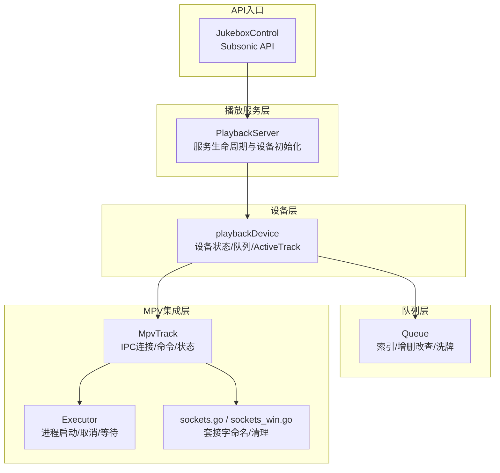
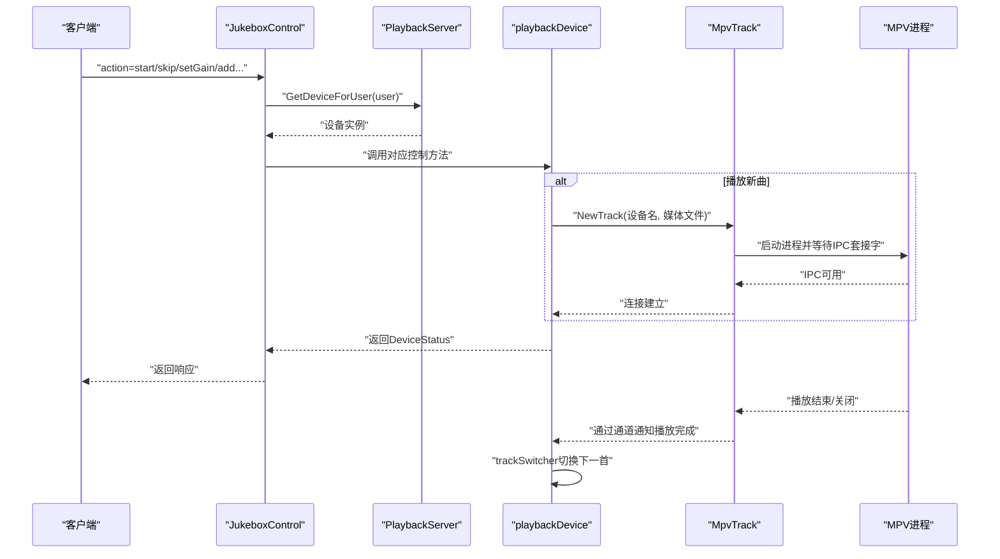
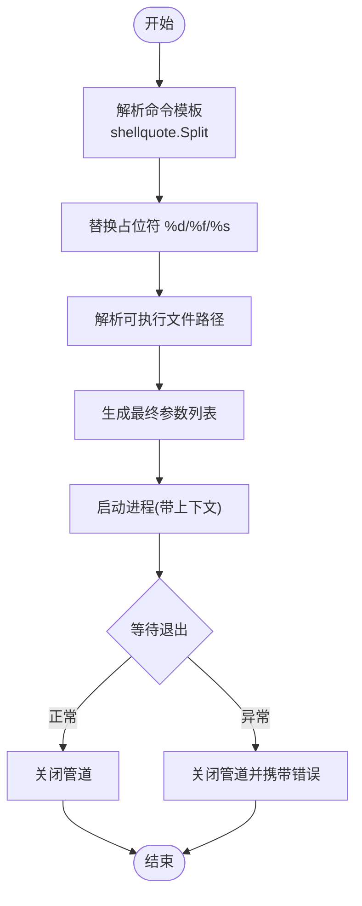
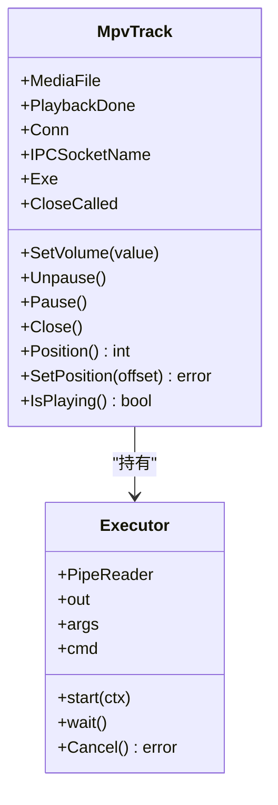
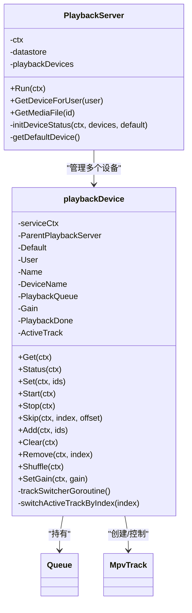
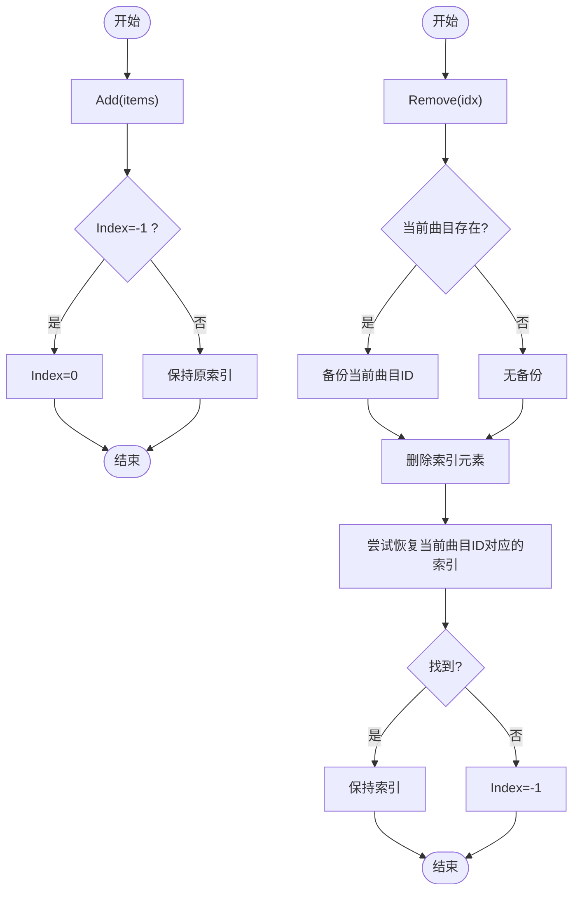
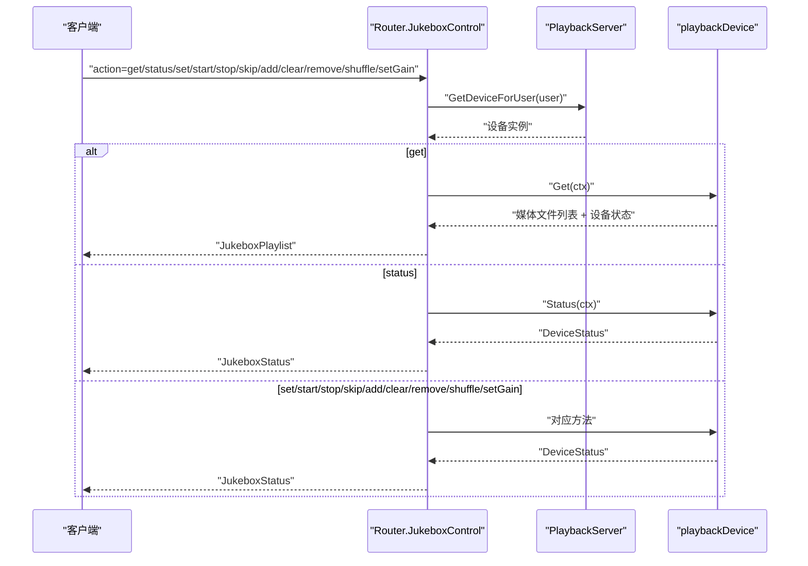
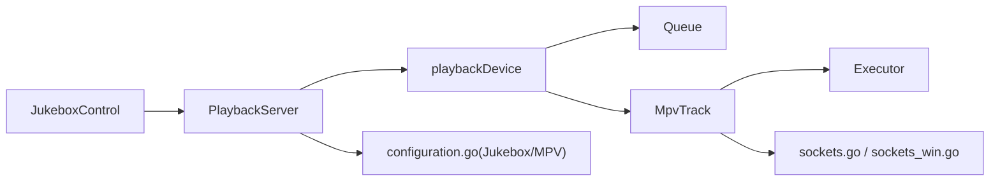

# 播放控制

<cite>
**本文引用的文件**
- [mpv.go](file://core/playback/mpv/mpv.go)
- [track.go](file://core/playback/mpv/track.go)
- [sockets.go](file://core/playback/mpv/sockets.go)
- [sockets_win.go](file://core/playback/mpv/sockets_win.go)
- [playbackserver.go](file://core/playback/playbackserver.go)
- [device.go](file://core/playback/device.go)
- [queue.go](file://core/playback/queue.go)
- [jukebox.go](file://server/subsonic/jukebox.go)
- [configuration.go](file://conf/configuration.go)
- [mpv_test.go](file://core/playback/mpv/mpv_test.go)
- [queue_test.go](file://core/playback/queue_test.go)
</cite>

## 目录
1. [简介](#简介)
2. [项目结构](#项目结构)
3. [核心组件](#核心组件)
4. [架构总览](#架构总览)
5. [详细组件分析](#详细组件分析)
6. [依赖关系分析](#依赖关系分析)
7. [性能与低延迟优化](#性能与低延迟优化)
8. [故障恢复与排障指南](#故障恢复与排障指南)
9. [结论](#结论)
10. [附录：API与数据模型](#附录api与数据模型)

## 简介
本文件面向“播放控制系统”的实现与使用，重点解析以下内容：
- MPV 播放器集成：进程启动、IPC 套接字通信、状态查询与命令下发
- 播放服务架构：设备发现与初始化、默认设备选择、服务生命周期
- 播放队列模型：队列数据结构、索引管理、随机播放与循环边界处理
- 控制接口：播放、暂停、跳转、音量控制、队列增删改查等
- 客户端到播放器指令的映射流程：Subsonic/Jukebox API 到内部设备调用
- 多客户端协调与状态同步：设备状态聚合、播放完成事件传播
- 故障恢复策略：进程退出、套接字等待超时、错误回退
- 面向初学者的概念解释与面向高级开发者的低延迟控制、状态预测、多设备扩展建议

## 项目结构
播放控制相关代码主要位于 core/playback 及其子包 mpv，以及 server/subsonic 的 Jukebox 控制入口。整体采用“服务层 + 设备层 + 队列层 + MPV 进程与 IPC 层”的分层设计。

图表来源
- [playbackserver.go](file://core/playback/playbackserver.go#L1-L128)
- [device.go](file://core/playback/device.go#L1-L300)
- [queue.go](file://core/playback/queue.go#L1-L137)
- [mpv.go](file://core/playback/mpv/mpv.go#L1-L132)
- [track.go](file://core/playback/mpv/track.go#L1-L224)
- [sockets.go](file://core/playback/mpv/sockets.go#L1-L23)
- [sockets_win.go](file://core/playback/mpv/sockets_win.go#L1-L20)
- [jukebox.go](file://server/subsonic/jukebox.go#L1-L136)

章节来源
- [playbackserver.go](file://core/playback/playbackserver.go#L1-L128)
- [device.go](file://core/playback/device.go#L1-L300)
- [queue.go](file://core/playback/queue.go#L1-L137)
- [mpv.go](file://core/playback/mpv/mpv.go#L1-L132)
- [track.go](file://core/playback/mpv/track.go#L1-L224)
- [sockets.go](file://core/playback/mpv/sockets.go#L1-L23)
- [sockets_win.go](file://core/playback/mpv/sockets_win.go#L1-L20)
- [jukebox.go](file://server/subsonic/jukebox.go#L1-L136)

## 核心组件
- MPV 执行器（Executor）：封装进程启动、标准输出管道、等待退出与取消
- MpvTrack：封装 MPV 进程生命周期、IPC 连接、播放控制命令（播放/暂停/跳转/音量）、状态查询
- playbackDevice：设备抽象，持有队列、当前 ActiveTrack、设备状态聚合、对外控制接口
- Queue：播放队列数据结构，包含当前索引、增删改查、洗牌、边界判断
- PlaybackServer：服务入口，负责设备初始化、默认设备选择、媒体文件查询
- Subsonic Jukebox API：将客户端请求映射为设备控制动作

章节来源
- [mpv.go](file://core/playback/mpv/mpv.go#L1-L132)
- [track.go](file://core/playback/mpv/track.go#L1-L224)
- [device.go](file://core/playback/device.go#L1-L300)
- [queue.go](file://core/playback/queue.go#L1-L137)
- [playbackserver.go](file://core/playback/playbackserver.go#L1-L128)
- [jukebox.go](file://server/subsonic/jukebox.go#L1-L136)

## 架构总览
播放控制的端到端流程如下：
- 客户端通过 Subsonic Jukebox API 发起控制请求
- PlaybackServer 将用户映射到默认设备或指定设备
- 设备层根据请求执行相应动作（播放、暂停、跳转、音量、队列操作）
- 对于播放新曲目，创建 MpvTrack 并建立 IPC 连接；播放完成后通过通道通知设备切换下一首
- 设备状态通过 Status 接口返回给客户端

图表来源
- [jukebox.go](file://server/subsonic/jukebox.go#L1-L136)
- [playbackserver.go](file://core/playback/playbackserver.go#L1-L128)
- [device.go](file://core/playback/device.go#L1-L300)
- [track.go](file://core/playback/mpv/track.go#L1-L224)

## 详细组件分析

### MPV 执行器与进程通信
- 进程启动：Executor 使用带上下文的命令执行器启动 MPV，标准输出重定向到管道，便于捕获参数（测试用途）
- 进程等待与退出：等待进程退出，区分非零退出码与等待错误，并通过管道错误关闭上报
- 取消：若存在已启动的进程，可调用取消以终止
- 命令模板解析：通过 shellquote 分割模板，替换占位符（设备名、文件路径、套接字），并根据配置替换可执行文件路径
- 可执行文件定位：优先使用配置路径，否则查找系统路径，支持当前目录探测

图表来源
- [mpv.go](file://core/playback/mpv/mpv.go#L1-L132)

章节来源
- [mpv.go](file://core/playback/mpv/mpv.go#L1-L132)
- [mpv_test.go](file://core/playback/mpv/mpv_test.go#L1-L391)

### MpvTrack 与 IPC 控制
- IPC 连接：创建临时套接字名，等待套接字出现后建立连接
- 生命周期：监听连接关闭事件，触发播放完成信号
- 控制命令：
  - 播放/暂停：设置 pause 属性
  - 跳转：设置 time-pos 属性（带重试与类型校验）
  - 音量：将 0~1 映射到 0~100 设置 volume 属性
  - 关闭：尝试发送 quit，失败则取消执行器并清理套接字
- 状态查询：Position 返回秒级时间戳，IsPlaying 查询 pause 状态

图表来源
- [track.go](file://core/playback/mpv/track.go#L1-L224)
- [mpv.go](file://core/playback/mpv/mpv.go#L1-L132)

章节来源
- [track.go](file://core/playback/mpv/track.go#L1-L224)
- [sockets.go](file://core/playback/mpv/sockets.go#L1-L23)
- [sockets_win.go](file://core/playback/mpv/sockets_win.go#L1-L20)

### 播放服务与设备管理
- 服务入口：PlaybackServer 提供 Run 启动服务，初始化音频设备列表与默认设备
- 设备定义：每个设备由名称与设备名组成，支持单设备自动默认、多设备需显式指定默认设备
- 默认设备选择：若未配置默认设备且仅有一个设备，则该设备为默认；否则必须在配置中指定
- 设备接口：Get、Status、Set、Start、Stop、Skip、Add、Clear、Remove、Shuffle、SetGain
- 状态聚合：DeviceStatus 包含当前索引、是否播放、音量、当前位置

图表来源
- [playbackserver.go](file://core/playback/playbackserver.go#L1-L128)
- [device.go](file://core/playback/device.go#L1-L300)

章节来源
- [playbackserver.go](file://core/playback/playbackserver.go#L1-L128)
- [device.go](file://core/playback/device.go#L1-L300)

### 播放队列模型
- 数据结构：Queue 维护 Items（媒体文件列表）与 Index（当前播放位置）
- 基本操作：
  - Add：追加到末尾，若为空则将索引置零
  - Set：清空后追加（保留当前播放曲目）
  - Clear：重置索引与列表
  - Remove：按索引删除，若删除的是当前曲目则将索引置无效
  - Shuffle：对 Items 原地洗牌，保持当前曲目 ID 不变
  - SetIndex/IncreaseIndex/IsAtLastElement：索引边界与前进逻辑
- 边界与错误：越界访问会记录错误日志并返回空指针或无效索引

图表来源
- [queue.go](file://core/playback/queue.go#L1-L137)

章节来源
- [queue.go](file://core/playback/queue.go#L1-L137)
- [queue_test.go](file://core/playback/queue_test.go#L1-L122)

### Subsonic Jukebox API 映射
- 支持动作：get/status/set/start/stop/skip/add/clear/remove/shuffle/setGain
- 参数解析：从请求参数中读取 id 列表、index、offset、gain 等
- 权限控制：可配置是否启用、是否仅管理员可用
- 响应格式：将设备状态转换为 JukeboxStatus 返回

图表来源
- [jukebox.go](file://server/subsonic/jukebox.go#L1-L136)
- [playbackserver.go](file://core/playback/playbackserver.go#L1-L128)
- [device.go](file://core/playback/device.go#L1-L300)

章节来源
- [jukebox.go](file://server/subsonic/jukebox.go#L1-L136)

## 依赖关系分析
- 组件耦合
  - playbackDevice 依赖 Queue、MpvTrack、PlaybackServer（用于查询媒体文件）
  - MpvTrack 依赖 Executor、IPC 库、MPV 套接字
  - PlaybackServer 依赖配置与设备定义
- 外部依赖
  - MPV 进程与 IPC 套接字（跨平台差异：Windows 使用命名管道）
  - 配置项：MPV 命令模板、可执行文件路径、Jukebox 开关与默认设备
- 潜在环路
  - 设备与服务之间为单向依赖，无循环导入
  - IPC 与进程启动相互独立，通过通道进行异步通知

图表来源
- [jukebox.go](file://server/subsonic/jukebox.go#L1-L136)
- [playbackserver.go](file://core/playback/playbackserver.go#L1-L128)
- [device.go](file://core/playback/device.go#L1-L300)
- [queue.go](file://core/playback/queue.go#L1-L137)
- [track.go](file://core/playback/mpv/track.go#L1-L224)
- [mpv.go](file://core/playback/mpv/mpv.go#L1-L132)
- [sockets.go](file://core/playback/mpv/sockets.go#L1-L23)
- [sockets_win.go](file://core/playback/mpv/sockets_win.go#L1-L20)
- [configuration.go](file://conf/configuration.go#L201-L208)

章节来源
- [configuration.go](file://conf/configuration.go#L201-L208)

## 性能与低延迟优化
- IPC 状态查询重试：Position 在属性不可用时进行有限次重试，避免瞬时错误导致状态不一致
- 套接字等待超时：NewTrack 中等待套接字出现设置超时与间隔，防止阻塞
- 进程取消：Close 时优先 IPC quit，失败则取消执行器，缩短资源回收时间
- 单设备单 goroutine：trackSwitcherGoroutine 串行处理播放完成事件，避免并发切换竞争
- 建议（高级）
  - 使用更短的轮询间隔与指数退避策略
  - 对频繁调用的 SetGain/Position 做本地缓存与批量合并
  - 在高并发场景下引入队列化命令缓冲，减少 IPC 调用次数
  - 多设备场景下按设备维度隔离 goroutine，避免全局锁争用

章节来源
- [track.go](file://core/playback/mpv/track.go#L1-L224)
- [device.go](file://core/playback/device.go#L1-L300)

## 故障恢复与排障指南
- 进程启动失败
  - 检查 MPV 命令模板与可执行文件路径配置
  - 查看日志中的“Failed to parse MPV command template”提示
- IPC 套接字等待超时
  - 确认模板中 --input-ipc-server 已正确传入
  - 检查操作系统权限与路径合法性（Windows 使用命名管道）
- 播放完成未切换
  - 确认 PlaybackDone 通道被触发
  - 检查 trackSwitcherGoroutine 是否仍在运行
- 音量/跳转失败
  - 查看属性不可用错误并确认重试逻辑生效
  - 确保 MPV 版本与属性名称兼容
- 多设备配置错误
  - 若存在多个设备但未设置默认设备，服务初始化会报错
  - 确认默认设备名与设备定义字段数量正确

章节来源
- [mpv.go](file://core/playback/mpv/mpv.go#L1-L132)
- [track.go](file://core/playback/mpv/track.go#L1-L224)
- [playbackserver.go](file://core/playback/playbackserver.go#L1-L128)
- [device.go](file://core/playback/device.go#L1-L300)

## 结论
该播放控制系统以清晰的分层设计实现了从 API 请求到 MPV 播放器的完整链路。通过队列与设备抽象，系统支持基本播放控制与队列管理；通过 IPC 与进程生命周期管理，确保了稳定的播放体验与良好的故障恢复能力。对于高级场景，可在现有基础上扩展多设备并行、低延迟状态预测与命令批处理等能力。

## 附录：API与数据模型

### API 动作与参数
- get：返回当前队列与设备状态
- status：返回设备状态
- set：设置队列为给定媒体文件 ID 列表
- start：开始播放（若无活动曲目则从当前索引开始）
- stop：暂停播放
- skip：跳转到指定索引并设置偏移秒数
- add：追加媒体文件 ID 列表到队列
- clear：清空队列并暂停
- remove：按索引移除队列项
- shuffle：随机打乱队列
- setGain：设置音量（0.0~1.0）

章节来源
- [jukebox.go](file://server/subsonic/jukebox.go#L1-L136)

### 数据模型
- DeviceStatus：包含 CurrentIndex、Playing、Gain、Position
- Queue：包含 Index、Items（媒体文件列表）
- MediaFile：媒体元信息（ID、路径等）

章节来源
- [device.go](file://core/playback/device.go#L1-L300)
- [queue.go](file://core/playback/queue.go#L1-L137)