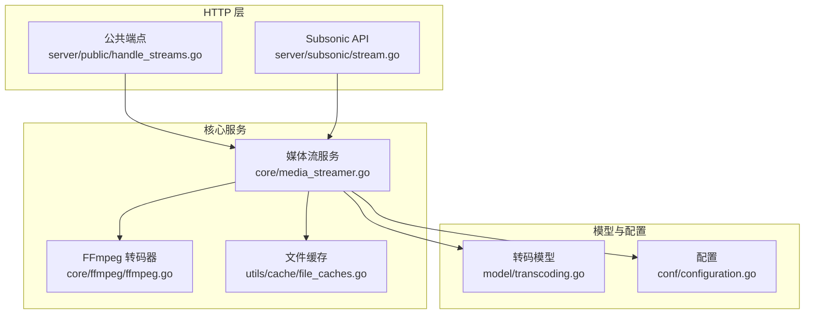
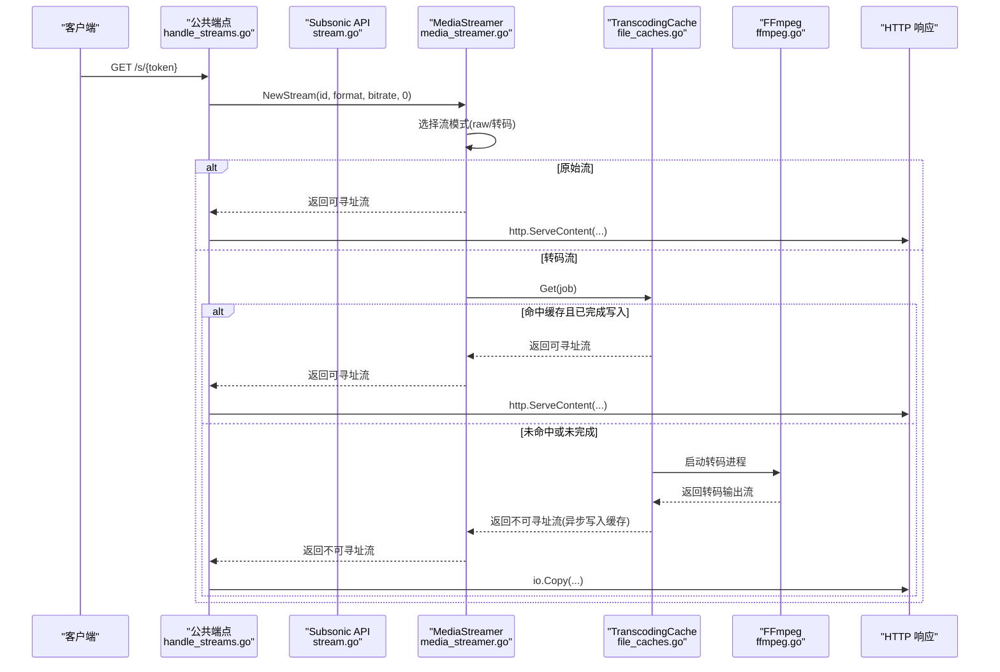
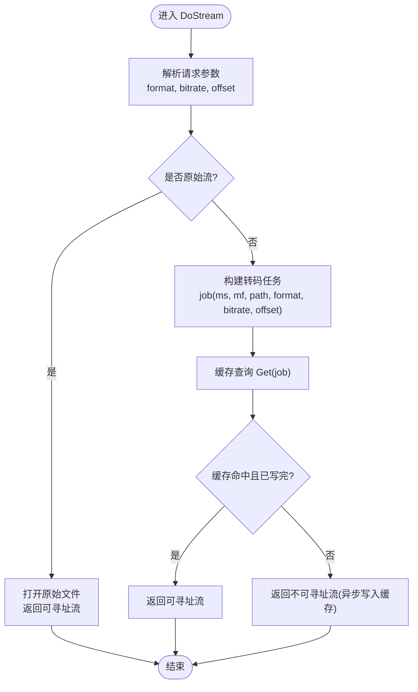
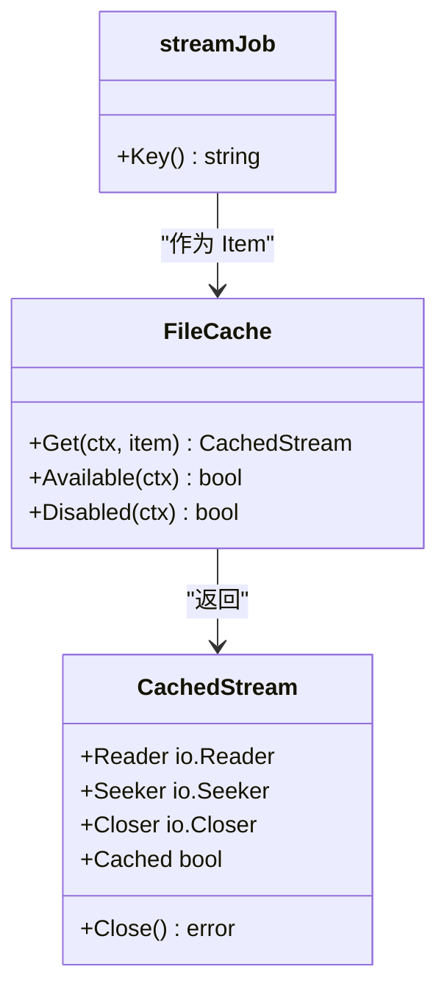
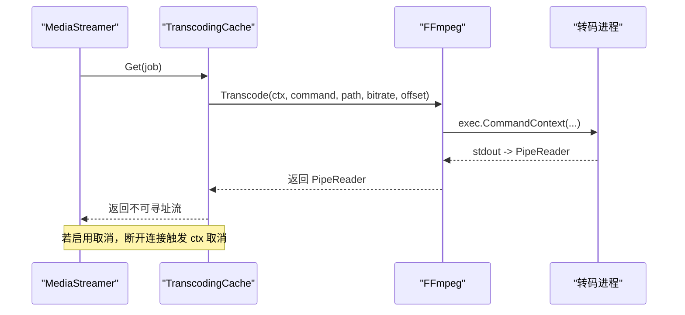
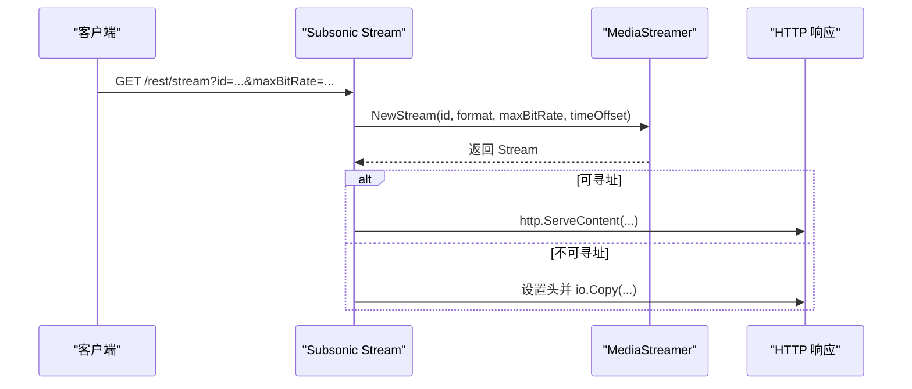
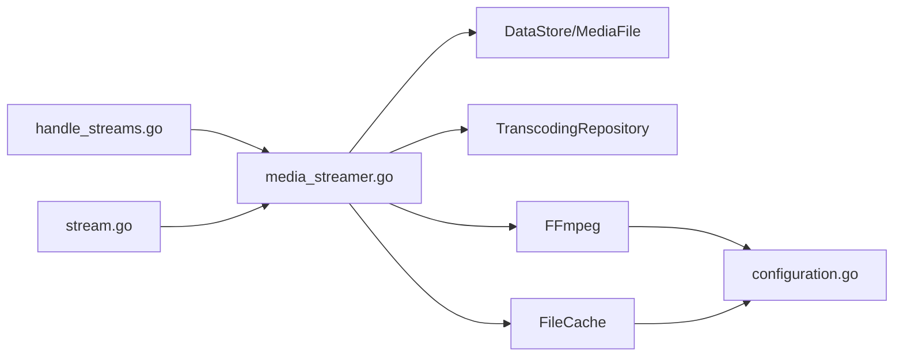

# 流媒体传输管道

<cite>
**本文引用的文件**
- [core/media_streamer.go](file://core/media_streamer.go)
- [server/public/handle_streams.go](file://server/public/handle_streams.go)
- [server/subsonic/stream.go](file://server/subsonic/stream.go)
- [core/ffmpeg/ffmpeg.go](file://core/ffmpeg/ffmpeg.go)
- [utils/cache/file_caches.go](file://utils/cache/file_caches.go)
- [model/transcoding.go](file://model/transcoding.go)
- [conf/configuration.go](file://conf/configuration.go)
- [core/media_streamer_test.go](file://core/media_streamer_test.go)
</cite>

## 目录
1. [简介](#简介)
2. [项目结构](#项目结构)
3. [核心组件](#核心组件)
4. [架构总览](#架构总览)
5. [详细组件分析](#详细组件分析)
6. [依赖关系分析](#依赖关系分析)
7. [性能考量](#性能考量)
8. [故障排查指南](#故障排查指南)
9. [结论](#结论)
10. [附录](#附录)

## 简介
本文件系统性梳理 Navidrome 的流媒体传输管道，重点覆盖以下方面：
- 请求处理流程：从 HTTP 入口到媒体流服务的完整链路
- 数据流控制与分块传输：原始流、转码流、缓存命中/未命中的路径
- 错误处理机制：跨层日志记录、优雅降级与关闭资源
- Subsonic API 兼容的流式传输逻辑
- 不同流媒体模式（直接流、转码流）的决策与实现
- 缓冲策略、断点续传支持与性能优化技术

## 项目结构
围绕流媒体传输的关键模块分布如下：
- 核心流媒体服务：core/media_streamer.go 定义 MediaStreamer 接口与具体实现，负责选择流模式、调用转码器与缓存
- HTTP 公共端点：server/public/handle_streams.go 提供共享链接的流式访问
- Subsonic API：server/subsonic/stream.go 实现标准流式接口与下载接口
- 转码器：core/ffmpeg/ffmpeg.go 封装 FFmpeg 进程，提供转码输出流
- 文件缓存：utils/cache/file_caches.go 提供基于文件系统的缓存，支持命中/未命中与可寻址读取
- 配置：conf/configuration.go 暴露转码相关开关与参数
- 模型：model/transcoding.go 描述转码规则与命令模板

图表来源
- [core/media_streamer.go](file://core/media_streamer.go#L1-L120)
- [server/public/handle_streams.go](file://server/public/handle_streams.go#L1-L72)
- [server/subsonic/stream.go](file://server/subsonic/stream.go#L1-L81)
- [core/ffmpeg/ffmpeg.go](file://core/ffmpeg/ffmpeg.go#L1-L120)
- [utils/cache/file_caches.go](file://utils/cache/file_caches.go#L1-L120)
- [model/transcoding.go](file://model/transcoding.go#L1-L19)
- [conf/configuration.go](file://conf/configuration.go#L1-L120)

章节来源
- [core/media_streamer.go](file://core/media_streamer.go#L1-L120)
- [server/public/handle_streams.go](file://server/public/handle_streams.go#L1-L72)
- [server/subsonic/stream.go](file://server/subsonic/stream.go#L1-L81)
- [core/ffmpeg/ffmpeg.go](file://core/ffmpeg/ffmpeg.go#L1-L120)
- [utils/cache/file_caches.go](file://utils/cache/file_caches.go#L1-L120)
- [model/transcoding.go](file://model/transcoding.go#L1-L19)
- [conf/configuration.go](file://conf/configuration.go#L1-L120)

## 核心组件
- MediaStreamer 接口与实现：负责根据请求参数与媒体文件属性选择“原始流”或“转码流”，并返回可读/可寻址的流对象
- Stream 结构：封装媒体元信息、内容类型、长度估算、是否可寻址等
- TranscodingCache：基于文件系统的缓存，支持命中后返回可寻址流，未命中时异步写入缓存
- FFmpeg：封装转码进程启动、管道读取与上下文取消
- Subsonic/公共端点：统一通过 MediaStreamer 获取 Stream，再以 http.ServeContent 或 io.Copy 输出

章节来源
- [core/media_streamer.go](file://core/media_streamer.go#L21-L131)
- [utils/cache/file_caches.go](file://utils/cache/file_caches.go#L1-L120)
- [core/ffmpeg/ffmpeg.go](file://core/ffmpeg/ffmpeg.go#L1-L120)
- [server/subsonic/stream.go](file://server/subsonic/stream.go#L1-L81)
- [server/public/handle_streams.go](file://server/public/handle_streams.go#L1-L72)

## 架构总览
下面的序列图展示了典型请求从 HTTP 到媒体流服务再到输出的完整流程，分别对应 Subsonic 与公共端点两种入口。

图表来源
- [server/public/handle_streams.go](file://server/public/handle_streams.go#L16-L71)
- [server/subsonic/stream.go](file://server/subsonic/stream.go#L20-L81)
- [core/media_streamer.go](file://core/media_streamer.go#L51-L113)
- [utils/cache/file_caches.go](file://utils/cache/file_caches.go#L147-L203)
- [core/ffmpeg/ffmpeg.go](file://core/ffmpeg/ffmpeg.go#L38-L121)

## 详细组件分析

### 组件A：MediaStreamer 与流模式选择
- 关键职责
  - 解析请求参数（格式、码率、偏移）
  - 依据媒体文件属性与配置决定是否需要转码
  - 返回可寻址或不可寻址的流对象
- 流模式决策逻辑
  - 若请求格式为 raw 或媒体文件后缀与请求一致且未指定码率，则走原始流
  - 若存在针对客户端的默认转码配置，优先使用该配置；否则根据请求码率与默认降采样格式进行判断
  - 若目标格式与原格式相同且目标码率不小于原码率，则回退为原始流
- 可寻址性
  - 原始流：os.File 实现 io.ReadCloser/io.Seeker，可寻址
  - 转码流：缓存命中且已完成写入时返回可寻址；否则仅可读不可寻址

图表来源
- [core/media_streamer.go](file://core/media_streamer.go#L60-L113)
- [utils/cache/file_caches.go](file://utils/cache/file_caches.go#L147-L203)

章节来源
- [core/media_streamer.go](file://core/media_streamer.go#L60-L183)
- [core/media_streamer_test.go](file://core/media_streamer_test.go#L40-L74)

### 组件B：TranscodingCache 与缓存策略
- 缓存初始化
  - 异步初始化，支持大小限制与条目上限
  - 初始化失败会禁用缓存，后续直接透传读取
- 命中/未命中行为
  - 命中且已完成写入：返回可寻址流（SectionReader），支持范围请求
  - 命中但未完成：返回只读流，不支持寻址
  - 未命中：异步启动读取器并将数据复制到缓存文件
- 失效与清理
  - 写入失败或异常会尝试移除键，避免脏数据
  - LRU 清理策略按大小与条目数控制

图表来源
- [utils/cache/file_caches.go](file://utils/cache/file_caches.go#L1-L203)
- [core/media_streamer.go](file://core/media_streamer.go#L38-L49)

章节来源
- [utils/cache/file_caches.go](file://utils/cache/file_caches.go#L1-L203)
- [core/media_streamer.go](file://core/media_streamer.go#L38-L49)

### 组件C：FFmpeg 转码器与取消策略
- 进程启动
  - 使用 exec.CommandContext 支持取消
  - 通过 io.Pipe 将转码器输出作为流返回
- 取消策略
  - 可配置是否允许转码取消：开启时使用请求上下文，断开即取消；关闭时保留请求值但不取消
- 错误传播
  - 子进程非零退出会通过 CloseWithError 传播错误，读取侧感知

图表来源
- [core/media_streamer.go](file://core/media_streamer.go#L197-L227)
- [core/ffmpeg/ffmpeg.go](file://core/ffmpeg/ffmpeg.go#L38-L121)
- [conf/configuration.go](file://conf/configuration.go#L22-L66)

章节来源
- [core/ffmpeg/ffmpeg.go](file://core/ffmpeg/ffmpeg.go#L38-L121)
- [core/media_streamer.go](file://core/media_streamer.go#L197-L227)
- [conf/configuration.go](file://conf/configuration.go#L22-L66)

### 组件D：Subsonic API 与公共端点的流式传输
- Subsonic
  - Stream：解析 id、maxBitRate、timeOffset，调用 MediaStreamer.NewStream，随后根据是否可寻址选择 http.ServeContent 或 io.Copy
  - Download：支持按实体类型打包下载，内部同样通过 MediaStreamer 获取流
- 公共端点
  - handleStream：解码共享令牌，调用 MediaStreamer.NewStream，处理 HEAD/GET，必要时估算 Content-Length

图表来源
- [server/subsonic/stream.go](file://server/subsonic/stream.go#L20-L81)
- [server/public/handle_streams.go](file://server/public/handle_streams.go#L16-L71)

章节来源
- [server/subsonic/stream.go](file://server/subsonic/stream.go#L20-L81)
- [server/public/handle_streams.go](file://server/public/handle_streams.go#L16-L71)

## 依赖关系分析
- 组件耦合
  - MediaStreamer 依赖 DataStore（获取媒体元信息）、TranscodingRepository（查找转码规则）、FFmpeg（执行转码）、FileCache（缓存）
  - HTTP 层仅依赖 MediaStreamer，保持清晰的职责分离
- 外部依赖
  - FFmpeg 可执行文件路径与可用性由配置控制
  - 缓存目录与大小由配置控制

图表来源
- [server/public/handle_streams.go](file://server/public/handle_streams.go#L16-L71)
- [server/subsonic/stream.go](file://server/subsonic/stream.go#L20-L81)
- [core/media_streamer.go](file://core/media_streamer.go#L1-L120)
- [core/ffmpeg/ffmpeg.go](file://core/ffmpeg/ffmpeg.go#L1-L120)
- [utils/cache/file_caches.go](file://utils/cache/file_caches.go#L1-L120)
- [conf/configuration.go](file://conf/configuration.go#L1-L120)

章节来源
- [core/media_streamer.go](file://core/media_streamer.go#L1-L120)
- [model/transcoding.go](file://model/transcoding.go#L1-L19)
- [conf/configuration.go](file://conf/configuration.go#L1-L120)

## 性能考量
- 缓存命中与可寻址性
  - 命中且已完成写入时返回可寻址流，支持 Range/Content-Length，有利于断点续传与播放器预加载
  - 未命中时返回不可寻址流，采用 io.Copy 顺序传输，避免阻塞
- 取消策略
  - 可配置转码取消：在高并发场景下，断开连接可立即终止转码进程，节省资源
- 码率与格式选择
  - 当目标码率不高于源码率时回退为原始流，减少 CPU 占用
  - 默认降采样格式用于在未指定转码规则时降低带宽占用
- 缓存大小与清理
  - 通过配置控制缓存大小与条目上限，结合 LRU 清理策略平衡内存与命中率

章节来源
- [utils/cache/file_caches.go](file://utils/cache/file_caches.go#L147-L203)
- [core/media_streamer.go](file://core/media_streamer.go#L133-L183)
- [core/media_streamer.go](file://core/media_streamer.go#L197-L227)
- [conf/configuration.go](file://conf/configuration.go#L22-L66)

## 故障排查指南
- 常见问题定位
  - 转码失败：检查 FFmpeg 可用性与命令模板；确认缓存初始化状态
  - 缓存不可用：查看缓存初始化日志与禁用原因
  - 断点续传无效：确认返回的是可寻址流（缓存命中且已完成写入）
- 日志与告警
  - 关键路径均包含 Info/Debug/Error 记录，便于追踪请求生命周期
  - 下载/流式传输结束后会尝试关闭流，避免资源泄漏
- 单元测试参考
  - 测试覆盖了原始流可寻址、转码流不可寻址、缓存完成后再次请求变为可寻址等场景

章节来源
- [core/media_streamer.go](file://core/media_streamer.go#L60-L113)
- [server/subsonic/stream.go](file://server/subsonic/stream.go#L20-L81)
- [server/public/handle_streams.go](file://server/public/handle_streams.go#L16-L71)
- [core/media_streamer_test.go](file://core/media_streamer_test.go#L40-L74)

## 结论
Navidrome 的流媒体传输管道通过清晰的分层设计实现了高性能与高可靠性的音频流服务：
- 请求自上而下经过 HTTP 层、MediaStreamer、缓存与转码器，最终以可寻址或不可寻址的方式输出
- 通过可配置的取消策略、缓存命中与 LRU 清理，兼顾低延迟与高并发
- Subsonic API 与公共端点共享同一套流式传输逻辑，保证一致性与易维护性

## 附录
- 断点续传支持
  - 当返回可寻址流时，客户端可通过 Range 请求实现断点续传
  - 当返回不可寻址流时，Range 不可用，需依赖客户端重试策略
- 实际代码示例路径
  - Subsonic 流式传输：[server/subsonic/stream.go](file://server/subsonic/stream.go#L20-L81)
  - 公共端点流式传输：[server/public/handle_streams.go](file://server/public/handle_streams.go#L16-L71)
  - MediaStreamer 流模式选择与返回：[core/media_streamer.go](file://core/media_streamer.go#L60-L113)
  - 转码器启动与取消：[core/ffmpeg/ffmpeg.go](file://core/ffmpeg/ffmpeg.go#L38-L121)
  - 缓存命中/未命中与可寻址性：[utils/cache/file_caches.go](file://utils/cache/file_caches.go#L147-L203)