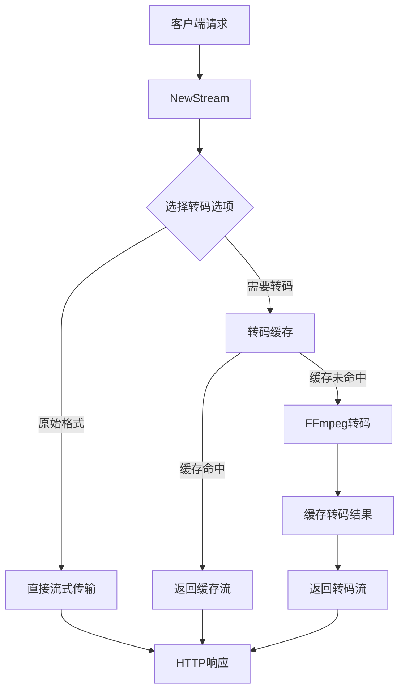
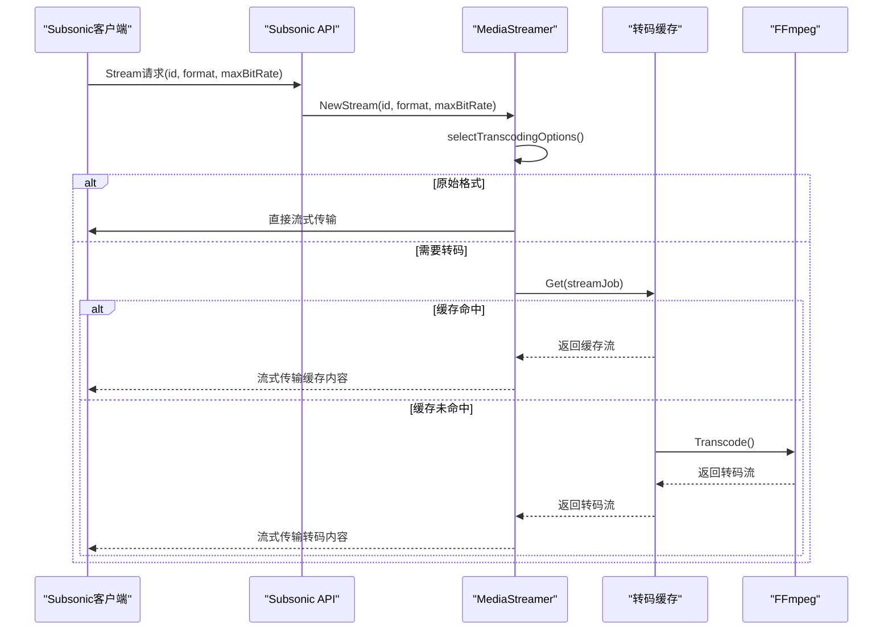
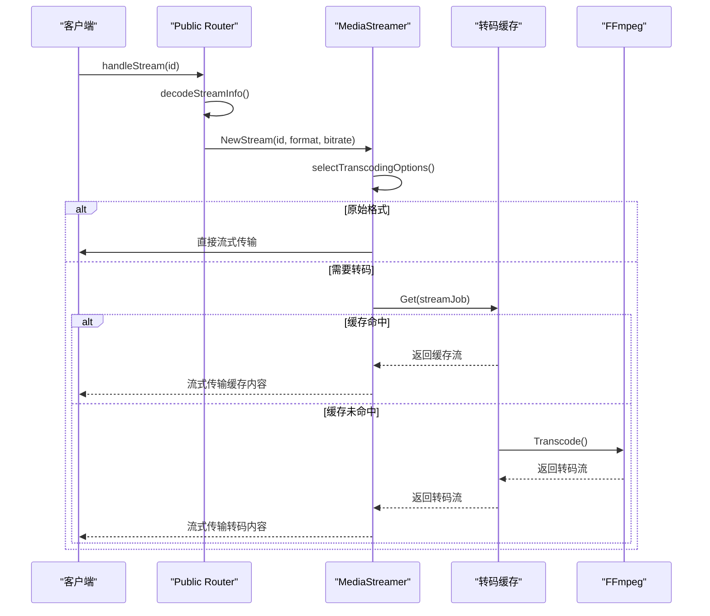
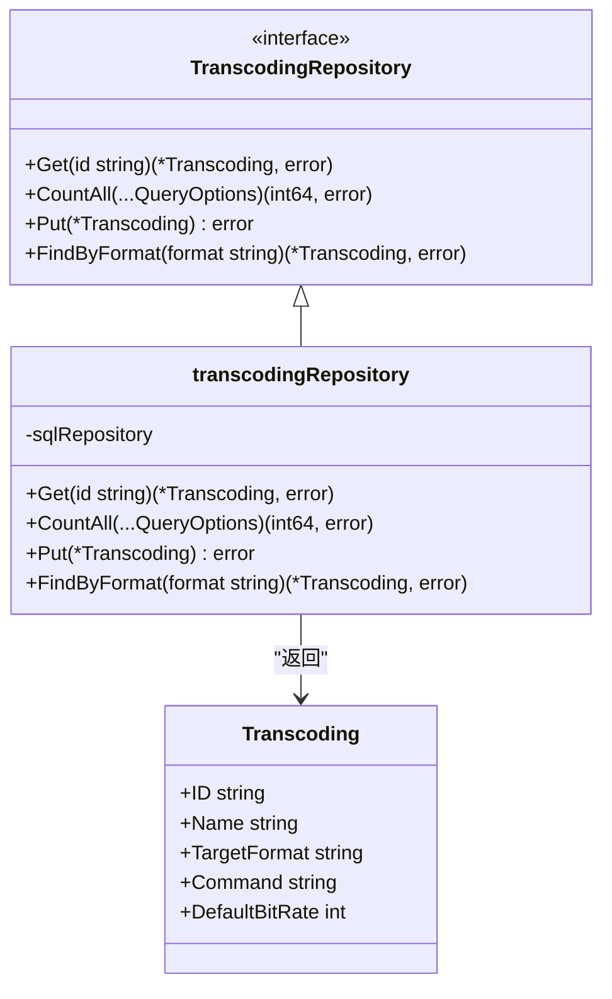
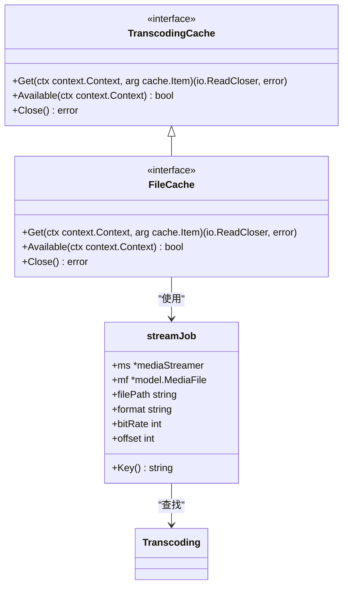
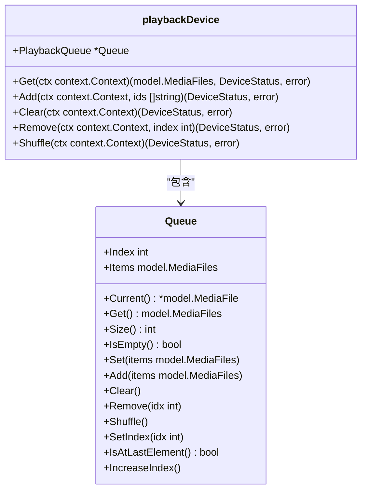
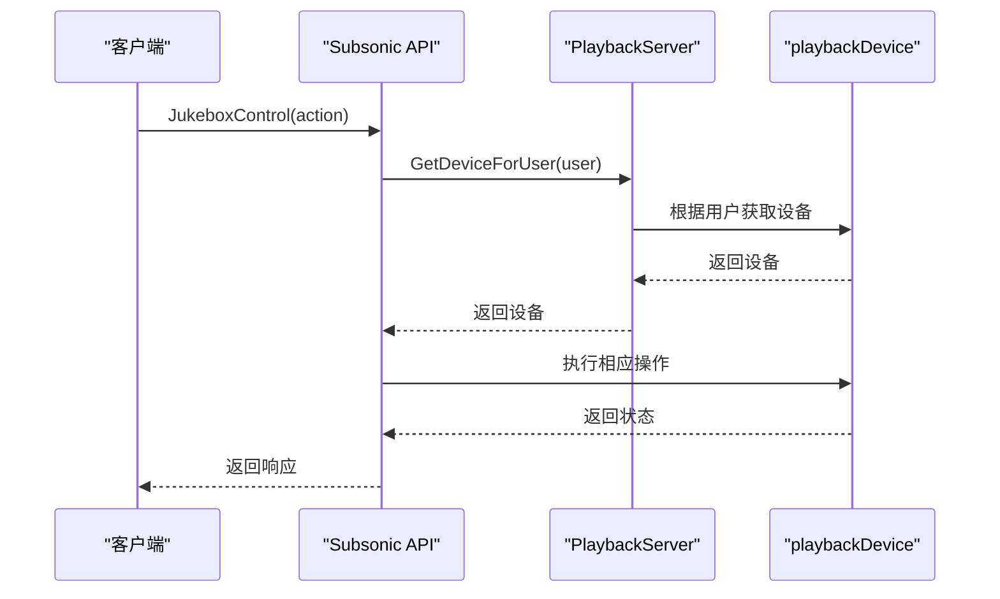

# 流媒体服务

<cite>
**本文档引用的文件**   
- [media_streamer.go](file://core/media_streamer.go)
- [ffmpeg.go](file://core/ffmpeg/ffmpeg.go)
- [handle_streams.go](file://server/public/handle_streams.go)
- [stream.go](file://server/subsonic/stream.go)
- [transcoding.go](file://model/transcoding.go)
- [public.go](file://server/public/public.go)
- [api.go](file://server/subsonic/api.go)
- [queue.go](file://core/playback/queue.go)
- [playbackserver.go](file://core/playback/playbackserver.go)
- [players.go](file://core/players.go)
- [jukebox.go](file://server/subsonic/jukebox.go)
- [configuration.go](file://conf/configuration.go)
- [transcoding_repository.go](file://persistence/transcoding_repository.go)
</cite>

## 目录
1. [引言](#引言)
2. [流媒体管道架构](#流媒体管道架构)
3. [FFmpeg集成与转码配置](#ffmpeg集成与转码配置)
4. [客户端请求处理流程](#客户端请求处理流程)
5. [转码预设管理](#转码预设管理)
6. [性能相关配置](#性能相关配置)
7. [播放队列与播放器状态集成](#播放队列与播放器状态集成)
8. [流媒体基础概念](#流媒体基础概念)
9. [高级主题](#高级主题)

## 引言

流媒体服务是Navidrome音乐服务器的核心功能，负责处理音频文件的流式传输、格式转码和播放控制。该服务支持多种客户端请求，包括原生流、Subsonic API流和公共分享流，通过FFmpeg实现高效的音频转码，并提供灵活的转码预设管理机制。本文档将全面解释流媒体服务的实现细节，为初学者提供基础概念的解释，同时为高级开发者提供低延迟流、自适应比特率等高级主题的技术细节。

## 流媒体管道架构

流媒体管道是Navidrome处理音频流的核心组件，负责从媒体文件到客户端的整个流式传输过程。管道的主要组件包括媒体流创建器、转码缓存和FFmpeg转码器。



**图表来源**
- [media_streamer.go](file://core/media_streamer.go#L21-L113)
- [handle_streams.go](file://server/public/handle_streams.go#L16-L71)
- [stream.go](file://server/subsonic/stream.go#L20-L49)

**本节来源**
- [media_streamer.go](file://core/media_streamer.go#L21-L113)
- [handle_streams.go](file://server/public/handle_streams.go#L16-L71)
- [stream.go](file://server/subsonic/stream.go#L20-L49)

## FFmpeg集成与转码配置

FFmpeg是Navidrome流媒体服务的核心转码引擎，负责将各种音频格式转换为客户端支持的格式。FFmpeg集成通过`FFmpeg`接口实现，提供了转码、提取图像和探测文件信息的功能。

```mermaid
classDiagram
class FFmpeg {
<<interface>>
+Transcode(ctx context.Context, command, path string, maxBitRate, offset int) (io.ReadCloser, error)
+ExtractImage(ctx context.Context, path string) (io.ReadCloser, error)
+Probe(ctx context.Context, files []string) (string, error)
+CmdPath() (string, error)
+IsAvailable() bool
+Version() string
}
class ffmpeg {
-ffmpeg{}
+Transcode(ctx context.Context, command, path string, maxBitRate, offset int) (io.ReadCloser, error)
+ExtractImage(ctx context.Context, path string) (io.ReadCloser, error)
+Probe(ctx context.Context, files []string) (string, error)
+CmdPath() (string, error)
+IsAvailable() bool
+Version() string
}
FFmpeg <|-- ffmpeg
class ffCmd {
-*io.PipeReader
-out *io.PipeWriter
-args []string
-cmd *exec.Cmd
+start(ctx context.Context) error
+wait()
}
ffmpeg --> ffCmd : "创建"
```

**图表来源**
- [ffmpeg.go](file://core/ffmpeg/ffmpeg.go#L18-L25)
- [ffmpeg.go](file://core/ffmpeg/ffmpeg.go#L36-L157)

**本节来源**
- [ffmpeg.go](file://core/ffmpeg/ffmpeg.go#L18-L229)

## 客户端请求处理流程

流媒体服务支持多种客户端请求，包括原生流、Subsonic API流和公共分享流。每种请求类型都有特定的处理流程，但都遵循相似的处理模式。

### Subsonic流处理

Subsonic API流处理是通过`Router.Stream`方法实现的，该方法处理来自Subsonic客户端的流式请求。



**图表来源**
- [stream.go](file://server/subsonic/stream.go#L52-L81)
- [media_streamer.go](file://core/media_streamer.go#L51-L113)

### 公共流服务

公共流服务是通过`Router.handleStream`方法实现的，该方法处理来自公共分享链接的流式请求。



**图表来源**
- [handle_streams.go](file://server/public/handle_streams.go#L16-L71)
- [media_streamer.go](file://core/media_streamer.go#L51-L113)

**本节来源**
- [stream.go](file://server/subsonic/stream.go#L52-L81)
- [handle_streams.go](file://server/public/handle_streams.go#L16-L71)
- [media_streamer.go](file://core/media_streamer.go#L51-L113)

## 转码预设管理

转码预设是Navidrome流媒体服务的重要配置，允许用户定义不同的转码格式和参数。转码预设通过`Transcoding`模型和`TranscodingRepository`进行管理。



**图表来源**
- [transcoding.go](file://model/transcoding.go#L3-L18)
- [transcoding_repository.go](file://persistence/transcoding_repository.go#L13-L112)

**本节来源**
- [transcoding.go](file://model/transcoding.go#L3-L18)
- [transcoding_repository.go](file://persistence/transcoding_repository.go#L13-L112)

## 性能相关配置

流媒体服务提供了多种性能相关配置，包括比特率限制、缓冲策略和转码缓存管理，以优化流式传输的性能和用户体验。

### 比特率限制

比特率限制是通过`selectTranscodingOptions`函数实现的，该函数根据客户端请求和配置选择合适的转码选项。

```mermaid
flowchart TD
A[开始] --> B{请求格式为"raw"?}
B --> |是| C[返回原始格式]
B --> |否| D{请求格式与原始格式相同且比特率为0?}
D --> |是| E[返回原始格式]
D --> |否| F{请求比特率>0且<原始比特率?}
F --> |是| G[使用默认降采样格式]
F --> |否| H{播放器有转码配置?}
H --> |是| I[使用播放器配置]
H --> |否| J{请求比特率>0?}
J --> |是| K[使用请求比特率]
J --> |否| L[使用转码预设默认比特率]
K --> M[选择转码格式]
L --> M
M --> N{转码格式与原始格式相同且比特率>=原始比特率?}
N --> |是| O[返回原始格式]
N --> |否| P[返回转码格式和比特率]
```

**图表来源**
- [media_streamer.go](file://core/media_streamer.go#L134-L182)

### 缓冲策略

缓冲策略是通过转码缓存实现的，使用`TranscodingCache`来缓存转码结果，避免重复转码。



**图表来源**
- [media_streamer.go](file://core/media_streamer.go#L26-L28)
- [media_streamer.go](file://core/media_streamer.go#L197-L227)

**本节来源**
- [media_streamer.go](file://core/media_streamer.go#L134-L227)

## 播放队列与播放器状态集成

流媒体服务与播放队列和播放器状态紧密集成，支持Jukebox模式和播放控制功能。

### 播放队列管理

播放队列是通过`Queue`结构体实现的，提供了添加、删除、清空和获取队列内容的功能。



**图表来源**
- [queue.go](file://core/playback/queue.go#L11-L14)
- [device.go](file://core/playback/device.go#L32-L36)

### 播放器状态管理

播放器状态是通过`playbackDevice`和`PlaybackServer`实现的，支持播放、暂停、跳过和音量控制等功能。



**图表来源**
- [playbackserver.go](file://core/playback/playbackserver.go#L18-L22)
- [device.go](file://core/playback/device.go#L25-L37)
- [jukebox.go](file://server/subsonic/jukebox.go#L29-L137)

**本节来源**
- [queue.go](file://core/playback/queue.go#L11-L137)
- [playbackserver.go](file://core/playback/playbackserver.go#L18-L128)
- [device.go](file://core/playback/device.go#L25-L269)
- [jukebox.go](file://server/subsonic/jukebox.go#L29-L137)

## 流媒体基础概念

### 流式传输

流式传输是一种将音频或视频数据分块传输的技术，允许客户端在下载完整文件之前开始播放。Navidrome的流媒体服务支持两种流式传输模式：原始流和转码流。

- **原始流**：直接传输原始音频文件，不进行任何转码。
- **转码流**：将原始音频文件转换为客户端支持的格式后再传输。

### 转码

转码是将音频文件从一种格式转换为另一种格式的过程。Navidrome使用FFmpeg作为转码引擎，支持多种音频格式的转换。转码过程包括：

1. 读取原始音频文件
2. 解码原始音频数据
3. 重新编码为目标格式
4. 输出转码后的音频流

### 缓存

缓存是提高流媒体服务性能的关键技术。Navidrome使用转码缓存来存储已转码的音频文件，避免重复转码。缓存的键由媒体文件ID、更新时间、比特率、格式和偏移量组成。

**本节来源**
- [media_streamer.go](file://core/media_streamer.go#L47-L49)
- [ffmpeg.go](file://core/ffmpeg/ffmpeg.go#L38-L48)

## 高级主题

### 低延迟流

低延迟流是通过优化转码和传输过程实现的。Navidrome通过以下方式降低延迟：

1. 使用高效的转码预设
2. 优化FFmpeg命令参数
3. 使用流式转码而不是文件转码
4. 启用转码缓存

### 自适应比特率

自适应比特率是根据网络条件和客户端能力动态调整音频比特率的技术。Navidrome通过以下方式实现自适应比特率：

1. 检测客户端请求的比特率
2. 根据网络带宽选择合适的转码预设
3. 动态调整转码参数

### 转码取消

转码取消是通过上下文取消实现的。当客户端断开连接时，转码过程会自动取消，避免资源浪费。

```go
// Choose the appropriate context based on EnableTranscodingCancellation configuration.
// This is where we decide whether transcoding processes should be cancellable or not.
var transcodingCtx context.Context
if conf.Server.EnableTranscodingCancellation {
    // Use the request context directly, allowing cancellation when client disconnects
    transcodingCtx = ctx
} else {
    // Use background context with request values preserved.
    // This prevents cancellation but maintains request metadata (user, client, etc.)
    transcodingCtx = request.AddValues(context.Background(), ctx)
}
```

**本节来源**
- [media_streamer.go](file://core/media_streamer.go#L208-L218)
- [configuration.go](file://conf/configuration.go#L44)