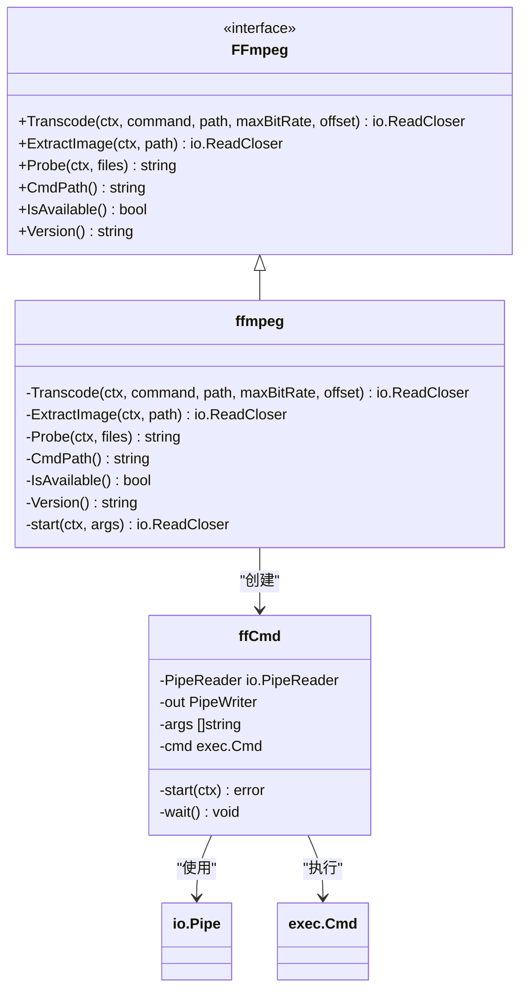
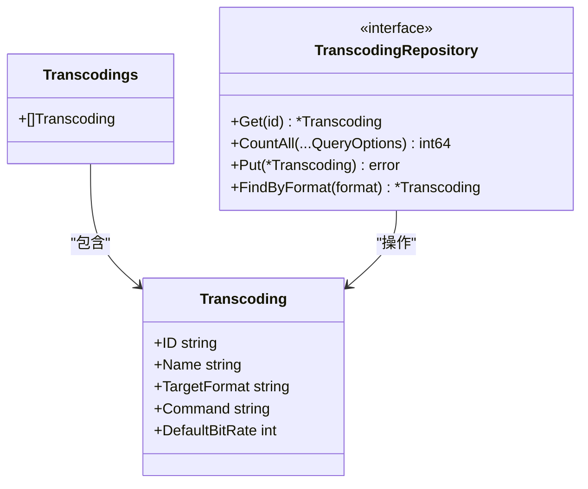
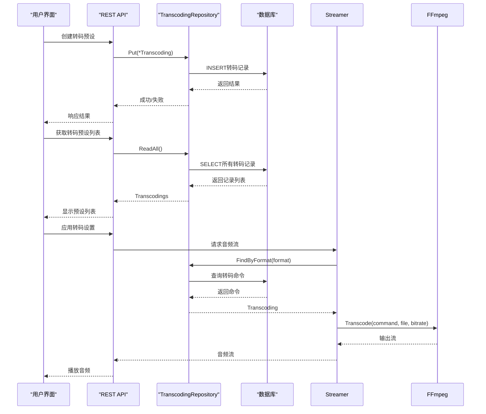
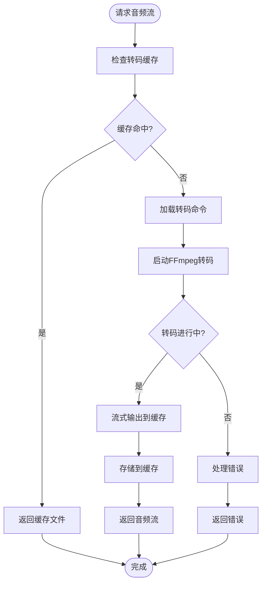

# 音频转码

<cite>
**本文档中引用的文件 **  
- [ffmpeg.go](file://core/ffmpeg/ffmpeg.go)
- [transcoding.go](file://model/transcoding.go)
- [transcoding_repository.go](file://persistence/transcoding_repository.go)
- [media_streamer.go](file://core/media_streamer.go)
- [configuration.go](file://conf/configuration.go)
- [consts.go](file://consts/consts.go)
</cite>

## 目录
1. [简介](#简介)
2. [FFmpeg集成实现](#ffmpeg集成实现)
3. [转码预设数据模型](#转码预设数据模型)
4. [转码持久化机制](#转码持久化机制)
5. [转码配置管理流程](#转码配置管理流程)
6. [转码队列与资源管理](#转码队列与资源管理)
7. [音频转码基础概念](#音频转码基础概念)
8. [性能优化与高级特性](#性能优化与高级特性)

## 简介
音频转码功能是Navidrome系统中的核心组件，负责将原始音频文件转换为不同格式和比特率以适应客户端设备的能力。该功能通过FFmpeg工具实现，支持动态转码配置、缓存管理和错误恢复。系统允许管理员创建和管理转码预设，根据客户端请求协商最佳转码设置，并通过高效的进程管理确保转码操作的稳定性和性能。

## FFmpeg集成实现

音频转码功能通过`core/ffmpeg`包与FFmpeg工具进行集成，实现了转码命令生成、进程管理和输出流处理。该模块提供了`FFmpeg`接口，定义了转码、提取图像、探测文件和检查可用性等核心功能。



**图源**
- [ffmpeg.go](file://core/ffmpeg/ffmpeg.go#L18-L25)

**章节源**
- [ffmpeg.go](file://core/ffmpeg/ffmpeg.go#L1-L229)

### 转码命令生成
转码命令的生成通过`createFFmpegCommand`函数实现，该函数接收转码模板命令、文件路径、最大比特率和偏移量作为参数。它使用`%s`、`%b`和`%t`作为占位符，分别替换为文件路径、比特率和时间偏移。函数还处理命令中的额外空格，并确保FFmpeg可执行文件的路径正确。

### 进程管理
转码进程的管理通过`ffCmd`结构体实现，该结构体封装了`exec.Cmd`和管道操作。`start`方法启动FFmpeg进程并将输出重定向到管道，`wait`方法监控进程状态并在进程异常退出时关闭输出管道。这种设计确保了转码过程的稳定性和错误处理能力。

### 输出流处理
输出流处理通过`io.Pipe`实现，允许将FFmpeg的输出直接作为流返回给客户端。`Transcode`方法返回一个`io.ReadCloser`，客户端可以按需读取转码后的音频数据。这种流式处理方式减少了内存占用，并支持大文件的高效传输。

## 转码预设数据模型

转码预设的数据模型在`model/transcoding.go`中定义，包含转码配置的核心属性。该模型通过`Transcoding`结构体表示，支持JSON序列化和数据库持久化。



**图源**
- [transcoding.go](file://model/transcoding.go#L3-L18)

**章节源**
- [transcoding.go](file://model/transcoding.go#L1-L19)

### 数据模型属性
`Transcoding`结构体包含以下关键属性：
- **ID**: 转码预设的唯一标识符
- **Name**: 预设的名称，用于用户界面显示
- **TargetFormat**: 目标音频格式（如mp3、opus）
- **Command**: FFmpeg转码命令模板
- **DefaultBitRate**: 默认比特率（kbps）

这些属性共同定义了一个完整的转码配置，允许系统根据客户端需求选择合适的转码预设。

## 转码持久化机制

转码配置的持久化通过`persistence/transcoding_repository.go`中的`transcodingRepository`实现。该仓库实现了`TranscodingRepository`接口，提供对转码预设的CRUD操作。

```mermaid
classDiagram
class transcodingRepository {
-sqlRepository
+Get(id) *Transcoding
+CountAll(...QueryOptions) int64
+Put(*Transcoding) error
+FindByFormat(format) *Transcoding
+Read(id) interface{}
+ReadAll(...rest.QueryOptions) interface{}
+EntityName() string
+NewInstance() interface{}
+Save(entity) string
+Update(id, entity, cols) error
+Delete(id) error
}
class sqlRepository {
-ctx context.Context
-db dbx.Builder
-registerModel(model, mapper)
-newSelect() squirrel.SelectBuilder
-queryOne(sel, dest) error
-queryAll(sel, dest) error
-count(sel, qo) int64
-put(id, entity) (string, error)
-delete(clause) error
}
transcodingRepository --> sqlRepository : "继承"
transcodingRepository --> model.Transcoding : "操作"
```

**图源**
- [transcoding_repository.go](file://persistence/transcoding_repository.go#L13-L23)

**章节源**
- [transcoding_repository.go](file://persistence/transcoding_repository.go#L1-L113)

### 权限控制
转码仓库实现了严格的权限控制，只有管理员用户才能执行写操作。`Put`、`Update`和`Delete`方法都检查当前用户的管理员权限，如果非管理员用户尝试修改转码配置，则返回`rest.ErrPermissionDenied`错误。

### 数据库操作
仓库使用`github.com/Masterminds/squirrel`库构建SQL查询，确保查询的安全性和可维护性。`Get`方法通过ID查询单个转码预设，`FindByFormat`方法通过目标格式查询预设，`CountAll`方法统计预设总数。这些操作支持分页和排序，适用于大规模转码配置管理。

## 转码配置管理流程

转码配置的创建、管理和应用流程涉及多个组件的协同工作。系统通过REST API暴露转码配置管理接口，允许管理员在用户界面中创建、编辑和删除转码预设。



**图源**
- [transcoding_repository.go](file://persistence/transcoding_repository.go#L59-L63)
- [media_streamer.go](file://core/media_streamer.go#L220-L225)

**章节源**
- [transcoding_repository.go](file://persistence/transcoding_repository.go#L50-L112)
- [media_streamer.go](file://core/media_streamer.go#L197-L227)

### 配置创建
管理员通过用户界面创建转码预设时，系统验证输入参数的合法性，然后调用`TranscodingRepository.Put`方法将预设保存到数据库。预设的ID由系统自动生成，确保唯一性。

### 配置应用
当客户端请求音频流时，系统根据客户端能力协商最佳转码设置。`selectTranscodingOptions`函数根据请求的格式和比特率，结合播放器配置和服务器默认设置，选择合适的转码预设。如果请求的格式与原始格式相同且不需要降采样，则直接返回原始文件。

## 转码队列管理

转码队列管理通过`core/media_streamer.go`中的`GetTranscodingCache`函数实现。该函数创建一个文件缓存，用于存储已转码的音频文件，避免重复转码。



**图源**
- [media_streamer.go](file://core/media_streamer.go#L197-L227)

**章节源**
- [media_streamer.go](file://core/media_streamer.go#L1-L228)

### 资源限制
系统通过配置项`Server.TranscodingCacheSize`限制转码缓存的大小，防止磁盘空间耗尽。缓存使用LRU（最近最少使用）策略管理文件，确保常用文件保留在缓存中。此外，`EnableTranscodingCancellation`配置项控制转码进程的取消行为，允许或禁止在客户端断开连接时终止转码进程。

### 错误恢复
转码过程中的错误通过`ffCmd.wait`方法处理。如果FFmpeg进程异常退出，系统会关闭输出管道并返回错误信息。对于临时性错误（如文件不存在），系统会重试转码操作；对于永久性错误（如无效的转码命令），系统会记录错误日志并返回客户端。

## 音频转码基础概念

音频转码是将音频文件从一种格式转换为另一种格式的过程，通常涉及采样率、比特率和编码方式的改变。Navidrome系统支持多种音频格式的转码，包括MP3、Opus和AAC。

### 输入/输出格式
系统支持的输入格式包括FLAC、WAV、ALAC等无损格式，以及MP3、AAC等有损格式。输出格式由转码预设的`TargetFormat`属性定义，常见的输出格式包括：
- **MP3**: 广泛兼容的有损音频格式
- **Opus**: 高效的开源音频格式，适合流媒体
- **AAC**: 高质量的有损音频格式，常用于移动设备

### 比特率和采样率
比特率（Bit Rate）表示每秒传输的音频数据量，单位为kbps。较高的比特率通常意味着更好的音质，但也会增加文件大小和带宽需求。采样率（Sample Rate）表示每秒采集的音频样本数，单位为Hz。常见的采样率包括44.1kHz（CD质量）和48kHz（DVD质量）。

## 性能优化与高级特性

Navidrome系统提供了多种性能优化和高级特性，以提升转码效率和用户体验。

### 硬件加速支持
系统通过FFmpeg的硬件加速功能支持GPU转码。管理员可以在转码命令中添加硬件加速参数（如`-hwaccel cuda`），利用GPU进行并行计算，显著提升转码速度。硬件加速特别适用于高分辨率音频文件的批量转码。

### 自定义转码配置
管理员可以创建自定义转码配置，满足特定需求。转码命令模板支持以下占位符：
- **%s**: 文件路径
- **%b**: 比特率（kbps）
- **%t**: 时间偏移（秒）

例如，一个自定义的Opus转码命令可以是：`ffmpeg -i %s -ss %t -map 0:a:0 -b:a %bk -v 0 -c:a libopus -f opus -`。这种灵活性允许管理员优化转码参数，平衡音质和性能。

### 性能监控
系统通过`core/metrics`模块收集转码性能数据，包括转码时间、CPU使用率和内存消耗。这些数据可用于分析系统瓶颈，优化转码配置。管理员可以通过Prometheus监控转码队列的长度和处理速度，及时发现和解决性能问题。