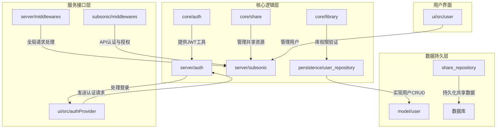
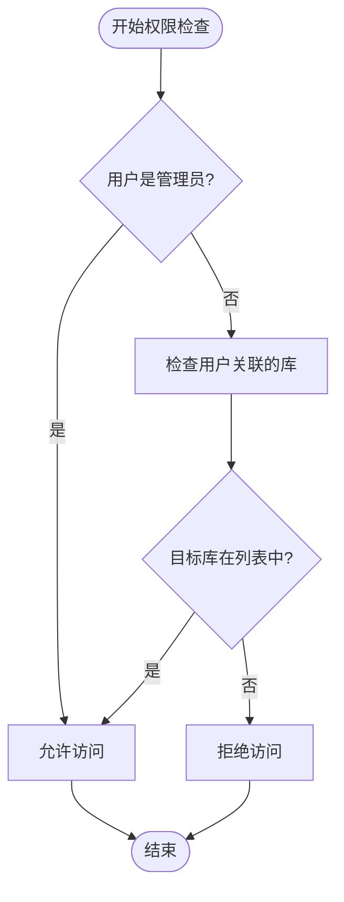
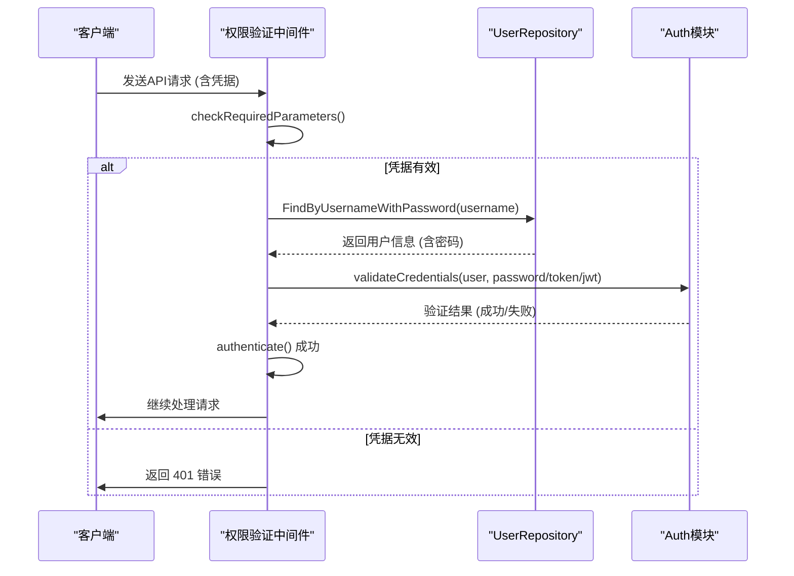
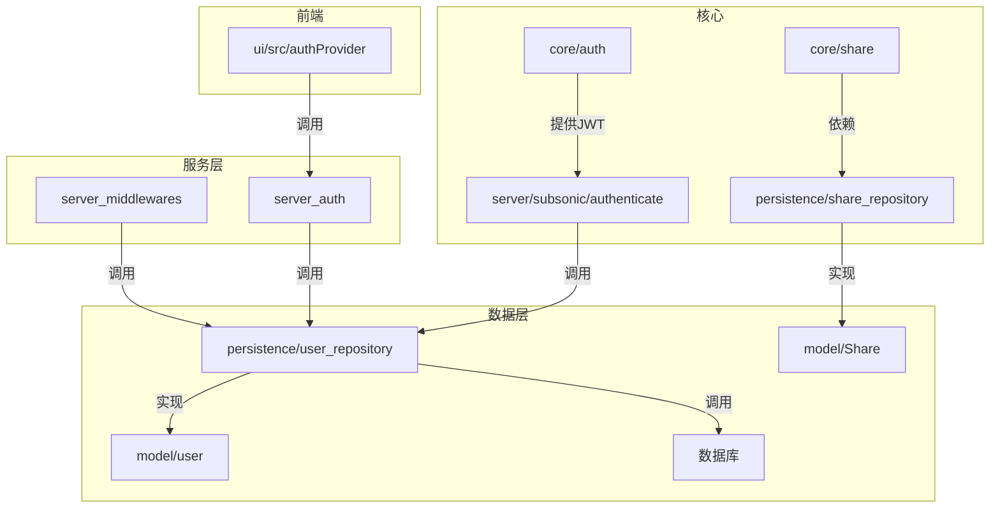

# 权限控制系统

<cite>
**本文档引用的文件**
- [auth.go](file://core/auth/auth.go)
- [user.go](file://model/user.go)
- [user_repository.go](file://persistence/user_repository.go)
- [share.go](file://core/share.go)
- [share_repository.go](file://persistence/share_repository.go)
- [middlewares.go](file://server/middlewares.go)
- [subsonic/middlewares.go](file://server/subsonic/middlewares.go)
- [auth.go](file://server/auth.go)
- [errors.go](file://model/errors.go)
- [sql_restful.go](file://persistence/sql_restful.go)
- [authProvider.js](file://ui/src/authProvider.js)
</cite>

## 目录
1. [简介](#简介)
2. [项目结构](#项目结构)
3. [核心组件](#核心组件)
4. [权限模型与角色](#权限模型与角色)
5. [权限验证中间件](#权限验证中间件)
6. [用户权限动态更新](#用户权限动态更新)
7. [细粒度权限控制扩展](#细粒度权限控制扩展)
8. [共享功能中的权限继承](#共享功能中的权限继承)
9. [自定义权限策略接口](#自定义权限策略接口)
10. [依赖分析](#依赖分析)
11. [故障排除指南](#故障排除指南)

## 简介
本文档深入解析 Navidrome 音乐服务器的权限控制系统。系统基于用户角色（管理员、普通用户、只读用户）实现细粒度的访问控制，确保数据安全与功能灵活性。核心机制包括基于 JWT 的身份认证、REST API 的权限拦截、用户库权限管理以及共享资源的权限继承。文档将详细阐述权限验证流程、性能优化策略、动态更新机制，并为开发者提供可扩展的权限控制方案。

## 项目结构
Navidrome 的权限控制系统贯穿于多个核心模块，其结构清晰地体现了分层设计原则。



**图源**
- [core/auth](file://core/auth)
- [persistence/user_repository.go](file://persistence/user_repository.go)
- [server/middlewares.go](file://server/middlewares.go)
- [server/subsonic/middlewares.go](file://server/subsonic/middlewares.go)
- [ui/src/authProvider.js](file://ui/src/authProvider.js)

**本节源码**
- [core](file://core)
- [persistence](file://persistence)
- [server](file://server)
- [ui](file://ui)

## 核心组件
权限控制系统由几个关键组件协同工作：`auth` 模块负责 JWT 的生成与验证；`user_repository` 实现了基于角色的访问控制（RBAC）逻辑；`share` 服务管理外部共享链接的权限；而 `middlewares` 则作为拦截器，在请求到达业务逻辑前执行权限检查。

**本节源码**
- [core/auth/auth.go](file://core/auth/auth.go)
- [persistence/user_repository.go](file://persistence/user_repository.go)
- [core/share.go](file://core/share.go)
- [server/middlewares.go](file://server/middlewares.go)

## 权限模型与角色
系统定义了清晰的用户角色权限边界，通过 `model.User` 结构体中的 `IsAdmin` 字段进行区分。

### 角色权限边界
- **管理员 (Admin)**: 拥有最高权限，可以访问所有音乐库、创建/修改/删除任何用户、管理所有系统设置。
- **普通用户 (User)**: 只能访问被明确分配的音乐库，可以修改自己的个人资料和密码，但不能管理其他用户。
- **只读用户**: 系统中没有显式的“只读”角色，但通过不分配任何音乐库权限，可以实现对特定用户的只读限制。

用户权限的核心逻辑在 `model.User` 结构体和 `persistence/user_repository.go` 中实现。

```go
// model/user.go
type User struct {
    ID           string `json:"id"`
    UserName     string `json:"userName"`
    Name         string `json:"name"`
    IsAdmin      bool   `json:"isAdmin"` // 标识是否为管理员
    // ... 其他字段
}

// 判断用户是否有权访问指定库
func (u User) HasLibraryAccess(libraryID int) bool {
    if u.IsAdmin {
        return true // 管理员拥有所有库的访问权
    }
    for _, lib := range u.Libraries {
        if lib.ID == libraryID {
            return true
        }
    }
    return false
}
```

**图源**
- [model/user.go](file://model/user.go#L7-L40)

#### 权限检查流程
当一个请求需要验证用户对特定资源的访问权限时，系统会调用 `HasLibraryAccess` 方法。该方法首先检查用户是否为管理员，如果是则直接放行；否则，遍历用户关联的库列表，检查目标库ID是否在列表中。



**图源**
- [model/user.go](file://model/user.go#L30-L39)

**本节源码**
- [model/user.go](file://model/user.go#L7-L40)
- [core/library.go](file://core/library.go#L105-L129)

## 权限验证中间件
权限验证主要通过 HTTP 中间件链实现，分为全局中间件和子系统专用中间件。

### 执行流程
1.  **全局中间件 (`server/middlewares.go`)**:
    *   `requestLogger`: 记录请求日志。
    *   `loggerInjector`: 为请求上下文注入日志ID。
    *   `realIPMiddleware`: 处理反向代理，获取真实客户端IP。
    *   `clientUniqueIDMiddleware`: 管理客户端唯一ID的Cookie。
    *   `UpdateLastAccessMiddleware`: **性能优化关键**。它使用一个 `utils.Limiter` 限流器，确保对 `UpdateLastAccessAt` 的数据库更新操作不会过于频繁，从而避免了每个请求都写数据库的性能瓶颈。

2.  **Subsonic API 专用中间件 (`server/subsonic/middlewares.go`)**:
    *   `checkRequiredParameters`: 验证API调用必需的参数。
    *   `authenticate`: **核心认证中间件**。它从请求中提取凭据（用户名/密码、Token、JWT），调用 `ds.User().FindByUsernameWithPassword()` 获取用户信息，并通过 `validateCredentials` 函数验证凭据的有效性。
    *   `getPlayer`: 为当前会话注册或获取播放器信息。

### 权限验证序列图


**图源**
- [server/subsonic/middlewares.go](file://server/subsonic/middlewares.go#L98-L154)
- [core/auth/auth.go](file://core/auth/auth.go#L103-L110)
- [persistence/user_repository.go](file://persistence/user_repository.go#L188-L194)

### 性能优化策略
`UpdateLastAccessMiddleware` 是性能优化的典范。它通过 `utils.Limiter` 限制对 `UpdateLastAccessAt` 方法的调用频率，避免了高并发下对数据库的频繁写入。

```go
// server/middlewares.go
func UpdateLastAccessMiddleware(ds model.DataStore) func(next http.Handler) http.Handler {
    userAccessLimiter := utils.Limiter{Interval: consts.UpdateLastAccessFrequency} // 设置更新频率
    return func(next http.Handler) http.Handler {
        return http.HandlerFunc(func(w http.ResponseWriter, r *http.Request) {
            // ... 获取用户信息 ...
            userAccessLimiter.Do(usr.ID, func() { // 使用限流器
                ds.User(ctx).UpdateLastAccessAt(usr.ID) // 实际的数据库操作
            })
            next.ServeHTTP(w, r)
        })
    }
}
```

**本节源码**
- [server/middlewares.go](file://server/middlewares.go#L304-L327)
- [server/subsonic/middlewares.go](file://server/subsonic/middlewares.go#L98-L154)

## 用户权限动态更新
用户的权限（如 `IsAdmin` 状态、关联的音乐库）可以在运行时通过管理界面动态修改，并立即生效。

### 实现方式
1.  **REST API 更新**: 当管理员在UI上修改用户权限时，前端会调用 `/api/users/:id` 的 `PUT` 接口。
2.  **权限拦截**: `persistence/user_repository.go` 中的 `Update` 方法会拦截此请求。
3.  **权限检查**: 在 `Update` 方法内部，首先检查当前操作用户（`loggedUser`）的权限。
    *   如果操作用户不是管理员，且不是在修改自己的信息，则直接返回 `rest.ErrPermissionDenied`。
    *   如果操作用户是管理员，则允许修改，但会强制将非管理员用户的 `IsAdmin` 字段设为 `false`，防止权限提升。
4.  **实时生效**: 由于权限检查（如 `HasLibraryAccess`）是基于数据库中最新的用户数据进行的，因此一旦更新成功，新的权限就会立即在后续请求中生效。

```go
// persistence/user_repository.go
func (r *userRepository) Update(id string, entity any, _ ...string) error {
    usr := loggedUser(r.ctx)
    if !usr.IsAdmin && usr.ID != u.ID { // 检查操作者权限
        return rest.ErrPermissionDenied
    }
    if !usr.IsAdmin {
        u.IsAdmin = false // 非管理员不能提升自己为管理员
        u.UserName = usr.UserName
    }
    // ... 其他验证和更新逻辑 ...
}
```

**本节源码**
- [persistence/user_repository.go](file://persistence/user_repository.go#L262-L275)

## 细粒度权限控制扩展
系统当前的权限模型主要基于用户角色和库关联。未来可以扩展为更复杂的模型。

### 基于资源的访问控制 (RBAC)
当前系统已具备RBAC的雏形（用户-角色-权限）。可以进一步细化，例如：
*   为用户或角色分配更细粒度的权限，如 `playlist:create`, `playlist:delete`, `settings:edit`。
*   在 `model.User` 或 `model.Role` 结构体中增加 `Permissions []string` 字段。
*   在中间件中增加对这些权限的检查。

### 属性基访问控制 (ABAC)
ABAC允许基于用户、资源、环境等多种属性进行动态决策。
*   **实现路径**: 可以引入一个策略引擎（如 Open Policy Agent）。
*   **集成点**: 在 `authenticate` 中间件之后，增加一个 `authorize` 中间件。该中间件将当前用户、请求的资源、操作类型、环境信息（如IP、时间）等作为输入，调用策略引擎进行决策。
*   **优势**: 可以实现如“仅在工作日9-18点允许从公司IP访问”等复杂策略。

## 共享功能中的权限继承
`core/share.go` 模块实现了外部共享链接的功能，其权限规则体现了权限继承和传播。

### 权限继承与传播规则
1.  **创建者权限**: 共享链接的创建者（`UserID`）拥有对该链接的完全控制权（读、写、删除）。
2.  **访问者权限**: 通过链接访问的用户（访客）拥有**只读**权限。他们可以查看和播放共享的资源（艺术家、专辑、播放列表等），但不能进行任何修改。
3.  **资源权限继承**: 共享链接所指向的资源（如一个专辑）的访问权限，继承自创建该链接的用户的权限。如果创建者有权访问该专辑，那么链接就是有效的；否则，链接将无法创建或访问。
4.  **有效期控制**: 共享链接可以设置过期时间 (`ExpiresAt`)，实现权限的自动失效。

```go
// core/share.go
func (s *shareService) Load(ctx context.Context, id string) (*model.Share, error) {
    share, err := repo.Get(id)
    // ... 检查链接是否过期 ...
    share.LastVisitedAt = P(time.Now()) // 记录访问时间
    share.VisitCount++ // 增加访问次数
    // 更新访问统计，但不改变访问者的权限
    err = repo.(rest.Persistable).Update(id, share, "last_visited_at", "visit_count")
    return share, nil
}
```
此代码表明，访客的访问行为仅更新链接自身的统计信息，而不会获得对原始资源的写权限。

**本节源码**
- [core/share.go](file://core/share.go#L34-L51)
- [persistence/share_repository.go](file://persistence/share_repository.go#L77-L124)

## 自定义权限策略接口
系统通过清晰的接口和中间件设计，为开发者提供了扩展自定义权限策略的可能性。

### 接口设计
1.  **`rest.Repository` 接口**: `persistence` 包中的所有仓库都实现了此接口。`Read`, `ReadAll`, `Save`, `Update`, `Delete` 等方法是实施权限检查的理想位置。
2.  **中间件模式**: 开发者可以创建新的中间件，将其注入到请求处理链中。例如，可以创建一个 `customAuthorizationMiddleware` 来执行特定的业务逻辑检查。

### 实现示例
以下是一个为特定API端点添加自定义权限检查的伪代码示例：

```go
// 自定义中间件
func customAuthorization(requiredPermission string) func(http.Handler) http.Handler {
    return func(next http.Handler) http.Handler {
        return http.HandlerFunc(func(w http.ResponseWriter, r *http.Request) {
            ctx := r.Context()
            user, ok := request.UserFrom(ctx)
            if !ok {
                http.Error(w, "Unauthorized", http.StatusUnauthorized)
                return
            }
            // 假设有一个方法检查用户是否拥有指定权限
            if !user.HasPermission(requiredPermission) {
                http.Error(w, "Forbidden", http.StatusForbidden)
                return
            }
            next.ServeHTTP(w, r)
        })
    }
}

// 在路由中使用
router.HandleFunc("/api/special", customAuthorization("special:access")(specialHandler))
```

这种设计确保了系统在保持核心安全性的前提下，具备了良好的灵活性和可扩展性。

**本节源码**
- [persistence/sql_restful.go](file://persistence/sql_restful.go#L20-L66)
- [server/middlewares.go](file://server/middlewares.go#L27)

## 依赖分析
权限控制系统各组件间的依赖关系如下：



**图源**
- [core/auth/auth.go](file://core/auth/auth.go)
- [persistence/user_repository.go](file://persistence/user_repository.go)
- [server/subsonic/middlewares.go](file://server/subsonic/middlewares.go)
- [ui/src/authProvider.js](file://ui/src/authProvider.js)

**本节源码**
- [persistence/user_repository.go](file://persistence/user_repository.go)
- [server/subsonic/middlewares.go](file://server/subsonic/middlewares.go)

## 故障排除指南
当遇到权限相关问题时，可参考以下常见错误及解决方案。

### 常见错误
- **401 Unauthorized (未授权)**:
    *   **原因**: JWT 令牌无效、过期或凭据错误。
    *   **排查**: 检查 `auth.Validate()` 函数的日志，确认令牌是否有效。检查登录凭据是否正确。
- **403 Forbidden (禁止访问)**:
    *   **原因**: 用户尝试执行超出其权限的操作，如普通用户尝试修改其他用户。
    *   **排查**: 检查 `persistence/user_repository.go` 中的 `Update` 和 `Save` 方法，确认权限检查逻辑是否被触发。查看日志中是否有 `rest.ErrPermissionDenied` 的记录。
- **"Invalid Resource ID" 错误**:
    *   **原因**: 在创建共享链接时，提供的资源ID无效或用户无权访问。
    *   **排查**: 检查 `core/share.go` 中的 `contentsLabelFrom*` 系列方法，确认资源是否存在且用户有访问权限。

**本节源码**
- [model/errors.go](file://model/errors.go#L5-L12)
- [persistence/user_repository.go](file://persistence/user_repository.go#L212-L213)
- [core/share.go](file://core/share.go#L120-L121)