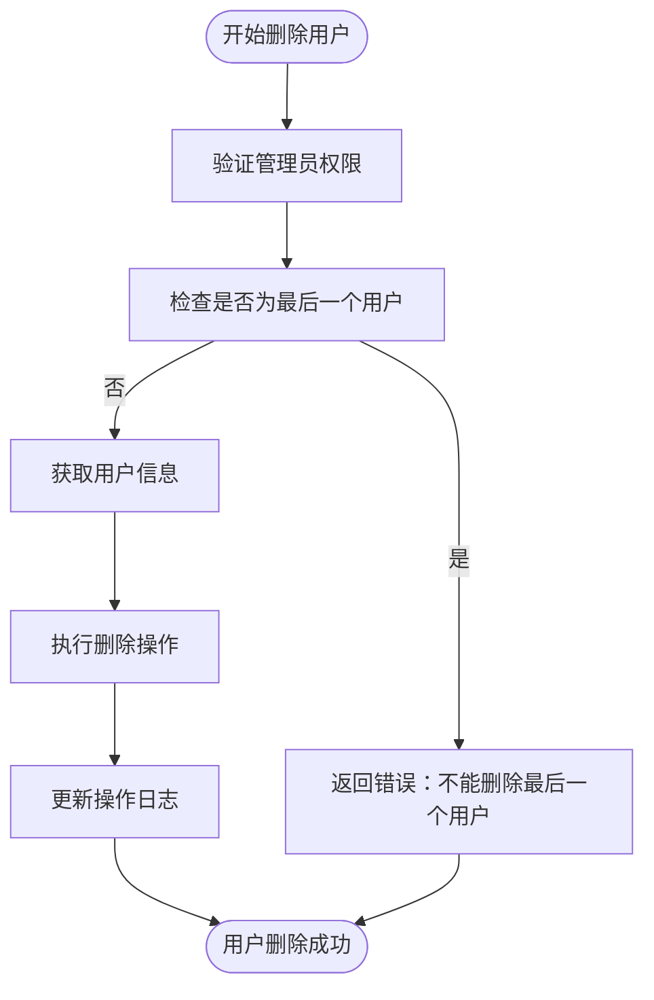
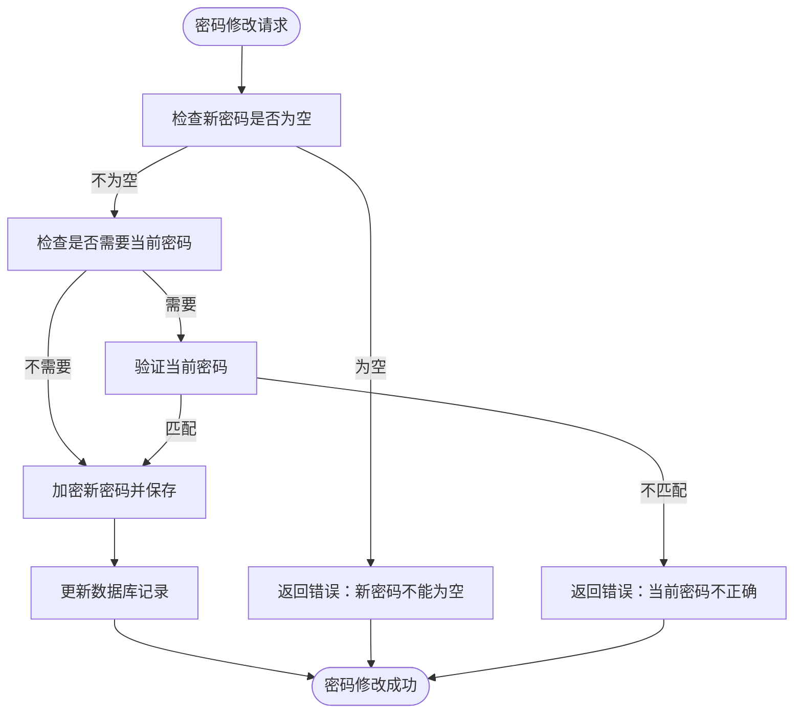
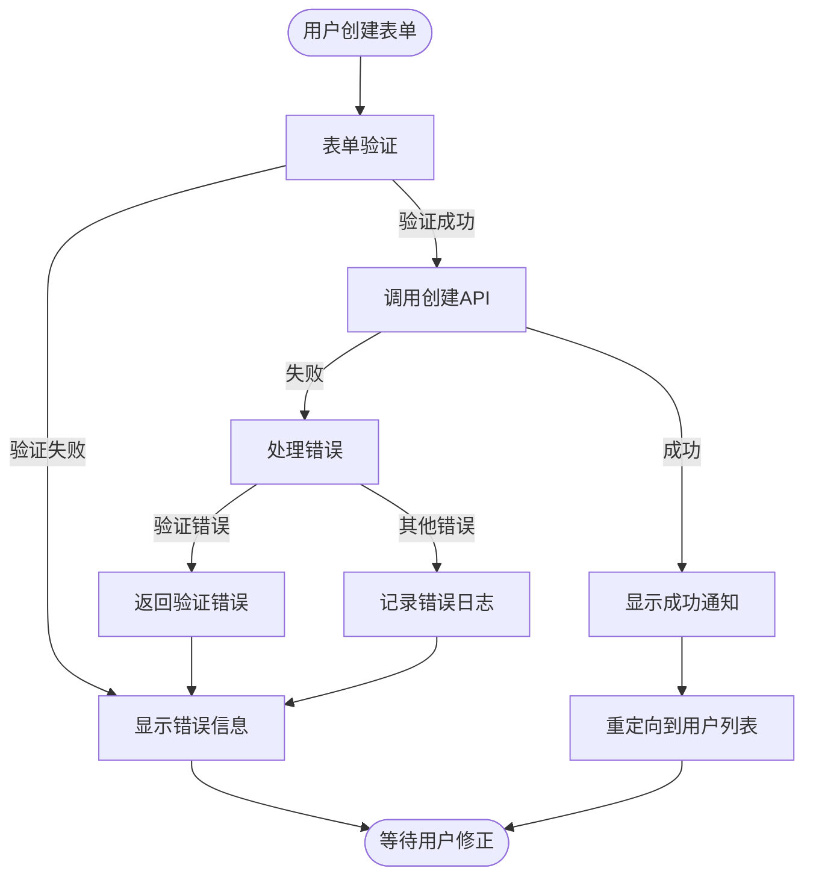

# 用户生命周期管理

<cite>
**本文档中引用的文件**   
- [user.go](file://cmd/user.go)
- [users.go](file://server/subsonic/users.go)
- [UserCreate.jsx](file://ui/src/user/UserCreate.jsx)
- [user.go](file://model/user.go)
- [user_repository.go](file://persistence/user_repository.go)
- [backup.go](file://cmd/backup.go)
- [backup.go](file://db/backup.go)
- [consts.go](file://consts/consts.go)
- [log.go](file://log/log.go)
- [user_props.go](file://model/user_props.go)
- [user_props_repository.go](file://persistence/user_props_repository.go)
- [middlewares.go](file://server/middlewares.go)
</cite>

## 目录
1. [简介](#简介)
2. [用户创建流程](#用户创建流程)
3. [用户激活与禁用](#用户激活与禁用)
4. [用户删除机制](#用户删除机制)
5. [用户信息更新](#用户信息更新)
6. [密码策略与验证](#密码策略与验证)
7. [用户状态转换规则](#用户状态转换规则)
8. [审计日志记录](#审计日志记录)
9. [批量操作实现](#批量操作实现)
10. [前端管理界面](#前端管理界面)
11. [数据迁移与备份恢复](#数据迁移与备份恢复)
12. [密码重置与账户锁定](#密码重置与账户锁定)

## 简介
Navidrome音乐服务器提供完整的用户生命周期管理功能，涵盖用户创建、激活、禁用、删除等完整流程。系统通过API接口和管理界面实现用户管理，支持密码策略验证、用户信息更新、状态转换和审计日志记录。管理员可通过命令行工具或Web界面执行用户批量操作，并实施数据迁移和备份恢复策略。

## 用户创建流程
用户创建流程通过`cmd/user.go`中的`runCreateUser`函数实现，包含以下步骤：
1. 通过命令行交互式输入密码并进行确认
2. 验证用户名唯一性
3. 创建用户对象并设置基本信息（用户名、邮箱、姓名、管理员状态）
4. 自动分配图书馆访问权限：管理员用户可访问所有图书馆，普通用户自动分配默认图书馆
5. 加密存储用户密码
6. 在数据库中持久化用户信息

用户创建时支持通过`--library-ids`参数指定可访问的图书馆ID列表，或通过`--admin`参数创建管理员账户。系统会自动验证指定的图书馆ID是否存在，并确保用户不会同时被设置为管理员并指定特定图书馆。

**Section sources**
- [user.go](file://cmd/user.go#L165-L230)
- [user.go](file://model/user.go#L7-L28)
- [user_repository.go](file://persistence/user_repository.go#L114-L164)

## 用户激活与禁用
用户激活通过首次登录自动完成，系统在`server/middlewares.go`中通过`UpdateLastLoginMiddleware`中间件记录用户的最后登录时间。用户禁用功能通过修改用户状态实现，将用户`IsAdmin`字段设置为`false`并移除其图书馆访问权限。

管理员用户和普通用户在图书馆访问权限上有明确区分：
- 管理员用户自动获得所有图书馆的访问权限
- 普通用户根据配置自动分配到默认图书馆
- 用户的图书馆访问权限可通过`SetUserLibraries`方法动态调整

用户激活状态通过`LastLoginAt`和`LastAccessAt`字段跟踪，系统定期更新这些时间戳以反映用户的活跃状态。

**Section sources**
- [user_repository.go](file://persistence/user_repository.go#L197-L207)
- [middlewares.go](file://server/middlewares.go#L304-L329)
- [user.go](file://model/user.go#L13-L14)

## 用户删除机制
用户删除机制在`cmd/user.go`的`runDeleteUser`函数中实现，包含以下安全检查：
1. 验证删除操作由管理员执行
2. 检查系统中剩余用户数量，确保不会删除最后一个用户
3. 获取要删除的用户信息
4. 执行删除操作并记录日志

删除操作通过`Delete`方法实现，该方法首先验证执行者的管理员权限，然后从数据库中移除用户记录及其相关的权限设置。系统通过事务处理确保数据一致性，并在删除失败时返回适当的错误信息。

**Diagram sources **
- [user.go](file://cmd/user.go#L232-L261)
- [user_repository.go](file://persistence/user_repository.go#L334-L343)

## 用户信息更新
用户信息更新通过`runUserEdit`函数实现，支持以下操作：
- 更新密码
- 修改管理员状态
- 调整图书馆访问权限
- 更新邮箱和姓名信息

更新操作包含严格的权限验证：
- 只有管理员可以修改其他用户的信息
- 普通用户只能修改自己的非敏感信息（如姓名、邮箱）
- 密码修改需要验证当前密码（除非是管理员修改其他用户密码）

系统通过`validatePasswordChange`函数验证密码修改请求，确保新密码不为空且当前密码正确匹配。用户名更新时会检查唯一性约束，防止重复用户名。

**Section sources**
- [user.go](file://cmd/user.go#L263-L369)
- [user_repository.go](file://persistence/user_repository.go#L262-L292)
- [user_repository.go](file://persistence/user_repository.go#L294-L317)

## 密码策略与验证
密码策略在`persistence/user_repository.go`中通过`validatePasswordChange`函数实现，包含以下验证规则：
1. 新密码不能为空
2. 修改密码时必须提供当前密码
3. 当前密码必须与存储的密码匹配
4. 管理员修改其他用户密码时无需提供当前密码

密码存储采用加密方式，系统使用`encryptPassword`和`decryptPassword`方法进行密码的加密和解密。加密密钥可通过`PasswordEncryptionKey`配置项设置，系统会验证密钥的一致性以确保密码可正确解密。

密码加密使用SHA-256哈希算法生成32字节密钥，通过`utils.Encrypt`函数对密码进行加密存储。系统在启动时初始化加密密钥，并在密钥变更时自动重新加密所有现有密码。

**Diagram sources **
- [user_repository.go](file://persistence/user_repository.go#L294-L317)
- [user_repository.go](file://persistence/user_repository.go#L409-L418)

## 用户状态转换规则
用户状态转换遵循严格的业务规则，主要状态包括：
- **活跃状态**：用户已登录且最近有活动记录
- **非活跃状态**：用户长时间未登录
- **管理员状态**：具有系统管理权限
- **普通用户状态**：仅具有基本访问权限

状态转换规则：
1. 新创建用户默认为非管理员状态
2. 只有管理员可以将用户提升为管理员
3. 管理员可以降级其他管理员为普通用户
4. 用户的最后访问时间自动更新，反映其活跃状态
5. 系统保留至少一个管理员用户

权限继承规则：
- 管理员用户自动获得所有图书馆的访问权限
- 普通用户根据`default_new_users`标志自动分配到默认图书馆
- 用户的图书馆访问权限可以单独设置，覆盖默认分配

**Section sources**
- [user.go](file://model/user.go#L30-L39)
- [user_repository.go](file://persistence/user_repository.go#L145-L163)
- [user_repository.go](file://persistence/user_repository.go#L442-L471)

## 审计日志记录
审计日志记录通过系统日志组件实现，主要记录以下用户管理操作：
- 用户创建
- 用户删除
- 用户信息更新
- 密码修改
- 登录活动

日志记录包含详细信息：
- 操作类型
- 执行用户
- 目标用户
- 操作时间
- 操作结果
- 相关参数

系统使用`log`包进行日志记录，支持不同级别的日志输出（Info、Warn、Error等）。敏感信息（如密码）在日志中被自动脱敏处理，确保系统安全。

用户活动跟踪通过`UpdateLastAccessMiddleware`中间件实现，定期更新用户的最后访问时间，但受频率限制以避免过度写入数据库。

**Section sources**
- [log.go](file://log/log.go#L176-L352)
- [user.go](file://cmd/user.go#L229-L230)
- [user.go](file://cmd/user.go#L260-L261)
- [user.go](file://cmd/user.go#L367-L368)
- [middlewares.go](file://server/middlewares.go#L304-L329)

## 批量操作实现
批量操作主要通过命令行工具和API接口实现，支持以下功能：
- 用户批量创建
- 用户批量删除
- 用户信息批量更新
- 用户数据导入导出

性能优化方案：
1. 使用数据库事务批量处理操作
2. 批量SQL语句减少数据库往返次数
3. 适当的索引优化查询性能
4. 并行处理独立操作

用户列表导出支持CSV和JSON格式，通过`runUserList`函数实现。导出操作会格式化时间戳、库路径等信息，便于外部系统处理。

对于大规模用户操作，建议使用命令行工具而非Web界面，以获得更好的性能和可靠性。

**Section sources**
- [user.go](file://cmd/user.go#L370-L476)
- [user.go](file://cmd/user.go#L211-L222)
- [user_repository.go](file://persistence/user_repository.go#L129-L140)

## 前端管理界面
前端管理界面在`ui/src/user/UserCreate.jsx`中实现，提供用户友好的创建表单，包含以下字段：
- 用户名（必填）
- 姓名（必填）
- 邮箱（可选，格式验证）
- 密码（必填）
- 管理员状态（复选框）

权限控制规则：
- 只有管理员用户可以访问用户管理界面
- 普通用户无法创建或修改其他用户
- 界面根据用户角色显示不同选项

当创建管理员用户时，界面会显示提示信息，说明管理员自动获得所有图书馆的访问权限，无需手动选择。对于普通用户，界面提供图书馆选择组件，允许管理员指定可访问的图书馆。

前端通过React Admin框架实现表单验证和数据提交，使用`mutate`函数调用后端API创建用户。

**Diagram sources **
- [UserCreate.jsx](file://ui/src/user/UserCreate.jsx#L30-L52)
- [wrapperDataProvider.js](file://ui/src/dataProvider/wrapperDataProvider.js#L111-L125)

## 数据迁移与备份恢复
数据迁移和备份恢复通过`cmd/backup.go`中的命令行工具实现，提供以下功能：
- 数据库备份
- 备份文件清理
- 数据库恢复

备份策略：
- 自动备份：根据配置定期创建备份
- 手动备份：管理员可随时创建备份
- 备份保留：可配置保留的备份数量

备份文件命名包含时间戳，便于识别和管理。系统使用SQLite的在线备份API确保备份过程中数据库的可用性。

恢复操作必须在系统离线状态下进行，以避免数据不一致。恢复前会提示管理员确认操作，防止意外覆盖现有数据。

最佳实践：
1. 定期测试备份文件的可恢复性
2. 将备份文件存储在独立的物理位置
3. 实施多级备份策略（每日、每周、每月）
4. 监控备份操作的成功率和执行时间

**Section sources**
- [backup.go](file://cmd/backup.go#L76-L187)
- [backup.go](file://db/backup.go#L103-L149)

## 密码重置与账户锁定
密码重置流程通过用户编辑功能实现，管理员可以为用户设置新密码。系统要求在修改密码时进行二次确认，确保操作的准确性。

账户锁定策略基于以下安全考虑：
- 防止暴力破解攻击
- 保护用户账户安全
- 符合安全合规要求

虽然当前代码中未直接实现账户锁定功能，但可以通过以下方式增强安全性：
1. 配置外部认证系统实现登录失败限制
2. 使用防火墙规则限制频繁登录尝试
3. 实施多因素认证

密码重置时，系统会加密存储新密码，并在下次登录时要求用户确认密码修改。管理员应遵循最小权限原则，仅在必要时重置用户密码。

**Section sources**
- [user.go](file://cmd/user.go#L122-L155)
- [user.go](file://cmd/user.go#L311-L318)
- [user_repository.go](file://persistence/user_repository.go#L409-L418)