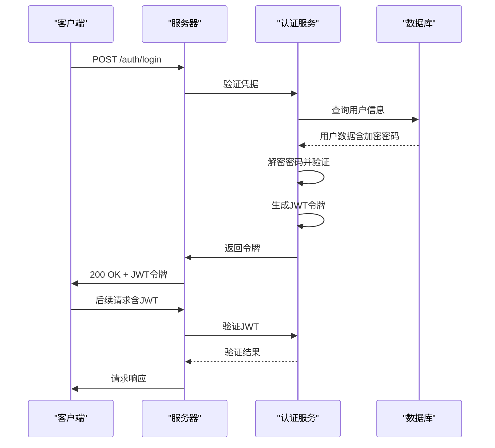
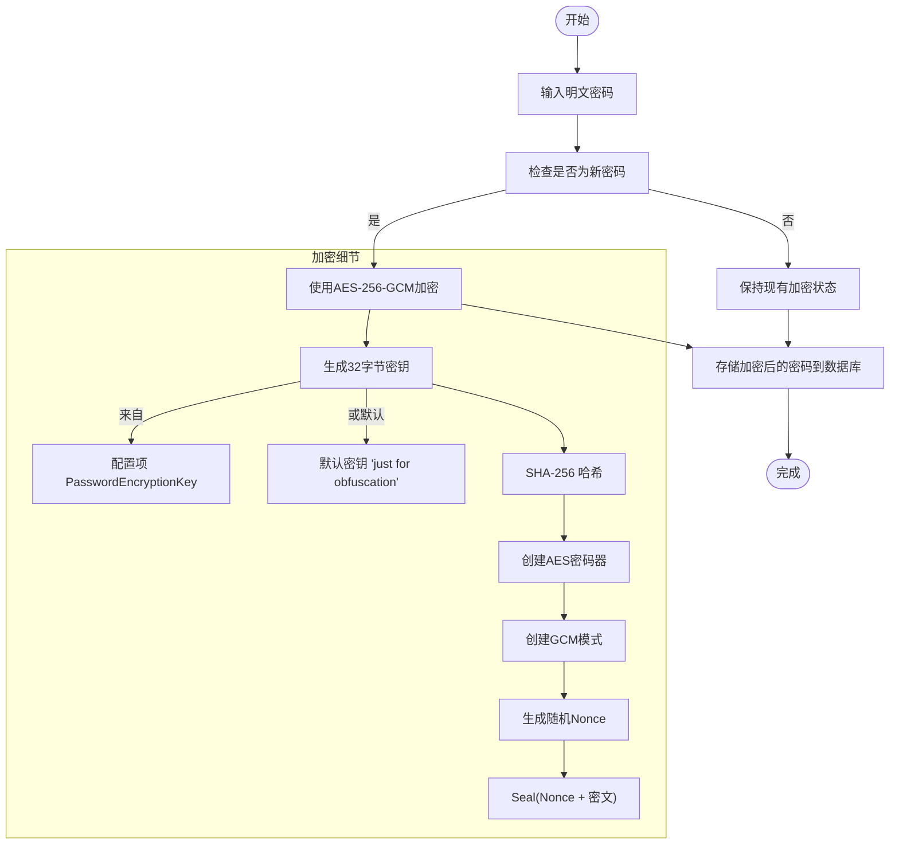
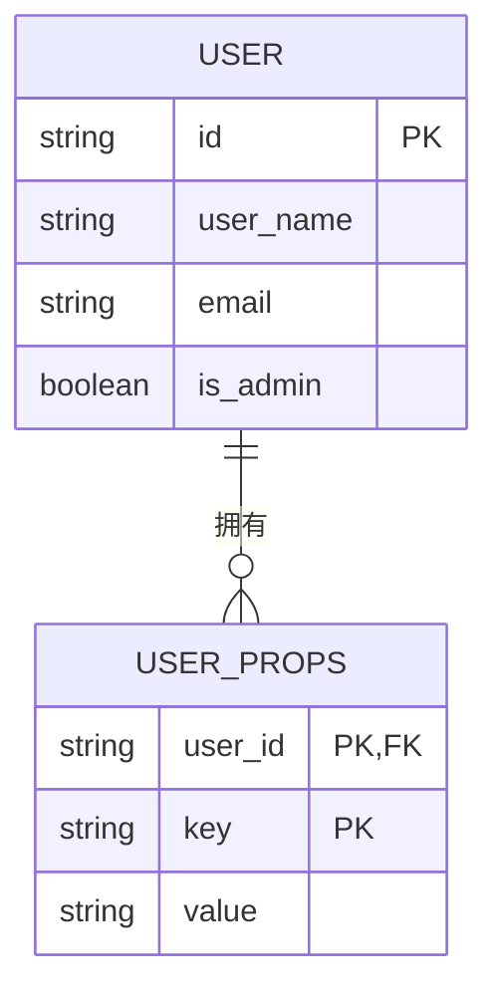
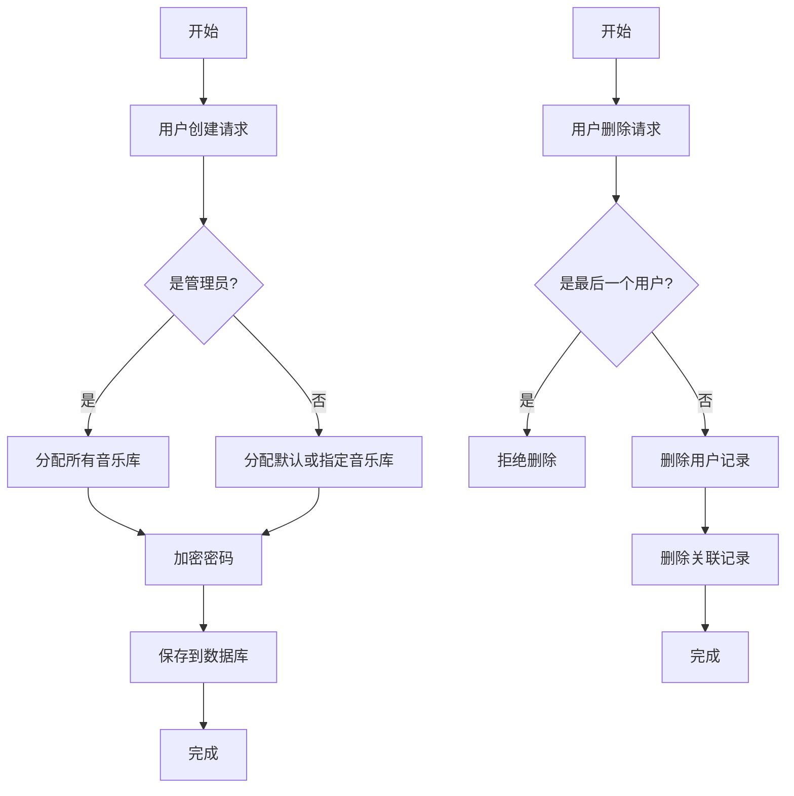

# 用户管理

<cite>
**本文档中引用的文件**   
- [auth.go](file://core/auth/auth.go)
- [user.go](file://model/user.go)
- [user_props.go](file://model/user_props.go)
- [user_repository.go](file://persistence/user_repository.go)
- [user_props_repository.go](file://persistence/user_props_repository.go)
- [users.go](file://server/subsonic/users.go)
- [user.go](file://cmd/user.go)
- [consts.go](file://consts/consts.go)
- [encrypt.go](file://utils/encrypt.go)
- [configuration.go](file://conf/configuration.go)
</cite>

## 目录
1. [简介](#简介)
2. [认证与授权机制](#认证与授权机制)
3. [用户属性管理](#用户属性管理)
4. [权限控制系统](#权限控制系统)
5. [用户生命周期管理](#用户生命周期管理)
6. [外部身份集成](#外部身份集成)
7. [安全最佳实践](#安全最佳实践)

## 简介

Navidrome 是一个自托管的音乐服务器，提供完整的用户管理功能。本文档详细解释了其用户管理系统的各个方面，包括认证授权机制、用户属性管理、权限控制、用户生命周期管理以及安全最佳实践。系统设计旨在为初学者提供直观理解，同时为高级用户提供深入的技术细节和扩展点。

## 认证与授权机制

Navidrome 使用基于 JWT（JSON Web Token）的认证系统来管理用户会话。该系统确保了安全的用户身份验证和会话管理。

**Diagram sources**
- [auth.go](file://core/auth/auth.go#L26-L147)
- [server.go](file://server/server.go#L208-L222)
- [auth.go](file://server/auth.go#L36-L177)

**Section sources**
- [auth.go](file://core/auth/auth.go#L1-L147)
- [server.go](file://server/server.go#L208-L247)
- [auth.go](file://server/auth.go#L1-L177)

### JWT 认证流程

系统的核心认证流程基于 JWT 标准实现，主要包含以下步骤：

1.  **初始化**: `Init` 函数在应用启动时调用，负责创建或加载用于签名 JWT 的密钥。该密钥存储在数据库的 `property` 表中，键名为 `JWTSecret`，并使用 AES-256-GCM 算法进行加密保护。
2.  **用户登录**: 当用户通过 `/auth/login` 端点提交用户名和密码时，系统会调用 `validateLogin` 函数。该函数从数据库中检索用户记录（包含加密的密码），解密后与用户输入的密码进行比对。
3.  **令牌生成**: 认证成功后，`CreateToken` 函数会创建一个 JWT 令牌。令牌的声明（claims）包含用户ID (`uid`)、用户名 (`sub`)、是否为管理员 (`adm`) 以及过期时间。
4.  **会话管理**: 令牌的过期时间通过 `TouchToken` 函数动态更新，每次用户活动时都会延长会话有效期，该时长由 `conf.Server.SessionTimeout` 配置项决定，默认为48小时。
5.  **令牌验证**: 所有受保护的API请求都必须在 `Authorization` 头或 Cookie 中包含有效的 JWT 令牌。`JWTVerifier` 中间件负责验证令牌的有效性。

### 密码加密策略

Navidrome 对用户密码采用严格的加密策略，确保即使数据库泄露，密码也不会被轻易破解。

**Diagram sources**
- [user_repository.go](file://persistence/user_repository.go#L409-L418)
- [encrypt.go](file://utils/encrypt.go#L15-L38)
- [consts.go](file://consts/consts.go#L31-L34)

**Section sources**
- [user_repository.go](file://persistence/user_repository.go#L119-L121)
- [encrypt.go](file://utils/encrypt.go#L1-L73)
- [consts.go](file://consts/consts.go#L31-L34)

#### 加密实现
- **算法**: 使用 AES-256-GCM（Galois/Counter Mode），这是一种提供机密性、完整性和认证的现代加密模式。
- **密钥派生**: 加密密钥由 `PasswordEncryptionKey` 配置项或默认密钥 `just for obfuscation` 经过 SHA-256 哈希生成，确保密钥长度为32字节。
- **随机性**: 每次加密都会生成一个随机的Nonce（Number used once），防止相同的明文产生相同的密文。
- **存储**: 加密后的数据以Base64编码的字符串形式存储在数据库中。

### 会话管理

会话管理通过 JWT 令牌实现无状态会话。服务器不存储会话信息，所有必要信息都包含在令牌本身。会话超时由 `conf.Server.SessionTimeout` 控制，用户每次与服务器交互时，`TouchToken` 函数都会刷新令牌的过期时间，从而延长会话。

## 用户属性管理

用户属性管理允许存储和检索与用户相关的个性化设置，如主题偏好、默认视图等，这些信息与核心用户数据分离，提供了灵活的扩展性。

### 存储结构

用户属性存储在名为 `user_props` 的数据库表中，采用简单的键值对（Key-Value）结构。每个属性由 `user_id`、`key` 和 `value` 三个字段组成，其中 `user_id` 和 `key` 共同构成主键。

**Diagram sources**
- [user_props.go](file://model/user_props.go#L3-L8)
- [user_props_repository.go](file://persistence/user_props_repository.go#L12-L21)

**Section sources**
- [user_props.go](file://model/user_props.go#L1-L9)
- [user_props_repository.go](file://persistence/user_props_repository.go#L1-L64)

### 个性化设置持久化

个性化设置（如主题、默认视图）通过 `UserPropsRepository` 接口进行持久化。当用户在UI中更改设置时，前端会调用相应的API，后端服务将这些设置作为键值对保存到 `user_props` 表中。

#### 常见属性键
- `theme`: 存储用户选择的主题ID。
- `defaultView`: 存储用户偏好的默认视图（如专辑、艺术家）。
- `language`: 存储用户界面语言。
- `volume`: 存储用户上次设置的音量。

#### 实现机制
- **接口**: `UserPropsRepository` 定义了 `Put`, `Get`, `Delete`, `DefaultGet` 四个核心方法。
- **持久化**: `user_props_repository.go` 实现了该接口，直接操作数据库的 `user_props` 表。
- **默认值**: `DefaultGet` 方法允许在属性不存在时返回一个默认值，避免了空值检查。

## 权限控制系统

Navidrome 的权限控制系统基于用户角色（管理员/普通用户）和资源访问控制，确保了数据的安全性和隔离性。

### 管理员与普通用户的权限差异

| 权限/功能 | 管理员 | 普通用户 |
| :--- | :--- | :--- |
| **用户管理** | 可创建、编辑、删除所有用户 | 仅可编辑自己的信息（如果 `EnableUserEditing` 开启） |
| **库访问** | 自动拥有所有音乐库的访问权限 | 仅能访问被明确分配的音乐库 |
| **系统配置** | 可访问和修改系统设置 | 无权访问 |
| **API 访问** | 可调用所有 Subsonic API | 只能调用与其权限匹配的 API |

**Section sources**
- [user.go](file://model/user.go#L30-L39)
- [users.go](file://server/subsonic/users.go#L16-L32)
- [configuration.go](file://conf/configuration.go#L74)

### 权限检查实现

权限检查在多个层面进行：
1.  **数据访问层**: `UserRepository` 的 `Read`, `ReadAll`, `Save`, `Update`, `Delete` 等方法会检查调用者的权限。例如，只有管理员才能读取所有用户列表。
2.  **业务逻辑层**: 在执行敏感操作（如删除用户）前，会进行权限验证。
3.  **API 层**: Subsonic API 的响应会根据用户权限动态构建，例如 `buildUserResponse` 函数会根据用户是否为管理员来设置 `jukeboxRole` 等字段。

## 用户生命周期管理

用户生命周期管理涵盖了从创建到删除的完整流程，包括密码重置等关键操作。

### 用户创建/删除流程

#### 创建流程
1.  通过命令行工具 `navidrome user create` 或初始设置界面触发。
2.  系统提示输入用户名、密码、邮箱等信息。
3.  验证用户名是否唯一。
4.  为新用户生成一个随机的ID。
5.  加密用户密码。
6.  将用户信息存入数据库。
7.  根据用户类型（管理员/普通用户）自动分配音乐库访问权限。

#### 删除流程
1.  通过命令行工具 `navidrome user delete` 触发。
2.  系统检查待删除用户是否为最后一个用户，如果是，则拒绝删除以防止系统无管理员。
3.  从 `user` 表中删除用户记录。
4.  级联删除 `user_library` 和 `user_props` 表中相关的关联记录。

**Diagram sources**
- [user.go](file://cmd/user.go#L165-L230)
- [user.go](file://cmd/user.go#L232-L261)
- [user_repository.go](file://persistence/user_repository.go#L114-L163)

**Section sources**
- [user.go](file://cmd/user.go#L1-L478)
- [user_repository.go](file://persistence/user_repository.go#L114-L163)

### 密码重置机制

密码重置通过 `NewPassword` 和 `CurrentPassword` 字段实现。当用户更新其密码时：
1.  如果用户是管理员或正在修改自己的密码，系统会要求提供 `CurrentPassword` 进行验证。
2.  `validatePasswordChange` 函数会检查当前密码是否正确。
3.  新密码通过 `encryptPassword` 方法加密后，替换数据库中的旧密码。

## 外部身份提供者的集成可能性

虽然当前代码库主要实现本地认证，但其架构为集成外部身份提供者（如 OAuth2、LDAP）提供了可能性。`ExtAuth` 配置项和 `extAuthOptions` 结构体表明了系统设计上对此的支持。通过扩展 `validateLogin` 函数，可以集成对 Google、GitHub 等第三方认证服务的支持，从而允许用户使用其外部账户登录。

## 安全最佳实践

### 多因素认证扩展点

当前系统未实现多因素认证（MFA），但其模块化设计为未来扩展提供了清晰的路径。可以在 `doLogin` 函数成功验证密码后，插入一个MFA验证步骤。例如，可以生成一个TOTP（基于时间的一次性密码）并发送到用户的注册邮箱或手机，要求用户在规定时间内输入以完成登录。

### 大规模用户管理的性能考虑

对于大规模用户管理，系统在设计上考虑了以下性能因素：
- **数据库索引**: `user` 表在 `user_name` 字段上建立了不区分大小写的索引，确保 `FindByUsername` 查询的高效性。
- **批量操作**: `SetUserLibraries` 方法使用单个SQL语句来更新用户与音乐库的关联关系，避免了多次数据库交互。
- **缓存**: 虽然用户数据本身可能不会被频繁缓存，但JWT验证是无状态的，减轻了服务器的会话存储压力。