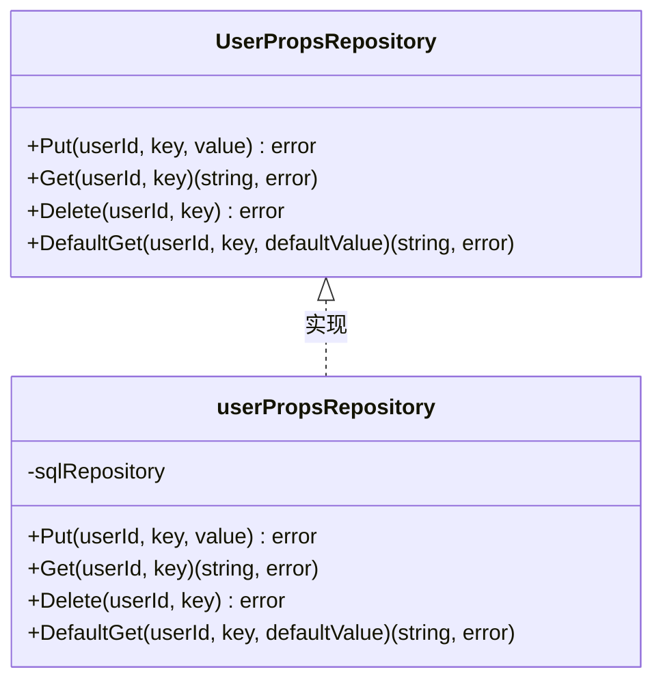
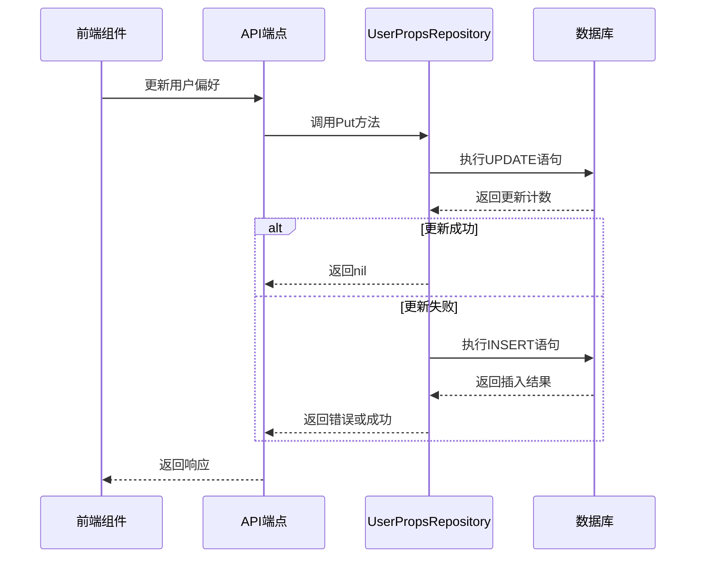
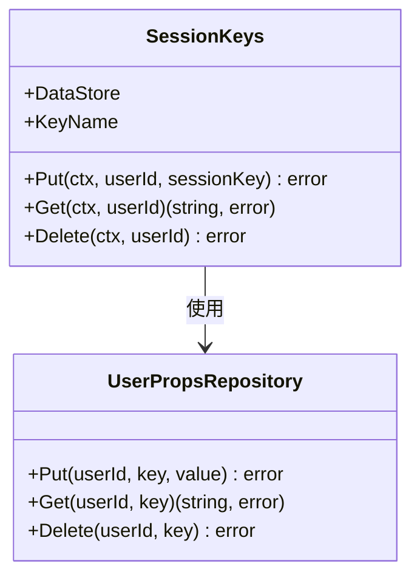

# 用户配置文件管理

<cite>
**本文档中引用的文件**  
- [user_props.go](file://model/user_props.go)
- [user_props_repository.go](file://persistence/user_props_repository.go)
- [config.go](file://server/nativeapi/config.go)
- [Personal.jsx](file://ui/src/personal/Personal.jsx)
- [SelectTheme.jsx](file://ui/src/personal/SelectTheme.jsx)
- [SelectDefaultView.jsx](file://ui/src/personal/SelectDefaultView.jsx)
- [SelectLanguage.jsx](file://ui/src/personal/SelectLanguage.jsx)
- [configuration.go](file://conf/configuration.go)
- [20210623155401_add_user_prefs_player_scrobbler_enabled.go](file://db/migrations/20210623155401_add_user_prefs_player_scrobbler_enabled.go)
- [session_keys.go](file://core/agents/session_keys.go)
</cite>

## 目录
1. [简介](#简介)
2. [用户属性数据模型](#用户属性数据模型)
3. [配置持久化机制](#配置持久化机制)
4. [配置读取与更新流程](#配置读取与更新流程)
5. [前端组件交互](#前端组件交互)
6. [扩展指南](#扩展指南)
7. [结论](#结论)

## 简介
本文档详细阐述Navidrome音乐服务器中用户配置文件管理的实现机制。重点介绍用户属性（UserProps）的数据模型设计，包括主题偏好、默认视图、播放器设置等个性化选项的存储结构。文档将解释user_props.go中各项配置的含义和默认值，提供配置持久化机制的实现细节，包括数据库存储和缓存策略，并结合config.go中的API端点说明配置的读取和更新流程。同时，展示前端组件（如Personal.jsx）如何与后端交互实现用户偏好设置，为开发者提供添加新用户属性的扩展指南。

## 用户属性数据模型
用户属性数据模型采用键值对存储方式，通过`UserPropsRepository`接口定义了对用户个性化配置的增删改查操作。该模型支持存储各种用户偏好设置，如主题选择、语言偏好、默认视图等。



**图表来源**  
- [user_props.go](file://model/user_props.go#L3-L8)
- [user_props_repository.go](file://persistence/user_props_repository.go#L12-L64)

**用户属性表结构**  
用户属性存储在数据库的`user_props`表中，其结构定义如下：

```sql
create table user_props (
    user_id varchar not null,
    key varchar not null,
    value varchar,
    constraint user_props_pk
        primary key (user_id, key)
);
```

该表以`user_id`和`key`作为复合主键，确保每个用户对每个配置项只能有一条记录。这种设计支持灵活的用户偏好存储，可以轻松扩展新的配置项而无需修改表结构。

**图表来源**  
- [20210623155401_add_user_prefs_player_scrobbler_enabled.go](file://db/migrations/20210623155401_add_user_prefs_player_scrobbler_enabled.go#L23-L31)

**Section sources**
- [user_props.go](file://model/user_props.go#L1-L9)
- [user_props_repository.go](file://persistence/user_props_repository.go#L1-L64)

## 配置持久化机制
用户配置的持久化机制基于数据库存储和缓存策略的结合，确保配置数据的可靠性和访问效率。

### 数据库存储实现
用户属性的数据库存储通过`userPropsRepository`结构体实现，该结构体继承自`sqlRepository`，提供了对`user_props`表的CRUD操作。



**图表来源**  
- [user_props_repository.go](file://persistence/user_props_repository.go#L24-L35)

`Put`方法的实现采用了先尝试更新再插入的策略：首先尝试更新已存在的记录，如果更新影响的行数为0，则执行插入操作。这种"upsert"模式确保了数据的一致性。

`Get`方法通过查询`user_props`表获取指定用户和键的值，如果未找到记录则返回`ErrNotFound`错误。`DefaultGet`方法在此基础上增加了默认值支持，当配置项不存在时返回提供的默认值。

### 缓存策略
虽然代码中没有显式的缓存层，但通过以下机制实现了类似缓存的效果：

1. **本地存储**：前端组件使用`localStorage`存储部分用户偏好，如默认视图和语言设置，减少对后端的频繁请求。
2. **会话缓存**：用户登录后，其配置信息可能被缓存在会话中，提高访问速度。
3. **配置合并**：系统配置与用户配置在运行时合并，避免重复读取。

**Section sources**
- [user_props_repository.go](file://persistence/user_props_repository.go#L24-L63)
- [SelectDefaultView.jsx](file://ui/src/personal/SelectDefaultView.jsx#L6)
- [SelectLanguage.jsx](file://ui/src/personal/SelectLanguage.jsx#L33)

## 配置读取与更新流程
用户配置的读取与更新流程涉及前端、API端点和数据存储层的协同工作。

### 配置读取流程
配置读取主要通过`DefaultGet`方法实现，该方法提供了安全的配置访问方式：

```go
func (r userPropsRepository) DefaultGet(userId, key string, defaultValue string) (string, error) {
    value, err := r.Get(userId, key)
    if errors.Is(err, model.ErrNotFound) {
        return defaultValue, nil
    }
    if err != nil {
        return defaultValue, err
    }
    return value, nil
}
```

该方法首先尝试获取配置值，如果配置项不存在（`ErrNotFound`），则返回默认值；如果发生其他错误，则返回默认值和错误信息。这种设计确保了即使配置项缺失，系统也能正常运行。

### 配置更新流程
配置更新流程通过`Put`方法实现，采用"先更新后插入"的策略：

```go
func (r userPropsRepository) Put(userId, key string, value string) error {
    update := Update(r.tableName).Set("value", value).Where(And{Eq{"user_id": userId}, Eq{"key": key}})
    count, err := r.executeSQL(update)
    if err != nil {
        return err
    }
    if count > 0 {
        return nil
    }
    insert := Insert(r.tableName).Columns("user_id", "key", "value").Values(userId, key, value)
    _, err = r.executeSQL(insert)
    return err
}
```

这种设计避免了因并发操作导致的唯一键冲突，提高了系统的稳定性和可靠性。

### 会话密钥管理
用户属性系统还被用于管理外部服务的会话密钥，如Last.fm和ListenBrainz：



**图表来源**  
- [session_keys.go](file://core/agents/session_keys.go#L9-L26)

`SessionKeys`结构体作为`UserPropsRepository`的简单包装，专门用于管理外部服务的会话密钥，体现了用户属性系统的通用性和可扩展性。

**Section sources**
- [user_props_repository.go](file://persistence/user_props_repository.go#L50-L59)
- [user_props_repository.go](file://persistence/user_props_repository.go#L24-L35)
- [session_keys.go](file://core/agents/session_keys.go#L1-L26)

## 前端组件交互
前端组件通过React Admin框架与后端API交互，实现用户偏好设置的可视化界面。

### 个人设置组件
`Personal.jsx`是用户个人设置的主组件，整合了多个子组件：

```jsx
const Personal = () => {
  return (
    <Card className={classes.root}>
      <Title title={'Navidrome - ' + translate('menu.personal.name')} />
      <SimpleForm toolbar={null} variant={'outlined'}>
        <SelectTheme />
        <SelectLanguage />
        <SelectDefaultView />
        {config.enableReplayGain && <ReplayGainToggle />}
        <NotificationsToggle />
        {config.lastFMEnabled && <LastfmScrobbleToggle />}
        {config.listenBrainzEnabled && <ListenBrainzScrobbleToggle />}
      </SimpleForm>
    </Card>
  )
}
```

该组件根据系统配置动态显示可选的设置项，如回放增益、Last.fm和ListenBrainz同步功能。

**图表来源**  
- [Personal.jsx](file://ui/src/personal/Personal.jsx#L17-L37)

### 主题选择组件
`SelectTheme.jsx`组件实现了主题选择功能：

```jsx
export const SelectTheme = (props) => {
  const currentTheme = useSelector((state) => state.theme)
  const themeChoices = [
    { id: AUTO_THEME_ID, name: 'Auto' },
  ]
  themeChoices.push(
    ...Object.keys(themes).map((key) => {
      return { id: key, name: themes[key].themeName }
    }),
  )
  return (
    <SelectInput
      source="theme"
      label={translate('menu.personal.options.theme')}
      defaultValue={currentTheme}
      choices={themeChoices}
      onChange={(event) => {
        dispatch(changeTheme(event.target.value))
      }}
    />
  )
}
```

该组件从Redux状态中获取当前主题，并提供自动、亮色和暗色主题选项。

**图表来源**  
- [SelectTheme.jsx](file://ui/src/personal/SelectTheme.jsx#L1-L47)

### 默认视图选择组件
`SelectDefaultView.jsx`组件管理默认视图设置：

```jsx
export const SelectDefaultView = (props) => {
  const current = localStorage.getItem('defaultView') || defaultAlbumList
  return (
    <SelectInput
      source="defaultView"
      label={translate('menu.personal.options.defaultView')}
      defaultValue={current}
      choices={choices}
      onChange={(event) => {
        localStorage.setItem('defaultView', event.target.value)
      }}
    />
  )
}
```

该组件使用`localStorage`存储默认视图设置，确保用户偏好在浏览器会话间持久化。

**图表来源**  
- [SelectDefaultView.jsx](file://ui/src/personal/SelectDefaultView.jsx#L1-L25)

### 语言选择组件
`SelectLanguage.jsx`组件处理语言偏好设置：

```jsx
export const SelectLanguage = (props) => {
  const locale = useLocale()
  return (
    <SelectInput
      source="language"
      label={translate('menu.personal.options.language')}
      defaultValue={locale}
      choices={choices}
      onChange={(event) => {
        setLocale(event.target.value).then(() => {
          localStorage.setItem('locale', event.target.value)
          document.documentElement.lang = event.target.value
        })
      }}
    />
  )
}
```

该组件不仅更新Redux状态，还同步更新`localStorage`和HTML文档的语言属性。

**图表来源**  
- [SelectLanguage.jsx](file://ui/src/personal/SelectLanguage.jsx#L1-L39)

**Section sources**
- [Personal.jsx](file://ui/src/personal/Personal.jsx#L1-L37)
- [SelectTheme.jsx](file://ui/src/personal/SelectTheme.jsx#L1-L47)
- [SelectDefaultView.jsx](file://ui/src/personal/SelectDefaultView.jsx#L1-L25)
- [SelectLanguage.jsx](file://ui/src/personal/SelectLanguage.jsx#L1-L39)

## 扩展指南
为开发者提供添加新用户属性的完整流程指南。

### 添加新用户属性的步骤
1. **确定配置项需求**：明确新配置项的用途、数据类型和默认值。
2. **更新前端组件**：在`Personal.jsx`中添加新的设置组件。
3. **实现前端逻辑**：创建新的React组件处理用户交互。
4. **更新状态管理**：在Redux中添加相应的action和reducer。
5. **测试配置项**：验证新配置项的读取和更新功能。

### 数据库迁移
当需要添加新的用户属性时，通常不需要修改数据库结构，因为`user_props`表的键值对设计支持灵活扩展。但如果需要添加全局配置项，则需要更新`configuration.go`文件：

```go
type configOptions struct {
    // ... existing fields
    NewFeatureEnabled bool
    NewFeatureSetting string
}
```

然后在`setViperDefaults()`函数中设置默认值：

```go
viper.SetDefault("newfeatureenabled", false)
viper.SetDefault("newfeaturesetting", "default_value")
```

### API接口更新
如果需要为新配置项提供专门的API端点，可以在`server/nativeapi/config.go`中添加相应的处理函数。但通常情况下，通用的用户属性API已经足够满足需求。

### 前端表单集成
前端表单集成遵循以下模式：

1. 创建新的选择组件，继承自`SelectInput`或`BooleanInput`。
2. 在`Personal.jsx`中导入并使用新组件。
3. 根据系统配置条件性渲染新组件。
4. 确保配置变更时正确更新状态和存储。

**Section sources**
- [configuration.go](file://conf/configuration.go#L22-L137)
- [config.go](file://server/nativeapi/config.go#L37-L133)
- [Personal.jsx](file://ui/src/personal/Personal.jsx#L1-L37)

## 结论
Navidrome的用户配置文件管理系统采用灵活的键值对存储模型，通过`UserPropsRepository`接口提供了统一的配置管理方式。系统实现了可靠的配置持久化机制，结合数据库存储和前端缓存策略，确保了用户偏好的安全性和访问效率。前端组件通过React Admin框架与后端API无缝集成，为用户提供了直观的个性化设置界面。该系统的设计具有良好的扩展性，开发者可以轻松添加新的用户属性而无需修改核心架构，体现了模块化和可维护性的设计原则。