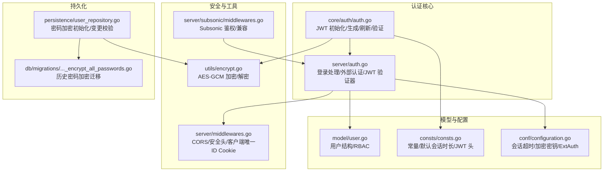
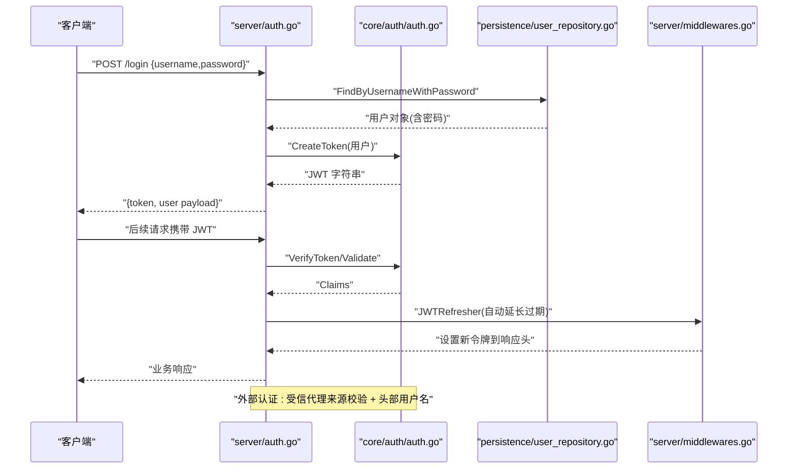
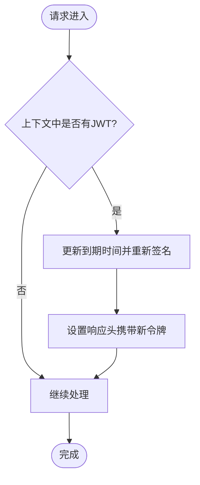
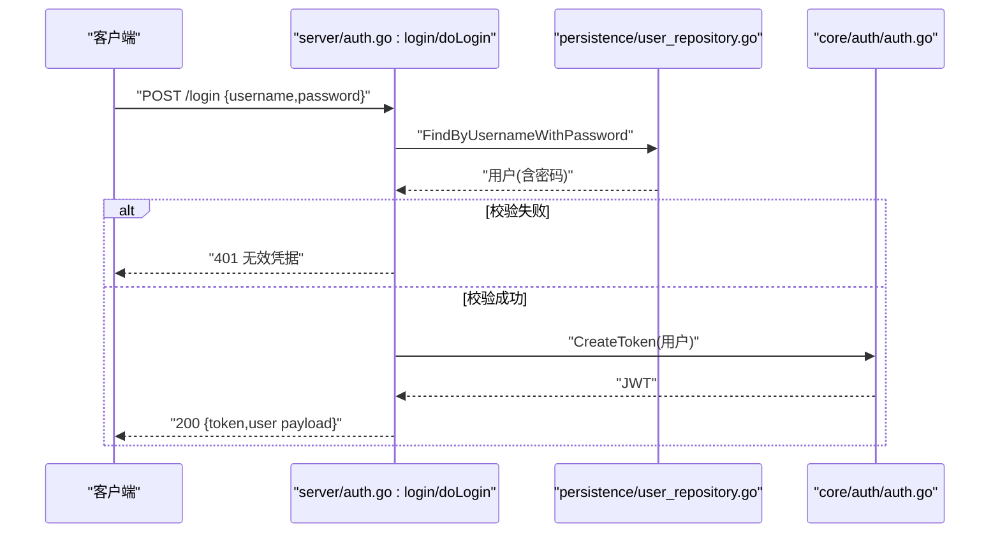
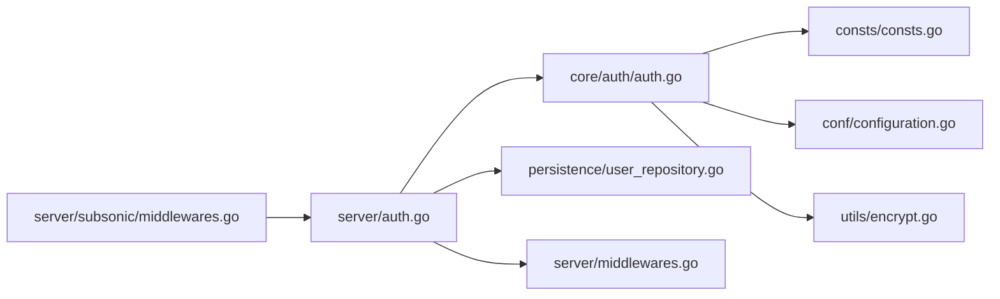

# 认证与授权

<cite>
**本文引用的文件**
- [core/auth/auth.go](file://core/auth/auth.go)
- [server/auth.go](file://server/auth.go)
- [model/user.go](file://model/user.go)
- [consts/consts.go](file://consts/consts.go)
- [conf/configuration.go](file://conf/configuration.go)
- [utils/encrypt.go](file://utils/encrypt.go)
- [server/middlewares.go](file://server/middlewares.go)
- [server/subsonic/middlewares.go](file://server/subsonic/middlewares.go)
- [db/migrations/20210616150710_encrypt_all_passwords.go](file://db/migrations/20210616150710_encrypt_all_passwords.go)
- [persistence/user_repository.go](file://persistence/user_repository.go)
</cite>

## 目录
1. [简介](#简介)
2. [项目结构](#项目结构)
3. [核心组件](#核心组件)
4. [架构总览](#架构总览)
5. [详细组件分析](#详细组件分析)
6. [依赖关系分析](#依赖关系分析)
7. [性能考量](#性能考量)
8. [故障排查指南](#故障排查指南)
9. [结论](#结论)
10. [附录](#附录)

## 简介
本文件系统性梳理 Navidrome 的认证与授权机制，覆盖以下关键主题：
- JWT 令牌的生成、验证与刷新流程，含过期策略与安全存储
- 密码哈希与加密策略（含迁移与密钥管理）
- 基于角色的访问控制（RBAC），区分管理员与普通用户
- 会话管理与安全最佳实践（防重放、CSRF 风险缓解）
- 实际代码示例路径：auth.go 中的 LoginHandler 与 Authenticate 中间件
- 扩展建议：多因素认证（MFA）接口设计与 OAuth2 集成点

## 项目结构
围绕认证与授权的关键目录与文件：
- 核心认证：core/auth/auth.go（JWT 初始化、令牌生成/刷新/验证、密钥管理）
- 服务端入口：server/auth.go（登录处理、外部认证、JWT 验证器与刷新器）
- 用户模型：model/user.go（用户结构与库访问控制）
- 常量与默认值：consts/consts.go（JWT 头、密钥、默认会话时长等）
- 配置：conf/configuration.go（会话超时、加密密钥、反向代理认证等）
- 加密工具：utils/encrypt.go（AES-GCM 对称加密）
- 安全中间件：server/middlewares.go（CORS、安全头、客户端唯一 ID Cookie）
- Subsonic 兼容层：server/subsonic/middlewares.go（传统参数鉴权与 JWT 支持）
- 密码迁移：db/migrations/20210616150710_encrypt_all_passwords.go（历史密码加密）
- 用户仓储：persistence/user_repository.go（密码加密初始化、变更校验）

图表来源
- [core/auth/auth.go](file://core/auth/auth.go#L1-L148)
- [server/auth.go](file://server/auth.go#L1-L372)
- [model/user.go](file://model/user.go#L1-L62)
- [consts/consts.go](file://consts/consts.go#L1-L79)
- [conf/configuration.go](file://conf/configuration.go#L526-L665)
- [utils/encrypt.go](file://utils/encrypt.go#L1-L73)
- [server/middlewares.go](file://server/middlewares.go#L87-L166)
- [server/subsonic/middlewares.go](file://server/subsonic/middlewares.go#L93-L128)
- [db/migrations/20210616150710_encrypt_all_passwords.go](file://db/migrations/20210616150710_encrypt_all_passwords.go#L1-L56)
- [persistence/user_repository.go](file://persistence/user_repository.go#L346-L407)

章节来源
- [core/auth/auth.go](file://core/auth/auth.go#L1-L148)
- [server/auth.go](file://server/auth.go#L1-L372)
- [model/user.go](file://model/user.go#L1-L62)
- [consts/consts.go](file://consts/consts.go#L1-L79)
- [conf/configuration.go](file://conf/configuration.go#L526-L665)
- [utils/encrypt.go](file://utils/encrypt.go#L1-L73)
- [server/middlewares.go](file://server/middlewares.go#L87-L166)
- [server/subsonic/middlewares.go](file://server/subsonic/middlewares.go#L93-L128)
- [db/migrations/20210616150710_encrypt_all_passwords.go](file://db/migrations/20210616150710_encrypt_all_passwords.go#L1-L56)
- [persistence/user_repository.go](file://persistence/user_repository.go#L346-L407)

## 核心组件
- JWT 认证核心
  - 初始化与密钥管理：从数据库属性读取或生成并加密保存；使用对称密钥 HS256
  - 令牌生成：包含签发者、签发时间、主体、用户ID、是否管理员、到期时间
  - 令牌刷新：在请求中自动延长到期时间并回写响应头
  - 令牌验证：支持从 Authorization 头、Cookie、查询参数解析与验证
- 登录与外部认证
  - 内部登录：用户名+明文密码校验，成功后返回 JWT 与用户信息
  - 外部认证：受信反向代理来源校验，从指定头部提取用户名并按需创建用户
- 用户模型与 RBAC
  - 用户结构含管理员标识与库访问判断
- 安全中间件
  - CORS、安全头、客户端唯一 ID Cookie（HttpOnly/Secure/SameSite）
- 密码与密钥
  - AES-GCM 对称加密用于 JWT 秘钥与历史密码迁移
  - 密钥派生与变更检测，确保一致性

章节来源
- [core/auth/auth.go](file://core/auth/auth.go#L26-L109)
- [server/auth.go](file://server/auth.go#L36-L172)
- [server/auth.go](file://server/auth.go#L174-L216)
- [server/auth.go](file://server/auth.go#L270-L289)
- [model/user.go](file://model/user.go#L1-L62)
- [server/middlewares.go](file://server/middlewares.go#L87-L166)
- [utils/encrypt.go](file://utils/encrypt.go#L1-L73)
- [db/migrations/20210616150710_encrypt_all_passwords.go](file://db/migrations/20210616150710_encrypt_all_passwords.go#L1-L56)
- [persistence/user_repository.go](file://persistence/user_repository.go#L346-L407)

## 架构总览
下图展示从客户端到服务端的认证流程，涵盖登录、JWT 验证、刷新与外部认证。

图表来源
- [server/auth.go](file://server/auth.go#L36-L172)
- [core/auth/auth.go](file://core/auth/auth.go#L77-L109)
- [persistence/user_repository.go](file://persistence/user_repository.go#L346-L407)
- [server/middlewares.go](file://server/middlewares.go#L270-L289)

## 详细组件分析

### JWT 令牌生命周期与刷新
- 初始化与密钥
  - 从数据属性读取 JWT 秘钥，若不存在则生成随机密钥并通过加密键加密后保存
  - 加密键由配置项派生，若变更会触发一致性检查与迁移
- 令牌生成
  - 包含标准字段（签发者、签发时间、主体）与自定义字段（用户ID、是否管理员）
  - 通过 TouchToken 设置到期时间为当前时间加上会话超时
- 令牌验证
  - 支持从 Authorization 头、Cookie、查询参数三种来源解析
  - 使用 HS256 签名进行验证
- 刷新策略
  - JWTRefresher 在每次请求中检查上下文中的令牌，若存在则重新签名并延长到期时间
  - 将新令牌写入响应头，客户端可透明续期

图表来源
- [server/auth.go](file://server/auth.go#L270-L289)
- [core/auth/auth.go](file://core/auth/auth.go#L91-L101)

章节来源
- [core/auth/auth.go](file://core/auth/auth.go#L26-L109)
- [server/auth.go](file://server/auth.go#L174-L216)
- [server/auth.go](file://server/auth.go#L270-L289)

### 登录流程与外部认证
- 内部登录
  - 从请求体解析用户名与密码
  - 调用用户仓库查找用户并比对密码
  - 成功后调用 CreateToken 生成 JWT，并返回用户信息与 Subsonic 相关字段
- 外部认证
  - 若启用 ExtAuth，先校验反向代理来源 IP 是否在白名单内
  - 从指定头部读取用户名，若用户不存在且为首个用户则自动创建管理员
  - 更新最近登录时间

图表来源
- [server/auth.go](file://server/auth.go#L36-L172)
- [persistence/user_repository.go](file://persistence/user_repository.go#L346-L407)
- [core/auth/auth.go](file://core/auth/auth.go#L77-L89)

章节来源
- [server/auth.go](file://server/auth.go#L36-L172)
- [server/auth.go](file://server/auth.go#L291-L335)

### 用户模型与 RBAC
- 用户结构包含管理员标识与库关联
- RBAC 差异
  - 管理员拥有所有库访问权限
  - 普通用户仅能访问其被授权的库集合
- 权限变更
  - 用户仓储对删除操作要求管理员身份
  - 修改密码需要当前密码校验（除非是自动生成的初始密码）

章节来源
- [model/user.go](file://model/user.go#L1-L62)
- [persistence/user_repository.go](file://persistence/user_repository.go#L326-L344)
- [persistence/user_repository.go](file://persistence/user_repository.go#L294-L318)

### 密码哈希与加密策略
- 历史密码加密迁移
  - 迁移脚本遍历用户表，使用默认密钥对旧密码进行加密并写回
- 当前密码加密
  - 用户仓储在启动时根据配置派生加密密钥
  - 若密钥变更，会拒绝登录以避免无法解密
  - 新增/修改密码时使用 AES-GCM 加密并持久化
- 加密工具
  - utils/encrypt.go 提供对称加解密封装，使用随机 Nonce 与 AEAD

章节来源
- [db/migrations/20210616150710_encrypt_all_passwords.go](file://db/migrations/20210616150710_encrypt_all_passwords.go#L1-L56)
- [persistence/user_repository.go](file://persistence/user_repository.go#L346-L407)
- [utils/encrypt.go](file://utils/encrypt.go#L1-L73)

### 会话管理与安全最佳实践
- 客户端唯一 ID Cookie
  - 通过请求头或 Cookie 注入唯一 ID，设置 HttpOnly/Secure/SameSite Strict
  - 默认一年有效期，路径基于 BasePath
- CORS 与安全头
  - 统一暴露必要的响应头（含自定义授权头）
  - 设置安全头（禁止 MIME 嗅探、帧拒绝、同源引用策略等）
- CSRF 风险缓解
  - 采用 SameSite Strict Cookie 与 HttpOnly 防止跨站脚本窃取
  - 重要接口建议结合 CSRF Token 或 Origin/Referer 校验（当前未见显式 CSRF Token 实现）
- 防重放与速率限制
  - Subsonic 层对参数鉴权有基本校验
  - 服务端中间件包含访问频率限制与日志记录，可用于进一步防护

章节来源
- [server/middlewares.go](file://server/middlewares.go#L87-L166)
- [server/middlewares.go](file://server/middlewares.go#L104-L114)
- [server/middlewares.go](file://server/middlewares.go#L304-L329)

### Subsonic 兼容鉴权
- 支持多种鉴权方式：内部密码、MD5 Token（带盐）、JWT
- 优先级：外部认证（受信代理）> JWT > MD5 Token > 明文密码
- 未找到用户时，若为首个用户则自动创建管理员

章节来源
- [server/subsonic/middlewares.go](file://server/subsonic/middlewares.go#L93-L128)
- [server/subsonic/middlewares.go](file://server/subsonic/middlewares.go#L201-L214)

## 依赖关系分析
- 组件耦合
  - server/auth.go 依赖 core/auth/auth.go 生成/验证 JWT
  - 用户仓库负责密码与权限校验，与持久化层交互
  - 安全中间件贯穿请求链路，提供统一的安全策略
- 外部依赖
  - jwtauth/jwx 用于 JWT 编解码与验证
  - AES-GCM 用于对称加密
  - 反向代理信任列表用于外部认证

图表来源
- [server/auth.go](file://server/auth.go#L1-L372)
- [core/auth/auth.go](file://core/auth/auth.go#L1-L148)
- [persistence/user_repository.go](file://persistence/user_repository.go#L346-L407)
- [consts/consts.go](file://consts/consts.go#L1-L79)
- [conf/configuration.go](file://conf/configuration.go#L526-L665)
- [utils/encrypt.go](file://utils/encrypt.go#L1-L73)
- [server/middlewares.go](file://server/middlewares.go#L87-L166)
- [server/subsonic/middlewares.go](file://server/subsonic/middlewares.go#L93-L128)

## 性能考量
- 令牌刷新成本低：仅需重新签名并延长到期时间，避免频繁重建用户上下文
- 密钥派生与加密：AES-GCM 为轻量对称加密，适合小规模数据（密钥、密码）
- 日志与限流：访问频率限制中间件可降低滥用风险，同时保留必要日志便于审计

## 故障排查指南
- JWT 无法验证
  - 检查 Authorization 头格式（Bearer 前缀）
  - 确认会话超时配置与服务器时间同步
  - 查看密钥是否被正确解密与保存
- 外部认证失败
  - 校验反向代理来源 IP 是否在可信列表
  - 确认头部名称与值是否正确传递
- 密码无法登录
  - 确认密码加密密钥未变更
  - 检查迁移是否成功执行
- CSRF/会话问题
  - 确认 Cookie 的 Secure/SameSite 设置与 HTTPS 环境一致
  - 检查 BasePath 与 Cookie Path 是否匹配

章节来源
- [server/auth.go](file://server/auth.go#L174-L216)
- [server/auth.go](file://server/auth.go#L291-L335)
- [persistence/user_repository.go](file://persistence/user_repository.go#L346-L407)
- [server/middlewares.go](file://server/middlewares.go#L130-L166)

## 结论
Navidrome 的认证体系以 JWT 为核心，结合外部认证、RBAC 与安全中间件，提供了较为完整的登录与访问控制能力。通过会话超时与自动刷新机制，兼顾了用户体验与安全性。建议在生产环境中：
- 强制 HTTPS 并完善 CSRF 防护（如引入 CSRF Token）
- 严格管理加密密钥，避免密钥变更导致的登录中断
- 结合速率限制与审计日志，提升抗攻击能力

## 附录

### 实际代码示例路径
- 登录处理器：server/auth.go 中的 login/doLogin
  - [server/auth.go](file://server/auth.go#L36-L172)
- JWT 验证器与刷新器：server/auth.go 中的 JWTVerifier/JWTRefresher
  - [server/auth.go](file://server/auth.go#L174-L216)
  - [server/auth.go](file://server/auth.go#L270-L289)
- 令牌生成与刷新：core/auth/auth.go 中的 CreateToken/ToucheToken
  - [core/auth/auth.go](file://core/auth/auth.go#L77-L101)
- 用户模型与 RBAC：model/user.go
  - [model/user.go](file://model/user.go#L1-L62)
- 外部认证与自动创建用户：server/auth.go 中的 handleLoginFromHeaders
  - [server/auth.go](file://server/auth.go#L291-L335)
- Subsonic 鉴权兼容：server/subsonic/middlewares.go
  - [server/subsonic/middlewares.go](file://server/subsonic/middlewares.go#L93-L128)

### 扩展建议：多因素认证（MFA）与 OAuth2
- MFA 接口设计
  - 在用户模型中增加 MFA 状态与绑定信息字段
  - 在登录流程中新增二次验证步骤（短信/邮箱/TOTP），成功后才发放 JWT
  - 为已绑定 MFA 的用户在刷新令牌时增加额外校验
- OAuth2 集成点
  - 在 server/auth.go 中新增 OAuth2 登录路由，回调后映射用户并发放 JWT
  - 与外部认证（ExtAuth）协同，支持多源身份源
  - 为第三方平台提供标准化的 OpenID Connect 兼容端点