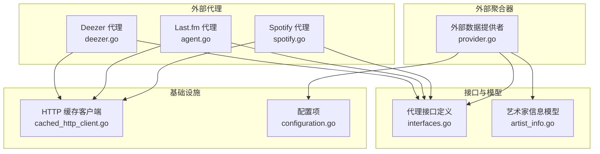
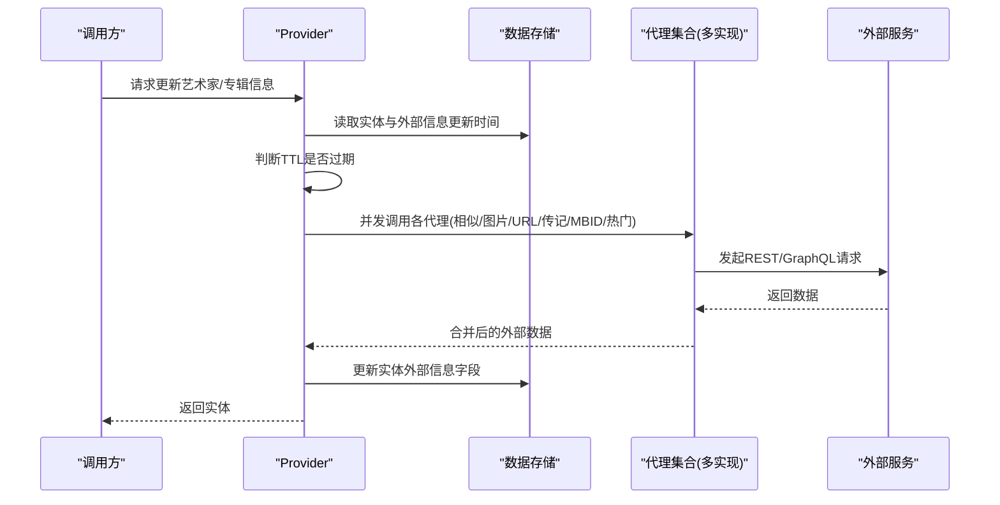
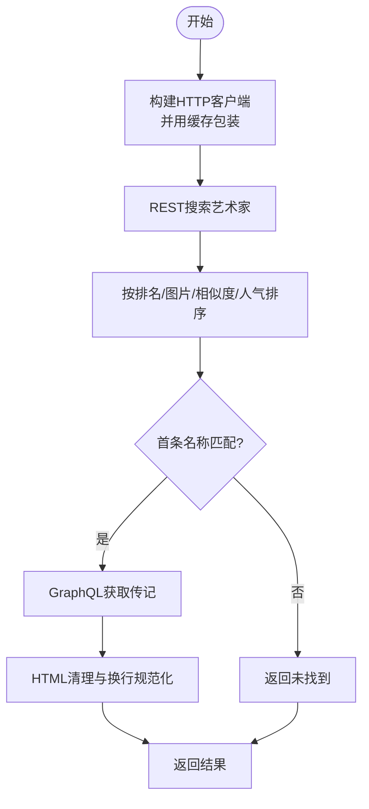
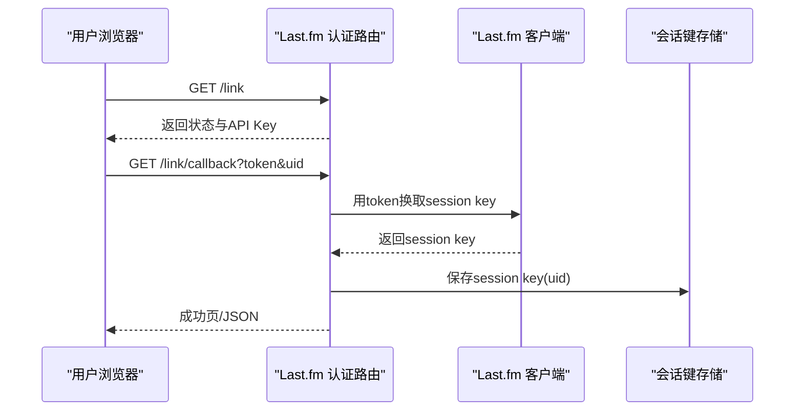
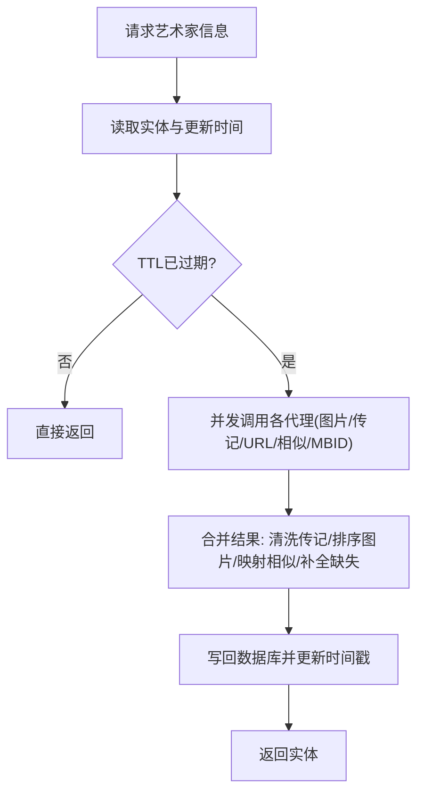
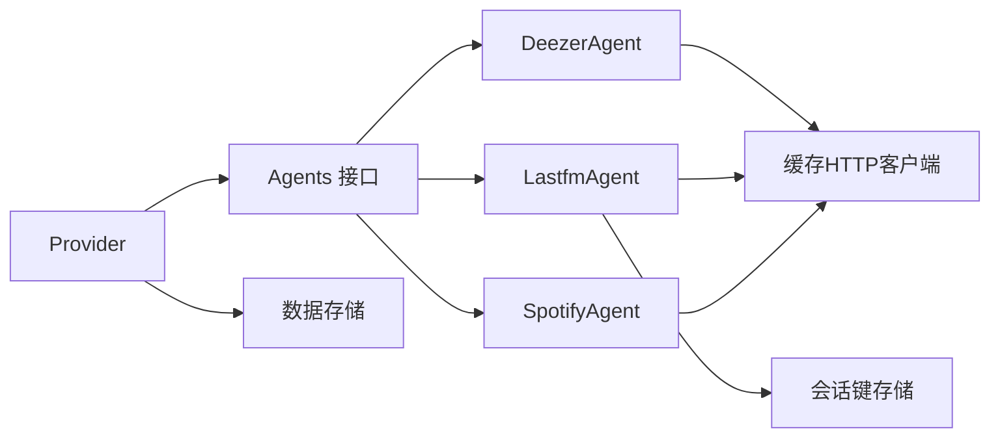

# 元数据增强

<cite>
**本文引用的文件**
- [deezer.go](file://core/agents/deezer/deezer.go)
- [client.go](file://core/agents/deezer/client.go)
- [provider.go](file://core/external/provider.go)
- [interfaces.go](file://core/agents/interfaces.go)
- [artist_info.go](file://model/artist_info.go)
- [agent.go](file://core/agents/lastfm/agent.go)
- [auth_router.go](file://core/agents/lastfm/auth_router.go)
- [spotify.go](file://core/agents/spotify/spotify.go)
- [cached_http_client.go](file://utils/cache/cached_http_client.go)
- [configuration.go](file://conf/configuration.go)
</cite>

## 目录
1. [简介](#简介)
2. [项目结构](#项目结构)
3. [核心组件](#核心组件)
4. [架构总览](#架构总览)
5. [详细组件分析](#详细组件分析)
6. [依赖关系分析](#依赖关系分析)
7. [性能与缓存特性](#性能与缓存特性)
8. [故障排除指南](#故障排除指南)
9. [结论](#结论)
10. [附录：配置与使用建议](#附录配置与使用建议)

## 简介
本文件系统性阐述 Navidrome 的“元数据增强”能力，重点覆盖通过外部服务（Deezer、Last.fm、Spotify）补充艺术家与专辑元数据的机制。内容涵盖：
- 外部数据提供者接口与调用流程
- 各代理（Agent）对 API 的封装与错误处理
- 艺术家信息模型与合并策略
- 缓存与并发刷新队列
- Last.fm 认证路由与会话键管理
- 实际代码示例路径（以文件+行号定位）
- 面向初学者的流程图解与面向高级用户的配置与排障建议

## 项目结构
围绕“元数据增强”的关键目录与文件：
- 核心代理层：core/agents/{deezer,lastfm,spotify}
- 外部数据聚合层：core/external/provider.go
- 接口与通用类型：core/agents/interfaces.go
- 模型定义：model/artist_info.go
- 缓存与 HTTP 客户端：utils/cache/cached_http_client.go
- 配置项：conf/configuration.go

图表来源
- [deezer.go](file://core/agents/deezer/deezer.go#L1-L160)
- [agent.go](file://core/agents/lastfm/agent.go#L1-L384)
- [spotify.go](file://core/agents/spotify/spotify.go#L1-L97)
- [provider.go](file://core/external/provider.go#L1-L734)
- [interfaces.go](file://core/agents/interfaces.go#L1-L85)
- [artist_info.go](file://model/artist_info.go#L1-L14)
- [cached_http_client.go](file://utils/cache/cached_http_client.go#L1-L111)
- [configuration.go](file://conf/configuration.go#L1-L200)

章节来源
- [deezer.go](file://core/agents/deezer/deezer.go#L1-L160)
- [agent.go](file://core/agents/lastfm/agent.go#L1-L384)
- [spotify.go](file://core/agents/spotify/spotify.go#L1-L97)
- [provider.go](file://core/external/provider.go#L1-L734)
- [interfaces.go](file://core/agents/interfaces.go#L1-L85)
- [artist_info.go](file://model/artist_info.go#L1-L14)
- [cached_http_client.go](file://utils/cache/cached_http_client.go#L1-L111)
- [configuration.go](file://conf/configuration.go#L1-L200)

## 核心组件
- 外部数据提供者接口：统一抽象各代理的能力，包括专辑信息、专辑图片、艺术家 MBID、URL、传记、相似艺术家、艺术家图片、热门歌曲等。
- 外部聚合器 Provider：负责从数据库读取实体，按需触发外部调用，合并返回值并持久化；支持后台刷新队列与 TTL 控制。
- 代理实现：
  - Deezer：基于 REST/GraphQL 获取艺术家图片、相似艺术家、热门歌曲与传记。
  - Last.fm：基于 REST 获取专辑信息/图片、艺术家 MBID/URL/传记、相似艺术家、热门歌曲；提供认证路由与会话键存储。
  - Spotify：基于 REST 搜索艺术家并排序，返回图片。
- 缓存与并发：HTTP 请求缓存、并发分组与后台刷新队列，提升吞吐与稳定性。

章节来源
- [interfaces.go](file://core/agents/interfaces.go#L1-L85)
- [provider.go](file://core/external/provider.go#L1-L734)
- [deezer.go](file://core/agents/deezer/deezer.go#L1-L160)
- [agent.go](file://core/agents/lastfm/agent.go#L1-L384)
- [spotify.go](file://core/agents/spotify/spotify.go#L1-L97)
- [cached_http_client.go](file://utils/cache/cached_http_client.go#L1-L111)

## 架构总览
外部数据增强的整体流程如下：
- 调用方请求艺术家/专辑信息更新
- Provider 根据 TTL 判断是否需要刷新
- 并发调用多个代理（errgroup），收集信息
- 将外部返回的图片按尺寸排序、传记清洗、相似艺术家映射到本地实体
- 写回数据库并记录更新时间戳

图表来源
- [provider.go](file://core/external/provider.go#L1-L734)
- [interfaces.go](file://core/agents/interfaces.go#L1-L85)

## 详细组件分析

### Deezer 代理：API 客户端与认证/速率限制
- 组件职责
  - 提供艺术家图片、相似艺术家、热门歌曲、传记等能力
  - 使用缓存 HTTP 客户端减少重复请求
  - 基于 REST 搜索艺术家，GraphQL 获取传记
- 关键实现要点
  - HTTP 客户端包装：在构造函数中创建带超时的 HTTP 客户端，并用缓存包装器包裹，统一 TTL。
  - REST 搜索与排序：按“排名+有无图片+名称相似度+人气”综合排序，确保首条匹配名称。
  - GraphQL 传记：通过 pipe 接口查询，设置语言头，解析响应并清理 HTML。
  - 错误处理：区分 NotFound 与其他错误，日志记录便于排障。
- 速率限制与重试
  - 未见显式限流器；通过缓存与并发控制降低压力；若外部限流，应结合上游策略调整并发与重试。

图表来源
- [deezer.go](file://core/agents/deezer/deezer.go#L1-L160)
- [client.go](file://core/agents/deezer/client.go#L1-L220)
- [cached_http_client.go](file://utils/cache/cached_http_client.go#L1-L111)

章节来源
- [deezer.go](file://core/agents/deezer/deezer.go#L1-L160)
- [client.go](file://core/agents/deezer/client.go#L1-L220)
- [cached_http_client.go](file://utils/cache/cached_http_client.go#L1-L111)

### Last.fm 代理：认证路由与 Scrobble
- 组件职责
  - 提供专辑信息/图片、艺术家 MBID/URL/传记、相似艺术家、热门歌曲
  - 提供认证路由，完成授权回调并保存用户会话键
  - 支持 NowPlaying 与 Scrobble（含错误分类与重试策略）
- 关键实现要点
  - 认证路由：暴露 /link、/link/callback、/link/unlink，回调中换取会话键并持久化
  - 会话键存储：使用 SessionKeys 结构，按用户 ID 存取
  - 错误处理：区分 Last.fm 特定错误码，决定重试或不可恢复
  - 图片抓取：解析艺术家页面 Open Graph 图像，过滤默认占位图
- 速率限制与重试
  - 未见显式限流；Scrobble 对特定错误码进行延迟重试，其他错误按策略处理

图表来源
- [auth_router.go](file://core/agents/lastfm/auth_router.go#L1-L133)
- [agent.go](file://core/agents/lastfm/agent.go#L1-L384)

章节来源
- [agent.go](file://core/agents/lastfm/agent.go#L1-L384)
- [auth_router.go](file://core/agents/lastfm/auth_router.go#L1-L133)

### Spotify 代理：搜索与图片选择
- 组件职责
  - 搜索艺术家并按“有无图片、名称相似度、人气”排序，返回图片列表
- 关键实现要点
  - 搜索参数与排序逻辑，确保优先返回高质量、匹配度高的结果
  - 名称严格匹配首条，否则视为未找到

章节来源
- [spotify.go](file://core/agents/spotify/spotify.go#L1-L97)

### 外部数据提供者 Provider：合并策略与缓存
- 组件职责
  - 统一入口：UpdateArtistInfo、UpdateAlbumInfo、ArtistImage、AlbumImage、TopSongs、ArtistRadio
  - 合并策略：
    - 传记：清洗 HTML、替换换行、添加外链目标
    - 图片：按尺寸降序，填充大中小图字段
    - 相似艺术家：先映射到本地实体，再按原始顺序补齐缺失项
    - 热门歌曲：优先按 MBID 匹配，其次按标题匹配，最后按评分/年份排序
  - 缓存与刷新：
    - TTL 过期后异步刷新，使用后台队列与超时控制
    - 并发分组限制，避免瞬时风暴
- 错误处理
  - 对 NotFound、Canceled、其他错误分别记录日志并返回空/错误

图表来源
- [provider.go](file://core/external/provider.go#L1-L734)

章节来源
- [provider.go](file://core/external/provider.go#L1-L734)

### 接口与模型：统一抽象与数据承载
- 接口抽象
  - AlbumInfoRetriever、AlbumImageRetriever、ArtistImageRetriever、ArtistBiographyRetriever、ArtistSimilarRetriever、ArtistTopSongsRetriever、ArtistURLRetriever、ArtistMBIDRetriever
  - 统一的 ExternalImage、Song、Artist 类型
- 艺术家信息模型
  - 承载 ID、名称、MBID、传记、图片尺寸字段、Last.fm URL、相似艺术家等

章节来源
- [interfaces.go](file://core/agents/interfaces.go#L1-L85)
- [artist_info.go](file://model/artist_info.go#L1-L14)

## 依赖关系分析
- Provider 依赖 Agents 接口集合，动态注册各代理实现
- 代理内部依赖缓存 HTTP 客户端，统一超时与缓存行为
- Last.fm 代理依赖会话键存储，用于 Scrobble 与 NowPlaying
- Provider 在加载相似艺术家时，先一次性查询本地数据库，再按顺序回填

图表来源
- [provider.go](file://core/external/provider.go#L1-L734)
- [interfaces.go](file://core/agents/interfaces.go#L1-L85)
- [cached_http_client.go](file://utils/cache/cached_http_client.go#L1-L111)
- [agent.go](file://core/agents/lastfm/agent.go#L1-L384)

章节来源
- [provider.go](file://core/external/provider.go#L1-L734)
- [interfaces.go](file://core/agents/interfaces.go#L1-L85)
- [cached_http_client.go](file://utils/cache/cached_http_client.go#L1-L111)
- [agent.go](file://core/agents/lastfm/agent.go#L1-L384)

## 性能与缓存特性
- HTTP 缓存
  - 缓存键由请求方法、URL、头部、可选 Body 序列化生成
  - TTL 默认来自构造参数，命中则直接复用响应
- 并发与限速
  - Provider 在填充艺术家信息时使用并发分组，限制同时请求数
  - 后台刷新队列采用固定延迟与超时，避免阻塞主流程
- TTL 与失效策略
  - 艺术家/专辑信息分别有独立 TTL，过期后触发后台刷新
  - 若上下文取消，提前退出并记录警告

章节来源
- [cached_http_client.go](file://utils/cache/cached_http_client.go#L1-L111)
- [provider.go](file://core/external/provider.go#L1-L734)
- [configuration.go](file://conf/configuration.go#L1-L200)

## 故障排除指南
- Deezer
  - 未找到：检查名称匹配与搜索限制；确认 GraphQL 语言头与 JWT 获取是否成功
  - 错误日志：查看 API 返回码与消息，必要时增加重试或降级
- Last.fm
  - 认证失败：确认回调参数 token/uid 是否完整；检查会话键保存是否成功
  - Scrobble 错误：根据错误码判断是否重试或不可恢复
- Spotify
  - 未找到：检查名称大小写与相似度阈值；适当提高搜索限制
- Provider
  - 相似艺术家为空：确认本地数据库中是否存在同名实体；检查映射逻辑
  - 热门歌曲为空：确认 MBID 与标题匹配策略；检查本地媒体文件过滤条件

章节来源
- [deezer.go](file://core/agents/deezer/deezer.go#L1-L160)
- [client.go](file://core/agents/deezer/client.go#L1-L220)
- [agent.go](file://core/agents/lastfm/agent.go#L1-L384)
- [auth_router.go](file://core/agents/lastfm/auth_router.go#L1-L133)
- [spotify.go](file://core/agents/spotify/spotify.go#L1-L97)
- [provider.go](file://core/external/provider.go#L1-L734)

## 结论
Navidrome 的元数据增强通过“接口抽象 + 多代理 + Provider 聚合 + 缓存与并发”的设计，在保证扩展性的同时兼顾性能与稳定性。Deezer、Last.fm、Spotify 各司其职，Provider 负责合并与持久化，形成闭环。对于外部服务不可用或限流场景，系统通过缓存、TTL、并发控制与错误分类提供了稳健的应对策略。

## 附录：配置与使用建议
- 启用外部服务
  - 在配置中启用对应代理与 API Key/Secret/ID
- TTL 与缓存
  - 调整艺术家/专辑信息 TTL，平衡新鲜度与请求压力
  - 保持缓存 TTL 与超时一致，避免过期风暴
- 日志与监控
  - 开启详细日志，关注外部调用耗时与错误码
  - 对 Last.fm Scrobble 错误进行分类统计，优化重试策略

章节来源
- [configuration.go](file://conf/configuration.go#L1-L200)
- [provider.go](file://core/external/provider.go#L1-L734)