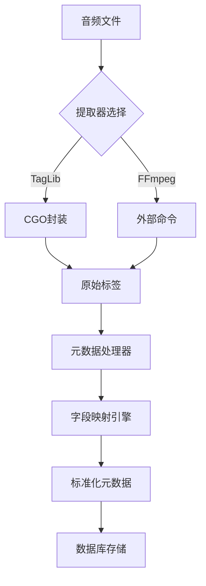
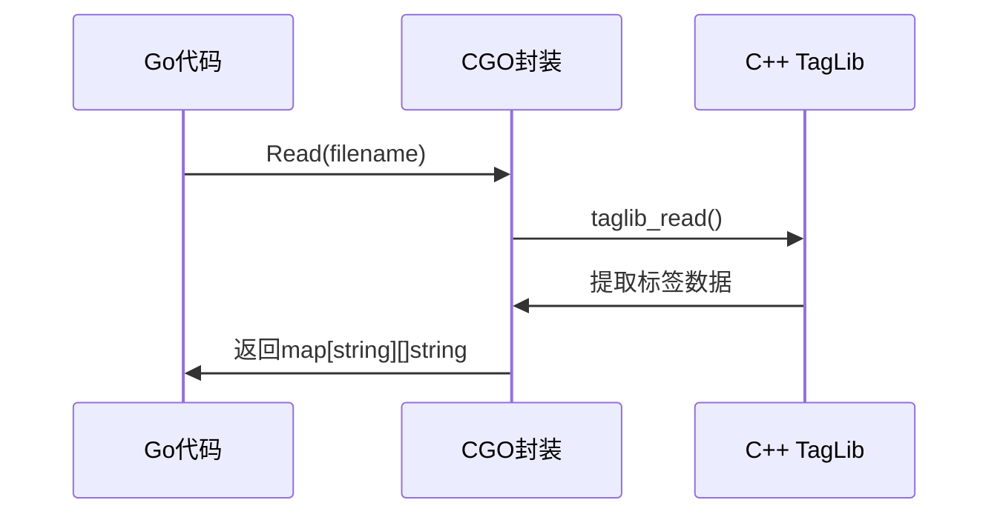
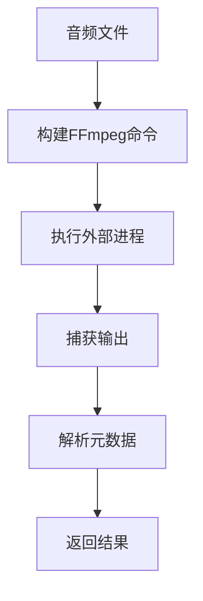
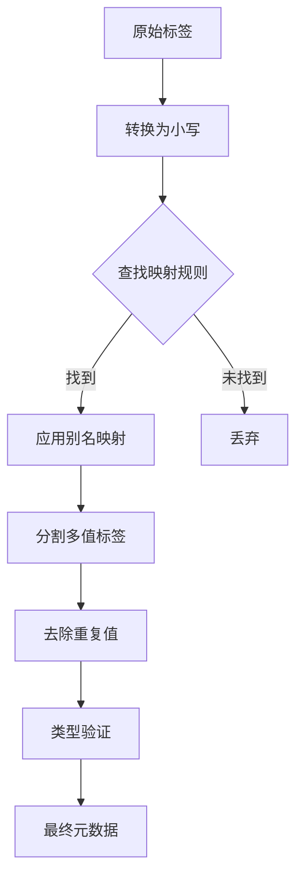

# 元数据提取

<cite>
**本文档引用的文件**
- [taglib.go](file://adapters/taglib/taglib.go)
- [taglib_wrapper.go](file://adapters/taglib/taglib_wrapper.go)
- [taglib_wrapper.cpp](file://adapters/taglib/taglib_wrapper.cpp)
- [taglib_wrapper.h](file://adapters/taglib/taglib_wrapper.h)
- [metadata.go](file://model/metadata/metadata.go)
- [tag.go](file://model/tag.go)
- [mappings.yaml](file://resources/mappings.yaml)
- [ffmpeg.go](file://core/ffmpeg/ffmpeg.go)
- [tag_mappings.go](file://model/tag_mappings.go)
</cite>

## 目录
1. [简介](#简介)
2. [元数据提取架构](#元数据提取架构)
3. [TagLib元数据提取机制](#taglib元数据提取机制)
4. [FFmpeg元数据提取机制](#ffmpeg元数据提取机制)
5. [元数据合并与字段映射](#元数据合并与字段映射)
6. [元数据优先级与自定义配置](#元数据优先级与自定义配置)
7. [性能优化与故障排除](#性能优化与故障排除)
8. [结论](#结论)

## 简介

Navidrome音乐库管理系统提供了两种主要的元数据提取途径：基于C++ TagLib库的本地提取和基于FFmpeg的外部工具提取。本文档详细解释了这两种机制的实现细节，包括TagLib的CGO封装、元数据合并策略、字段映射规则以及优先级配置。系统通过灵活的配置文件支持自定义标签映射，为用户提供了一套完整的元数据处理解决方案。

## 元数据提取架构

Navidrome的元数据提取系统采用模块化设计，通过适配器模式支持多种提取方式。系统核心由三个主要组件构成：提取器注册中心、元数据处理器和字段映射引擎。提取器注册中心管理TagLib和FFmpeg两种提取器，根据配置选择合适的实现。元数据处理器负责解析原始标签并应用清洗规则，而字段映射引擎则根据配置文件将不同格式的标签统一到标准字段。



**图源**
- [taglib.go](file://adapters/taglib/taglib.go)
- [ffmpeg.go](file://core/ffmpeg/ffmpeg.go)
- [metadata.go](file://model/metadata/metadata.go)

**节源**
- [taglib.go](file://adapters/taglib/taglib.go)
- [ffmpeg.go](file://core/ffmpeg/ffmpeg.go)

## TagLib元数据提取机制

### CGO封装实现

TagLib提取器通过CGO技术封装C++库，实现了高性能的本地元数据解析。`taglib_wrapper.go`文件定义了Go与C++之间的接口，使用`#cgo`指令配置编译参数，确保在不同平台上的兼容性。核心函数`Read`通过`taglib_read` C函数调用TagLib库，将提取的标签存储在Go映射中。



**图源**
- [taglib_wrapper.go](file://adapters/taglib/taglib_wrapper.go)
- [taglib_wrapper.cpp](file://adapters/taglib/taglib_wrapper.cpp)

### 标签解析流程

TagLib提取器首先通过`FileRef`类加载音频文件，然后提取基本音频属性（如比特率、采样率、声道数等）和标签信息。对于ID3v2.4格式，特别处理了TIPL（参与人员）帧，将其解析为标准化的角色标签。系统还支持M4A文件的iTunes特定标签，通过`goPutM4AStr`函数处理。

**节源**
- [taglib.go](file://adapters/taglib/taglib.go)
- [taglib_wrapper.cpp](file://adapters/taglib/taglib_wrapper.cpp)

## FFmpeg元数据提取机制

### 外部命令执行

FFmpeg提取器通过执行外部命令`ffmpeg -f ffmetadata`来提取元数据。`ffmpeg.go`文件中的`Probe`方法构建并执行命令，捕获输出结果。这种方式虽然性能略低于本地库，但支持更广泛的音频格式，且无需编译依赖。



**图源**
- [ffmpeg.go](file://core/ffmpeg/ffmpeg.go)

### 格式兼容性

FFmpeg提取器能够处理TagLib不支持的格式，如DSF、DSD等专业音频格式。通过`probeCmd`常量定义的命令模板，系统可以灵活配置FFmpeg参数。提取器还实现了错误恢复机制，当文件无法读取时会返回详细的错误信息。

**节源**
- [ffmpeg.go](file://core/ffmpeg/ffmpeg.go)

## 元数据合并与字段映射

### 标准化处理流程

元数据处理器`metadata.go`实现了复杂的标签清洗和标准化流程。系统首先将所有标签名转换为小写，然后根据`mappings.yaml`中的配置进行字段映射。对于多值标签，支持多种分隔符（如"/"、";"、","），并自动去除重复值。



**图源**
- [metadata.go](file://model/metadata/metadata.go)
- [tag_mappings.go](file://model/tag_mappings.go)

### 特殊标签处理

系统对特定类型的标签进行了特殊处理：
- **日期标签**：支持多种格式（YYYY、YYYY-MM、YYYY-MM-DD），自动提取年份
- **数值标签**：验证整数和浮点数格式，无效值将被丢弃
- **UUID标签**：验证MusicBrainz ID等UUID格式
- **配对标签**：如歌词和表演者，支持语言/角色标识

**节源**
- [metadata.go](file://model/metadata/metadata.go)

## 元数据优先级与自定义配置

### 映射配置文件

`mappings.yaml`文件定义了标签映射规则，包括主标签和附加标签。每个标签配置包含别名列表、类型、最大长度和分割规则。系统支持运行时重载配置，允许用户自定义标签映射而无需修改代码。

```yaml
main:
  title:
    aliases: [ tit2, title, ©nam, inam ]
  artist:
    aliases: [ tpe1, artist, ©art, author, iart ]
  genre:
    aliases: [ tcon, genre, ©gen, wm/genre, ignr ]
    split: [ ";", "/", "," ]
    album: true
```

### 优先级规则

当同一标签存在多个来源时，系统遵循以下优先级规则：
1. TagLib提取的标签优先于FFmpeg
2. 主标签优先于附加标签
3. 显式配置的别名优先于默认映射
4. 多值标签按配置的分割规则处理

**节源**
- [mappings.yaml](file://resources/mappings.yaml)
- [tag_mappings.go](file://model/tag_mappings.go)

## 性能优化与故障排除

### 性能建议

1. **选择合适的提取器**：对于大量文件，优先使用TagLib以获得最佳性能
2. **优化配置**：减少不必要的标签映射，提高处理速度
3. **批量处理**：利用系统内置的批量处理能力，减少I/O开销
4. **缓存策略**：合理配置缓存，避免重复解析

### 故障排除指南

常见问题及解决方案：
- **权限错误**：确保Navidrome有读取音频文件的权限
- **格式不支持**：检查文件扩展名是否在支持列表中
- **标签解析失败**：验证文件完整性，尝试使用FFmpeg提取器
- **编码问题**：处理非标准编码文件时，可能需要手动修复标签

**节源**
- [taglib.go](file://adapters/taglib/taglib.go)
- [ffmpeg.go](file://core/ffmpeg/ffmpeg.go)

## 结论

Navidrome的元数据提取系统通过双提取器架构提供了灵活性和可靠性。TagLib提供高性能的本地解析，而FFmpeg确保广泛的格式兼容性。系统的模块化设计和可配置的映射规则使其能够适应各种音乐库管理需求。通过合理的配置和优化，用户可以获得高效、准确的元数据提取体验。