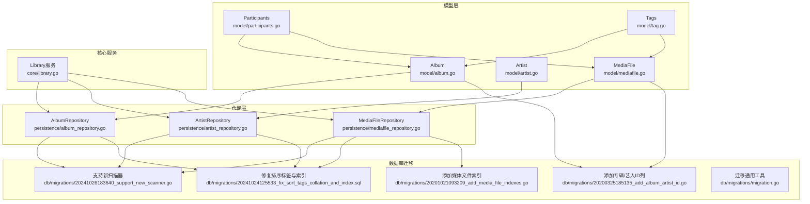
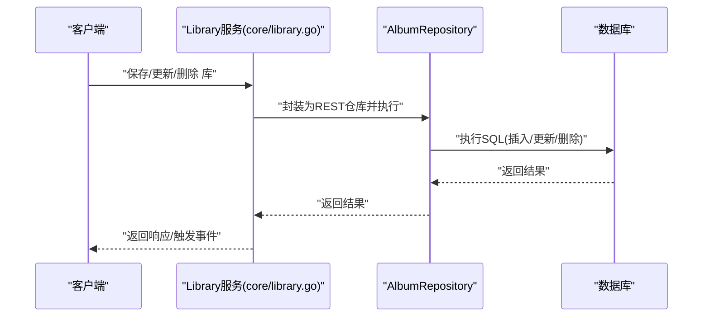
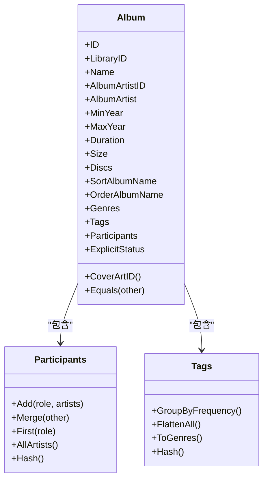
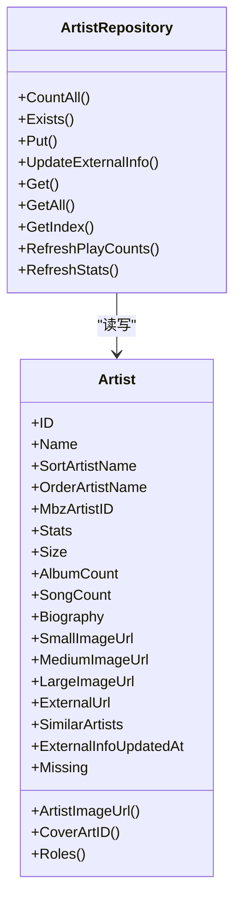
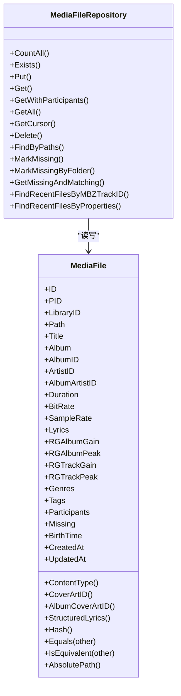
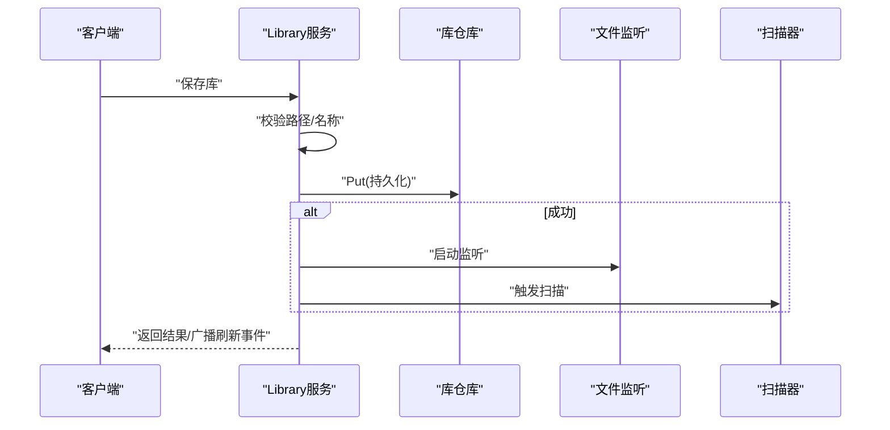
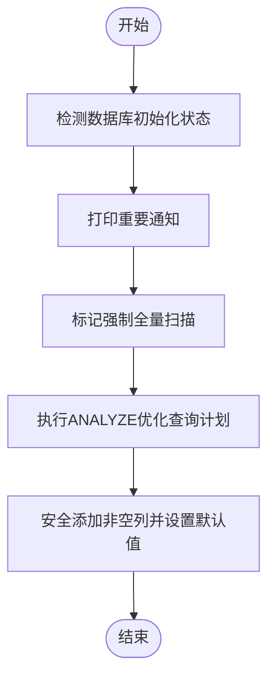
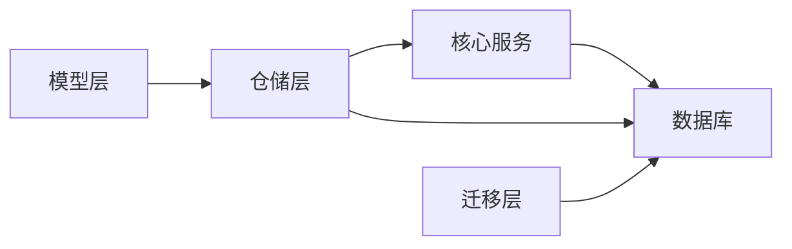

# 实体管理

<cite>
**本文引用的文件**
- [model/album.go](file://model/album.go)
- [model/artist.go](file://model/artist.go)
- [model/mediafile.go](file://model/mediafile.go)
- [model/participants.go](file://model/participants.go)
- [model/tag.go](file://model/tag.go)
- [core/library.go](file://core/library.go)
- [persistence/album_repository.go](file://persistence/album_repository.go)
- [persistence/artist_repository.go](file://persistence/artist_repository.go)
- [persistence/mediafile_repository.go](file://persistence/mediafile_repository.go)
- [db/migrations/migration.go](file://db/migrations/migration.go)
- [db/migrations/20241026183640_support_new_scanner.go](file://db/migrations/20241026183640_support_new_scanner.go)
- [db/migrations/20241024125533_fix_sort_tags_collation_and_index.sql](file://db/migrations/20241024125533_fix_sort_tags_collation_and_index.sql)
- [db/migrations/20201021093209_add_media_file_indexes.go](file://db/migrations/20201021093209_add_media_file_indexes.go)
- [db/migrations/20200325185135_add_album_artist_id.go](file://db/migrations/20200325185135_add_album_artist_id.go)
</cite>

## 目录
1. [简介](#简介)
2. [项目结构](#项目结构)
3. [核心组件](#核心组件)
4. [架构总览](#架构总览)
5. [详细组件分析](#详细组件分析)
6. [依赖关系分析](#依赖关系分析)
7. [性能考量](#性能考量)
8. [故障排查指南](#故障排查指南)
9. [结论](#结论)
10. [附录](#附录)

## 简介
本文件聚焦于实体管理功能，围绕专辑(Album)、艺术家(Artist)与媒体文件(MediaFile)三类核心实体，系统阐述其数据模型、业务规则、仓储层实现、数据库迁移与索引策略，并给出面向初学者的实体关系图解与面向高级用户的性能优化建议。读者可据此快速理解如何在Navidrome中进行实体的增删改查、参与艺术家管理、专辑封面处理、以及扫描与统计刷新等关键流程。

## 项目结构
- 模型层位于 model/，定义Album、Artist、MediaFile及其相关类型（如Participants、Tags）。
- 仓储层位于 persistence/，封装AlbumRepository、ArtistRepository、MediaFileRepository的CRUD与搜索逻辑。
- 核心服务位于 core/，例如Library服务负责库的用户授权、路径校验与仓库包装。
- 数据库迁移位于 db/migrations/，包含索引优化、表结构调整与多库支持等历史演进。

图表来源
- [model/album.go](file://model/album.go#L1-L145)
- [model/artist.go](file://model/artist.go#L1-L90)
- [model/mediafile.go](file://model/mediafile.go#L1-L378)
- [model/participants.go](file://model/participants.go#L1-L200)
- [model/tag.go](file://model/tag.go#L1-L258)
- [persistence/album_repository.go](file://persistence/album_repository.go#L1-L395)
- [persistence/artist_repository.go](file://persistence/artist_repository.go#L1-L564)
- [persistence/mediafile_repository.go](file://persistence/mediafile_repository.go#L1-L414)
- [core/library.go](file://core/library.go#L1-L408)
- [db/migrations/20241026183640_support_new_scanner.go](file://db/migrations/20241026183640_support_new_scanner.go#L44-L84)
- [db/migrations/20241024125533_fix_sort_tags_collation_and_index.sql](file://db/migrations/20241024125533_fix_sort_tags_collation_and_index.sql#L186-L379)
- [db/migrations/20201021093209_add_media_file_indexes.go](file://db/migrations/20201021093209_add_media_file_indexes.go#L1-L28)
- [db/migrations/20200325185135_add_album_artist_id.go](file://db/migrations/20200325185135_add_album_artist_id.go#L1-L35)
- [db/migrations/migration.go](file://db/migrations/migration.go#L1-L124)

章节来源
- [model/album.go](file://model/album.go#L1-L145)
- [model/artist.go](file://model/artist.go#L1-L90)
- [model/mediafile.go](file://model/mediafile.go#L1-L378)
- [persistence/album_repository.go](file://persistence/album_repository.go#L1-L395)
- [persistence/artist_repository.go](file://persistence/artist_repository.go#L1-L564)
- [persistence/mediafile_repository.go](file://persistence/mediafile_repository.go#L1-L414)
- [core/library.go](file://core/library.go#L1-L408)
- [db/migrations/migration.go](file://db/migrations/migration.go#L1-L124)

## 核心组件
- Album：专辑实体，包含名称、年份范围、时长、大小、参与艺术家、标签、流派、封面路径、外部元信息等；提供相等性比较、专辑级标签过滤、封面ID计算等能力。
- Artist：艺术家实体，包含名称、排序字段、MBID、统计信息（按角色聚合）、封面URL、相似艺术家、缺失标记等；提供封面URL选择、角色集合等能力。
- MediaFile：媒体文件实体，包含标题、专辑/艺人、时长、比特率、采样率、歌词、ReplayGain、参与艺术家、标签、缺失标记、绝对路径计算等；提供内容类型推断、封面ID计算、Hash比较、绝对路径拼接等能力。
- Participants：参与艺术家集合，按角色分组，支持去重合并、排序、哈希等。
- Tags：标签集合，支持频率分组、扁平化、哈希、流派转换等。

章节来源
- [model/album.go](file://model/album.go#L1-L145)
- [model/artist.go](file://model/artist.go#L1-L90)
- [model/mediafile.go](file://model/mediafile.go#L1-L378)
- [model/participants.go](file://model/participants.go#L1-L200)
- [model/tag.go](file://model/tag.go#L1-L258)

## 架构总览
实体管理贯穿“模型层—仓储层—核心服务—数据库迁移”的完整链路：
- 模型层定义实体与关系；
- 仓储层提供统一的CRUD、搜索、过滤、统计更新接口；
- 核心服务对库资源进行访问控制与事件广播；
- 迁移层保障Schema演进、索引优化与兼容性。

图表来源
- [core/library.go](file://core/library.go#L132-L276)
- [persistence/album_repository.go](file://persistence/album_repository.go#L188-L213)

章节来源
- [core/library.go](file://core/library.go#L132-L276)
- [persistence/album_repository.go](file://persistence/album_repository.go#L188-L213)

## 详细组件分析

### 专辑(Album)实体
- 字段要点
  - 基础属性：名称、年份范围、时长、大小、目录ID列表、是否合辑、评论、分类号、MBID等。
  - 排序与展示：sort_album_name、sort_album_artist_name、order_*系列字段。
  - 参与艺术家：Participants映射到专辑-艺术家关联表，支持多角色。
  - 标签与流派：Tags与Genres，专辑级标签过滤。
  - 外部元信息：描述、图片URL、外部链接、更新时间。
  - 封面ID：通过封面路径与专辑ID生成ArtworkID。
- 业务规则
  - 相等性比较忽略计算字段，使用哈希结构对比。
  - 专辑级标签仅保留映射中声明为专辑级别的标签。
  - 年份范围与日期采用“全部一致则取值，否则为空”的策略。
  - 合辑场景下，若存在多个专辑艺人且不一致，则显示“群星”。
- 专辑封面处理
  - 若媒体文件自带封面且启用特性开关，则优先使用媒体文件封面；否则回退到专辑封面。
  - 选择封面时优先低盘号，再按路径排序以保证一致性。
- 仓储接口
  - 提供CountAll、Exists、Put、UpdateExternalInfo、Get、GetAll、Touch、TouchByMissingFolder、GetTouchedAlbums、RefreshPlayCounts、CopyAttributes等方法。
  - 支持基于全文本、年份、艺人、评分、缺失状态、流派、库ID等过滤与排序。

图表来源
- [model/album.go](file://model/album.go#L1-L145)
- [model/participants.go](file://model/participants.go#L1-L200)
- [model/tag.go](file://model/tag.go#L1-L258)

章节来源
- [model/album.go](file://model/album.go#L1-L145)
- [persistence/album_repository.go](file://persistence/album_repository.go#L188-L395)

### 艺艺术家(Artist)实体
- 字段要点
  - 名称、排序字段、MBID、统计信息（按角色聚合：歌曲数、专辑数、大小）、封面URL、相似艺术家、缺失标记、创建/更新时间。
- 业务规则
  - 角色集合由统计字段推导。
  - 封面URL优先级：大图 > 中图 > 小图。
- 仓储接口
  - 提供CountAll、Exists、Put、UpdateExternalInfo、Get、GetAll、GetIndex等方法。
  - 支持按角色、库ID、缺失状态等过滤；支持按统计指标排序。

图表来源
- [model/artist.go](file://model/artist.go#L1-L90)
- [persistence/artist_repository.go](file://persistence/artist_repository.go#L1-L564)

章节来源
- [model/artist.go](file://model/artist.go#L1-L90)
- [persistence/artist_repository.go](file://persistence/artist_repository.go#L1-L564)

### 媒体文件(MediaFile)实体
- 字段要点
  - 标题、专辑/艺人、专辑ID、时长、比特率、采样率、歌词、ReplayGain、参与艺术家、标签、缺失标记、创建/更新时间等。
- 业务规则
  - 内容类型根据扩展名推断。
  - 封面ID优先使用媒体文件自带封面，否则回退到专辑封面。
  - Hash用于跨媒体文件比较，忽略标识字段；IsEquivalent仅按路径基名匹配。
  - 绝对路径拼接：基于库根路径与相对路径组合。
- 仓储接口
  - 提供CountAll、Exists、Put、Get、GetWithParticipants、GetAll、GetCursor、Delete、FindByPaths、MarkMissing、GetMissingAndMatching、FindRecentFilesByMBZTrackID、FindRecentFilesByProperties等方法。
  - 支持按路径、库ID、艺人ID、缺失状态、评分等过滤与排序。

图表来源
- [model/mediafile.go](file://model/mediafile.go#L1-L378)
- [persistence/mediafile_repository.go](file://persistence/mediafile_repository.go#L1-L414)

章节来源
- [model/mediafile.go](file://model/mediafile.go#L1-L378)
- [persistence/mediafile_repository.go](file://persistence/mediafile_repository.go#L1-L414)

### 参与艺术家与标签
- 参与艺术家
  - 角色体系：artist、albumartist、composer、conductor、lyricist、arranger、producer、director、engineer、mixer、remixer、djmixer、performer、maincredit等。
  - Participants按角色分组，支持去重合并、排序、哈希、提取所有艺人ID/名称等。
- 标签
  - 标签名常量覆盖专辑、标题、曲目、流派、编曲者、发行方、音乐识别ID等。
  - 支持频率分组、扁平化、哈希、流派转换等。

章节来源
- [model/participants.go](file://model/participants.go#L1-L200)
- [model/tag.go](file://model/tag.go#L1-L258)

### 核心服务：库管理
- 用户-库关联：获取/设置用户可访问的库，管理员自动拥有全部库权限。
- 库资源校验：名称与路径必填，路径必须为绝对路径且可访问，存储方案需有效。
- 仓库包装：对库实体进行REST封装，保存后启动监听与扫描，删除后清理并触发扫描。
- 错误映射：数据库唯一约束冲突映射为验证错误，未找到映射为资源不存在，权限不足映射为拒绝访问。

图表来源
- [core/library.go](file://core/library.go#L132-L276)

章节来源
- [core/library.go](file://core/library.go#L1-L408)

### 仓储层：AlbumRepository
- 查询与过滤
  - 全文检索、年份范围、艺人ID、评分、缺失、流派、库ID、角色ID等过滤器。
  - 排序映射：名称、艺人、专辑艺人、年份、随机、最近添加、收藏/评分等。
- 写入与更新
  - Put时记录导入时间，成功后同步参与者信息。
  - UpdateExternalInfo仅更新外部元信息字段。
- 扫描辅助
  - Touch/TouchByMissingFolder用于标记扫描进度。
  - GetTouchedAlbums按库筛选最近扫描期间被触达的专辑游标。
  - RefreshPlayCounts基于注解表聚合播放计数并写回。
- 搜索
  - 支持UUID直接匹配MBID或全文搜索。

章节来源
- [persistence/album_repository.go](file://persistence/album_repository.go#L1-L395)

### 仓储层：ArtistRepository
- 查询与过滤
  - 角色过滤、库ID过滤、缺失状态过滤。
  - 排序映射：名称、收藏/评分、歌曲数/专辑数/大小、主信用统计等。
- 写入与更新
  - Put时记录创建/更新时间。
  - UpdateExternalInfo更新生物、图片、相似艺术家、外部链接等。
- 统计与索引
  - RefreshStats按库统计各角色的专辑数、歌曲数、大小，并写入library_artist.stats。
  - GetIndex按首字母或配置分组返回索引。
- 清理
  - purgeEmpty删除无内容的空艺人。
  - markMissing根据专辑缺失状态反向标记艺人缺失。

章节来源
- [persistence/artist_repository.go](file://persistence/artist_repository.go#L1-L564)

### 仓储层：MediaFileRepository
- 查询与过滤
  - 路径、库ID、艺人ID、缺失、评分等过滤。
  - 排序映射：标题、艺人、专辑艺人、专辑、随机、最近添加、收藏/评分等。
- 写入与更新
  - Put按路径+库ID去重匹配，确保同一文件在同一库内唯一。
  - 更新参与者信息。
- 扫描辅助
  - MarkMissing/MarkMissingByFolder批量标记缺失。
  - GetMissingAndMatching返回缺失文件与其可能匹配集（按PID）。
  - FindRecentFilesByMBZTrackID/FindRecentFilesByProperties在其他库中查找近期新增的匹配文件。
- 搜索
  - 支持UUID直接匹配MBID或全文搜索。

章节来源
- [persistence/mediafile_repository.go](file://persistence/mediafile_repository.go#L1-L414)

### 数据库迁移与版本控制
- 迁移工具
  - notice：在初始化后打印重要提示。
  - forceFullRescan：强制全量扫描并运行ANALYZE优化查询计划。
  - createAddColumnFunc：安全地为现有行添加非空列并设置默认值。
- 关键迁移
  - 新扫描器支持：引入media_file_artists与album_artists关联表，建立角色与子角色，新增索引。
  - 排序标签与索引修复：调整排序字段与索引，增加collate NOCASE以提升大小写无关排序性能。
  - 添加媒体文件索引：为artist、album_artist、mbz_track_id等建立索引。
  - 添加专辑/艺人ID列：为album与media_file添加album_artist_id列并建立索引。
- 版本控制
  - 使用goose框架管理迁移版本，确保Schema演进与兼容性。

图表来源
- [db/migrations/migration.go](file://db/migrations/migration.go#L1-L124)

章节来源
- [db/migrations/migration.go](file://db/migrations/migration.go#L1-L124)
- [db/migrations/20241026183640_support_new_scanner.go](file://db/migrations/20241026183640_support_new_scanner.go#L44-L84)
- [db/migrations/20241024125533_fix_sort_tags_collation_and_index.sql](file://db/migrations/20241024125533_fix_sort_tags_collation_and_index.sql#L186-L379)
- [db/migrations/20201021093209_add_media_file_indexes.go](file://db/migrations/20201021093209_add_media_file_indexes.go#L1-L28)
- [db/migrations/20200325185135_add_album_artist_id.go](file://db/migrations/20200325185135_add_album_artist_id.go#L1-L35)

## 依赖关系分析
- 模型层
  - Album/Artist/MediaFile依赖Participants与Tags进行角色与标签管理。
  - Album与MediaFile均依赖封面ID生成函数，实现优先媒体文件封面、回退专辑封面的策略。
- 仓储层
  - AlbumRepository/ArtistRepository/MediaFileRepository分别封装Album/Artist/MediaFile的CRUD与搜索。
  - 通过PostScan/PostMapArgs序列化/反序列化复杂字段（如Discs、Participants、Tags、FolderIDs）。
  - 过滤器与排序映射统一了查询条件与排序逻辑。
- 核心服务
  - Library服务包装库仓库，负责路径校验、监听与扫描触发、事件广播。
- 迁移层
  - 通过索引与表结构调整，支撑大规模数据的高效查询与统计。

图表来源
- [model/album.go](file://model/album.go#L1-L145)
- [model/artist.go](file://model/artist.go#L1-L90)
- [model/mediafile.go](file://model/mediafile.go#L1-L378)
- [persistence/album_repository.go](file://persistence/album_repository.go#L1-L395)
- [persistence/artist_repository.go](file://persistence/artist_repository.go#L1-L564)
- [persistence/mediafile_repository.go](file://persistence/mediafile_repository.go#L1-L414)
- [core/library.go](file://core/library.go#L1-L408)
- [db/migrations/migration.go](file://db/migrations/migration.go#L1-L124)

章节来源
- [model/album.go](file://model/album.go#L1-L145)
- [model/artist.go](file://model/artist.go#L1-L90)
- [model/mediafile.go](file://model/mediafile.go#L1-L378)
- [persistence/album_repository.go](file://persistence/album_repository.go#L1-L395)
- [persistence/artist_repository.go](file://persistence/artist_repository.go#L1-L564)
- [persistence/mediafile_repository.go](file://persistence/mediafile_repository.go#L1-L414)
- [core/library.go](file://core/library.go#L1-L408)
- [db/migrations/migration.go](file://db/migrations/migration.go#L1-L124)

## 性能考量
- 查询优化
  - 利用索引：专辑/艺人/媒体文件的artist、album_artist、album_id、mbz_*等字段已建立索引，有助于加速过滤与排序。
  - 全文检索：Album/Artist/MediaFile均维护full_text字段，结合PostMapArgs在写入时构建，提升模糊搜索性能。
  - 排序映射：针对常用排序字段提供稳定排序表达式，避免复杂计算导致的性能下降。
- 统计与聚合
  - Album/Artist的播放计数与评分通过注解表聚合，减少重复扫描成本。
  - Artist统计按库聚合至library_artist.stats，支持按角色维度查询与排序。
- 缓存策略
  - 建议在应用层对高频查询结果（如索引、热门专辑、艺术家统计）进行短期缓存，降低数据库压力。
  - 对封面图片与外部元信息采用独立缓存与预热策略，减少I/O与网络开销。
- 批处理与分页
  - 删除缺失文件、标记缺失、统计刷新等操作采用分批处理，避免单次事务过大。
  - 游标查询（GetCursor/GetTouchedAlbums）提供稳定的分页体验，适合大数据量场景。

[本节为通用指导，无需列出具体文件来源]

## 故障排查指南
- 库路径校验失败
  - 现象：保存库时报路径无效/不可访问/不是目录。
  - 排查：确认路径为绝对路径、存在且可读；检查存储方案与权限。
  - 参考路径
    - [core/library.go](file://core/library.go#L331-L376)
- 唯一约束冲突
  - 现象：保存库时报名称或路径唯一冲突。
  - 排查：检查是否存在同名/同路径库；修改后重试。
  - 参考路径
    - [core/library.go](file://core/library.go#L280-L306)
- 扫描与统计异常
  - 现象：扫描后统计不更新或播放计数异常。
  - 排查：确认RefreshPlayCounts/RefreshStats执行成功；检查注解表与library_artist.stats是否正确更新。
  - 参考路径
    - [persistence/album_repository.go](file://persistence/album_repository.go#L320-L339)
    - [persistence/artist_repository.go](file://persistence/artist_repository.go#L347-L368)
- 封面与路径问题
  - 现象：封面不显示或路径拼接错误。
  - 排查：确认EnableMediaFileCoverArt开关与HasCoverArt标志；检查AbsoluteURL与LibraryPath配置。
  - 参考路径
    - [model/mediafile.go](file://model/mediafile.go#L160-L162)
    - [model/mediafile.go](file://model/mediafile.go#L104-L115)

章节来源
- [core/library.go](file://core/library.go#L280-L376)
- [persistence/album_repository.go](file://persistence/album_repository.go#L320-L339)
- [persistence/artist_repository.go](file://persistence/artist_repository.go#L347-L368)
- [model/mediafile.go](file://model/mediafile.go#L104-L162)

## 结论
本文件从模型、仓储、核心服务与迁移四个维度系统梳理了Navidrome的实体管理能力。Album/Artist/MediaFile三类核心实体通过Participants与Tags实现灵活的角色与标签管理；仓储层提供完善的CRUD、搜索与统计接口；核心服务保障库资源的安全访问与生命周期管理；迁移层持续优化索引与Schema以支撑高性能查询与统计。建议在生产环境中结合索引策略、缓存与批处理实践，进一步提升整体性能与稳定性。

[本节为总结性内容，无需列出具体文件来源]

## 附录
- 实际代码示例（以路径代替代码）
  - Album艺术图处理与回退逻辑
    - [model/mediafile.go](file://model/mediafile.go#L104-L115)
  - MediaFile绝对路径拼接
    - [model/mediafile.go](file://model/mediafile.go#L160-L162)
  - Album与MediaFile的Hash比较
    - [model/mediafile.go](file://model/mediafile.go#L135-L158)
  - Album标签过滤与专辑级标签
    - [model/album.go](file://model/album.go#L89-L110)
  - Album封面路径选择与优先级
    - [model/mediafile.go](file://model/mediafile.go#L117-L119)
    - [model/mediafile.go](file://model/mediafile.go#L313-L333)
  - AlbumRepository的Touch/TouchByMissingFolder
    - [persistence/album_repository.go](file://persistence/album_repository.go#L263-L292)
  - ArtistRepository的RefreshStats（按库统计）
    - [persistence/artist_repository.go](file://persistence/artist_repository.go#L370-L513)
  - MediaFileRepository的GetMissingAndMatching
    - [persistence/mediafile_repository.go](file://persistence/mediafile_repository.go#L300-L332)
  - 迁移：新增媒体文件索引
    - [db/migrations/20201021093209_add_media_file_indexes.go](file://db/migrations/20201021093209_add_media_file_indexes.go#L1-L28)
  - 迁移：修复排序标签与索引
    - [db/migrations/20241024125533_fix_sort_tags_collation_and_index.sql](file://db/migrations/20241024125533_fix_sort_tags_collation_and_index.sql#L186-L379)
  - 迁移：支持新扫描器（关联表与索引）
    - [db/migrations/20241026183640_support_new_scanner.go](file://db/migrations/20241026183640_support_new_scanner.go#L44-L84)
  - 迁移：添加专辑/艺人ID列
    - [db/migrations/20200325185135_add_album_artist_id.go](file://db/migrations/20200325185135_add_album_artist_id.go#L1-L35)