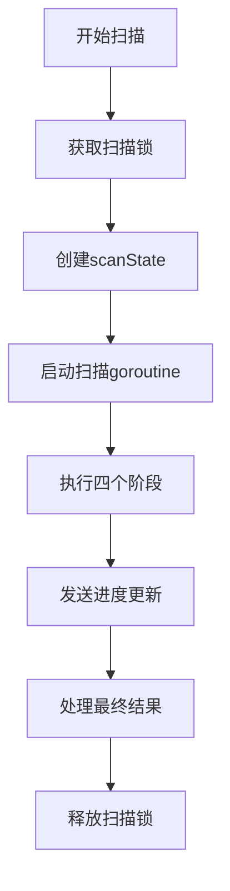
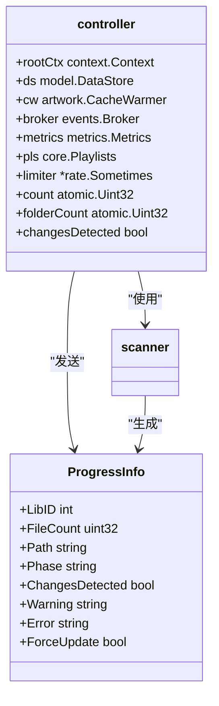
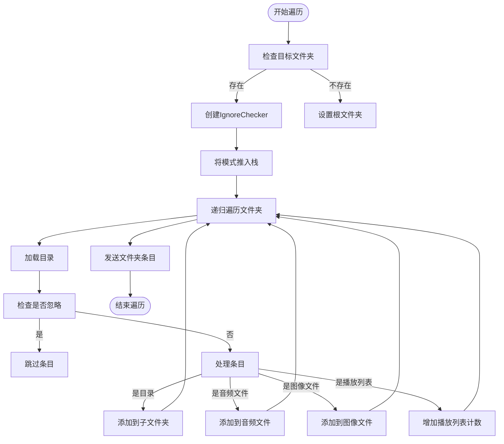
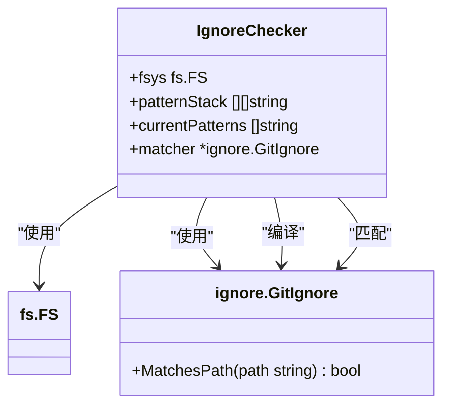
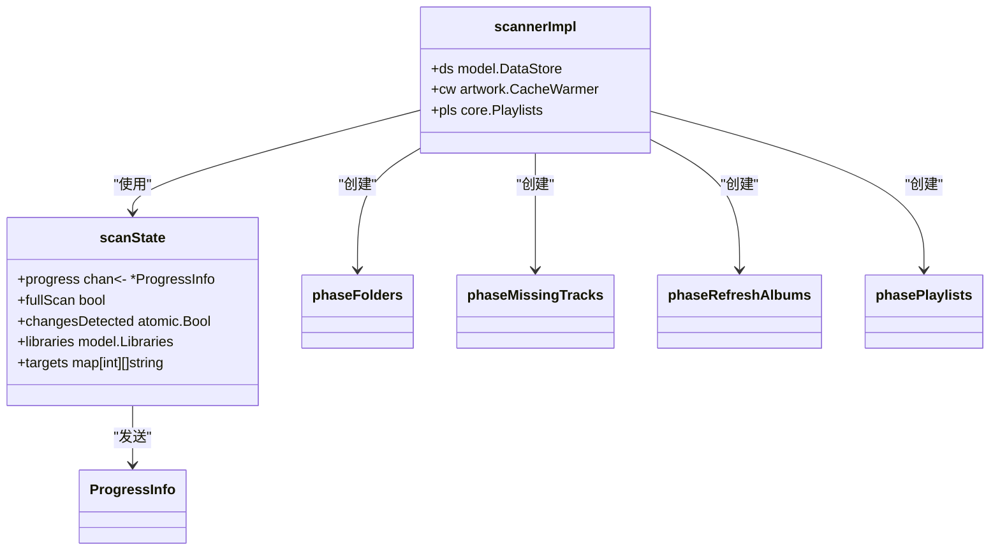
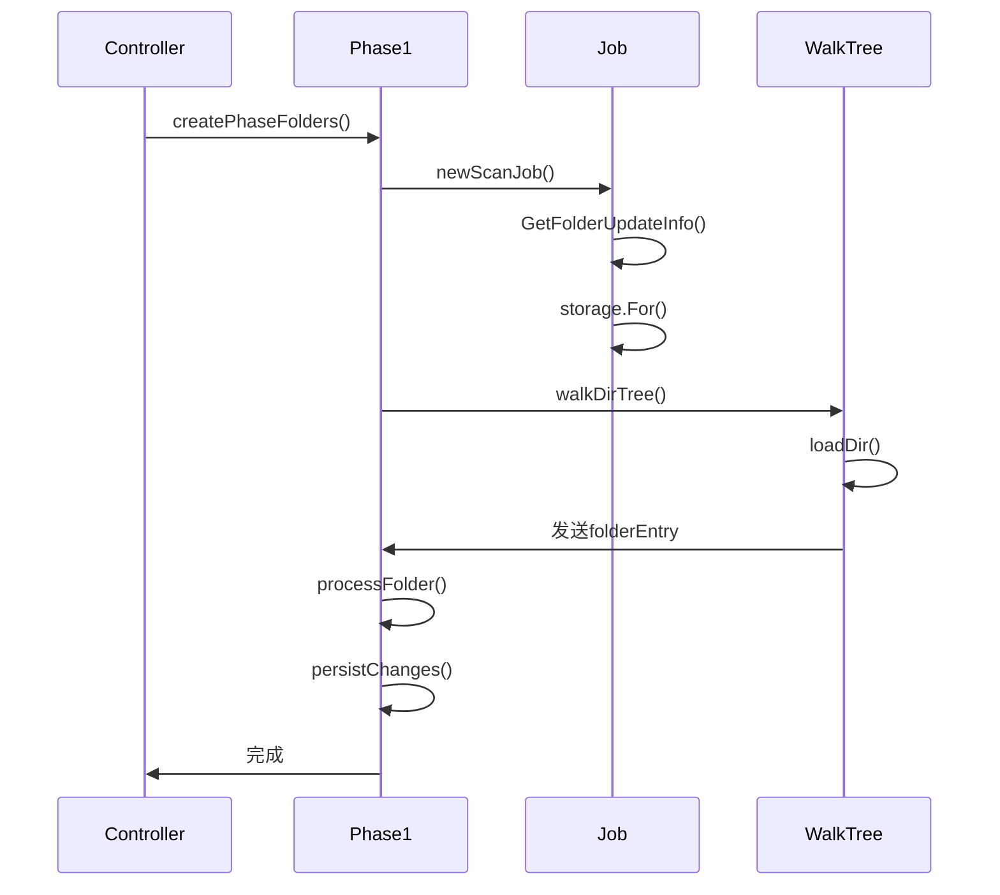
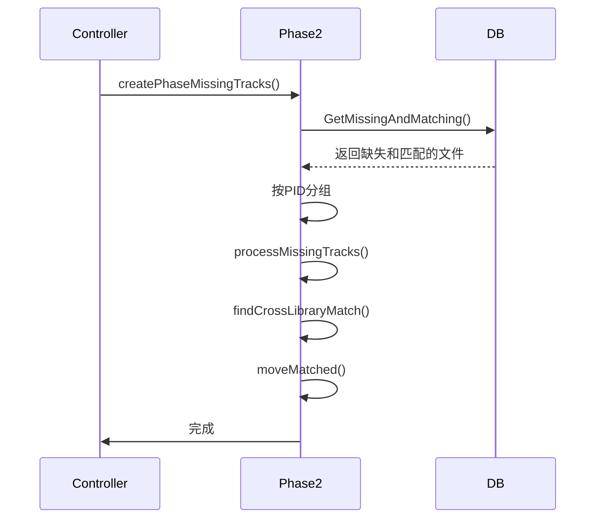
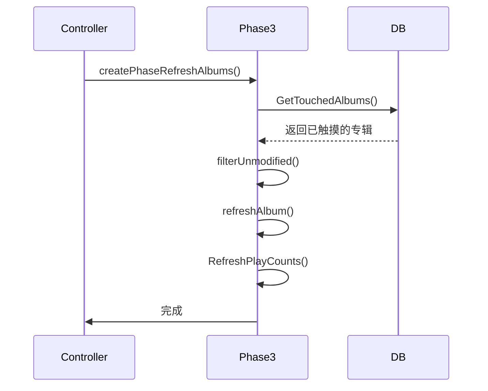
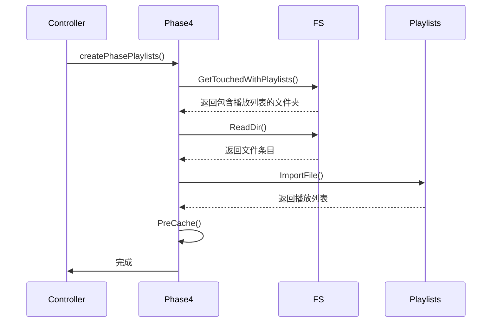
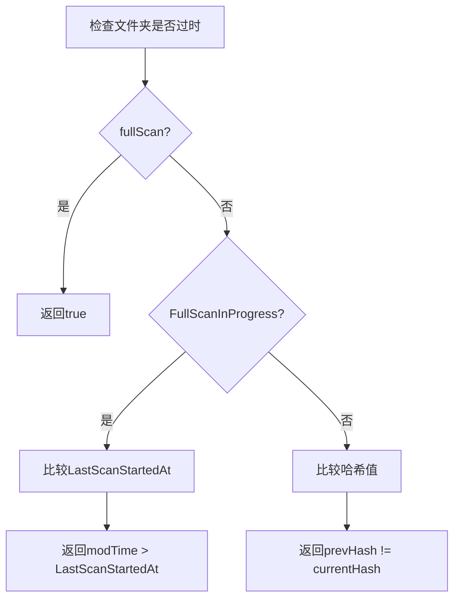

# 扫描流程

<cite>
**本文档引用的文件**   
- [controller.go](file://scanner/controller.go)
- [scanner.go](file://scanner/scanner.go)
- [phase_1_folders.go](file://scanner/phase_1_folders.go)
- [phase_2_missing_tracks.go](file://scanner/phase_2_missing_tracks.go)
- [phase_3_refresh_albums.go](file://scanner/phase_3_refresh_albums.go)
- [phase_4_playlists.go](file://scanner/phase_4_playlists.go)
- [walk_dir_tree.go](file://scanner/walk_dir_tree.go)
- [ignore_checker.go](file://scanner/ignore_checker.go)
- [folder_entry.go](file://scanner/folder_entry.go)
- [consts.go](file://consts/consts.go)
- [configuration.go](file://conf/configuration.go)
</cite>

## 目录
1. [扫描流程概述](#扫描流程概述)
2. [扫描器控制逻辑](#扫描器控制逻辑)
3. [文件系统遍历算法](#文件系统遍历算法)
4. [忽略规则匹配](#忽略规则匹配)
5. [扫描周期控制](#扫描周期控制)
6. [四个扫描阶段详解](#四个扫描阶段详解)
7. [增量扫描策略与性能优化](#增量扫描策略与性能优化)
8. [故障排除指南](#故障排除指南)

## 扫描流程概述

Navidrome的扫描流程是一个复杂的多阶段过程，旨在高效地同步音乐库与文件系统。该流程分为四个主要阶段：目录结构构建、缺失音轨处理、专辑信息刷新和播放列表处理。每个阶段都有特定的职责，共同确保音乐库的完整性和准确性。

扫描流程从`controller.go`中的`ScanFolders`方法开始，该方法负责协调整个扫描过程。它首先获取扫描锁以防止并发扫描，然后创建一个`scanState`对象来跟踪扫描状态。接着，它启动一个goroutine来执行实际的扫描工作，并通过`progress`通道接收进度信息。



**Diagram sources**
- [controller.go](file://scanner/controller.go#L202-L249)
- [scanner.go](file://scanner/scanner.go#L56-L184)

## 扫描器控制逻辑

扫描器的控制逻辑主要在`controller.go`文件中实现，它负责管理扫描的状态和并发处理。核心是`controller`结构体，它包含了一个原子布尔值`running`，用于确保同一时间只有一个扫描进程在运行。



**Diagram sources**
- [controller.go](file://scanner/controller.go#L94-L105)
- [controller.go](file://scanner/controller.go#L76-L85)

`ScanFolders`方法是扫描的入口点，它首先尝试获取扫描锁。如果另一个扫描已经在运行，它会返回`ErrAlreadyScanning`错误。一旦获得锁，它会创建一个上下文并启动扫描goroutine。这个设计确保了扫描操作的线程安全性。

## 文件系统遍历算法

文件系统遍历算法在`walk_dir_tree.go`文件中实现，它使用递归方法遍历目录树。核心函数是`walkDirTree`，它接受一个`scanJob`和目标文件夹列表，返回一个`folderEntry`通道。



**Diagram sources**
- [walk_dir_tree.go](file://scanner/walk_dir_tree.go#L18-L61)
- [walk_dir_tree.go](file://scanner/walk_dir_tree.go#L64-L91)

该算法使用`IgnoreChecker`来处理`.ndignore`文件，确保被忽略的文件和文件夹不会被处理。`loadDir`函数负责读取目录内容，并根据文件类型将其分类到不同的集合中。

## 忽略规则匹配

忽略规则匹配在`ignore_checker.go`文件中实现，它使用栈式方法管理`.ndignore`模式。`IgnoreChecker`结构体维护一个模式栈，当进入一个文件夹时，相关的`.ndignore`模式被推入栈中；当离开文件夹时，模式从栈中弹出。



**Diagram sources**
- [ignore_checker.go](file://scanner/ignore_checker.go#L18-L23)
- [ignore_checker.go](file://scanner/ignore_checker.go#L156-L163)

`ShouldIgnore`方法检查给定路径是否应被忽略，它使用编译后的`GitIgnore`匹配器来确定匹配结果。这种设计允许在遍历目录树时动态地应用忽略规则，确保只有相关的文件被处理。

## 扫描周期控制

扫描周期控制在`scanner.go`文件中实现，它定义了`scanState`结构体来跟踪扫描状态。`scanState`包含一个`progress`通道，用于发送进度信息，以及`fullScan`标志，用于指示是否执行完整扫描。



**Diagram sources**
- [scanner.go](file://scanner/scanner.go#L29-L36)
- [scanner.go](file://scanner/scanner.go#L23-L27)

`scanFolders`方法协调四个阶段的执行，使用`run.Sequentially`和`run.Parallel`函数来控制执行顺序。前两个阶段按顺序执行，而第三和第四阶段可以并行执行，以提高效率。

## 四个扫描阶段详解

### phase_1_folders（目录结构构建）

第一阶段负责构建目录结构并导入新或更新的文件。它从`phase_1_folders.go`文件中的`createPhaseFolders`函数开始，为每个库创建`scanJob`。



**Diagram sources**
- [phase_1_folders.go](file://scanner/phase_1_folders.go#L29-L50)
- [phase_1_folders.go](file://scanner/phase_1_folders.go#L137-L192)

该阶段使用`walkDirTree`遍历目录树，为每个文件夹创建`folderEntry`。然后，它比较文件夹的修改时间与数据库中的更新时间，以确定文件夹是否已过时。如果文件夹已过时，它会加载媒体文件的元数据并持久化更改。

### phase_2_missing_tracks（缺失音轨处理）

第二阶段处理标记为缺失的媒体文件，尝试找到它们的新位置。它从`phase_2_missing_tracks.go`文件中的`createPhaseMissingTracks`函数开始。



**Diagram sources**
- [phase_2_missing_tracks.go](file://scanner/phase_2_missing_tracks.go#L43-L50)
- [phase_2_missing_tracks.go](file://scanner/phase_2_missing_tracks.go#L56-L105)

该阶段首先从数据库加载所有缺失的媒体文件，然后按持久标识符(PID)分组。对于每个组，它尝试找到精确匹配或等效匹配。如果找到匹配，它会调用`moveMatched`函数来更新数据库中的文件位置。

### phase_3_refresh_albums（专辑信息刷新）

第三阶段刷新所有新或更改的专辑信息。它从`phase_3_refresh_albums.go`文件中的`createPhaseRefreshAlbums`函数开始。



**Diagram sources**
- [phase_3_refresh_albums.go](file://scanner/phase_3_refresh_albums.go#L35-L37)
- [phase_3_refresh_albums.go](file://scanner/phase_3_refresh_albums.go#L43-L68)

该阶段加载所有已触摸的专辑（即在第一阶段中创建或修改的专辑），然后过滤掉未修改的专辑。对于每个需要刷新的专辑，它从数据库中的媒体文件重新计算专辑信息，并更新数据库。

### phase_4_playlists（播放列表处理）

第四阶段导入和更新播放列表。它从`phase_4_playlists.go`文件中的`createPhasePlaylists`函数开始。



**Diagram sources**
- [phase_4_playlists.go](file://scanner/phase_4_playlists.go#L29-L37)
- [phase_4_playlists.go](file://scanner/phase_4_playlists.go#L43-L78)

该阶段首先检查`AutoImportPlaylists`配置是否启用，然后加载所有包含播放列表的已触摸文件夹。对于每个文件夹，它读取目录内容，找到有效的播放列表文件，并调用`ImportFile`函数来导入播放列表。

## 增量扫描策略与性能优化

Navidrome使用增量扫描策略来提高效率。在`folder_entry.go`文件中，`isOutdated`方法决定了一个文件夹是否需要被处理。



**Diagram sources**
- [folder_entry.go](file://scanner/folder_entry.go#L65-L70)
- [folder_entry.go](file://scanner/folder_entry.go#L84-L117)

性能优化技术包括：
1. 使用哈希值来快速比较文件夹内容
2. 并行执行第三和第四阶段
3. 使用事务批量更新数据库
4. 预缓存艺术作品以减少后续请求

## 故障排除指南

### 处理扫描中断

如果扫描过程中断，Navidrome会记录`LastScanErrorKey`属性。下次扫描时，它会检测到中断的完整扫描并自动执行完整扫描。

```go
// 在 scanner.go 中
if !state.fullScan {
    for _, lib := range state.libraries {
        if lib.FullScanInProgress {
            log.Info(ctx, "Scanner: Interrupted full scan detected", "lib", lib.Name)
            state.fullScan = true
            break
        }
    }
}
```

**Section sources**
- [scanner.go](file://scanner/scanner.go#L112-L126)

### 处理文件锁定问题

文件锁定问题通常发生在`walkDirTree`过程中。系统会记录警告并跳过无法访问的目录。

```go
// 在 walk_dir_tree.go 中
func isDirReadable(ctx context.Context, fsys fs.FS, dirPath string) bool {
    dir, err := fsys.Open(dirPath)
    if err != nil {
        log.Warn("Scanner: Skipping unreadable directory", "path", dirPath, err)
        return false
    }
    err = dir.Close()
    if err != nil {
        log.Warn(ctx, "Scanner: Error closing directory", "path", dirPath, err)
    }
    return true
}
```

**Section sources**
- [walk_dir_tree.go](file://scanner/walk_dir_tree.go#L216-L228)

### 配置相关问题

扫描器的配置在`conf/configuration.go`中定义，包括`FollowSymlinks`和`PurgeMissing`等选项。

```go
type scannerOptions struct {
    Enabled            bool
    Schedule           string
    WatcherWait        time.Duration
    ScanOnStartup      bool
    Extractor          string
    ArtistJoiner       string
    GenreSeparators    string
    GroupAlbumReleases bool
    FollowSymlinks     bool
    PurgeMissing       string
}
```

**Section sources**
- [configuration.go](file://conf/configuration.go#L139-L150)
- [consts.go](file://consts/consts.go#L118-L122)

这些配置允许用户根据需要调整扫描行为，例如是否跟随符号链接或如何处理缺失的文件。