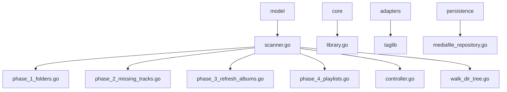
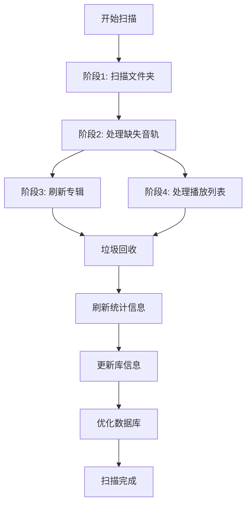
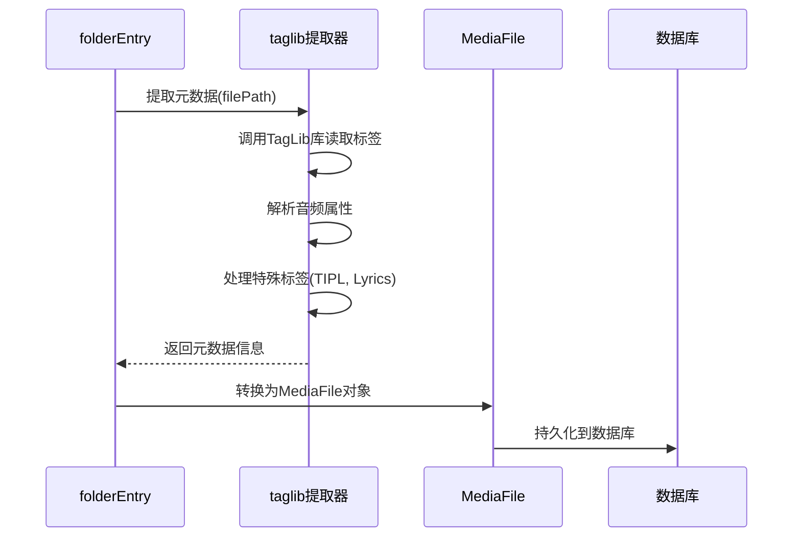
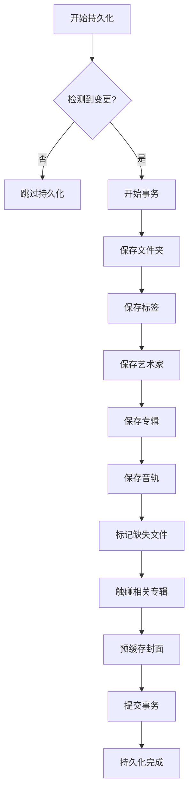
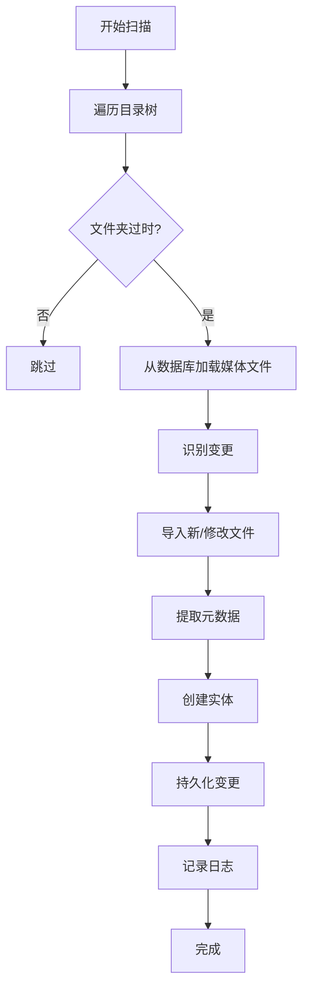
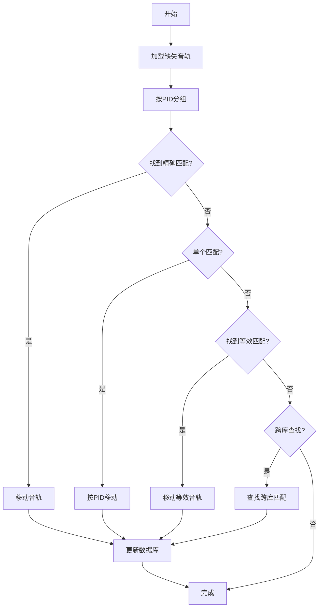
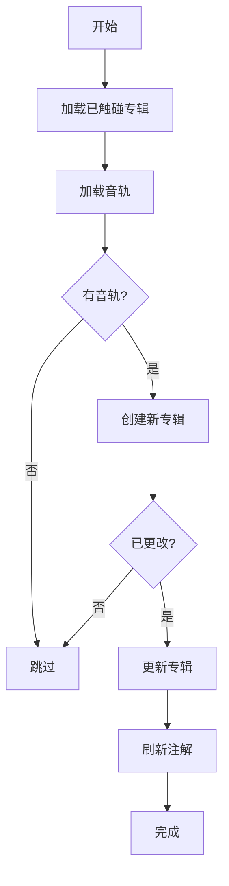
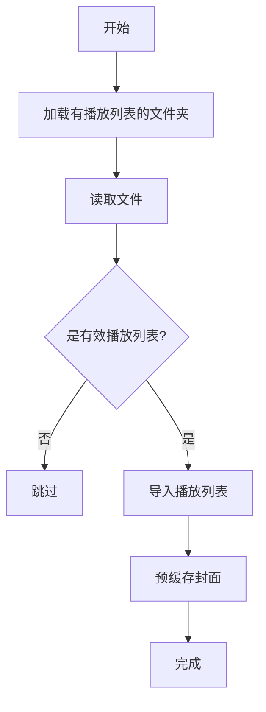
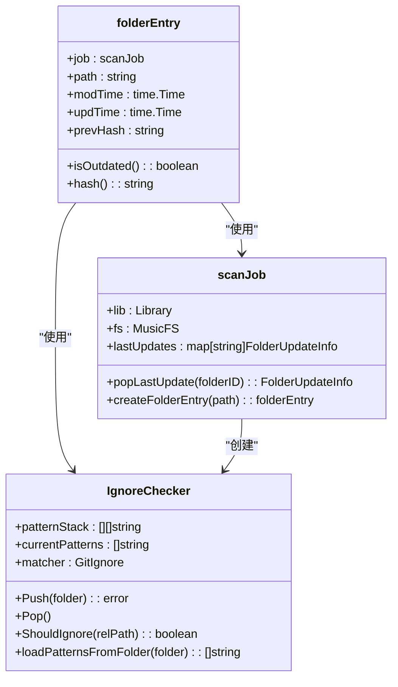
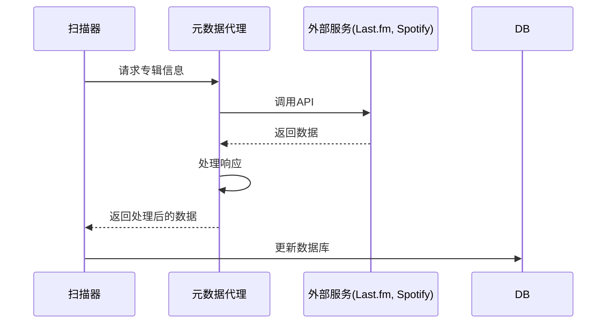

# 音乐库管理

<cite>
**本文档引用的文件**  
- [scanner.go](file://scanner/scanner.go)
- [controller.go](file://scanner/controller.go)
- [library.go](file://core/library.go)
- [taglib.go](file://adapters/taglib/taglib.go)
- [phase_1_folders.go](file://scanner/phase_1_folders.go)
- [phase_2_missing_tracks.go](file://scanner/phase_2_missing_tracks.go)
- [phase_3_refresh_albums.go](file://scanner/phase_3_refresh_albums.go)
- [phase_4_playlists.go](file://scanner/phase_4_playlists.go)
- [walk_dir_tree.go](file://scanner/walk_dir_tree.go)
- [folder_entry.go](file://scanner/folder_entry.go)
- [ignore_checker.go](file://scanner/ignore_checker.go)
- [scan.go](file://cmd/scan.go)
- [scanner.go](file://model/scanner.go)
</cite>

## 目录
1. [简介](#简介)
2. [项目结构](#项目结构)
3. [核心组件](#核心组件)
4. [扫描器架构](#扫描器架构)
5. [元数据提取流程](#元数据提取流程)
6. [数据库持久化机制](#数据库持久化机制)
7. [扫描阶段详解](#扫描阶段详解)
8. [增量更新策略](#增量更新策略)
9. [配置选项](#配置选项)
10. [外部服务集成](#外部服务集成)
11. [性能优化建议](#性能优化建议)
12. [故障排除指南](#故障排除指南)

## 简介
本文档详细介绍了音乐库管理系统的扫描器架构、元数据提取流程和数据库持久化机制。系统通过多阶段扫描流程，实现对音乐文件的自动发现、元数据解析和数据库更新。扫描器支持全量扫描和增量扫描两种模式，能够高效处理音乐库的变更。系统采用模块化设计，各组件职责清晰，便于维护和扩展。

## 项目结构
音乐库管理系统的项目结构清晰，各模块职责分明。核心功能分布在scanner、core、model、persistence等目录中。scanner目录包含扫描器的核心实现，core目录包含业务逻辑，model目录定义数据模型，persistence目录负责数据持久化。

**Diagram sources**
- [phase_1_folders.go](file://scanner/phase_1_folders.go)
- [phase_2_missing_tracks.go](file://scanner/phase_2_missing_tracks.go)
- [phase_3_refresh_albums.go](file://scanner/phase_3_refresh_albums.go)
- [phase_4_playlists.go](file://scanner/phase_4_playlists.go)
- [controller.go](file://scanner/controller.go)
- [walk_dir_tree.go](file://scanner/walk_dir_tree.go)
- [library.go](file://core/library.go)
- [scanner.go](file://model/scanner.go)

**Section sources**
- [phase_1_folders.go](file://scanner/phase_1_folders.go)
- [phase_2_missing_tracks.go](file://scanner/phase_2_missing_tracks.go)
- [phase_3_refresh_albums.go](file://scanner/phase_3_refresh_albums.go)
- [phase_4_playlists.go](file://scanner/phase_4_playlists.go)
- [controller.go](file://scanner/controller.go)
- [walk_dir_tree.go](file://scanner/walk_dir_tree.go)
- [library.go](file://core/library.go)
- [scanner.go](file://model/scanner.go)

## 核心组件
音乐库管理系统的核心组件包括扫描控制器、扫描器实现、文件遍历器、元数据提取器和数据库持久化层。这些组件协同工作，完成音乐库的管理和更新。

**Section sources**
- [controller.go](file://scanner/controller.go)
- [scanner.go](file://scanner/scanner.go)
- [walk_dir_tree.go](file://scanner/walk_dir_tree.go)
- [taglib.go](file://adapters/taglib/taglib.go)
- [mediafile_repository.go](file://persistence/mediafile_repository.go)

## 扫描器架构
音乐库扫描器采用分阶段处理架构，将扫描过程分解为多个独立的阶段，每个阶段专注于特定的任务。这种设计提高了代码的可维护性和可测试性，同时也便于性能优化。

**Diagram sources**
- [scanner.go](file://scanner/scanner.go)
- [phase_1_folders.go](file://scanner/phase_1_folders.go)
- [phase_2_missing_tracks.go](file://scanner/phase_2_missing_tracks.go)
- [phase_3_refresh_albums.go](file://scanner/phase_3_refresh_albums.go)
- [phase_4_playlists.go](file://scanner/phase_4_playlists.go)

## 元数据提取流程
元数据提取是音乐库管理系统的核心功能之一。系统通过适配器模式支持多种元数据提取方式，目前主要使用taglib适配器。

**Diagram sources**
- [folder_entry.go](file://scanner/folder_entry.go)
- [taglib.go](file://adapters/taglib/taglib.go)
- [phase_1_folders.go](file://scanner/phase_1_folders.go)

## 数据库持久化机制
系统采用分层持久化机制，确保数据的一致性和完整性。每个扫描阶段都有明确的数据持久化策略。

**Diagram sources**
- [phase_1_folders.go](file://scanner/phase_1_folders.go)
- [mediafile_repository.go](file://persistence/mediafile_repository.go)
- [folder_repository.go](file://persistence/folder_repository.go)

## 扫描阶段详解
音乐库扫描过程分为四个主要阶段，每个阶段都有特定的职责和处理逻辑。

### 阶段1: 文件夹扫描 (phase_1_folders)
第一阶段负责遍历文件系统，发现新的或已修改的音乐文件。

**Diagram sources**
- [phase_1_folders.go](file://scanner/phase_1_folders.go)
- [walk_dir_tree.go](file://scanner/walk_dir_tree.go)

### 阶段2: 处理缺失音轨 (phase_2_missing_tracks)
第二阶段处理被标记为缺失的音轨，尝试找到它们的新位置。

**Diagram sources**
- [phase_2_missing_tracks.go](file://scanner/phase_2_missing_tracks.go)

### 阶段3: 刷新专辑 (phase_3_refresh_albums)
第三阶段刷新所有新或已更改的专辑信息。

**Diagram sources**
- [phase_3_refresh_albums.go](file://scanner/phase_3_refresh_albums.go)

### 阶段4: 处理播放列表 (phase_4_playlists)
第四阶段导入和更新播放列表。

**Diagram sources**
- [phase_4_playlists.go](file://scanner/phase_4_playlists.go)

## 增量更新策略
系统采用智能的增量更新策略，只处理发生变化的文件和目录，大大提高了扫描效率。

**Diagram sources**
- [folder_entry.go](file://scanner/folder_entry.go)
- [scanJob.go](file://scanner/phase_1_folders.go)
- [ignore_checker.go](file://scanner/ignore_checker.go)

## 配置选项
系统提供多种配置选项，以满足不同用户的需求。

| 配置项 | 默认值 | 描述 |
|--------|--------|------|
| Scanner.FullScanInterval | 7天 | 全量扫描间隔 |
| Scanner.PurgeMissing | never | 缺失项清理策略 |
| Scanner.FollowSymlinks | false | 是否跟踪符号链接 |
| AutoImportPlaylists | true | 是否自动导入播放列表 |
| Scanner.Threads | 4 | 扫描线程数 |

**Section sources**
- [conf.go](file://conf/configuration.go)

## 外部服务集成
系统支持与外部元数据服务集成，丰富音乐信息。

**Diagram sources**
- [agents.go](file://core/agents/agents.go)

## 性能优化建议
为了获得最佳性能，建议采取以下措施：

1. **合理设置扫描间隔**：根据音乐库的更新频率设置合适的扫描间隔
2. **使用SSD存储**：将音乐文件存储在SSD上，提高I/O性能
3. **增加扫描线程**：在多核CPU上增加扫描线程数
4. **定期优化数据库**：定期执行数据库优化操作
5. **避免深层目录结构**：尽量使用扁平化的目录结构

## 故障排除指南
遇到问题时，可以参考以下排查步骤：

1. **检查日志文件**：查看详细的错误信息
2. **验证文件权限**：确保应用程序有读取音乐文件的权限
3. **检查配置文件**：确认配置项设置正确
4. **测试网络连接**：如果使用外部服务，确保网络连接正常
5. **重启服务**：有时简单的重启可以解决临时问题

**Section sources**
- [log.go](file://log/log.go)
- [conf.go](file://conf/configuration.go)