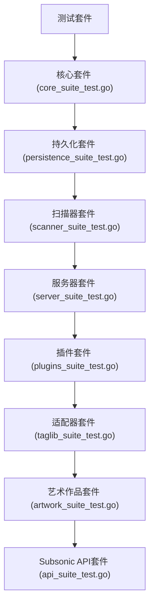
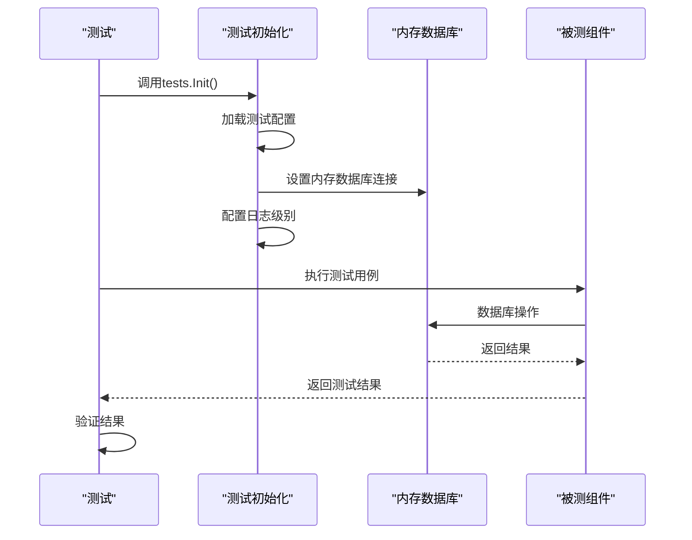
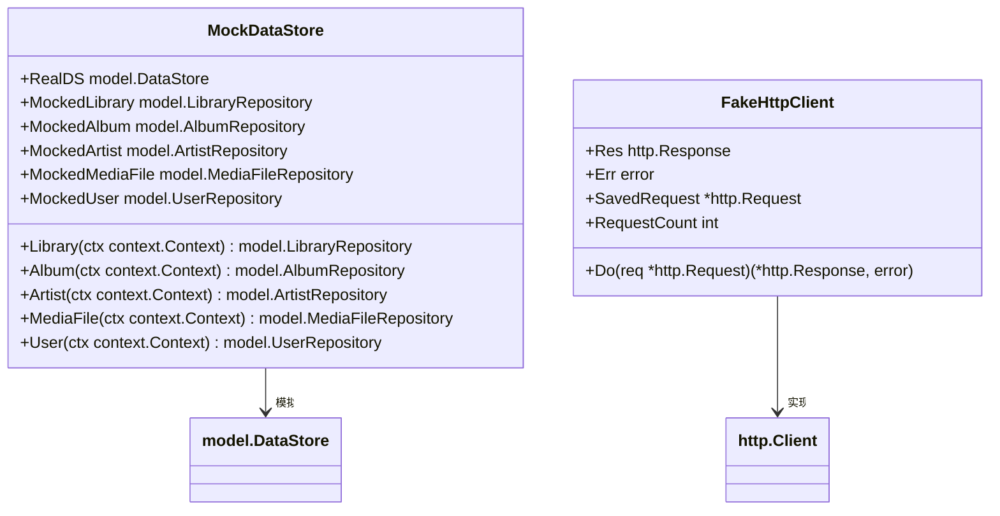

# 测试策略

<cite>
**本文档引用的文件**
- [init_tests.go](file://tests/init_tests.go)
- [test_helpers.go](file://tests/test_helpers.go)
- [core_suite_test.go](file://core/core_suite_test.go)
- [persistence_suite_test.go](file://persistence/persistence_suite_test.go)
- [scanner_suite_test.go](file://scanner/scanner_suite_test.go)
- [server_suite_test.go](file://server/server_suite_test.go)
- [plugins_suite_test.go](file://plugins/plugins_suite_test.go)
- [taglib_suite_test.go](file://adapters/taglib/taglib_suite_test.go)
- [artwork_suite_test.go](file://core/artwork/artwork_suite_test.go)
- [api_suite_test.go](file://server/subsonic/api_suite_test.go)
- [mock_data_store.go](file://tests/mock_data_store.go)
- [fake_http_client.go](file://tests/fake_http_client.go)
- [go.mod](file://go.mod)
- [Makefile](file://Makefile)
</cite>

## 目录
1. [介绍](#介绍)
2. [测试组织结构](#测试组织结构)
3. [单元测试](#单元测试)
4. [集成测试](#集成测试)
5. [端到端测试](#端到端测试)
6. [测试运行方法](#测试运行方法)
7. [测试覆盖率与质量保证](#测试覆盖率与质量保证)
8. [新功能测试用例编写](#新功能测试用例编写)
9. [测试数据管理与模拟对象](#测试数据管理与模拟对象)
10. [测试调试技巧](#测试调试技巧)
11. [性能测试指南](#性能测试指南)

## 介绍
Navidrome采用全面的测试策略来确保代码质量和系统稳定性。本测试策略文档详细描述了项目的测试框架、组织结构和实施方法。项目使用Ginkgo和Gomega作为主要的测试框架，通过分层测试策略覆盖从单元测试到端到端测试的各个层面。测试套件被组织成多个独立的测试套件，每个核心组件都有对应的测试套件，确保代码的可维护性和可测试性。

**Section sources**
- [init_tests.go](file://tests/init_tests.go#L1-L34)
- [test_helpers.go](file://tests/test_helpers.go#L1-L61)

## 测试组织结构
Navidrome的测试套件采用模块化组织结构，每个主要组件都有独立的测试套件。测试文件遵循`_suite_test.go`命名约定，用于定义测试套件的初始化和配置。项目中的测试套件包括核心功能测试、持久化测试、扫描器测试、服务器测试和插件测试等。这种组织方式使得测试可以按组件独立运行，提高了测试的可维护性和执行效率。

**Diagram sources**
- [core_suite_test.go](file://core/core_suite_test.go#L1-L18)
- [persistence_suite_test.go](file://persistence/persistence_suite_test.go#L1-L272)
- [scanner_suite_test.go](file://scanner/scanner_suite_test.go#L1-L27)
- [server_suite_test.go](file://server/server_suite_test.go#L1-L18)
- [plugins_suite_test.go](file://plugins/plugins_suite_test.go#L1-L33)
- [taglib_suite_test.go](file://adapters/taglib/taglib_suite_test.go#L1-L18)
- [artwork_suite_test.go](file://core/artwork/artwork_suite_test.go#L1-L18)
- [api_suite_test.go](file://server/subsonic/api_suite_test.go#L1-L18)

**Section sources**
- [core_suite_test.go](file://core/core_suite_test.go#L1-L18)
- [persistence_suite_test.go](file://persistence/persistence_suite_test.go#L1-L272)
- [scanner_suite_test.go](file://scanner/scanner_suite_test.go#L1-L27)

## 单元测试
Navidrome的单元测试专注于验证单个函数或方法的正确性。每个单元测试都设计为隔离测试，通过模拟依赖项来确保测试的独立性和可重复性。测试使用Ginkgo的Describe、Context和It块来组织测试用例，提供清晰的测试结构和可读性。单元测试通常在测试套件初始化时设置最低日志级别，以减少测试输出的噪音。

**Section sources**
- [core_suite_test.go](file://core/core_suite_test.go#L12-L17)
- [artwork_suite_test.go](file://core/artwork/artwork_suite_test.go#L12-L17)
- [api_suite_test.go](file://server/subsonic/api_suite_test.go#L12-L17)

## 集成测试
集成测试用于验证多个组件之间的交互和集成。Navidrome的集成测试通过初始化完整的测试环境来模拟真实场景，包括数据库连接和配置加载。`persistence_suite_test.go`文件中的测试套件展示了如何设置内存数据库并初始化测试数据，以验证数据持久化层的正确性。集成测试还使用`goleak`库来检测goroutine泄漏，确保资源的正确管理。

**Diagram sources**
- [persistence_suite_test.go](file://persistence/persistence_suite_test.go#L21-L272)
- [scanner_suite_test.go](file://scanner/scanner_suite_test.go#L15-L27)

**Section sources**
- [persistence_suite_test.go](file://persistence/persistence_suite_test.go#L21-L272)
- [scanner_suite_test.go](file://scanner/scanner_suite_test.go#L15-L27)

## 端到端测试
端到端测试验证Navidrome系统的整体行为，从API请求到数据库交互的完整流程。服务器测试套件(`server_suite_test.go`)负责验证HTTP服务器的正确性，包括路由、中间件和API端点。插件测试套件(`plugins_suite_test.go`)在运行测试前会自动构建测试插件，确保插件系统的完整性和兼容性。这些测试模拟真实用户场景，确保系统在集成环境下的正确行为。

**Section sources**
- [server_suite_test.go](file://server/server_suite_test.go#L12-L17)
- [plugins_suite_test.go](file://plugins/plugins_suite_test.go#L15-L33)

## 测试运行方法
Navidrome提供了多种测试运行方法，通过Makefile中的目标进行管理。开发者可以使用`make test`运行所有Go测试，使用`make test-race`运行带竞态检测的测试，或使用`make watch`在代码更改时自动重新运行测试。测试配置通过`tests.Init()`函数进行初始化，该函数负责加载测试配置文件并设置测试环境。测试可以使用`testing.Short()`标记来跳过耗时较长的测试。

**Section sources**
- [init_tests.go](file://tests/init_tests.go#L16-L33)
- [Makefile](file://Makefile#L48-L57)

## 测试覆盖率与质量保证
Navidrome通过严格的测试覆盖率目标和质量保证流程来确保代码质量。项目使用golangci-lint进行代码静态分析，确保代码风格和质量的一致性。测试套件的设计确保了核心功能的高覆盖率，特别是数据持久化和API接口等关键组件。质量保证流程包括预提交钩子，自动运行lint和测试，确保代码在提交前符合质量标准。

**Section sources**
- [Makefile](file://Makefile#L68-L94)
- [go.mod](file://go.mod#L7-L147)

## 新功能测试用例编写
为新功能编写测试用例时，应遵循Navidrome的测试模式。首先创建对应的测试文件，然后在适当的测试套件中添加新的测试用例。测试应使用Ginkgo的BDD风格语法，提供清晰的测试描述。对于涉及外部依赖的功能，应使用模拟对象来隔离测试。测试数据应通过`tests.TempFileName()`和`tests.TempFile()`等辅助函数创建，确保测试的独立性和可重复性。

**Section sources**
- [test_helpers.go](file://tests/test_helpers.go#L19-L27)
- [init_tests.go](file://tests/init_tests.go#L16-L33)

## 测试数据管理与模拟对象
Navidrome提供了丰富的测试数据管理和模拟对象支持。`mock_data_store.go`文件定义了`MockDataStore`结构，用于模拟数据存储层，允许在不依赖真实数据库的情况下测试业务逻辑。测试助手函数如`ClearDB()`用于重置测试数据库，确保测试之间的隔离性。对于HTTP客户端等外部依赖，项目提供了`FakeHttpClient`等模拟对象，可以精确控制测试场景和验证请求。

**Diagram sources**
- [mock_data_store.go](file://tests/mock_data_store.go#L10-L284)
- [fake_http_client.go](file://tests/fake_http_client.go#L5-L20)

**Section sources**
- [mock_data_store.go](file://tests/mock_data_store.go#L10-L284)
- [fake_http_client.go](file://tests/fake_http_client.go#L5-L20)
- [test_helpers.go](file://tests/test_helpers.go#L30-L40)

## 测试调试技巧
调试Navidrome测试时，可以使用`LogHook()`函数捕获和验证日志输出。通过设置环境变量`NOLOG=1`可以减少测试输出的噪音，只显示错误级别的日志。对于goroutine泄漏问题，可以使用`goleak`库进行检测。测试中的临时文件和目录会自动清理，但可以通过检查`TempDir()`的使用来确保资源的正确管理。使用Ginkgo的`--v`标志可以获取更详细的测试输出，帮助定位问题。

**Section sources**
- [test_helpers.go](file://tests/test_helpers.go#L42-L60)
- [init_tests.go](file://tests/init_tests.go#L28-L31)

## 性能测试指南
Navidrome的性能测试主要通过竞态检测和基准测试来实现。使用`make test-race`可以运行带竞态检测的测试，发现并发问题。对于性能敏感的代码路径，应编写基准测试来监控性能变化。扫描器等性能关键组件有专门的基准测试文件(`scanner_benchmark_test.go`)，用于评估不同场景下的性能表现。性能测试应定期运行，特别是在修改核心算法或数据结构后。

**Section sources**
- [Makefile](file://Makefile#L56-L58)
- [scanner/scanner_benchmark_test.go](file://scanner/scanner_benchmark_test.go)