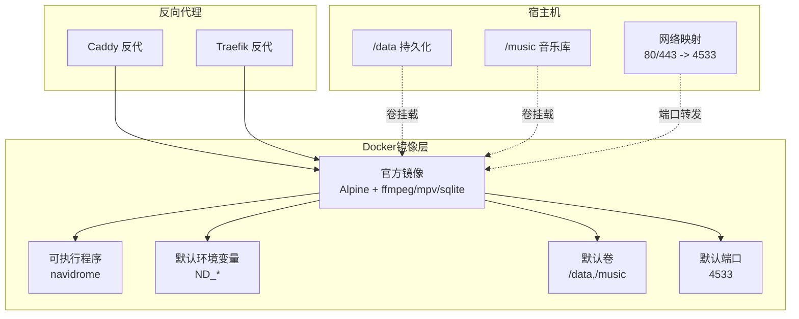
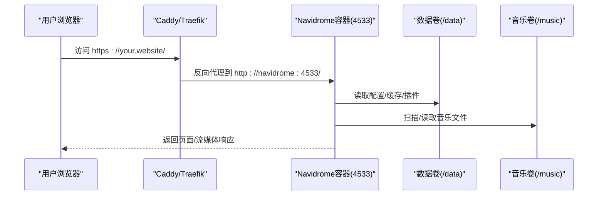
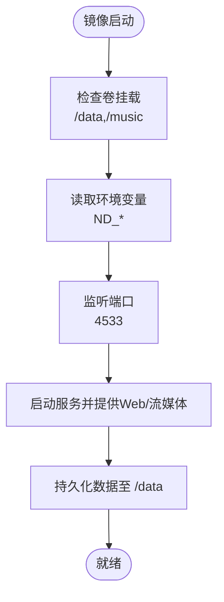
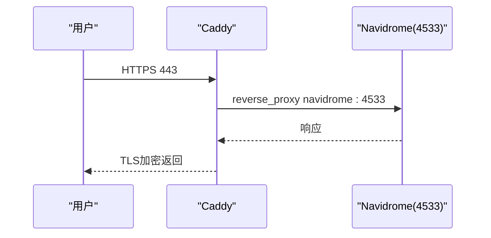
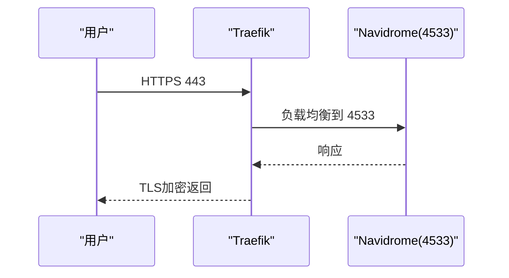
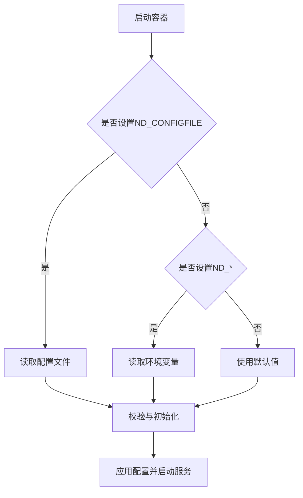
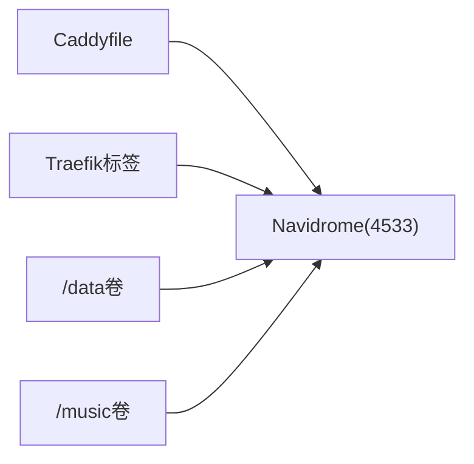

# Docker部署

<cite>
**本文引用的文件**
- [Dockerfile](file://Dockerfile)
- [docker-compose-caddy.yml](file://contrib/docker-compose/docker-compose-caddy.yml)
- [docker-compose-traefik.yml](file://contrib/docker-compose/docker-compose-traefik.yml)
- [Caddyfile](file://contrib/docker-compose/Caddyfile)
- [configuration.go](file://conf/configuration.go)
- [README.md](file://README.md)
</cite>

## 目录
1. [简介](#简介)
2. [项目结构](#项目结构)
3. [核心组件](#核心组件)
4. [架构总览](#架构总览)
5. [详细组件分析](#详细组件分析)
6. [依赖关系分析](#依赖关系分析)
7. [性能与资源建议](#性能与资源建议)
8. [故障排查指南](#故障排查指南)
9. [结论](#结论)
10. [附录](#附录)

## 简介
本文件面向希望使用官方Docker镜像部署Navidrome的用户，系统性说明如何通过docker run与docker-compose两种方式完成部署；重点解析contrib/docker-compose目录下的两套反向代理示例：Caddy与Traefik，并对比其配置差异；同时给出Dockerfile构建参数、环境变量、卷挂载、网络配置、健康检查与资源限制等最佳实践，以及生产环境部署注意事项。

## 项目结构
与Docker部署直接相关的核心文件：
- Dockerfile：官方镜像构建脚本，定义运行时环境、默认端口、数据卷与入口命令
- contrib/docker-compose/docker-compose-caddy.yml：基于Caddy的Compose编排示例
- contrib/docker-compose/docker-compose-traefik.yml：基于Traefik的Compose编排示例
- contrib/docker-compose/Caddyfile：Caddy反代规则示例
- conf/configuration.go：配置加载逻辑（含环境变量前缀、默认值、日志级别等）
- README.md：项目安装与文档链接

图表来源
- [Dockerfile](file://Dockerfile#L124-L147)
- [docker-compose-caddy.yml](file://contrib/docker-compose/docker-compose-caddy.yml#L1-L32)
- [docker-compose-traefik.yml](file://contrib/docker-compose/docker-compose-traefik.yml#L1-L52)

章节来源
- [Dockerfile](file://Dockerfile#L124-L147)
- [docker-compose-caddy.yml](file://contrib/docker-compose/docker-compose-caddy.yml#L1-L32)
- [docker-compose-traefik.yml](file://contrib/docker-compose/docker-compose-traefik.yml#L1-L52)

## 核心组件
- 官方镜像与运行时
  - 基于Alpine，内置ffmpeg、mpv、sqlite，便于音频转码与播放
  - 默认暴露端口4533，容器工作目录/app
  - 默认卷/data用于存放应用数据，/music用于音乐库
  - 入口命令为/app/navidrome
- 反向代理
  - Caddy：通过Caddyfile将请求反代到navidrome:4533
  - Traefik：通过标签声明路由规则、证书解析器与负载均衡端口
- 配置加载机制
  - 支持从配置文件或环境变量加载，ND_前缀自动映射
  - 默认地址0.0.0.0，端口4533，日志级别info

章节来源
- [Dockerfile](file://Dockerfile#L124-L147)
- [Caddyfile](file://contrib/docker-compose/Caddyfile#L1-L7)
- [docker-compose-traefik.yml](file://contrib/docker-compose/docker-compose-traefik.yml#L37-L52)
- [configuration.go](file://conf/configuration.go#L516-L720)

## 架构总览
下图展示两种反向代理方案的请求流转路径。

图表来源
- [docker-compose-caddy.yml](file://contrib/docker-compose/docker-compose-caddy.yml#L9-L32)
- [docker-compose-traefik.yml](file://contrib/docker-compose/docker-compose-traefik.yml#L9-L52)
- [Caddyfile](file://contrib/docker-compose/Caddyfile#L1-L7)

## 详细组件分析

### 组件A：Dockerfile构建参数与运行时
- 构建阶段
  - 使用多阶段构建，最终在Alpine中产出静态二进制与运行时依赖
  - 默认环境变量与卷已在镜像中预设，无需额外构建参数即可运行
- 运行时
  - 默认端口ND_PORT=4533，工作目录/app
  - 卷/data用于持久化应用数据，/music用于音乐库
  - 入口命令/app/navidrome

图表来源
- [Dockerfile](file://Dockerfile#L124-L147)

章节来源
- [Dockerfile](file://Dockerfile#L124-L147)

### 组件B：docker-compose-caddy.yml（Caddy反代）
- 服务
  - caddy：镜像caddy:2.6-alpine，只读根文件系统，映射80/443端口，挂载Caddyfile与数据卷
  - navidrome：镜像deluan/navidrome:latest，只读根文件系统，映射4533端口，挂载/data
- 关键点
  - Caddyfile中将请求反代到navidrome:4533，并传递必要的上游头信息
  - 示例注释展示了音乐库挂载方式（/mnt/music:/music:ro）

图表来源
- [docker-compose-caddy.yml](file://contrib/docker-compose/docker-compose-caddy.yml#L9-L32)
- [Caddyfile](file://contrib/docker-compose/Caddyfile#L1-L7)

章节来源
- [docker-compose-caddy.yml](file://contrib/docker-compose/docker-compose-caddy.yml#L1-L32)
- [Caddyfile](file://contrib/docker-compose/Caddyfile#L1-L7)

### 组件C：docker-compose-traefik.yml（Traefik反代）
- 服务
  - traefik：镜像traefik:2.9，启用Docker作为Provider，声明TLS挑战与Let’s Encrypt存储
  - navidrome：镜像deluan/navidrome:latest，只读根文件系统，映射4533端口，挂载/data
- 关键点
  - 通过容器标签声明路由规则、入口点、证书解析器与服务端口
  - 示例环境变量包含扫描间隔、日志级别、会话超时与BaseURL
  - 注释展示了音乐库挂载方式（/mnt/music:/music:ro）

图表来源
- [docker-compose-traefik.yml](file://contrib/docker-compose/docker-compose-traefik.yml#L9-L52)

章节来源
- [docker-compose-traefik.yml](file://contrib/docker-compose/docker-compose-traefik.yml#L1-L52)

### 组件D：环境变量与配置加载
- 环境变量前缀
  - ND_前缀自动映射到配置项，点号被替换为下划线
  - 例如：ND_PORT、ND_LOGLEVEL、ND_BASEURL、ND_SCANINTERVAL、ND_SESSIONTIMEOUT
- 默认值
  - 地址0.0.0.0，端口4533，日志级别info，会话超时168h，BaseURL为空
- 配置来源优先级
  - 若未指定ND_CONFIGFILE且未设置ND_*，则使用默认值并打印警告
  - 若存在配置文件或设置了ND_*，则按配置文件或环境变量加载

图表来源
- [configuration.go](file://conf/configuration.go#L516-L720)

章节来源
- [configuration.go](file://conf/configuration.go#L516-L720)

### 组件E：卷挂载最佳实践
- 必需卷
  - /data：存放数据库、缓存、插件、备份等应用数据
  - /music：挂载音乐库根目录（只读更安全）
- 建议
  - 将/data映射到宿主机持久化目录，避免容器重建丢失数据
  - 将/musci映射到实际音乐库路径，必要时使用只读模式
  - 如需外部服务（Last.fm、Spotify等），可在不启用外部服务时减少依赖

章节来源
- [Dockerfile](file://Dockerfile#L135-L140)
- [docker-compose-caddy.yml](file://contrib/docker-compose/docker-compose-caddy.yml#L29-L32)
- [docker-compose-traefik.yml](file://contrib/docker-compose/docker-compose-traefik.yml#L43-L45)

### 组件F：网络与端口配置
- 容器内
  - 默认监听0.0.0.0:4533
- 反代侧
  - Caddy：映射宿主机80/443到容器4533
  - Traefik：映射宿主机443到容器4533，并通过标签声明路由
- 生产建议
  - 仅开放必要端口（如443），内部服务通过反代访问
  - 使用只读根文件系统与最小权限运行容器

章节来源
- [Dockerfile](file://Dockerfile#L139-L142)
- [docker-compose-caddy.yml](file://contrib/docker-compose/docker-compose-caddy.yml#L17-L20)
- [docker-compose-traefik.yml](file://contrib/docker-compose/docker-compose-traefik.yml#L23-L27)

### 组件G：健康检查与可用性
- 健康检查
  - 建议在反代后端添加健康检查路径（如/keepalive）以监控服务状态
  - 可结合反代的探活机制（Caddy/Traefik）实现自动重试与故障转移
- 日志与可观测性
  - ND_LOGLEVEL控制日志级别，生产环境建议info或warn
  - 可开启Prometheus指标（如启用）并暴露指标端点

章节来源
- [configuration.go](file://conf/configuration.go#L516-L720)
- [docker-compose-traefik.yml](file://contrib/docker-compose/docker-compose-traefik.yml#L37-L41)

### 组件H：资源限制与生产部署
- 资源限制
  - 建议为容器设置内存与CPU限制，避免扫描/转码高峰占用过多资源
  - 对于大库场景，适当提高扫描间隔（ND_SCANINTERVAL）以降低IO压力
- 安全加固
  - 使用只读根文件系统、最小权限用户运行
  - 通过反代统一管理TLS与访问控制，避免直接暴露4533端口
- 备份与恢复
  - 将/data卷定期备份，确保数据库与缓存可恢复

章节来源
- [docker-compose-caddy.yml](file://contrib/docker-compose/docker-compose-caddy.yml#L23-L32)
- [docker-compose-traefik.yml](file://contrib/docker-compose/docker-compose-traefik.yml#L31-L52)

## 依赖关系分析
- 组件耦合
  - Navidrome容器依赖/data与/musci卷；反代（Caddy/Traefik）依赖容器网络可达
  - 反代通过容器名称navidrome:4533进行服务发现
- 外部依赖
  - Caddyfile定义反代规则
  - Traefik通过标签声明路由与证书解析

图表来源
- [Caddyfile](file://contrib/docker-compose/Caddyfile#L1-L7)
- [docker-compose-caddy.yml](file://contrib/docker-compose/docker-compose-caddy.yml#L9-L32)
- [docker-compose-traefik.yml](file://contrib/docker-compose/docker-compose-traefik.yml#L37-L52)

章节来源
- [Caddyfile](file://contrib/docker-compose/Caddyfile#L1-L7)
- [docker-compose-caddy.yml](file://contrib/docker-compose/docker-compose-caddy.yml#L1-L32)
- [docker-compose-traefik.yml](file://contrib/docker-compose/docker-compose-traefik.yml#L1-L52)

## 性能与资源建议
- 扫描与转码
  - 合理设置ND_SCANINTERVAL，避免频繁扫描导致磁盘IO飙升
  - 转码任务对CPU敏感，建议在低峰期执行或限制并发
- 缓存与存储
  - 保证/data卷有足够空间与良好的I/O性能
  - 适当增大缓存大小（图像缓存、转码缓存）以提升响应速度
- 反代优化
  - Caddy/Traefik均支持压缩与缓存，建议开启以减少带宽消耗

## 故障排查指南
- 无法访问Web界面
  - 检查反代是否正确映射443端口并指向navidrome:4533
  - 确认Caddyfile/Traefik标签中的路由规则与证书解析器配置
- 数据丢失或异常
  - 确认/data卷已正确挂载且具有写权限
  - 检查ND_CONFIGFILE与ND_DATAFOLDER是否指向预期位置
- 日志定位
  - 设置ND_LOGLEVEL为debug以获取详细日志
  - 查看容器日志与反代日志，确认网络连通性与证书状态

章节来源
- [docker-compose-caddy.yml](file://contrib/docker-compose/docker-compose-caddy.yml#L9-L32)
- [docker-compose-traefik.yml](file://contrib/docker-compose/docker-compose-traefik.yml#L9-L52)
- [configuration.go](file://conf/configuration.go#L516-L720)

## 结论
通过官方Docker镜像与contrib/docker-compose提供的两套反代示例，可以快速搭建稳定、可扩展的Navidrome服务。建议在生产环境中采用只读根文件系统、最小权限运行、合理的卷挂载与资源限制，并通过反代统一管理TLS与访问控制，确保服务的安全与高可用。

## 附录

### A. docker run基础命令（示例）
- 基本运行
  - docker run -d --name navidrome -p 4533:4533 -v /data:/data -v /music:/music deluan/navidrome:latest
- 加入反代（示例：Caddy）
  - docker run -d --name caddy -p 80:80 -p 443:443 -v caddy_data:/data -v ./Caddyfile:/etc/caddy/Caddyfile caddy:2.6-alpine
  - docker run -d --name navidrome -p 4533:4533 -v /data:/data -v /music:/music deluan/navidrome:latest

章节来源
- [Dockerfile](file://Dockerfile#L124-L147)
- [docker-compose-caddy.yml](file://contrib/docker-compose/docker-compose-caddy.yml#L9-L32)

### B. docker-compose快速开始
- Caddy方案
  - docker compose -f contrib/docker-compose/docker-compose-caddy.yml up -d
- Traefik方案
  - docker compose -f contrib/docker-compose/docker-compose-traefik.yml up -d

章节来源
- [docker-compose-caddy.yml](file://contrib/docker-compose/docker-compose-caddy.yml#L1-L32)
- [docker-compose-traefik.yml](file://contrib/docker-compose/docker-compose-traefik.yml#L1-L52)

### C. 环境变量清单（部分）
- ND_PORT：服务端口，默认4533
- ND_LOGLEVEL：日志级别，默认info
- ND_BASEURL：基础URL，默认空
- ND_SCANINTERVAL：扫描间隔，默认0（关闭）
- ND_SESSIONTIMEOUT：会话超时，默认168h
- ND_CONFIGFILE：配置文件路径，默认/data/navidrome.toml
- ND_MUSICFOLDER：音乐库路径，默认/musci
- ND_DATAFOLDER：数据目录，默认/data

章节来源
- [Dockerfile](file://Dockerfile#L135-L139)
- [configuration.go](file://conf/configuration.go#L516-L720)
- [docker-compose-traefik.yml](file://contrib/docker-compose/docker-compose-traefik.yml#L37-L41)

### D. 反代配置差异对比
- Caddy
  - 通过Caddyfile声明反代规则，简单直观
  - 适合轻量部署与单机场景
- Traefik
  - 通过容器标签声明路由、入口点与证书解析器
  - 更适合动态编排与多实例场景，具备更强的自动化能力

章节来源
- [Caddyfile](file://contrib/docker-compose/Caddyfile#L1-L7)
- [docker-compose-traefik.yml](file://contrib/docker-compose/docker-compose-traefik.yml#L37-L52)