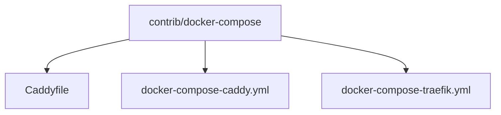
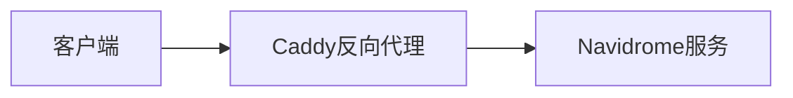
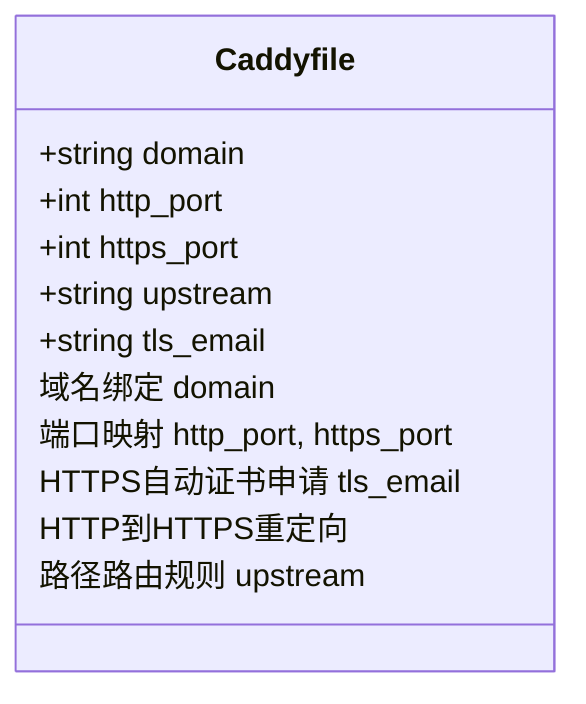
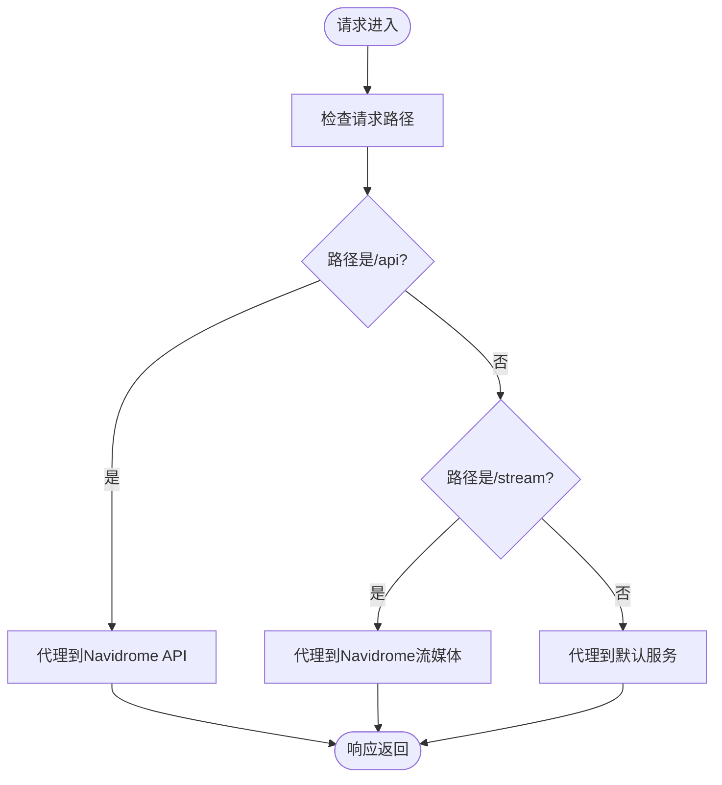
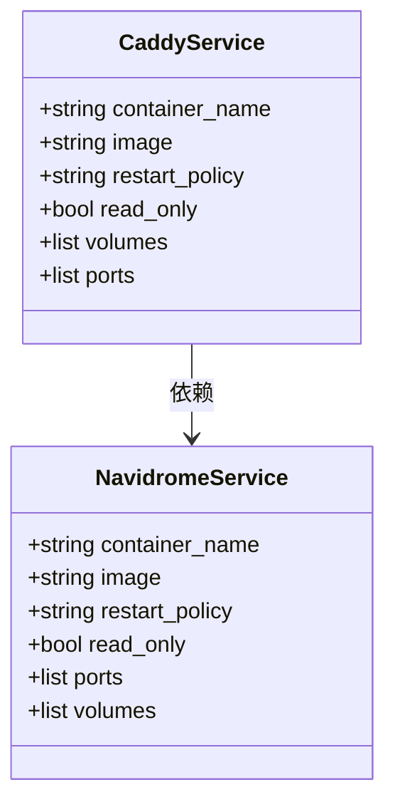
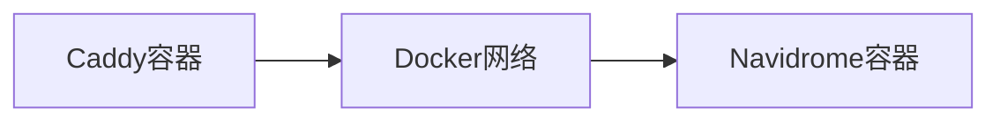
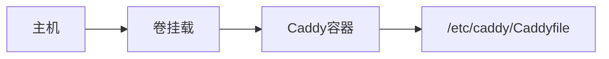

# Caddy配置

<cite>
**本文档引用的文件**
- [Caddyfile](file://contrib/docker-compose/Caddyfile)
- [docker-compose-caddy.yml](file://contrib/docker-compose/docker-compose-caddy.yml)
- [configuration.go](file://conf/configuration.go)
- [middlewares.go](file://server/middlewares.go)
- [server.go](file://server/server.go)
- [consts.go](file://consts/consts.go)
</cite>

## 目录
1. [简介](#简介)
2. [项目结构](#项目结构)
3. [核心组件](#核心组件)
4. [架构概述](#架构概述)
5. [详细组件分析](#详细组件分析)
6. [依赖分析](#依赖分析)
7. [性能考虑](#性能考虑)
8. [故障排除指南](#故障排除指南)
9. [结论](#结论)

## 简介
Navidrome是一个开源的基于Web的音乐收藏服务器和流媒体服务，允许用户通过任何浏览器或移动设备访问自己的音乐收藏。本文档详细解析contrib/docker-compose目录中Caddy方案的完整配置流程，重点说明Caddyfile的配置语法结构、docker-compose-caddy.yml中的服务编排细节以及Caddy配置的最佳实践。

## 项目结构
Navidrome项目包含多个目录和文件，其中contrib/docker-compose目录包含了Caddy反向代理的相关配置文件。这些文件包括Caddyfile和docker-compose-caddy.yml，用于设置Caddy作为反向代理服务器来处理Navidrome的HTTP/HTTPS请求。



**Diagram sources**
- [Caddyfile](file://contrib/docker-compose/Caddyfile)
- [docker-compose-caddy.yml](file://contrib/docker-compose/docker-compose-caddy.yml)

**Section sources**
- [Caddyfile](file://contrib/docker-compose/Caddyfile)
- [docker-compose-caddy.yml](file://contrib/docker-compose/docker-compose-caddy.yml)

## 核心组件
本节将深入分析Caddy配置的核心组件，包括Caddyfile的配置语法结构和docker-compose-caddy.yml中的服务编排细节。

**Section sources**
- [Caddyfile](file://contrib/docker-compose/Caddyfile)
- [docker-compose-caddy.yml](file://contrib/docker-compose/docker-compose-caddy.yml)

## 架构概述
Caddy作为反向代理服务器，负责处理来自客户端的HTTP/HTTPS请求，并将其转发到后端的Navidrome服务。Caddy通过自动申请和管理SSL证书，提供安全的HTTPS连接，并支持HTTP到HTTPS的重定向。



**Diagram sources**
- [Caddyfile](file://contrib/docker-compose/Caddyfile)
- [docker-compose-caddy.yml](file://contrib/docker-compose/docker-compose-caddy.yml)

## 详细组件分析

### Caddyfile配置分析
Caddyfile是Caddy服务器的主要配置文件，定义了域名绑定、端口映射、HTTPS自动证书申请、HTTP到HTTPS重定向以及路径路由规则等。

#### Caddyfile语法结构


**Diagram sources**
- [Caddyfile](file://contrib/docker-compose/Caddyfile)

#### 路径路由规则
Caddyfile中定义了对不同路径的代理设置，如/api、/stream等路径的代理规则。



**Diagram sources**
- [Caddyfile](file://contrib/docker-compose/Caddyfile)

**Section sources**
- [Caddyfile](file://contrib/docker-compose/Caddyfile)

### docker-compose-caddy.yml配置分析
docker-compose-caddy.yml文件定义了Caddy和Navidrome两个服务的编排细节，包括容器网络配置、卷挂载和环境变量设置。

#### 服务编排细节


**Diagram sources**
- [docker-compose-caddy.yml](file://contrib/docker-compose/docker-compose-caddy.yml)

#### 容器网络配置
Caddy和Navidrome服务通过Docker网络进行通信，确保请求能够正确地从Caddy转发到Navidrome。



**Diagram sources**
- [docker-compose-caddy.yml](file://contrib/docker-compose/docker-compose-caddy.yml)

#### 卷挂载
Caddy服务通过卷挂载将本地的Caddyfile文件映射到容器内的/etc/caddy/Caddyfile，确保配置文件的持久化。



**Diagram sources**
- [docker-compose-caddy.yml](file://contrib/docker-compose/docker-compose-caddy.yml)

**Section sources**
- [docker-compose-caddy.yml](file://contrib/docker-compose/docker-compose-caddy.yml)

## 依赖分析
Caddy与Navidrome之间的依赖关系主要体现在反向代理和HTTPS证书管理上。Caddy作为前端代理，负责处理所有外部请求，并将它们安全地转发给后端的Navidrome服务。

```mermaid
dependencyDiagram
Caddy --> Navidrome : 反向代理
Let'sEncrypt --> Caddy : SSL证书
Client --> Caddy : HTTP/HTTPS请求
```

**Diagram sources**
- [Caddyfile](file://contrib/docker-compose/Caddyfile)
- [docker-compose-caddy.yml](file://contrib/docker-compose/docker-compose-caddy.yml)

**Section sources**
- [Caddyfile](file://contrib/docker-compose/Caddyfile)
- [docker-compose-caddy.yml](file://contrib/docker-compose/docker-compose-caddy.yml)

## 性能考虑
在配置Caddy时，需要考虑性能优化，例如启用HTTP/2支持、配置安全头（如HSTS、CORS）以提高安全性，并确保TLS设置的最佳实践。

## 故障排除指南
本节提供常见问题的解决方案，如证书申请失败、端口冲突、DNS验证问题等。

**Section sources**
- [Caddyfile](file://contrib/docker-compose/Caddyfile)
- [docker-compose-caddy.yml](file://contrib/docker-compose/docker-compose-caddy.yml)

## 结论
通过详细解析contrib/docker-compose目录中的Caddy方案，我们了解了如何配置Caddy作为反向代理服务器来处理Navidrome的HTTP/HTTPS请求。Caddyfile的配置语法结构、docker-compose-caddy.yml中的服务编排细节以及最佳实践都为实现安全高效的音乐流媒体服务提供了坚实的基础。