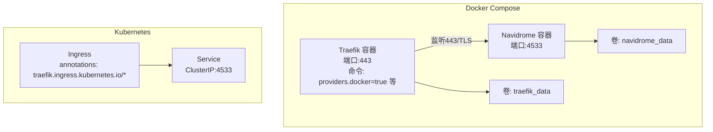
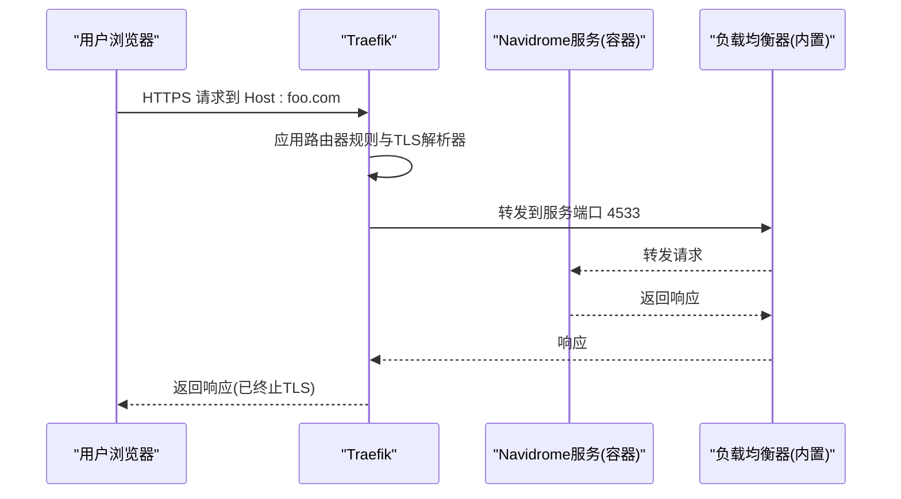
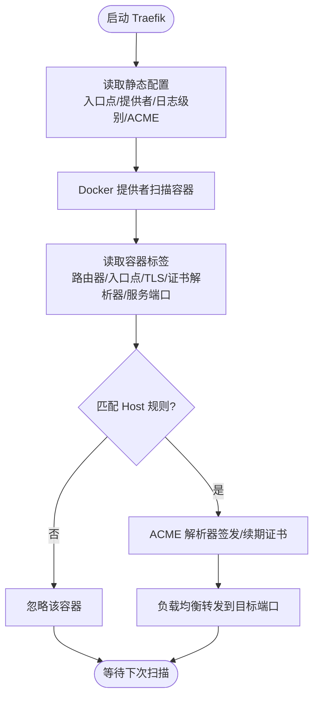
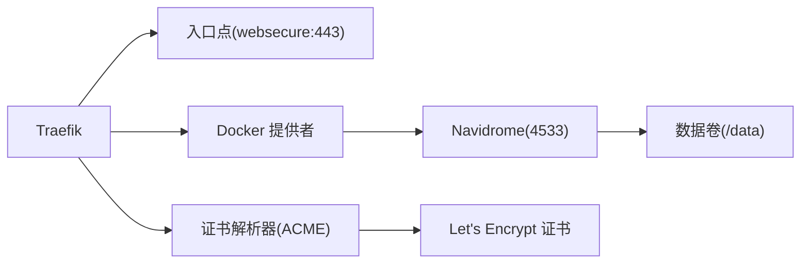

# Traefik配置

<cite>
**本文引用的文件**
- [contrib/docker-compose/docker-compose-traefik.yml](file://contrib/docker-compose/docker-compose-traefik.yml)
- [contrib/docker-compose/Caddyfile](file://contrib/docker-compose/Caddyfile)
- [contrib/docker-compose/docker-compose-caddy.yml](file://contrib/docker-compose/docker-compose-caddy.yml)
- [contrib/k8s/manifest.yml](file://contrib/k8s/manifest.yml)
- [conf/configuration.go](file://conf/configuration.go)
- [server/middlewares.go](file://server/middlewares.go)
- [server/nativeapi/native_api.go](file://server/nativeapi/native_api.go)
</cite>

## 目录
1. [简介](#简介)
2. [项目结构](#项目结构)
3. [核心组件](#核心组件)
4. [架构总览](#架构总览)
5. [详细组件分析](#详细组件分析)
6. [依赖关系分析](#依赖关系分析)
7. [性能考量](#性能考量)
8. [故障排查指南](#故障排查指南)
9. [结论](#结论)
10. [附录](#附录)

## 简介
本文件面向使用Navidrome并采用Traefik作为反向代理的用户，系统化梳理contrib/docker-compose目录中基于Docker的Traefik方案实现细节。重点覆盖：
- docker-compose-traefik.yml中的Docker标签（labels）配置机制：路由规则（Host匹配）、中间件应用、证书解析器设置（ACME）、入口点定义（HTTP/HTTPS）
- Traefik动态配置与静态配置的结合方式，以及如何通过Docker提供者自动发现Navidrome服务
- 配置最佳实践：启用Dashboard监控、配置日志级别、设置速率限制、实现高可用性
- 高级配置说明：自定义证书管理、通配符证书配置、多租户支持
- 实战案例：集成外部认证服务、配置自定义错误页面

## 项目结构
本仓库在contrib/docker-compose下提供了Traefik与Caddy两种反向代理的Compose示例；同时在contrib/k8s下提供了Kubernetes Ingress与Traefik注解的参考实现。本文围绕Docker Compose方案展开，辅以Kubernetes注解作为对比与扩展。

图表来源
- [contrib/docker-compose/docker-compose-traefik.yml](file://contrib/docker-compose/docker-compose-traefik.yml#L9-L28)
- [contrib/docker-compose/docker-compose-traefik.yml](file://contrib/docker-compose/docker-compose-traefik.yml#L29-L52)
- [contrib/k8s/manifest.yml](file://contrib/k8s/manifest.yml#L88-L112)

章节来源
- [contrib/docker-compose/docker-compose-traefik.yml](file://contrib/docker-compose/docker-compose-traefik.yml#L1-L52)
- [contrib/docker-compose/docker-compose-caddy.yml](file://contrib/docker-compose/docker-compose-caddy.yml#L1-L32)
- [contrib/docker-compose/Caddyfile](file://contrib/docker-compose/Caddyfile#L1-L7)
- [contrib/k8s/manifest.yml](file://contrib/k8s/manifest.yml#L1-L112)

## 核心组件
- Traefik容器
  - 使用Docker提供者自动发现服务
  - 仅暴露443端口，TLS由ACME解析器自动签发
  - 通过命令行参数设置日志级别、入口点、证书解析器等
- Navidrome容器
  - 暴露内部端口4533
  - 通过Docker标签声明路由规则、入口点、TLS与负载均衡目标端口
- 卷与持久化
  - Traefik使用独立卷存储Let’s Encrypt ACME状态
  - Navidrome使用独立卷存储数据

章节来源
- [contrib/docker-compose/docker-compose-traefik.yml](file://contrib/docker-compose/docker-compose-traefik.yml#L9-L28)
- [contrib/docker-compose/docker-compose-traefik.yml](file://contrib/docker-compose/docker-compose-traefik.yml#L29-L52)

## 架构总览
下图展示了Traefik如何通过Docker标签将Navidrome纳入其动态路由体系，并完成TLS终止与转发。

图表来源
- [contrib/docker-compose/docker-compose-traefik.yml](file://contrib/docker-compose/docker-compose-traefik.yml#L14-L23)
- [contrib/docker-compose/docker-compose-traefik.yml](file://contrib/docker-compose/docker-compose-traefik.yml#L45-L52)

## 详细组件分析

### Traefik静态配置与动态配置
- 静态配置（命令行参数）
  - 启用Docker提供者并默认不暴露容器
  - 定义入口点websecure监听443
  - 配置ACME TLS挑战、邮箱、存储路径
- 动态配置（Docker标签）
  - 通过labels声明路由器规则、入口点、TLS开关与证书解析器
  - 通过labels声明服务负载均衡目标端口

图表来源
- [contrib/docker-compose/docker-compose-traefik.yml](file://contrib/docker-compose/docker-compose-traefik.yml#L14-L23)
- [contrib/docker-compose/docker-compose-traefik.yml](file://contrib/docker-compose/docker-compose-traefik.yml#L45-L52)

章节来源
- [contrib/docker-compose/docker-compose-traefik.yml](file://contrib/docker-compose/docker-compose-traefik.yml#L14-L23)
- [contrib/docker-compose/docker-compose-traefik.yml](file://contrib/docker-compose/docker-compose-traefik.yml#L45-L52)

### Docker标签（labels）详解
- 启用开关
  - 启用Traefik对该容器的动态路由管理
- 路由器规则
  - Host匹配：限定域名
  - 入口点：绑定到websecure（443/TLS）
  - TLS开关与证书解析器：开启TLS并指定证书解析器
- 服务与负载均衡
  - 指定服务目标端口为Navidrome内部端口4533

章节来源
- [contrib/docker-compose/docker-compose-traefik.yml](file://contrib/docker-compose/docker-compose-traefik.yml#L45-L52)

### 证书解析器与入口点
- 证书解析器
  - 使用ACME TLS挑战，邮箱用于Let’s Encrypt通知，存储位置持久化在卷内
- 入口点
  - websecure入口点监听443，配合TLS与证书解析器工作

章节来源
- [contrib/docker-compose/docker-compose-traefik.yml](file://contrib/docker-compose/docker-compose-traefik.yml#L14-L23)

### 与Caddy方案的对比
- Caddy通过本地Caddyfile直接声明反向代理与头部转发
- Traefik通过Docker标签声明路由与TLS，二者均可实现相同功能，但配置载体不同

章节来源
- [contrib/docker-compose/Caddyfile](file://contrib/docker-compose/Caddyfile#L1-L7)
- [contrib/docker-compose/docker-compose-caddy.yml](file://contrib/docker-compose/docker-compose-caddy.yml#L1-L32)

### Kubernetes注解参考
- 在Kubernetes中，可通过Ingress注解启用Traefik路由TLS
- 该模式与Docker标签思路一致：声明Host、入口点、TLS与后端服务

章节来源
- [contrib/k8s/manifest.yml](file://contrib/k8s/manifest.yml#L88-L112)

### Navidrome服务端配置要点
- BaseURL与日志级别
  - BaseURL用于处理反向代理场景下的路径与主机信息
  - 日志级别可在环境变量中设置
- 中间件与安全头
  - 服务器端具备安全头与压缩中间件，可与Traefik共同提升安全性与性能

章节来源
- [conf/configuration.go](file://conf/configuration.go#L315-L343)
- [conf/configuration.go](file://conf/configuration.go#L526-L544)
- [server/middlewares.go](file://server/middlewares.go#L94-L134)

## 依赖关系分析
- 组件耦合
  - Traefik依赖Docker提供者自动发现Navidrome容器
  - Navidrome依赖Docker标签暴露路由与TLS
- 外部依赖
  - Let’s Encrypt ACME用于证书签发与续期
- 潜在风险
  - 若未正确配置Host规则或证书解析器，可能导致无法访问或证书失败

图表来源
- [contrib/docker-compose/docker-compose-traefik.yml](file://contrib/docker-compose/docker-compose-traefik.yml#L14-L23)
- [contrib/docker-compose/docker-compose-traefik.yml](file://contrib/docker-compose/docker-compose-traefik.yml#L29-L52)

章节来源
- [contrib/docker-compose/docker-compose-traefik.yml](file://contrib/docker-compose/docker-compose-traefik.yml#L14-L23)
- [contrib/docker-compose/docker-compose-traefik.yml](file://contrib/docker-compose/docker-compose-traefik.yml#L29-L52)

## 性能考量
- 日志级别
  - 建议在生产环境中将Traefik日志级别调低，减少IO开销
- 负载均衡
  - Traefik内置负载均衡，确保后端健康检查与会话亲和（如需）按需配置
- 中间件
  - 结合Navidrome的安全头与压缩中间件，可减少带宽占用并提升安全性

章节来源
- [contrib/docker-compose/docker-compose-traefik.yml](file://contrib/docker-compose/docker-compose-traefik.yml#L14-L23)
- [server/middlewares.go](file://server/middlewares.go#L94-L134)

## 故障排查指南
- 访问异常
  - 检查Host规则是否与实际域名一致
  - 确认入口点与端口映射正确（443）
- 证书问题
  - 检查ACME邮箱与存储路径是否有效
  - 查看Let’s Encrypt状态与DNS解析是否可达
- 日志定位
  - 适当提高Traefik日志级别以捕获错误
- 速率限制
  - 可在上游（Navidrome）或Traefik侧增加限流策略，避免过载

章节来源
- [contrib/docker-compose/docker-compose-traefik.yml](file://contrib/docker-compose/docker-compose-traefik.yml#L14-L23)
- [server/nativeapi/native_api.go](file://server/nativeapi/native_api.go#L205-L208)

## 结论
本方案通过Docker标签将Navidrome无缝接入Traefik，实现自动化的路由、TLS与证书管理。结合Kubernetes注解与Caddy方案，用户可根据部署环境灵活选择。建议在生产环境中优化日志级别、启用健康检查与限流，并妥善管理证书存储与续期。

## 附录

### 最佳实践清单
- 启用Dashboard监控
  - 在Traefik中启用Dashboard（参考官方文档），便于实时观测路由与证书状态
- 配置日志级别
  - 生产环境建议降低日志级别，避免过多IO
- 设置速率限制
  - 在Traefik或Navidrome侧配置限流，保护后端资源
- 高可用性
  - 多实例部署时，确保入口点与证书解析器共享存储，避免重复签发
- 自定义证书管理
  - 可替换ACME为自建CA或手动证书，按需调整解析器与入口点
- 通配符证书配置
  - 通配符证书需满足ACME DNS-01挑战要求，确保DNS权限与自动化脚本可用
- 多租户支持
  - 通过多个Host规则与独立证书解析器，实现多域名或多租户隔离

### 实战案例
- 集成外部认证服务
  - 在Traefik侧通过中间件或外部网关实现OIDC/SAML等认证，再将已认证请求转发至Navidrome
- 配置自定义错误页面
  - 在Traefik中配置自定义错误页或重定向规则，提升用户体验

[本节为概念性指导，无需代码来源]