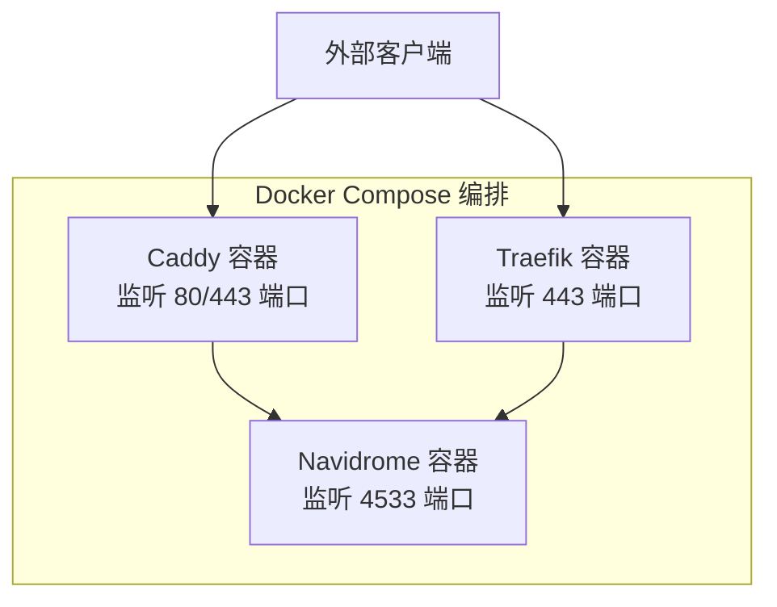
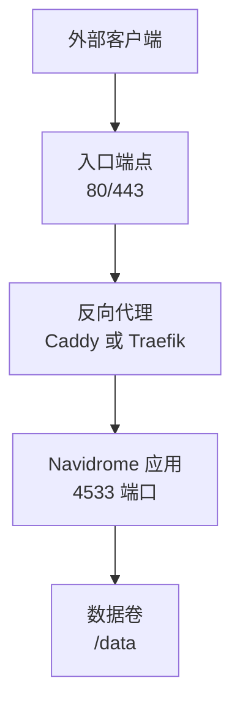
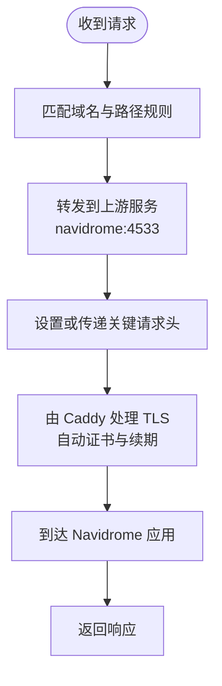
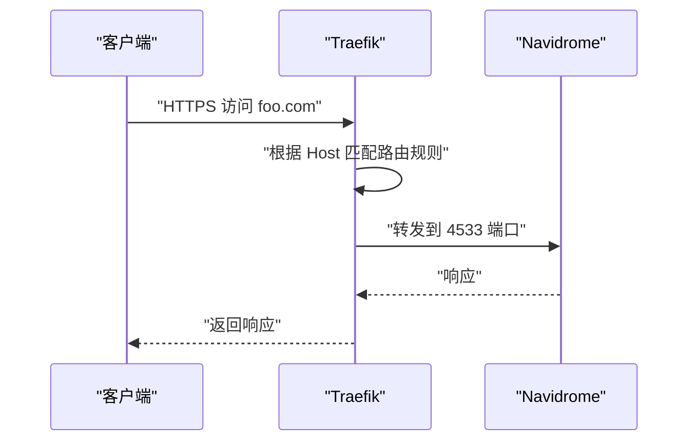
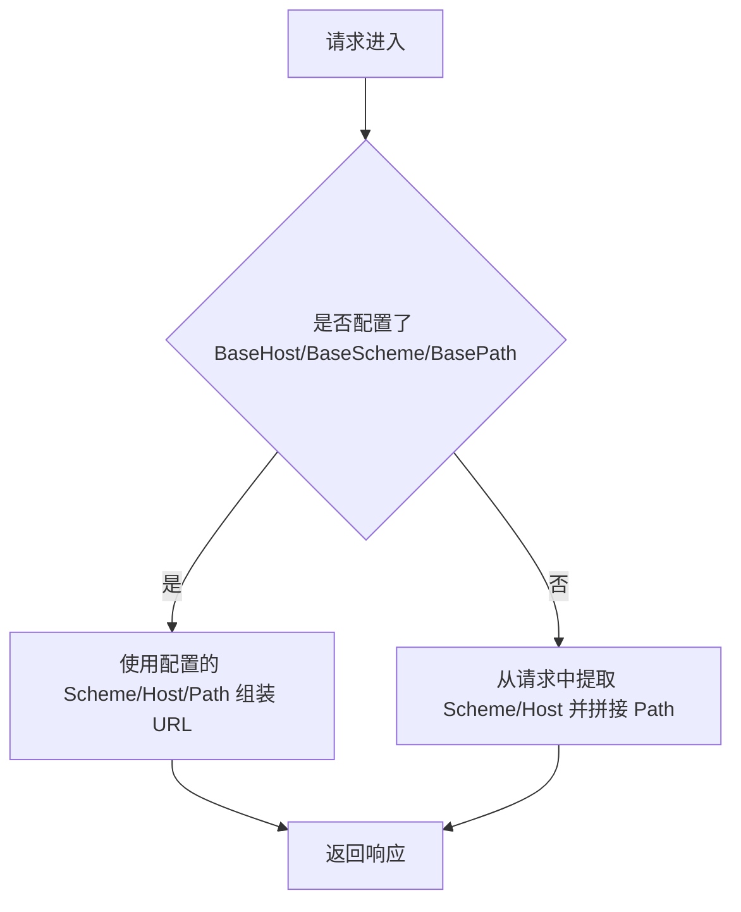
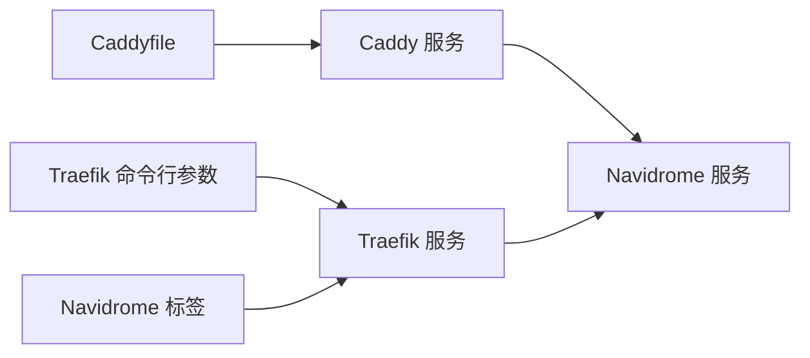

# 反向代理配置

<cite>
**本文引用的文件**
- [Caddyfile](file://contrib/docker-compose/Caddyfile)
- [docker-compose-caddy.yml](file://contrib/docker-compose/docker-compose-caddy.yml)
- [docker-compose-traefik.yml](file://contrib/docker-compose/docker-compose-traefik.yml)
- [configuration.go](file://conf/configuration.go)
- [server.go](file://server/server.go)
- [middlewares.go](file://server/middlewares.go)
- [server_test.go](file://server/server_test.go)
</cite>

## 目录
1. [简介](#简介)
2. [项目结构](#项目结构)
3. [核心组件](#核心组件)
4. [架构总览](#架构总览)
5. [详细组件分析](#详细组件分析)
6. [依赖关系分析](#依赖关系分析)
7. [性能考量](#性能考量)
8. [故障排查指南](#故障排查指南)
9. [结论](#结论)
10. [附录](#附录)

## 简介
本文件面向使用 Navidrome 的用户与运维工程师，系统性对比分析仓库中提供的两种反向代理方案：Caddy 与 Traefik。重点覆盖以下方面：
- Caddy 方案：解释 Caddyfile 配置语法（域名绑定、HTTPS 自动证书、HTTP 到 HTTPS 重定向、路径路由规则）。
- Traefik 方案：说明 docker-compose 中的 labels 配置（路由规则、中间件、证书解析器）。
- 性能对比、配置复杂度评估与适用场景建议。
- 高级主题：自定义域名、SSL/TLS 证书管理、HTTP/2 支持、以及与 Navidrome BaseURL 配置的协同。

## 项目结构
本仓库在 contrib/docker-compose 目录下提供了两套 Docker Compose 编排示例，分别用于部署 Caddy 和 Traefik 作为反向代理，同时运行 Navidrome 应用容器。

图表来源
- [docker-compose-caddy.yml](file://contrib/docker-compose/docker-compose-caddy.yml#L1-L32)
- [docker-compose-traefik.yml](file://contrib/docker-compose/docker-compose-traefik.yml#L1-L52)

章节来源
- [docker-compose-caddy.yml](file://contrib/docker-compose/docker-compose-caddy.yml#L1-L32)
- [docker-compose-traefik.yml](file://contrib/docker-compose/docker-compose-traefik.yml#L1-L52)

## 核心组件
- Caddyfile：定义站点规则、上游服务、请求头转发等。
- docker-compose-caddy.yml：声明 Caddy 与 Navidrome 两个服务，暴露必要端口并挂载配置文件。
- docker-compose-traefik.yml：声明 Traefik 与 Navidrome 两个服务，通过命令行参数启用 Docker 提供者、证书解析器，以及通过 labels 配置路由与服务。

章节来源
- [Caddyfile](file://contrib/docker-compose/Caddyfile#L1-L7)
- [docker-compose-caddy.yml](file://contrib/docker-compose/docker-compose-caddy.yml#L1-L32)
- [docker-compose-traefik.yml](file://contrib/docker-compose/docker-compose-traefik.yml#L1-L52)

## 架构总览
两种方案均采用“反向代理 + Navidrome”的架构。Caddy 使用内置的自动证书与反向代理能力；Traefik 通过 Docker 提供者自动发现服务并通过 labels 配置路由与证书。

图表来源
- [docker-compose-caddy.yml](file://contrib/docker-compose/docker-compose-caddy.yml#L1-L32)
- [docker-compose-traefik.yml](file://contrib/docker-compose/docker-compose-traefik.yml#L1-L52)

## 详细组件分析

### Caddy 方案

#### Caddyfile 配置要点
- 域名绑定：站点块以域名开头，用于匹配访问主机名。
- 反向代理：将匹配到的请求转发至上游服务（Navidrome 容器的 4533 端口）。
- 请求头转发：向上游传递 Host、X-Forwarded-For、X-Real-IP 等头部，便于后端识别真实客户端与原始主机。
- HTTPS 自动证书：Caddy 默认启用 ACME 证书解析器，无需额外配置即可自动签发与续期。
- HTTP 到 HTTPS 重定向：Caddyfile 示例未显式声明重定向，但 Caddy 在监听 80 端口时通常会自动处理 HTTP 到 HTTPS 的跳转（需结合端口映射与证书可用性）。

图表来源
- [Caddyfile](file://contrib/docker-compose/Caddyfile#L1-L7)
- [docker-compose-caddy.yml](file://contrib/docker-compose/docker-compose-caddy.yml#L1-L32)

章节来源
- [Caddyfile](file://contrib/docker-compose/Caddyfile#L1-L7)
- [docker-compose-caddy.yml](file://contrib/docker-compose/docker-compose-caddy.yml#L1-L32)

#### 关键实现与行为
- 反向代理与请求头：Caddyfile 明确设置了 Host、X-Forwarded-For、X-Real-IP 的上行头，确保 Navidrome 能正确识别客户端与原始主机。
- 端口映射：Caddy 暴露 80 与 443 端口，Navidrome 暴露 4533 端口，二者通过服务名互联。
- 证书管理：Caddy 默认启用 ACME 解析器，结合 443 端口可自动签发与续期证书。

章节来源
- [Caddyfile](file://contrib/docker-compose/Caddyfile#L1-L7)
- [docker-compose-caddy.yml](file://contrib/docker-compose/docker-compose-caddy.yml#L1-L32)

### Traefik 方案

#### docker-compose 中的标签与命令行参数
- Docker 提供者：启用 Docker 提供者并仅对显式标记的服务进行暴露。
- 入口端点：定义 websecure 入口端点监听 443。
- 证书解析器：配置 ACME TLS 挑战，指定存储位置与邮箱。
- Navidrome 服务标签：
  - 启用 Traefik。
  - 路由规则：基于 Host 的域名匹配。
  - 入口端点：websecure。
  - TLS 开启与证书解析器。
  - 服务负载均衡：指向 Navidrome 的 4533 端口。

图表来源
- [docker-compose-traefik.yml](file://contrib/docker-compose/docker-compose-traefik.yml#L1-L52)

章节来源
- [docker-compose-traefik.yml](file://contrib/docker-compose/docker-compose-traefik.yml#L1-L52)

#### 关键实现与行为
- 路由与中间件：通过 labels 定义路由规则、入口端点、TLS 与证书解析器，无需手动编写复杂的路由配置。
- 证书解析器：ACME TLS 挑战自动完成证书签发与续期，存储于指定路径。
- 服务发现：Docker 提供者自动发现容器并按标签生成路由。

章节来源
- [docker-compose-traefik.yml](file://contrib/docker-compose/docker-compose-traefik.yml#L1-L52)

### 与 Navidrome BaseURL 的协同

Navidrome 支持通过 BaseURL、BasePath、BaseHost、BaseScheme 等配置项控制对外 URL 的生成与重定向逻辑。这些配置会影响前端注入的配置、绝对 URL 生成与根路径重定向等行为。

图表来源
- [server.go](file://server/server.go#L245-L261)
- [configuration.go](file://conf/configuration.go#L33-L36)
- [configuration.go](file://conf/configuration.go#L331-L341)
- [server_test.go](file://server/server_test.go#L1-L66)

章节来源
- [server.go](file://server/server.go#L245-L261)
- [configuration.go](file://conf/configuration.go#L33-L36)
- [configuration.go](file://conf/configuration.go#L331-L341)
- [server_test.go](file://server/server_test.go#L1-L66)

## 依赖关系分析

图表来源
- [Caddyfile](file://contrib/docker-compose/Caddyfile#L1-L7)
- [docker-compose-caddy.yml](file://contrib/docker-compose/docker-compose-caddy.yml#L1-L32)
- [docker-compose-traefik.yml](file://contrib/docker-compose/docker-compose-traefik.yml#L1-L52)

章节来源
- [Caddyfile](file://contrib/docker-compose/Caddyfile#L1-L7)
- [docker-compose-caddy.yml](file://contrib/docker-compose/docker-compose-caddy.yml#L1-L32)
- [docker-compose-traefik.yml](file://contrib/docker-compose/docker-compose-traefik.yml#L1-L52)

## 性能考量
- 连接复用与协议支持：两者均支持 HTTP/2，有利于提升并发与资源加载效率。
- 证书处理：Caddy 与 Traefik 均具备高效的证书解析与续期机制，减少人工干预。
- 资源占用：两者均为轻量级代理，适合单机或小规模集群部署。
- 负载均衡：Traefik 通过 Docker 提供者自动发现服务，适合多实例扩展；Caddy 通过静态配置或外部负载均衡器扩展。

[本节为通用性能讨论，不直接分析具体文件]

## 故障排查指南
- 证书问题
  - Caddy：若证书签发失败，检查域名解析、DNS 记录与端口 80/443 是否可达。
  - Traefik：确认 ACME 邮箱、存储路径权限与 DNS 挑战配置。
- 路由不生效
  - Caddy：确认域名与站点块匹配、端口映射正确。
  - Traefik：确认 labels 是否存在且值正确，Docker 提供者已启用。
- BaseURL 导致的重定向异常
  - 若配置了 BaseHost/BaseScheme/BasePath，请确保与反向代理的域名、路径一致，避免循环重定向。
  - 参考测试用例验证绝对 URL 生成逻辑。

章节来源
- [server.go](file://server/server.go#L245-L261)
- [server_test.go](file://server/server_test.go#L1-L66)

## 结论
- Caddy 方案：配置简洁、零样板代码，适合快速上线与单机部署；自动证书与反向代理一体化，易于维护。
- Traefik 方案：通过标签与 Docker 提供者实现声明式路由，适合动态编排与多实例场景；证书解析器与中间件配置灵活。
- 选择建议：
  - 小型个人或家庭环境：优先 Caddy，配置更少、上手更快。
  - 动态编排与多实例：优先 Traefik，标签化配置与自动服务发现更契合。
- 高级配置：自定义域名与 SSL/TLS 证书管理、HTTP/2 支持均可在两种方案中实现；结合 Navidrome 的 BaseURL 配置，确保 URL 生成与重定向符合预期。

[本节为总结性内容，不直接分析具体文件]

## 附录

### 自定义域名与 SSL/TLS 证书管理
- Caddy：通过站点块绑定域名，自动 ACME 证书解析与续期；如需自定义证书路径，可在 Caddyfile 中调整。
- Traefik：通过命令行参数配置 ACME 解析器与存储路径；通过 labels 指定证书解析器与入口端点。

章节来源
- [Caddyfile](file://contrib/docker-compose/Caddyfile#L1-L7)
- [docker-compose-traefik.yml](file://contrib/docker-compose/docker-compose-traefik.yml#L1-L52)

### HTTP/2 支持
- 两者均默认启用 HTTP/2，配合 TLS 使用可获得更好的性能与安全性。

[本节为通用指导，不直接分析具体文件]

### Navidrome BaseURL 配置要点
- BaseURL：可为完整 URL，也可仅为路径；当提供完整 URL 时，将覆盖请求中的 Scheme/Host/Path。
- BasePath：影响绝对 URL 生成与前端资源路径。
- BaseHost/BaseScheme：用于强制指定对外访问的主机与协议，常与反向代理配合使用。

章节来源
- [configuration.go](file://conf/configuration.go#L33-L36)
- [configuration.go](file://conf/configuration.go#L331-L341)
- [server.go](file://server/server.go#L245-L261)
- [server_test.go](file://server/server_test.go#L1-L66)