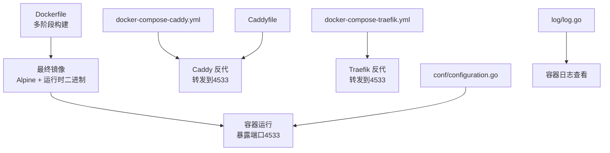
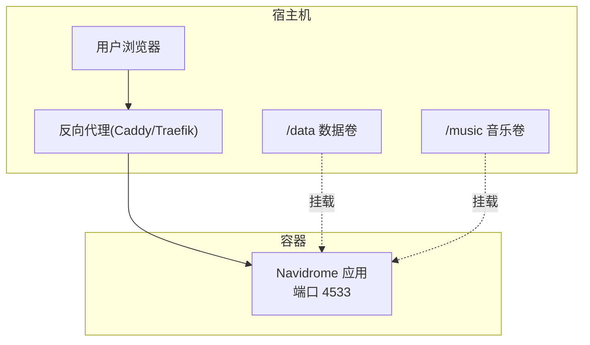
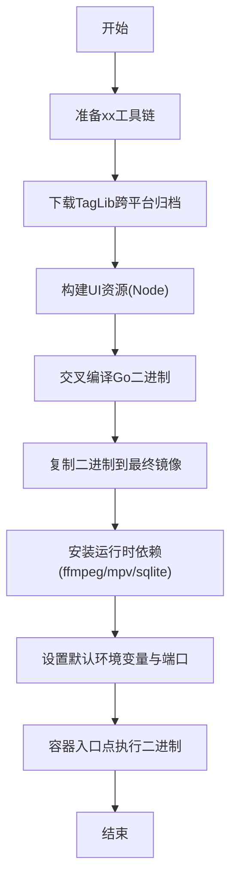
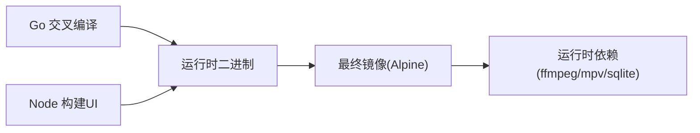

# 基础部署

<cite>
**本文引用的文件**
- [Dockerfile](file://Dockerfile)
- [docker-compose-caddy.yml](file://contrib/docker-compose/docker-compose-caddy.yml)
- [docker-compose-traefik.yml](file://contrib/docker-compose/docker-compose-traefik.yml)
- [Caddyfile](file://contrib/docker-compose/Caddyfile)
- [configuration.go](file://conf/configuration.go)
- [main.go](file://main.go)
- [log.go](file://log/log.go)
- [goreleaser.yml](file://release/goreleaser.yml)
- [navidrome.toml](file://release/linux/navidrome.toml)
</cite>

## 目录
1. [简介](#简介)
2. [项目结构](#项目结构)
3. [核心组件](#核心组件)
4. [架构总览](#架构总览)
5. [详细组件分析](#详细组件分析)
6. [依赖关系分析](#依赖关系分析)
7. [性能与资源建议](#性能与资源建议)
8. [故障排查指南](#故障排查指南)
9. [结论](#结论)
10. [附录](#附录)

## 简介
本文件面向希望在Docker环境中快速部署Navidrome的用户，基于仓库中的官方Dockerfile与Compose示例，提供从镜像拉取、容器运行、数据卷与端口配置到日志查看与健康检查的完整指南。同时对Dockerfile的多阶段构建策略进行解析，帮助理解镜像体积与运行时依赖。

## 项目结构
与Docker部署直接相关的关键文件：
- Dockerfile：定义了多阶段构建流程，最终生成基于Alpine的精简运行时镜像
- contrib/docker-compose/*：提供使用Caddy或Traefik作为反向代理的Compose编排示例
- conf/configuration.go：定义默认端口、配置加载优先级与环境变量前缀规则
- log/log.go：日志级别与输出控制，便于容器内日志查看与调试
- release/linux/navidrome.toml：Linux发行包默认配置路径参考
- release/goreleaser.yml：发布配置，体现镜像构建产物与目标平台

图表来源
- [Dockerfile](file://Dockerfile#L120-L147)
- [docker-compose-caddy.yml](file://contrib/docker-compose/docker-compose-caddy.yml#L1-L32)
- [docker-compose-traefik.yml](file://contrib/docker-compose/docker-compose-traefik.yml#L1-L52)
- [Caddyfile](file://contrib/docker-compose/Caddyfile#L1-L7)
- [configuration.go](file://conf/configuration.go#L526-L539)
- [log.go](file://log/log.go#L81-L113)

章节来源
- [Dockerfile](file://Dockerfile#L120-L147)
- [docker-compose-caddy.yml](file://contrib/docker-compose/docker-compose-caddy.yml#L1-L32)
- [docker-compose-traefik.yml](file://contrib/docker-compose/docker-compose-traefik.yml#L1-L52)
- [Caddyfile](file://contrib/docker-compose/Caddyfile#L1-L7)
- [configuration.go](file://conf/configuration.go#L526-L539)
- [log.go](file://log/log.go#L81-L113)

## 核心组件
- 官方Docker镜像与运行时
  - 镜像基于Alpine，内置运行所需工具（如ffmpeg、mpv、sqlite）
  - 默认监听端口为4533，可通过环境变量覆盖
  - 默认数据目录为/data，音乐目录为/mnt/music（通过环境变量映射）
- 多阶段构建
  - 使用Node构建UI资源，Go交叉编译二进制，最终仅拷贝运行时二进制到最小化镜像
  - 构建阶段使用xx-go/xx-apt实现跨平台CGO编译
- Compose示例
  - 提供Caddy/Traefik两种反向代理方案，均将外部流量转发至容器的4533端口
  - 示例中使用只读根文件系统、受限权限，提升安全性

章节来源
- [Dockerfile](file://Dockerfile#L120-L147)
- [configuration.go](file://conf/configuration.go#L526-L539)
- [docker-compose-caddy.yml](file://contrib/docker-compose/docker-compose-caddy.yml#L1-L32)
- [docker-compose-traefik.yml](file://contrib/docker-compose/docker-compose-traefik.yml#L1-L52)

## 架构总览
下图展示容器运行时与反向代理的关系，以及数据卷挂载位置。

图表来源
- [docker-compose-caddy.yml](file://contrib/docker-compose/docker-compose-caddy.yml#L1-L32)
- [docker-compose-traefik.yml](file://contrib/docker-compose/docker-compose-traefik.yml#L1-L52)
- [Dockerfile](file://Dockerfile#L130-L147)

## 详细组件分析

### Dockerfile 多阶段构建解析
- 阶段一：osxcross与xx工具链准备（用于跨平台编译）
- 阶段二：下载预编译的TagLib跨平台归档，供CGO链接
- 阶段三：Node构建UI资源，产出静态资源
- 阶段四：Go交叉编译二进制，支持Darwin/Windows/Linux多平台
- 阶段五：最终镜像（Alpine），安装运行时依赖，复制二进制，设置默认环境变量与端口

图表来源
- [Dockerfile](file://Dockerfile#L1-L147)

章节来源
- [Dockerfile](file://Dockerfile#L1-L147)

### 端口与环境变量
- 默认端口
  - 容器内默认监听4533端口
- 关键环境变量
  - ND_MUSICFOLDER：音乐库根目录，默认映射到/mnt/music
  - ND_DATAFOLDER：应用数据目录，默认映射到/data
  - ND_CONFIGFILE：配置文件路径，默认指向/data/navidrome.toml
  - ND_PORT：服务端口，默认4533
  - ND_BASEURL：基础URL，用于反向代理场景
  - ND_LOGLEVEL：日志级别（info/debug/trace等）
  - 其他ND_前缀环境变量：通过扁平化的键名映射到配置树（见下一节）

章节来源
- [Dockerfile](file://Dockerfile#L130-L147)
- [configuration.go](file://conf/configuration.go#L526-L539)

### 配置加载与ND_环境变量映射
- 配置来源优先级
  - 若存在ND_CONFIGFILE或配置文件，则以配置文件为准
  - 否则若检测到任何ND_环境变量（除ND_CONFIGFILE），则仅从环境变量加载
  - 否则使用默认值
- ND_环境变量命名规则
  - 将配置树的点分层级转换为大写并以下划线连接，前缀ND_
  - 例如：Address -> ND_ADDRESS；Port -> ND_PORT；LastFM.Enabled -> ND_LASTFM_ENABLED
- 常用ND_变量示例
  - ND_PORT、ND_BASEURL、ND_LOGLEVEL、ND_SCANINTERVAL、ND_SESSIONTIMEOUT、ND_MUSICFOLDER、ND_DATAFOLER、ND_CONFIGFILE

章节来源
- [configuration.go](file://conf/configuration.go#L340-L370)
- [configuration.go](file://conf/configuration.go#L515-L539)
- [ui/src/dialogs/aboutUtils.js](file://ui/src/dialogs/aboutUtils.js#L26-L48)
- [docker-compose-traefik.yml](file://contrib/docker-compose/docker-compose-traefik.yml#L37-L41)

### 数据卷挂载最佳实践
- /data：存放应用数据与配置文件（默认ND_CONFIGFILE=/data/navidrome.toml）
- /music：挂载音乐库目录（默认ND_MUSICFOLDER=/music）
- 建议
  - 将/data持久化到宿主机可靠存储，避免容器重建导致配置丢失
  - 将/mnt/music或/mnt/media等音乐目录映射到容器的/mnt/music
  - 在反向代理场景下，确保ND_BASEURL正确设置，以便生成正确的重定向链接

章节来源
- [Dockerfile](file://Dockerfile#L130-L147)
- [docker-compose-caddy.yml](file://contrib/docker-compose/docker-compose-caddy.yml#L21-L32)
- [docker-compose-traefik.yml](file://contrib/docker-compose/docker-compose-traefik.yml#L29-L45)

### 反向代理与端口映射
- Compose示例
  - Caddy：将80/443映射到宿主机，容器内部通过reverse_proxy转发到4533
  - Traefik：通过标签声明路由规则，将443证书解析与负载均衡交给Traefik，容器内仍监听4533
- 端口映射
  - 容器内：4533
  - 反向代理：80/443（或自定义端口）
- 健康检查
  - 可在反向代理或编排层添加健康检查（例如访问/keepalive或/insights接口），但需结合实际部署方式

章节来源
- [docker-compose-caddy.yml](file://contrib/docker-compose/docker-compose-caddy.yml#L1-L32)
- [Caddyfile](file://contrib/docker-compose/Caddyfile#L1-L7)
- [docker-compose-traefik.yml](file://contrib/docker-compose/docker-compose-traefik.yml#L1-L52)

### 日志查看与级别控制
- 日志级别
  - 支持fatal/error/warn/info/debug/trace
  - 可通过ND_LOGLEVEL设置
- 输出与脱敏
  - 容器标准输出即为日志输出
  - 内置敏感信息脱敏钩子，避免泄露密钥等
- 调试建议
  - 初次部署可临时提高日志级别定位问题
  - 结合反向代理日志与容器日志交叉验证

章节来源
- [log.go](file://log/log.go#L81-L113)
- [log.go](file://log/log.go#L115-L131)
- [log.go](file://log/log.go#L132-L139)
- [docker-compose-traefik.yml](file://contrib/docker-compose/docker-compose-traefik.yml#L37-L41)

### 健康检查与容器生命周期
- 健康检查
  - 可通过反向代理或编排工具对容器进行健康检查
  - 常见做法：访问/keepalive或/insights接口，确认服务可用
- 常用容器管理命令
  - 启动：docker compose up -d 或 docker run ...
  - 停止：docker compose down 或 docker stop <container>
  - 重启：docker compose restart 或 docker restart <container>
  - 查看日志：docker compose logs -f 或 docker logs -f <container>

章节来源
- [docker-compose-caddy.yml](file://contrib/docker-compose/docker-compose-caddy.yml#L1-L32)
- [docker-compose-traefik.yml](file://contrib/docker-compose/docker-compose-traefik.yml#L1-L52)

## 依赖关系分析
- 运行时依赖
  - ffmpeg：音频处理与转码
  - mpv：播放器支持
  - sqlite：本地数据库
- 构建期依赖
  - Node：构建前端资源
  - Go工具链：交叉编译二进制
  - xx工具链：跨平台编译与链接
- 配置与环境变量
  - 通过ND_前缀环境变量覆盖默认配置
  - 配置文件与ND_环境变量互斥：二者择一生效

图表来源
- [Dockerfile](file://Dockerfile#L48-L147)
- [goreleaser.yml](file://release/goreleaser.yml#L1-L30)

章节来源
- [Dockerfile](file://Dockerfile#L48-L147)
- [goreleaser.yml](file://release/goreleaser.yml#L1-L30)

## 性能与资源建议
- CPU/内存
  - 音频转码与封面提取会消耗CPU，建议为容器分配足够的CPU核数与内存
- 存储
  - 将/data与音乐目录分别挂载到高性能磁盘，避免I/O瓶颈
- 网络
  - 反向代理层开启压缩与缓存，减少带宽占用
- 并发与限流
  - 在反向代理层配置并发限制与超时，避免单点过载

[本节为通用建议，不直接分析具体文件]

## 故障排查指南
- 无法访问Web界面
  - 检查ND_BASEURL是否与反向代理域名一致
  - 确认端口映射与防火墙放行
- 音乐扫描失败
  - 检查ND_MUSICFOLDER是否正确挂载且有读权限
  - 查看日志中关于扫描器的错误提示
- 配置未生效
  - 若同时设置了ND_CONFIGFILE与ND_环境变量，优先级以配置文件为准
  - 确认ND_环境变量命名符合“ND_<大写_下划线>”规则
- 日志级别过低
  - 设置ND_LOGLEVEL为debug或trace，观察详细日志
- 健康检查失败
  - 访问/keepalive或/insights接口，确认返回状态正常

章节来源
- [configuration.go](file://conf/configuration.go#L340-L370)
- [configuration.go](file://conf/configuration.go#L515-L539)
- [log.go](file://log/log.go#L81-L113)
- [docker-compose-caddy.yml](file://contrib/docker-compose/docker-compose-caddy.yml#L1-L32)
- [docker-compose-traefik.yml](file://contrib/docker-compose/docker-compose-traefik.yml#L1-L52)

## 结论
通过官方Dockerfile与Compose示例，可以快速搭建一个安全、可维护的Navidrome服务。建议采用反向代理统一入口，合理规划数据卷与日志级别，并在生产环境中启用只读根文件系统与最小权限原则，以提升整体安全性与稳定性。

[本节为总结性内容，不直接分析具体文件]

## 附录

### 常用docker run命令要点（不含具体命令片段）
- 指定镜像：使用官方镜像
- 端口映射：将宿主端口映射到容器4533
- 数据卷：/data与/mnt/music分别映射到容器对应目录
- 环境变量：设置ND_PORT、ND_BASEURL、ND_LOGLEVEL、ND_MUSICFOLDER、ND_DATAFOLDER、ND_CONFIGFILE等
- 入口点：容器入口为运行时二进制

章节来源
- [Dockerfile](file://Dockerfile#L130-L147)
- [configuration.go](file://conf/configuration.go#L526-L539)

### Compose示例要点
- Caddy：将80/443映射到宿主机，容器内通过reverse_proxy转发到4533
- Traefik：通过标签声明路由与证书解析，容器内仍监听4533

章节来源
- [docker-compose-caddy.yml](file://contrib/docker-compose/docker-compose-caddy.yml#L1-L32)
- [docker-compose-traefik.yml](file://contrib/docker-compose/docker-compose-traefik.yml#L1-L52)
- [Caddyfile](file://contrib/docker-compose/Caddyfile#L1-L7)