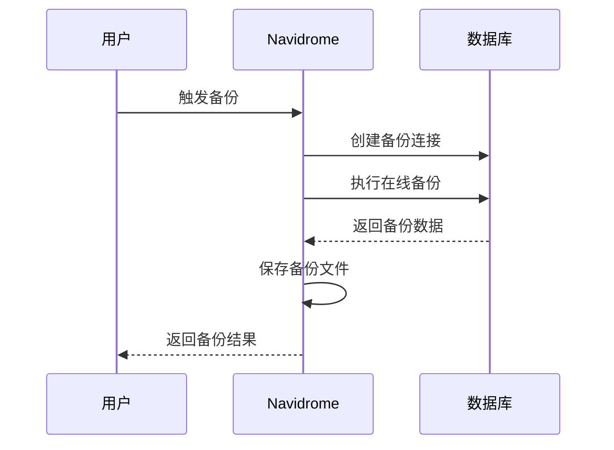
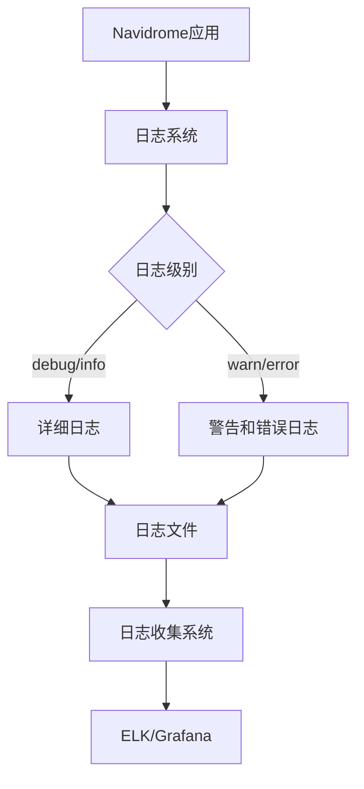

# 生产环境优化

<cite>
**本文档引用的文件**   
- [Dockerfile](file://Dockerfile)
- [docker-compose-caddy.yml](file://contrib/docker-compose/docker-compose-caddy.yml)
- [docker-compose-traefik.yml](file://contrib/docker-compose/docker-compose-traefik.yml)
- [manifest.yml](file://contrib/k8s/manifest.yml)
- [navidrome.toml](file://release/linux/navidrome.toml)
- [prometheus.go](file://core/metrics/prometheus.go)
- [configuration.go](file://conf/configuration.go)
- [db.go](file://db/db.go)
- [backup.go](file://db/backup.go)
</cite>

## 目录
1. [引言](#引言)
2. [高可用性与负载均衡配置](#高可用性与负载均衡配置)
3. [数据库持久化与备份恢复](#数据库持久化与备份恢复)
4. [容器资源限制与健康检查](#容器资源限制与健康检查)
5. [监控与日志集成](#监控与日志集成)
6. [性能调优策略](#性能调优策略)
7. [安全加固措施](#安全加固措施)
8. [多实例部署与水平扩展](#多实例部署与水平扩展)

## 引言
Navidrome是一个开源的基于Web的音乐收藏服务器和流媒体服务，支持Docker部署。本文档深入探讨在生产环境中部署Navidrome时的关键优化策略，涵盖高可用性配置、数据库持久化、备份恢复、资源限制、监控集成、性能调优和安全加固等方面，旨在为用户提供一个稳定、高效、安全的生产环境部署方案。

## 高可用性与负载均衡配置

Navidrome提供了多种生产环境部署的参考配置，包括使用Caddy和Traefik作为反向代理和负载均衡器的Docker Compose配置，以及Kubernetes部署清单。

在`contrib/docker-compose`目录中，提供了两种反向代理配置：
- `docker-compose-caddy.yml`：使用Caddy作为反向代理，配置了HTTPS支持和静态文件服务
- `docker-compose-traefik.yml`：使用Traefik作为反向代理，支持自动SSL证书管理和基于标签的路由配置

Kubernetes部署配置`contrib/k8s/manifest.yml`展示了如何在K8s环境中部署Navidrome，包括命名空间、持久卷声明、Deployment、Service和Ingress的完整配置，支持TLS加密和外部访问。

这些配置文件为生产环境的高可用性部署提供了基础框架，可以根据实际需求进行调整和优化。

**Section sources**
- [docker-compose-caddy.yml](file://contrib/docker-compose/docker-compose-caddy.yml)
- [docker-compose-traefik.yml](file://contrib/docker-compose/docker-compose-traefik.yml)
- [manifest.yml](file://contrib/k8s/manifest.yml)

## 数据库持久化与备份恢复

Navidrome使用SQLite作为其数据库，生产环境中的数据库持久化和备份恢复策略至关重要。

### 数据库持久化
在Docker部署中，通过Docker卷来实现数据库的持久化存储。在`docker-compose-caddy.yml`和`docker-compose-traefik.yml`中，都定义了`navidrome_data`卷，并将其挂载到容器的`/data`目录，确保数据库文件的持久化。

```mermaid
graph TD
A[Navidrome容器] --> B[/data 挂载点]
B --> C[navidrome_data Docker卷]
C --> D[主机文件系统]
```

**Diagram sources **
- [docker-compose-caddy.yml](file://contrib/docker-compose/docker-compose-caddy.yml)
- [docker-compose-traefik.yml](file://contrib/docker-compose/docker-compose-traefik.yml)

### 备份与恢复机制
Navidrome内置了数据库备份和恢复功能，相关代码位于`db/backup.go`。备份机制使用SQLite的在线备份API，可以在数据库运行时进行备份，而不会阻塞其他操作。

备份文件命名遵循时间戳格式，便于管理和恢复。通过`conf/configuration.go`中的`backupOptions`结构体，可以配置备份的保留数量和调度策略。



**Diagram sources **
- [backup.go](file://db/backup.go)
- [configuration.go](file://conf/configuration.go)

**Section sources**
- [backup.go](file://db/backup.go)
- [configuration.go](file://conf/configuration.go)

## 容器资源限制与健康检查

### 容器资源限制
在生产环境中，合理设置容器的CPU和内存限制对于系统稳定性至关重要。虽然提供的配置文件中没有直接的资源限制设置，但可以通过Docker Compose或Kubernetes的资源限制功能来实现。

建议根据实际负载情况设置合理的资源限制：
- 内存：建议至少512MB，对于大型音乐库可能需要1GB或更多
- CPU：建议至少1个核心，对于高并发访问可能需要2个或更多核心

### 健康检查配置
Navidrome提供了健康检查端点，可以在`server/nativeapi/native_api.go`中找到相关代码。健康检查的最佳实践包括：

1. 使用HTTP健康检查端点`/keepalive`
2. 设置合理的检查间隔和超时时间
3. 配置失败阈值和恢复阈值

在Docker Compose配置中，可以添加健康检查配置：

```yaml
healthcheck:
  test: ["CMD", "curl", "-f", "http://localhost:4533/keepalive"]
  interval: 30s
  timeout: 10s
  retries: 3
  start_period: 40s
```

**Section sources**
- [native_api.go](file://server/nativeapi/native_api.go)
- [docker-compose-caddy.yml](file://contrib/docker-compose/docker-compose-caddy.yml)

## 监控与日志集成

### Prometheus监控集成
Navidrome内置了Prometheus监控支持，相关代码位于`core/metrics/prometheus.go`。通过Prometheus可以收集和监控以下指标：

- HTTP请求统计（请求数、延迟）
- 数据库模型数量
- 媒体扫描状态
- 插件请求统计

在`configuration.go`中，可以通过`prometheusOptions`结构体配置Prometheus相关参数：

```go
type prometheusOptions struct {
    Enabled     bool
    MetricsPath string
    Password    string
}
```

建议的监控配置包括：
- 启用Prometheus监控（`ND_PROMETHEUS_ENABLED=true`）
- 设置监控路径（`ND_PROMETHEUS_METRICSPATH=/metrics`）
- 配置访问密码以增强安全性

### 日志收集
Navidrome的日志系统位于`log/`目录，支持多种日志级别和输出格式。生产环境中建议：

1. 将日志输出到文件而非标准输出
2. 配置适当的日志级别（建议`info`或`warn`）
3. 使用日志轮转策略防止日志文件过大

可以通过环境变量`ND_LOGLEVEL`和`ND_LOGFILE`来配置日志行为。



**Diagram sources **
- [prometheus.go](file://core/metrics/prometheus.go)
- [configuration.go](file://conf/configuration.go)
- [log.go](file://log/log.go)

**Section sources**
- [prometheus.go](file://core/metrics/prometheus.go)
- [configuration.go](file://conf/configuration.go)

## 性能调优策略

### 连接池配置
Navidrome的数据库连接池配置在`db/db.go`中：

```go
db.SetMaxOpenConns(max(4, runtime.NumCPU()))
```

这会根据CPU核心数自动设置最大连接数，最小为4。对于高并发环境，可以考虑适当增加连接数。

### 缓存策略
Navidrome实现了多级缓存机制：
1. 转码缓存：缓存转码后的音频文件
2. 图像缓存：缓存专辑封面等图像
3. 插件缓存：缓存插件数据

在`configuration.go`中，可以通过以下参数调整缓存大小：
- `ND_TRANSCODINGCACHESIZE`：转码缓存大小，默认100MB
- `ND_IMAGECACHESIZE`：图像缓存大小，默认100MB
- `ND_PLUGINSCACHESIZE`：插件缓存大小，默认100MB

### 文件系统选择
对于高性能需求，建议：
1. 使用SSD存储音乐文件和数据库
2. 对于临时缓存，可以考虑使用tmpfs（内存文件系统）
3. 确保音乐文件存储有足够的IOPS性能

在`utils/cache/spread_fs.go`中，Navidrome使用了分散式文件系统来优化缓存性能，将缓存文件分散到多个子目录中，避免单个目录文件过多导致的性能问题。

**Section sources**
- [db.go](file://db/db.go)
- [configuration.go](file://conf/configuration.go)
- [spread_fs.go](file://utils/cache/spread_fs.go)

## 安全加固措施

### 非root用户运行
在生产环境中，建议以非root用户运行Navidrome容器。虽然提供的Docker配置中没有明确指定用户，但可以通过以下方式实现：

```yaml
security_opt:
  - no-new-privileges:true
user: "1000:1000"
```

在`contrib/docker-compose/docker-compose-caddy.yml`中，已经注释了用户配置选项，可以根据需要启用。

### 最小权限原则
Navidrome遵循最小权限原则：
1. 容器以只读模式运行（`read_only: true`）
2. 限制容器的系统调用
3. 使用专用的非特权用户

### 网络隔离
建议的网络隔离策略包括：
1. 仅暴露必要的端口（4533）
2. 使用反向代理处理HTTPS和外部访问
3. 在容器网络中启用网络策略

在`cmd/svc.go`中，可以看到系统服务的安全配置，包括：
- `NoNewPrivileges=yes`：禁止获取新权限
- `PrivateTmp=yes`：使用私有临时目录
- `ProtectControlGroups=yes`：保护控制组

这些安全措施确保了Navidrome在生产环境中的安全性。

**Section sources**
- [docker-compose-caddy.yml](file://contrib/docker-compose/docker-compose-caddy.yml)
- [svc.go](file://cmd/svc.go)

## 多实例部署与水平扩展

### 多实例部署策略
Navidrome支持多实例部署，但需要注意以下几点：

1. **共享存储**：所有实例必须共享同一个音乐文件存储和数据库
2. **负载均衡**：使用反向代理（如Traefik或Caddy）进行负载均衡
3. **会话管理**：确保会话信息在实例间共享

### 水平扩展考虑
由于Navidrome使用SQLite数据库，水平扩展存在一些限制：
- SQLite不支持多写入器并发
- 数据库文件必须位于共享存储上
- 建议使用主从架构，一个写入实例，多个读取实例

对于大规模部署，可以考虑：
1. 使用外部数据库（如PostgreSQL）
2. 实现读写分离
3. 使用缓存层减轻数据库压力

在Kubernetes部署中，可以通过调整`replicas`数量来实现水平扩展：

```yaml
spec:
  replicas: 3
```

同时需要确保：
- 持久卷是ReadWriteMany模式
- 数据库连接池配置合理
- 缓存策略适应多实例环境

**Section sources**
- [manifest.yml](file://contrib/k8s/manifest.yml)
- [docker-compose-traefik.yml](file://contrib/docker-compose/docker-compose-traefik.yml)