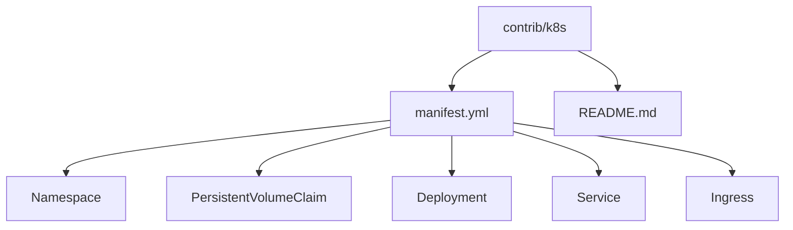
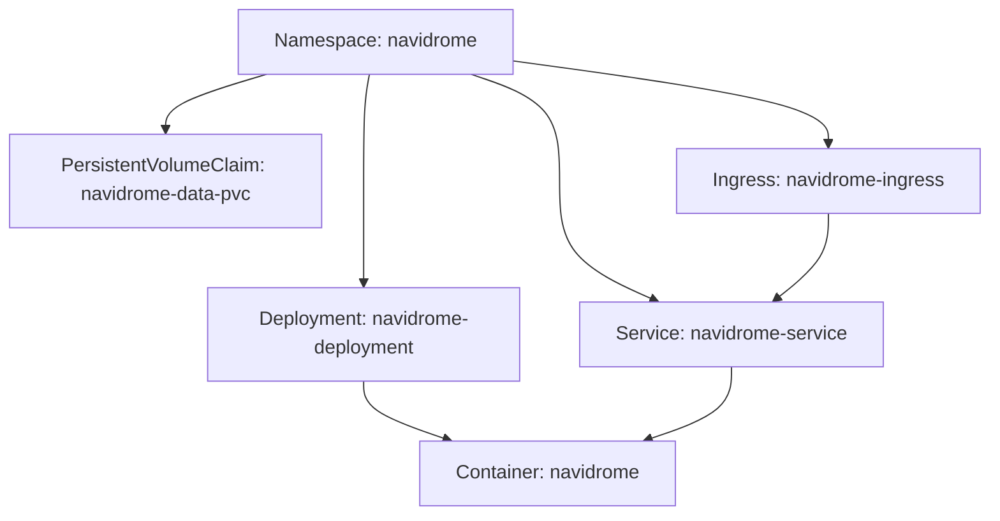
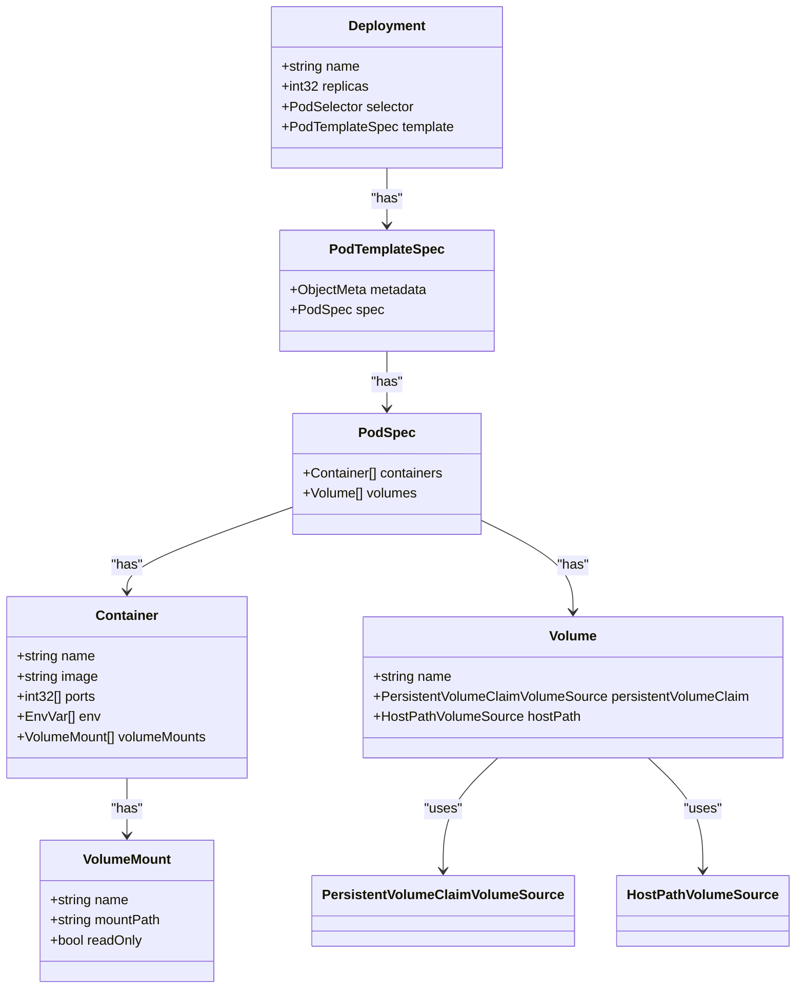
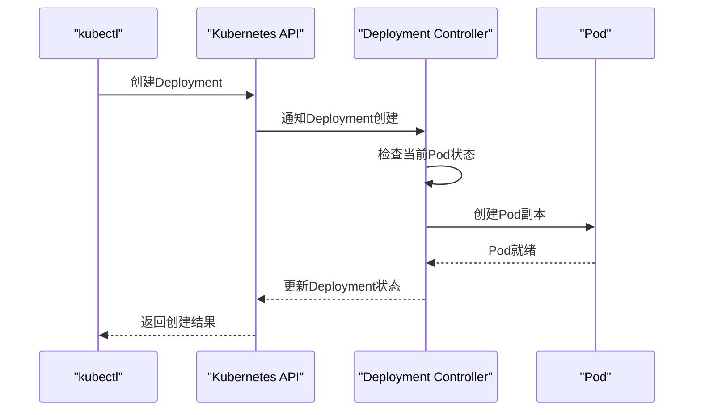
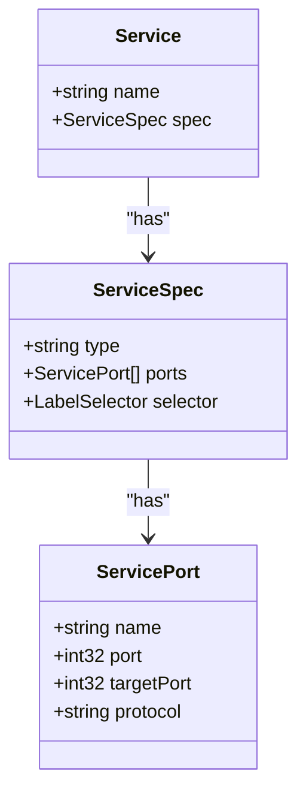
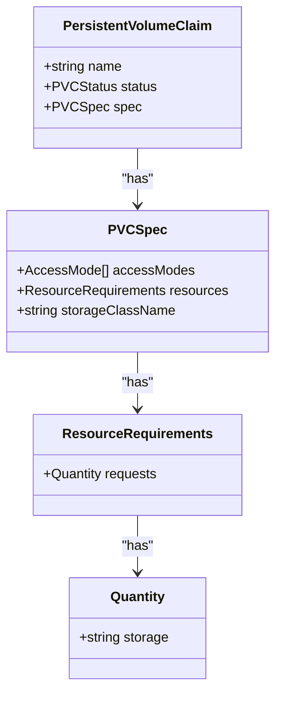
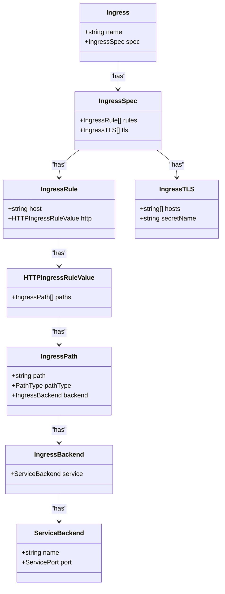
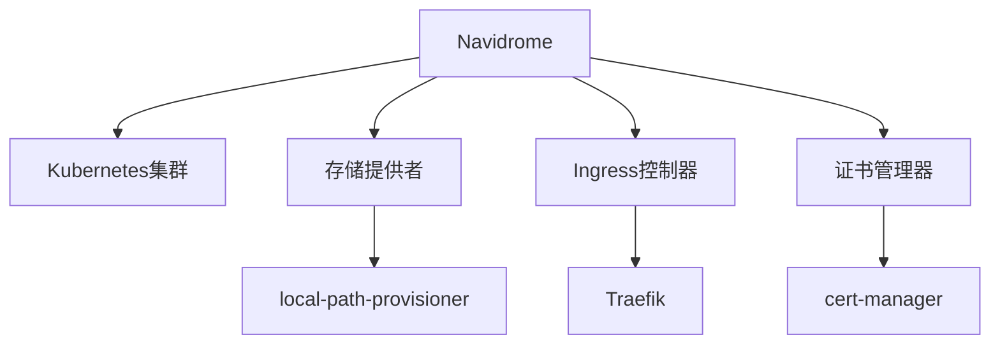

# Kubernetes部署

<cite>
**本文档中引用的文件**  
- [manifest.yml](file://contrib/k8s/manifest.yml)
- [README.md](file://contrib/k8s/README.md)
- [configuration.go](file://conf/configuration.go)
- [Dockerfile](file://Dockerfile)
- [server.go](file://server/server.go)
</cite>

## 目录
1. [简介](#简介)
2. [项目结构](#项目结构)
3. [核心组件](#核心组件)
4. [架构概述](#架构概述)
5. [详细组件分析](#详细组件分析)
6. [依赖分析](#依赖分析)
7. [性能考虑](#性能考虑)
8. [故障排除指南](#故障排除指南)
9. [结论](#结论)

## 简介
Navidrome是一个开源的基于Web的音乐收藏服务器和流媒体服务，允许用户从任何浏览器或移动设备访问自己的音乐收藏。本文档详细说明如何在Kubernetes集群中部署Navidrome，基于`contrib/k8s`目录中的`manifest.yml`文件。文档涵盖了Deployment、Service、PersistentVolumeClaim等Kubernetes资源的配置细节，并提供高可用性部署方案和滚动更新策略。

## 项目结构
Navidrome项目的结构包含多个目录，其中`contrib/k8s`目录包含了Kubernetes部署所需的manifest文件。该目录下的`manifest.yml`文件定义了Navidrome在Kubernetes中的部署配置，包括命名空间、持久卷声明、部署、服务和Ingress资源。

**Diagram sources**
- [manifest.yml](file://contrib/k8s/manifest.yml)

**Section sources**
- [manifest.yml](file://contrib/k8s/manifest.yml)
- [README.md](file://contrib/k8s/README.md)

## 核心组件
Navidrome的核心组件包括音乐服务器、数据库、缓存和Web界面。在Kubernetes部署中，这些组件通过Deployment、Service和PersistentVolumeClaim等资源进行配置和管理。`manifest.yml`文件中的Deployment资源定义了Navidrome容器的镜像、端口、环境变量和卷挂载。

**Section sources**
- [manifest.yml](file://contrib/k8s/manifest.yml)
- [configuration.go](file://conf/configuration.go)

## 架构概述
Navidrome的Kubernetes部署架构包括命名空间、持久卷声明、部署、服务和Ingress资源。命名空间`navidrome`用于隔离Navidrome的资源。持久卷声明`navidrome-data-pvc`为Navidrome的数据库提供持久化存储。部署`navidrome-deployment`定义了Navidrome容器的副本数、选择器和模板。服务`navidrome-service`将Navidrome容器暴露为集群内部的服务。Ingress资源`navidrome-ingress`配置了外部访问Navidrome服务的路由规则。

**Diagram sources**
- [manifest.yml](file://contrib/k8s/manifest.yml)

## 详细组件分析
### Deployment分析
Deployment资源`navidrome-deployment`定义了Navidrome容器的部署配置。它包括副本数、选择器、模板和容器配置。容器配置中指定了Navidrome的镜像、端口、环境变量和卷挂载。

#### 对象导向组件：

**Diagram sources**
- [manifest.yml](file://contrib/k8s/manifest.yml)

#### API/Service组件：

**Diagram sources**
- [manifest.yml](file://contrib/k8s/manifest.yml)

**Section sources**
- [manifest.yml](file://contrib/k8s/manifest.yml)

### Service分析
Service资源`navidrome-service`将Navidrome容器暴露为集群内部的服务。它通过选择器匹配Deployment中的Pod，并将流量路由到这些Pod。

#### 对象导向组件：

**Diagram sources**
- [manifest.yml](file://contrib/k8s/manifest.yml)

### PersistentVolumeClaim分析
PersistentVolumeClaim资源`navidrome-data-pvc`为Navidrome的数据库提供持久化存储。它请求2Gi的存储空间，并使用`local-path`存储类。

#### 对象导向组件：

**Diagram sources**
- [manifest.yml](file://contrib/k8s/manifest.yml)

### Ingress分析
Ingress资源`navidrome-ingress`配置了外部访问Navidrome服务的路由规则。它使用`cert-manager`获取Let's Encrypt TLS证书，并通过Traefik进行路由。

#### 对象导向组件：

**Diagram sources**
- [manifest.yml](file://contrib/k8s/manifest.yml)

## 依赖分析
Navidrome的Kubernetes部署依赖于多个外部组件，包括Kubernetes集群、存储提供者、Ingress控制器和证书管理器。`manifest.yml`文件中的配置需要根据实际环境进行调整，例如存储类名称、音乐文件路径和域名。

**Diagram sources**
- [manifest.yml](file://contrib/k8s/manifest.yml)
- [README.md](file://contrib/k8s/README.md)

**Section sources**
- [manifest.yml](file://contrib/k8s/manifest.yml)
- [README.md](file://contrib/k8s/README.md)

## 性能考虑
在部署Navidrome时，需要考虑资源请求与限制、就绪和存活探针设置。虽然`manifest.yml`文件中没有显式配置资源请求与限制，但建议根据实际负载情况进行配置。就绪和存活探针可以通过HTTP GET请求`/ping`路径来实现，该路径在Navidrome服务器中已配置为心跳检测。

**Section sources**
- [server.go](file://server/server.go)

## 故障排除指南
在部署Navidrome时，可能会遇到配置错误、存储问题或网络问题。建议检查`manifest.yml`文件中的配置是否正确，特别是存储类名称、音乐文件路径和域名。如果遇到证书问题，确保`cert-manager`已正确配置并能够获取Let's Encrypt证书。

**Section sources**
- [manifest.yml](file://contrib/k8s/manifest.yml)
- [README.md](file://contrib/k8s/README.md)

## 结论
本文档详细介绍了如何在Kubernetes集群中部署Navidrome，基于`contrib/k8s`目录中的`manifest.yml`文件。通过配置Deployment、Service、PersistentVolumeClaim和Ingress资源，可以实现Navidrome的高可用性部署。建议根据实际环境调整配置，并考虑资源请求与限制、就绪和存活探针设置以优化性能。