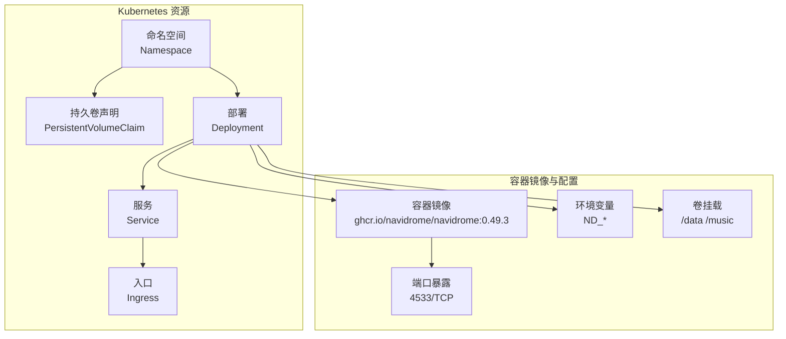
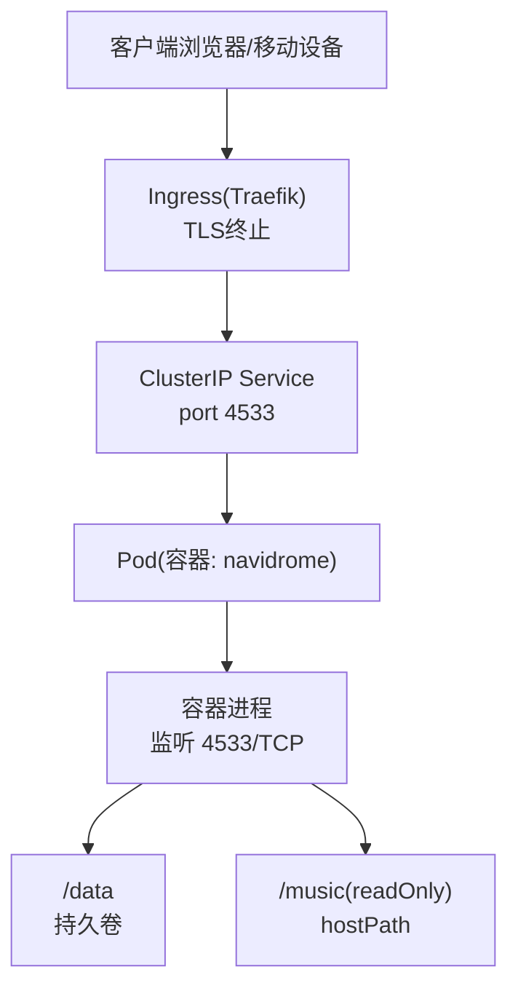
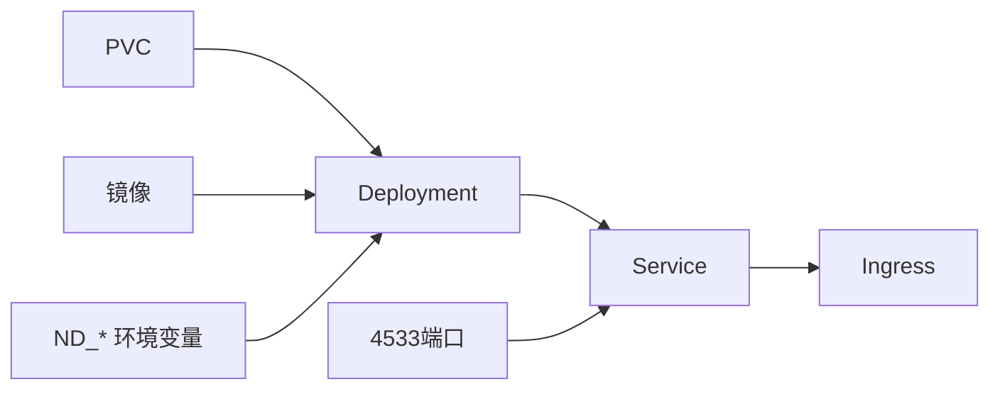

# 基础部署

<cite>
**本文引用的文件列表**
- [manifest.yml](file://contrib/k8s/manifest.yml)
- [README.md](file://contrib/k8s/README.md)
- [Dockerfile](file://Dockerfile)
- [configuration.go](file://conf/configuration.go)
- [root.go](file://cmd/root.go)
</cite>

## 目录
1. [简介](#简介)
2. [项目结构](#项目结构)
3. [核心组件](#核心组件)
4. [架构总览](#架构总览)
5. [详细组件分析](#详细组件分析)
6. [依赖关系分析](#依赖关系分析)
7. [性能考虑](#性能考虑)
8. [故障排查指南](#故障排查指南)
9. [结论](#结论)
10. [附录](#附录)

## 简介
本文件面向希望在Kubernetes上部署Navidrome的用户，基于仓库中的Kubernetes清单文件，系统化讲解Deployment资源配置、容器镜像与环境变量、端口暴露、存储挂载、Service与Ingress集成，以及如何使用kubectl进行部署与验证。同时提供滚动更新策略建议与探针（就绪/存活）配置思路，帮助在生产环境中稳定运行Navidrome。

## 项目结构
本仓库提供了Kubernetes部署所需的清单文件与说明文档：
- contrib/k8s/manifest.yml：包含命名空间、持久卷声明、Deployment、Service与Ingress的完整清单
- contrib/k8s/README.md：对清单使用注意事项的说明
- Dockerfile：容器镜像构建与默认环境变量定义
- conf/configuration.go：后端配置项与默认值来源
- cmd/root.go：服务启动流程入口

图表来源
- [manifest.yml](file://contrib/k8s/manifest.yml#L1-L112)
- [Dockerfile](file://Dockerfile#L125-L147)

章节来源
- [manifest.yml](file://contrib/k8s/manifest.yml#L1-L112)
- [README.md](file://contrib/k8s/README.md#L1-L12)

## 核心组件
- 命名空间：为Navidrome创建独立的资源隔离环境
- 持久卷声明：为数据库与缓存等数据提供本地存储
- Deployment：管理Pod副本、滚动更新策略与模板
- Service：集群内暴露Navidrome服务
- Ingress：对外提供TLS终止与域名访问

章节来源
- [manifest.yml](file://contrib/k8s/manifest.yml#L1-L112)

## 架构总览
下图展示从外部到内部的流量路径与组件交互。

图表来源
- [manifest.yml](file://contrib/k8s/manifest.yml#L73-L112)
- [Dockerfile](file://Dockerfile#L125-L147)

## 详细组件分析

### Deployment 配置详解
- 副本数与历史保留：控制滚动更新与回滚能力
- 选择器标签：用于匹配Pod模板标签
- Pod模板标签：用于Service与Ingress选择
- 容器镜像：使用官方镜像并指定版本
- 端口暴露：容器端口4533映射到Service
- 环境变量：通过ND_前缀配置扫描周期、会话超时、日志级别、转码缓存大小等
- 卷挂载：
  - data：指向PVC，存放数据库与配置
  - music：hostPath挂载宿主机音乐目录，只读
- 存储类与容量：根据集群存储提供器调整

章节来源
- [manifest.yml](file://contrib/k8s/manifest.yml#L22-L72)
- [Dockerfile](file://Dockerfile#L125-L147)

### 容器镜像与环境变量
- 默认端口：容器镜像在构建阶段暴露4533端口
- 默认数据目录：/data（对应ND_DATAFOLDER）
- 默认音乐目录：/music（对应ND_MUSICFOLDER）
- 默认配置文件：/data/navidrome.toml（对应ND_CONFIGFILE）
- 环境变量前缀：ND_，用于覆盖配置项（如ND_SCANSCHEDULE、ND_SESSIONTIMEOUT、ND_LOGLEVEL、ND_TRANSCODINGCACHESIZE等）

章节来源
- [Dockerfile](file://Dockerfile#L125-L147)
- [configuration.go](file://conf/configuration.go#L1-L200)

### 端口暴露与Service
- 容器端口：4533
- Service类型：ClusterIP，目标端口4533，选择器匹配Deployment标签
- 用途：在集群内提供稳定的服务发现与负载均衡

章节来源
- [manifest.yml](file://contrib/k8s/manifest.yml#L73-L87)

### 存储与持久化
- PVC：申请2Gi容量，访问模式ReadWriteOnce，使用local-path存储类
- Pod卷：
  - data：绑定PVC，用于数据库与缓存
  - music：hostPath挂载宿主机音乐目录，readOnly
- 注意事项：需根据实际存储提供器调整storageClassName与宿主机路径

章节来源
- [manifest.yml](file://contrib/k8s/manifest.yml#L8-L21)
- [manifest.yml](file://contrib/k8s/manifest.yml#L58-L72)

### Ingress 与外部访问
- Ingress控制器：Traefik
- TLS：使用cert-manager获取Let’s Encrypt证书
- 主机名：navidrome.${SECRET_INTERNAL_DOMAIN_NAME}（需提前在DNS中配置）
- 路由规则：将/路径转发至Service:4533

章节来源
- [manifest.yml](file://contrib/k8s/manifest.yml#L88-L112)
- [README.md](file://contrib/k8s/README.md#L1-L12)

### 部署与验证步骤
- 应用清单：使用kubectl apply -f contrib/k8s/manifest.yml
- 查看Pod状态：kubectl -n navidrome get pods -w
- 查看事件：kubectl -n navidrome describe pod <pod-name>
- 访问服务：通过Ingress域名访问，或使用kubectl port-forward进行本地验证

章节来源
- [manifest.yml](file://contrib/k8s/manifest.yml#L1-L112)

### 滚动更新策略配置示例
- maxUnavailable：允许的最大不可用副本数（例如0或1）
- maxSurge：允许的最大超出期望副本数（例如1或2）
- 更新策略：RollingUpdate
- 建议：结合就绪探针，确保新Pod完全就绪后再替换旧Pod，降低中断风险

（本节为通用实践说明，不直接引用具体代码文件）

### 探针（就绪/存活）工作原理与重要性
- 存活探针（livenessProbe）：检测容器是否仍在运行，若失败则重启
- 就绪探针（readinessProbe）：检测容器是否已准备好接收流量，未就绪时不会被加入Service后端
- 对Navidrome的重要性：
  - 启动扫描与索引构建需要时间，就绪探针可避免在数据未就绪时接入流量
  - 存活探针可自动恢复异常进程
- 建议：
  - 就绪探针：探测HTTP GET /（或/keepalive），初始延迟适当延长，周期与超时根据集群规模与磁盘I/O调整
  - 存活探针：探测HTTP GET /health（若存在），或使用exec方式检查进程状态

（本节为通用实践说明，不直接引用具体代码文件）

## 依赖关系分析
- Deployment依赖PVC与Service标签选择器
- Service依赖Deployment标签选择器
- Ingress依赖Service名称与端口
- 容器镜像依赖ND_环境变量与默认端口/卷挂载

图表来源
- [manifest.yml](file://contrib/k8s/manifest.yml#L1-L112)
- [Dockerfile](file://Dockerfile#L125-L147)

章节来源
- [manifest.yml](file://contrib/k8s/manifest.yml#L1-L112)
- [Dockerfile](file://Dockerfile#L125-L147)

## 性能考虑
- 扫描与索引：ND_SCANSCHEDULE与ND_SESSIONTIMEOUT影响扫描频率与会话保持，合理设置可平衡性能与实时性
- 转码缓存：ND_TRANSCODINGCACHESIZE影响转码性能与内存占用
- 存储I/O：PVC容量与存储类直接影响扫描与媒体读取性能
- 并发与限流：结合Service层的负载均衡与Ingress的连接数限制，避免过载

（本节为通用指导，不直接引用具体代码文件）

## 故障排查指南
- Pod无法就绪：
  - 检查就绪探针返回状态与日志
  - 确认/health或/keepalive端点可达
- 数据库初始化失败：
  - 检查PVC绑定状态与存储类支持
  - 确认/data目录权限与可用空间
- 外部访问失败：
  - 检查Ingress控制器状态与证书签发
  - 确认DNS解析到正确的Ingress地址
- 环境变量未生效：
  - 确认ND_前缀与键名正确
  - 参考配置项定义与默认值来源

章节来源
- [manifest.yml](file://contrib/k8s/manifest.yml#L1-L112)
- [configuration.go](file://conf/configuration.go#L1-L200)

## 结论
通过本清单，Navidrome可在Kubernetes上实现稳定的单实例部署。建议结合就绪/存活探针与合理的滚动更新策略，确保服务平滑升级与高可用。同时，根据集群与业务规模调整存储、扫描与转码参数，以获得最佳性能与用户体验。

## 附录

### 常用kubectl命令
- 应用清单：kubectl apply -f contrib/k8s/manifest.yml
- 查看Pod：kubectl -n navidrome get pods -w
- 查看事件：kubectl -n navidrome describe pod <pod-name>
- 访问调试：kubectl -n navidrome port-forward svc/navidrome-service 4533:4533

章节来源
- [manifest.yml](file://contrib/k8s/manifest.yml#L1-L112)