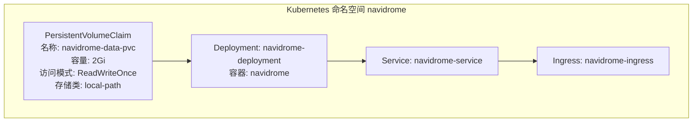
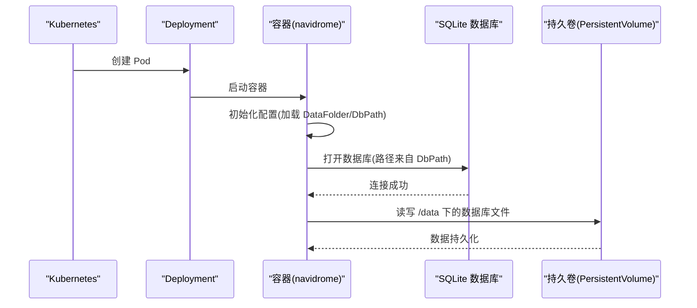
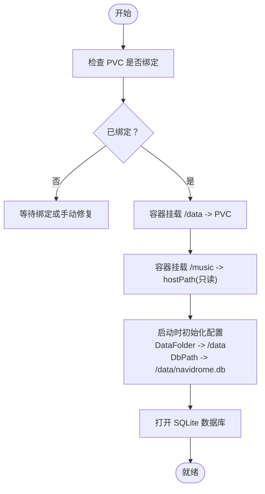
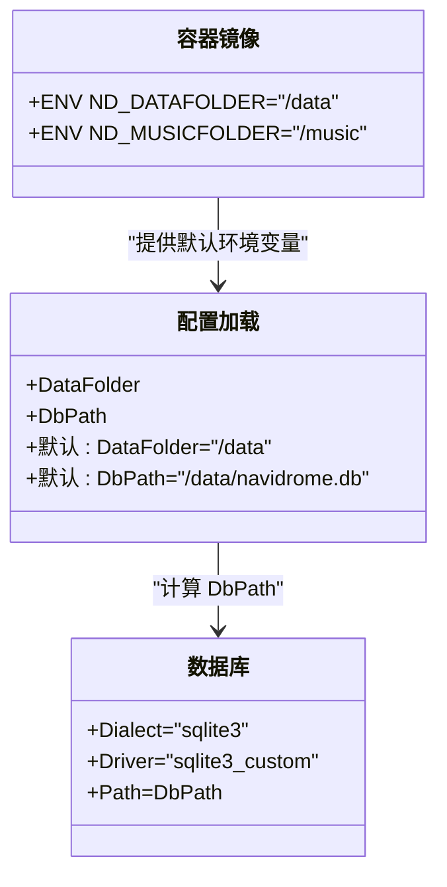
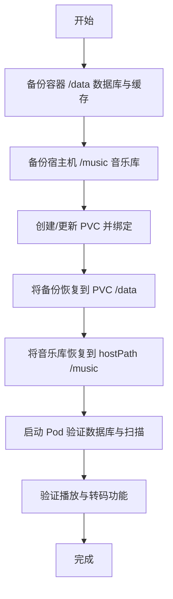
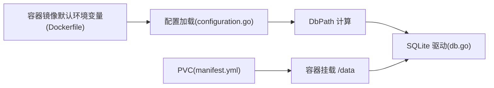

# 存储配置

<cite>
**本文引用的文件**
- [manifest.yml](file://contrib/k8s/manifest.yml)
- [README.md](file://contrib/k8s/README.md)
- [configuration.go](file://conf/configuration.go)
- [consts.go](file://consts/consts.go)
- [db.go](file://db/db.go)
- [Dockerfile](file://Dockerfile)
- [local.go](file://core/storage/local/local.go)
</cite>

## 目录
1. [简介](#简介)
2. [项目结构](#项目结构)
3. [核心组件](#核心组件)
4. [架构总览](#架构总览)
5. [详细组件分析](#详细组件分析)
6. [依赖关系分析](#依赖关系分析)
7. [性能考量](#性能考量)
8. [故障排查指南](#故障排查指南)
9. [结论](#结论)
10. [附录](#附录)

## 简介
本文件面向在 Kubernetes 上部署 Navidrome 的用户，围绕 manifest.yml 中的 PersistentVolumeClaim 配置，系统性说明如何为 Navidrome 持久化存储“音乐库数据”和“数据库文件”。文档涵盖：
- 存储类（StorageClass）选择与访问模式
- 容量规划与数据路径映射
- 不同云平台（AWS EBS、GCP PD、Azure Disk）与本地存储的配置示例
- 数据迁移策略与注意事项

## 项目结构
Navidrome 在 Kubernetes 中通过一个命名空间内的 PVC、Deployment、Service 和 Ingress 组成完整应用。其中 PVC 负责为 Navidrome 的数据目录提供持久化存储；Deployment 将 PVC 挂载到容器内的 /data，同时通过 hostPath 将宿主机上的音乐目录挂载到 /music 并设为只读。

图表来源
- [manifest.yml](file://contrib/k8s/manifest.yml#L1-L112)

章节来源
- [manifest.yml](file://contrib/k8s/manifest.yml#L1-L112)
- [README.md](file://contrib/k8s/README.md#L1-L12)

## 核心组件
- PVC（PersistentVolumeClaim）
  - 名称：navidrome-data-pvc
  - 访问模式：ReadWriteOnce
  - 存储类：local-path
  - 请求容量：2Gi
- Deployment
  - 容器镜像：ghcr.io/navidrome/navidrome:0.49.3
  - 挂载点：
    - /data -> PVC（用于数据库与缓存等）
    - /music -> hostPath（只读，指向宿主机音乐目录）
- Service 与 Ingress
  - Service 暴露 4533 端口
  - Ingress 使用 cert-manager 申请证书并启用 TLS

章节来源
- [manifest.yml](file://contrib/k8s/manifest.yml#L1-L112)
- [README.md](file://contrib/k8s/README.md#L1-L12)

## 架构总览
Navidrome 在容器内使用 SQLite 作为数据库后端，数据库文件位于 DataFolder 下的默认路径。根据配置逻辑，DbPath 默认由 DataFolder 与默认数据库文件名拼接而成。因此，将 PVC 挂载到 /data 即可确保数据库文件持久化。

图表来源
- [configuration.go](file://conf/configuration.go#L294-L306)
- [db.go](file://db/db.go#L30-L57)
- [manifest.yml](file://contrib/k8s/manifest.yml#L58-L71)

章节来源
- [configuration.go](file://conf/configuration.go#L294-L306)
- [db.go](file://db/db.go#L30-L57)
- [manifest.yml](file://contrib/k8s/manifest.yml#L58-L71)

## 详细组件分析

### PVC 配置与数据路径映射
- PVC 关键字段
  - 访问模式：ReadWriteOnce（单节点读写）
  - 存储类：local-path（K3s 内置本地路径提供者）
  - 请求容量：2Gi（用于数据库与缓存）
- 容器挂载
  - /data -> PVC（容器内数据目录）
  - /music -> hostPath（只读，指向宿主机音乐目录）

图表来源
- [manifest.yml](file://contrib/k8s/manifest.yml#L58-L71)
- [configuration.go](file://conf/configuration.go#L294-L306)
- [db.go](file://db/db.go#L30-L57)

章节来源
- [manifest.yml](file://contrib/k8s/manifest.yml#L58-L71)
- [configuration.go](file://conf/configuration.go#L294-L306)
- [db.go](file://db/db.go#L30-L57)

### 数据库文件位置与默认行为
- DbPath 默认值来源于 DataFolder 与默认数据库文件名拼接
- SQLite 驱动注册了自定义连接钩子以支持内置函数
- 容器镜像默认环境变量将 DataFolder 设为 /data，MusicFolder 设为 /music

图表来源
- [configuration.go](file://conf/configuration.go#L294-L306)
- [consts.go](file://consts/consts.go#L12-L15)
- [db.go](file://db/db.go#L30-L57)
- [Dockerfile](file://Dockerfile#L135-L136)

章节来源
- [configuration.go](file://conf/configuration.go#L294-L306)
- [consts.go](file://consts/consts.go#L12-L15)
- [db.go](file://db/db.go#L30-L57)
- [Dockerfile](file://Dockerfile#L135-L136)

### 存储类（StorageClass）与访问模式
- 当前 PVC 使用 storageClassName: local-path（K3s 内置）
- 访问模式为 ReadWriteOnce，适用于单副本部署
- 若需多副本或共享读写，请评估云厂商提供的共享块存储（例如 AWS EBS、GCP PD、Azure Disk），并在后续章节给出示例

章节来源
- [manifest.yml](file://contrib/k8s/manifest.yml#L1-L20)

### 容量规划与数据增长
- PVC 初始容量为 2Gi，主要用于数据库与缓存
- 实际运行中建议根据音乐库规模、转码缓存大小与日志量适当扩容
- 可通过调整 PVC 请求容量或更换更大容量的存储类来满足需求

章节来源
- [manifest.yml](file://contrib/k8s/manifest.yml#L15-L20)
- [README.md](file://contrib/k8s/README.md#L1-L12)

### 云平台与本地存储配置示例

说明
- 以下为配置思路与示例字段，不直接粘贴具体代码内容，请按需参考对应文件行号进行对照实现。

- AWS EBS（单节点）
  - 存储类：kubernetes.io/aws-ebs（需集群具备相应 CSI 驱动）
  - 访问模式：ReadWriteOnce
  - 示例字段（请在 PVC 中替换 storageClassName 与参数）
    - storageClassName: kubernetes.io/aws-ebs
    - resources.requests.storage: 50Gi 或更高
    - 卷参数（示例字段）：type: gp3, fsType: ext4

- GCP Persistent Disk（单节点）
  - 存储类：pd.csi.storage.gke.io（或 legacy 存储类）
  - 访问模式：ReadWriteOnce
  - 示例字段（请在 PVC 中替换 storageClassName 与参数）
    - storageClassName: pd-balanced
    - resources.requests.storage: 50Gi 或更高
    - 卷参数（示例字段）：type: balanced, fstype: ext4

- Azure Disk（单节点）
  - 存储类：disk.csi.azure.com（或 azure-disk）
  - 访问模式：ReadWriteOnce
  - 示例字段（请在 PVC 中替换 storageClassName 与参数）
    - storageClassName: managed-csi
    - resources.requests.storage: 50Gi 或更高
    - 卷参数（示例字段）：skuName: Premium_LRS, fsType: ext4

- 本地存储（K3s local-path）
  - 存储类：local-path（当前 manifest 已使用）
  - 访问模式：ReadWriteOnce
  - 示例字段（当前已配置）
    - storageClassName: local-path
    - resources.requests.storage: 2Gi

章节来源
- [manifest.yml](file://contrib/k8s/manifest.yml#L1-L20)
- [README.md](file://contrib/k8s/README.md#L1-L12)

### 迁移现有数据到 Kubernetes 持久卷

步骤概览
- 备份
  - 备份容器内 /data 下的数据库文件与缓存目录
  - 备份宿主机 /music 下的音乐库
- 准备 PVC
  - 创建或修改 PVC，确保 storageClassName 与容量满足需求
  - 确认 PVC 绑定状态
- 迁移
  - 将备份的数据库文件与缓存恢复到 PVC 对应目录（/data）
  - 将音乐库从宿主机复制到 hostPath 指向的目录（/music）
- 验证
  - 启动 Pod，确认数据库可正常打开且扫描任务可执行
  - 检查播放与转码功能是否正常

图表来源
- [manifest.yml](file://contrib/k8s/manifest.yml#L58-L71)
- [configuration.go](file://conf/configuration.go#L294-L306)
- [db.go](file://db/db.go#L30-L57)

章节来源
- [manifest.yml](file://contrib/k8s/manifest.yml#L58-L71)
- [configuration.go](file://conf/configuration.go#L294-L306)
- [db.go](file://db/db.go#L30-L57)

## 依赖关系分析
- 配置层
  - DataFolder 与 DbPath 的解析逻辑决定了数据库文件的实际位置
- 数据库层
  - SQLite 驱动注册与连接钩子保证数据库可用性
- 容器层
  - Dockerfile 默认环境变量将 DataFolder 设为 /data，MusicFolder 设为 /music
- 存储层
  - PVC 与 Deployment 的挂载关系决定数据持久化路径

图表来源
- [configuration.go](file://conf/configuration.go#L294-L306)
- [db.go](file://db/db.go#L30-L57)
- [Dockerfile](file://Dockerfile#L135-L136)
- [manifest.yml](file://contrib/k8s/manifest.yml#L58-L71)

章节来源
- [configuration.go](file://conf/configuration.go#L294-L306)
- [db.go](file://db/db.go#L30-L57)
- [Dockerfile](file://Dockerfile#L135-L136)
- [manifest.yml](file://contrib/k8s/manifest.yml#L58-L71)

## 性能考量
- 访问模式
  - ReadWriteOnce 适合单副本部署；若需要多副本共享读写，需评估云厂商共享块存储能力与延迟
- 存储类
  - 选择具备低延迟与高吞吐的存储类，有助于提升扫描与转码性能
- 缓存与转码
  - 转码缓存大小可通过环境变量控制，结合 PVC 容量合理规划
- 文件系统
  - 云盘建议使用 ext4 或 xfs 等现代文件系统，确保 inode 与目录项性能

[本节为通用指导，无需列出具体文件来源]

## 故障排查指南
- PVC 无法绑定
  - 检查 storageClassName 是否正确，以及集群是否安装对应 CSI 驱动
  - 检查节点存储资源是否充足
- 数据库无法打开
  - 确认 /data 目录存在且可写
  - 检查 DbPath 是否指向正确的数据库文件路径
- 音乐库不可读
  - 确认 hostPath 路径正确且权限允许
  - 确认挂载为只读模式符合预期
- 扫描失败
  - 检查扫描调度与日志输出
  - 确认磁盘空间充足

章节来源
- [manifest.yml](file://contrib/k8s/manifest.yml#L58-L71)
- [configuration.go](file://conf/configuration.go#L294-L306)
- [db.go](file://db/db.go#L30-L57)

## 结论
- 通过 PVC 将 /data 挂载到 Navidrome 的数据目录，即可实现数据库与缓存的持久化
- 当前示例使用 K3s 的 local-path 存储类与 ReadWriteOnce 访问模式，适合单副本部署
- 如需多副本或跨节点共享，应评估云厂商共享块存储方案并相应调整 PVC 配置
- 迁移时务必先备份，再恢复至 PVC 与 hostPath，最后验证服务可用性

[本节为总结，无需列出具体文件来源]

## 附录

### 关键配置要点对照
- PVC
  - storageClassName: local-path
  - accessModes: ReadWriteOnce
  - resources.requests.storage: 2Gi
- Deployment
  - /data -> PVC
  - /music -> hostPath(只读)
- 镜像默认环境变量
  - ND_DATAFOLDER=/data
  - ND_MUSICFOLDER=/music
- 数据库路径
  - DbPath 默认为 /data/navidrome.db

章节来源
- [manifest.yml](file://contrib/k8s/manifest.yml#L1-L112)
- [Dockerfile](file://Dockerfile#L135-L136)
- [consts.go](file://consts/consts.go#L12-L15)
- [configuration.go](file://conf/configuration.go#L294-L306)
- [db.go](file://db/db.go#L30-L57)