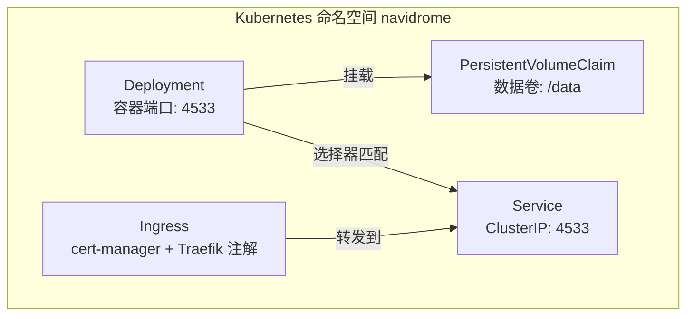
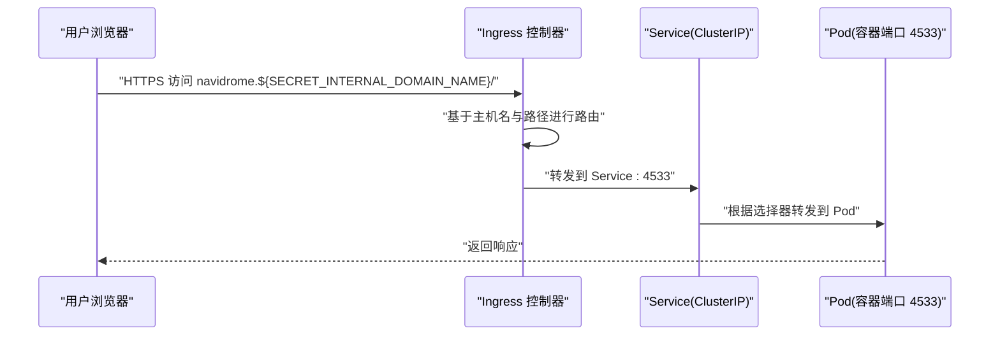
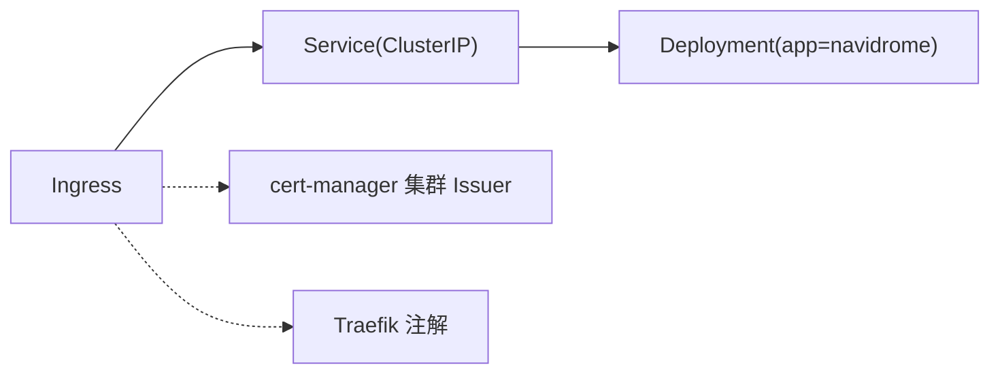

# 网络配置

<cite>
**本文引用的文件**
- [contrib/k8s/manifest.yml](file://contrib/k8s/manifest.yml)
- [contrib/k8s/README.md](file://contrib/k8s/README.md)
- [contrib/docker-compose/docker-compose-traefik.yml](file://contrib/docker-compose/docker-compose-traefik.yml)
- [contrib/docker-compose/docker-compose-caddy.yml](file://contrib/docker-compose/docker-compose-caddy.yml)
- [contrib/docker-compose/Caddyfile](file://contrib/docker-compose/Caddyfile)
- [README.md](file://README.md)
</cite>

## 目录
1. [简介](#简介)
2. [项目结构](#项目结构)
3. [核心组件](#核心组件)
4. [架构总览](#架构总览)
5. [详细组件分析](#详细组件分析)
6. [依赖关系分析](#依赖关系分析)
7. [性能考量](#性能考量)
8. [故障排查指南](#故障排查指南)
9. [结论](#结论)
10. [附录](#附录)

## 简介
本文件面向在 Kubernetes 上部署 Navidrome 的用户，围绕 manifest.yml 中的 Service 与 Ingress 配置，系统性说明如何将 Navidrome 暴露到外部网络，并对比 ClusterIP、NodePort、LoadBalancer 三种 Service 类型的差异与适用场景。同时，结合仓库中提供的 Traefik 与 Caddy 反向代理示例，给出 Ingress 控制器（如 Nginx、Traefik）的配置要点，包括 TLS 终止、域名与路径路由规则，以及与 README.md 中“外部访问与反向代理”的整体方案衔接。

## 项目结构
本项目的 K8s 部署清单位于 contrib/k8s/manifest.yml，配套说明位于 contrib/k8s/README.md；反向代理示例位于 contrib/docker-compose 下的 docker-compose-traefik.yml、docker-compose-caddy.yml 与 Caddyfile。这些文件共同构成了从 Pod 到 Ingress、再到外部访问的端到端网络拓扑。

图表来源
- [contrib/k8s/manifest.yml](file://contrib/k8s/manifest.yml#L22-L72)
- [contrib/k8s/manifest.yml](file://contrib/k8s/manifest.yml#L73-L87)
- [contrib/k8s/manifest.yml](file://contrib/k8s/manifest.yml#L88-L112)

章节来源
- [contrib/k8s/manifest.yml](file://contrib/k8s/manifest.yml#L1-L112)
- [contrib/k8s/README.md](file://contrib/k8s/README.md#L1-L12)

## 核心组件
- Service（ClusterIP）
  - 类型：ClusterIP
  - 监听端口：4533（目标端口为容器端口 4533）
  - 选择器：app=navidrome
  - 作用：在集群内部为 Deployment 提供稳定网络接入点
- Ingress
  - 使用注解启用 cert-manager 证书签发与 Traefik 路由器 TLS
  - 规则：主机名为 navidrome.${SECRET_INTERNAL_DOMAIN_NAME}，根路径 /
  - TLS：针对同一主机名申请并绑定 TLS 密钥
- 反向代理参考
  - Traefik：通过 Ingress 注解启用 TLS 与证书解析器
  - Caddy：通过 Caddyfile 将请求反代至 navidrome:4533

章节来源
- [contrib/k8s/manifest.yml](file://contrib/k8s/manifest.yml#L73-L87)
- [contrib/k8s/manifest.yml](file://contrib/k8s/manifest.yml#L88-L112)
- [contrib/docker-compose/docker-compose-traefik.yml](file://contrib/docker-compose/docker-compose-traefik.yml#L1-L52)
- [contrib/docker-compose/docker-compose-caddy.yml](file://contrib/docker-compose/docker-compose-caddy.yml#L1-L32)
- [contrib/docker-compose/Caddyfile](file://contrib/docker-compose/Caddyfile#L1-L7)

## 架构总览
下图展示了从浏览器到 Navidrome 的典型访问链路，强调 Ingress 在 TLS 终止、域名与路径路由上的作用，以及 Service 在集群内的负载均衡。

图表来源
- [contrib/k8s/manifest.yml](file://contrib/k8s/manifest.yml#L88-L112)
- [contrib/k8s/manifest.yml](file://contrib/k8s/manifest.yml#L73-L87)

## 详细组件分析

### Service（ClusterIP）
- 作用
  - 为 Deployment 暴露稳定的集群内网络入口，便于 Ingress 或集群内其他服务访问
- 端口映射
  - 目标端口：4533（容器端口）
  - Service 端口：4533
- 选择器
  - app=navidrome，确保流量被正确路由到 Navidrome Pod
- 适用场景
  - 仅需在集群内部访问或通过 Ingress 暴露到外部时使用

章节来源
- [contrib/k8s/manifest.yml](file://contrib/k8s/manifest.yml#L73-L87)

### Ingress（TLS 终止与路由）
- 主机与路径
  - 主机：navidrome.${SECRET_INTERNAL_DOMAIN_NAME}
  - 路径：/
- TLS
  - 使用 cert-manager 与 Let's Encrypt 签发证书
  - 指定 Traefik 路由器 TLS 开启
  - 证书密钥名称：navidrome-tls
- 注解
  - cert-manager.io/cluster-issuer：指定集群 Issuer
  - traefik.ingress.kubernetes.io/router.tls：启用 Traefik 路由器 TLS
- 适用场景
  - 需要通过域名与路径对外提供服务，且希望在 Ingress 层完成 TLS 终止

章节来源
- [contrib/k8s/manifest.yml](file://contrib/k8s/manifest.yml#L88-L112)
- [contrib/k8s/README.md](file://contrib/k8s/README.md#L9-L12)

### 反向代理参考（Traefik 与 Caddy）
- Traefik
  - 通过 Ingress 注解启用 TLS 与证书解析器
  - 路由规则与负载均衡器端口指向 4533
- Caddy
  - 通过 Caddyfile 的 reverse_proxy 将请求转发至 navidrome:4533
  - 自动处理 HTTP/HTTPS 与证书（可选）

章节来源
- [contrib/docker-compose/docker-compose-traefik.yml](file://contrib/docker-compose/docker-compose-traefik.yml#L1-L52)
- [contrib/docker-compose/docker-compose-caddy.yml](file://contrib/docker-compose/docker-compose-caddy.yml#L1-L32)
- [contrib/docker-compose/Caddyfile](file://contrib/docker-compose/Caddyfile#L1-L7)

### Service 类型对比（ClusterIP vs NodePort vs LoadBalancer）
- ClusterIP
  - 仅在集群内可达，适合与 Ingress/网关配合对外暴露
  - 优点：简单、安全、默认
  - 适用：Ingress 控制器统一管理外网入口
- NodePort
  - 在每个节点开放一个端口，直接对外暴露
  - 优点：无需额外网关即可从节点 IP 访问
  - 缺点：端口暴露面大，需防火墙策略控制
  - 适用：测试环境或无 Ingress 的简单场景
- LoadBalancer
  - 由云厂商或外部 LB 提供公网 IP
  - 优点：天然具备公网入口，便于 TLS 证书与域名绑定
  - 缺点：成本较高，可能受云厂商限制
  - 适用：生产环境需要稳定公网入口

（本节为通用概念说明，不直接分析具体文件）

### 外部访问与反向代理的完整方案
- 方案一：Ingress + cert-manager + Traefik（推荐）
  - Ingress 负责域名、路径与 TLS 终止
  - cert-manager 自动签发与续期证书
  - Traefik 作为 Ingress 控制器进行路由与转发
- 方案二：Ingress + cert-manager + Nginx Ingress Controller
  - 使用 Nginx Ingress Controller 替代 Traefik
  - 通过注解实现 TLS 与路由规则
- 方案三：Service（LoadBalancer）+ 反向代理（Traefik/Caddy）
  - 通过 LoadBalancer 获取公网 IP
  - 在集群外部署 Traefik/Caddy，负责 TLS 与反向代理

章节来源
- [contrib/k8s/README.md](file://contrib/k8s/README.md#L9-L12)
- [README.md](file://README.md#L69-L89)

## 依赖关系分析
- Ingress 依赖 Service 的选择器与端口
- Service 依赖 Deployment 的标签选择器
- Ingress TLS 依赖 cert-manager 与集群 Issuer
- Traefik 注解用于启用路由器 TLS 与证书解析器

图表来源
- [contrib/k8s/manifest.yml](file://contrib/k8s/manifest.yml#L73-L112)

章节来源
- [contrib/k8s/manifest.yml](file://contrib/k8s/manifest.yml#L73-L112)

## 性能考量
- Ingress 层 TLS 终止可减轻后端 Pod 的 CPU 压力，适合高并发场景
- 合理设置 Ingress 注解（如超时、缓冲区大小）以提升稳定性
- 若使用 LoadBalancer，建议结合限流与 WAF 策略，避免直接暴露在公网

（本节提供一般性指导，不直接分析具体文件）

## 故障排查指南
- DNS 未解析到 Ingress
  - 确认域名 navidrome.${SECRET_INTERNAL_DOMAIN_NAME} 已正确解析到 Ingress 控制器地址
- 证书签发失败
  - 检查 cert-manager 的集群 Issuer 配置与 DNS TXT 记录
  - 确认 Ingress 注解中 cluster-issuer 名称正确
- TLS 握手失败
  - 检查 Ingress TLS 配置与证书密钥名称是否一致
  - 确认 Traefik 注解 router.tls 已启用
- 路由不生效
  - 核对 Ingress 规则中的主机名与路径
  - 确认 Service 选择器与 Pod 标签一致

章节来源
- [contrib/k8s/manifest.yml](file://contrib/k8s/manifest.yml#L88-L112)
- [contrib/k8s/README.md](file://contrib/k8s/README.md#L9-L12)

## 结论
通过 ClusterIP Service 与 Ingress 的组合，Navidrome 可以安全、可控地对外提供服务。结合 cert-manager 与 Traefik 注解，可在 Ingress 层完成 TLS 终止与域名路由。对于不同环境，也可考虑 NodePort 或 LoadBalancer 的 Service 类型，或在集群外部署 Traefik/Caddy 作为反向代理。最终方案应综合安全、成本与运维复杂度进行取舍。

（本节为总结性内容，不直接分析具体文件）

## 附录
- 参考文档链接
  - 项目文档首页与安装说明：见 README.md 文档链接
- 示例文件路径
  - K8s 清单：contrib/k8s/manifest.yml
  - K8s 说明：contrib/k8s/README.md
  - Traefik 示例：contrib/docker-compose/docker-compose-traefik.yml
  - Caddy 示例：contrib/docker-compose/docker-compose-caddy.yml 与 Caddyfile

章节来源
- [README.md](file://README.md#L69-L89)
- [contrib/k8s/manifest.yml](file://contrib/k8s/manifest.yml#L1-L112)
- [contrib/k8s/README.md](file://contrib/k8s/README.md#L1-L12)
- [contrib/docker-compose/docker-compose-traefik.yml](file://contrib/docker-compose/docker-compose-traefik.yml#L1-L52)
- [contrib/docker-compose/docker-compose-caddy.yml](file://contrib/docker-compose/docker-compose-caddy.yml#L1-L32)
- [contrib/docker-compose/Caddyfile](file://contrib/docker-compose/Caddyfile#L1-L7)