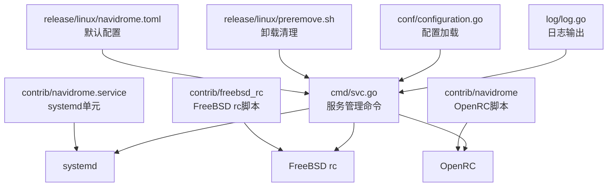
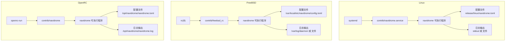
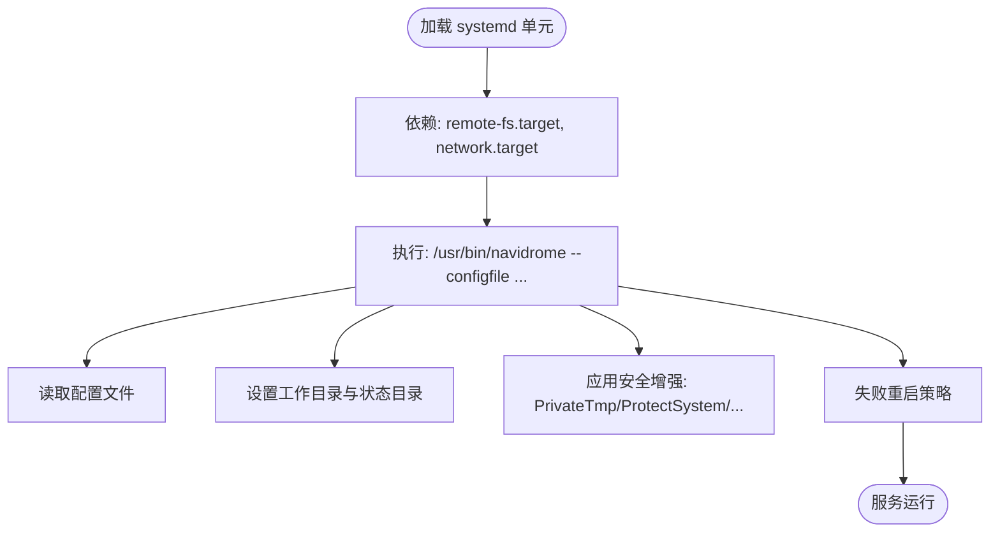
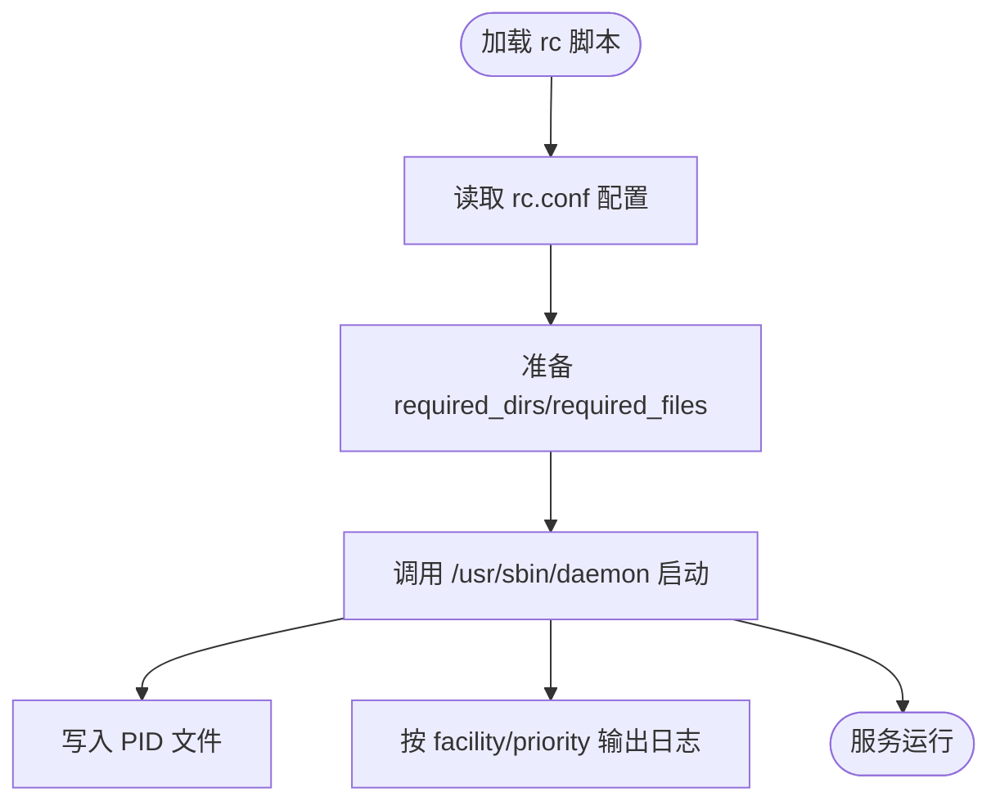
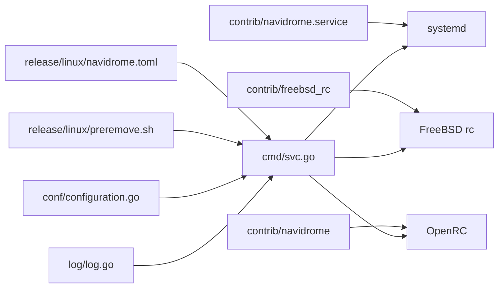

# 系统服务部署

<cite>
**本文引用的文件**
- [contrib/navidrome.service](file://contrib/navidrome.service)
- [contrib/freebsd_rc](file://contrib/freebsd_rc)
- [contrib/navidrome](file://contrib/navidrome)
- [cmd/svc.go](file://cmd/svc.go)
- [release/linux/navidrome.toml](file://release/linux/navidrome.toml)
- [release/linux/preremove.sh](file://release/linux/preremove.sh)
- [conf/configuration.go](file://conf/configuration.go)
- [log/log.go](file://log/log.go)
</cite>

## 目录
1. [简介](#简介)
2. [项目结构](#项目结构)
3. [核心组件](#核心组件)
4. [架构总览](#架构总览)
5. [详细组件分析](#详细组件分析)
6. [依赖关系分析](#依赖关系分析)
7. [性能与安全考量](#性能与安全考量)
8. [故障排查指南](#故障排查指南)
9. [结论](#结论)
10. [附录](#附录)

## 简介
本文件面向在Linux与FreeBSD系统上以系统服务方式运行Navidrome的用户，基于仓库中的服务配置文件与相关实现，系统性说明如何将Navidrome配置为系统服务，涵盖：
- systemd服务单元文件的关键配置项与含义（启动脚本、环境变量、用户权限、重启策略等）
- FreeBSD rc脚本的使用方法
- 服务状态管理命令（启动、停止、重启、查看状态）、日志查看方法与开机自启配置
- 安全最佳实践（使用专用系统用户运行服务）

## 项目结构
与系统服务部署直接相关的核心文件位于contrib目录，并由命令行子命令与配置加载逻辑支撑：
- Linux systemd单元：contrib/navidrome.service
- FreeBSD rc脚本：contrib/freebsd_rc
- OpenRC服务脚本：contrib/navidrome
- 服务管理命令：cmd/svc.go
- 默认配置模板：release/linux/navidrome.toml
- 卸载清理脚本：release/linux/preremove.sh
- 配置加载与日志输出：conf/configuration.go、log/log.go

图表来源
- [contrib/navidrome.service](file://contrib/navidrome.service#L1-L55)
- [contrib/freebsd_rc](file://contrib/freebsd_rc#L1-L53)
- [contrib/navidrome](file://contrib/navidrome#L1-L16)
- [cmd/svc.go](file://cmd/svc.go#L1-L245)
- [release/linux/navidrome.toml](file://release/linux/navidrome.toml#L1-L3)
- [release/linux/preremove.sh](file://release/linux/preremove.sh#L1-L30)
- [conf/configuration.go](file://conf/configuration.go#L275-L319)
- [log/log.go](file://log/log.go#L59-L297)

章节来源
- [contrib/navidrome.service](file://contrib/navidrome.service#L1-L55)
- [contrib/freebsd_rc](file://contrib/freebsd_rc#L1-L53)
- [contrib/navidrome](file://contrib/navidrome#L1-L16)
- [cmd/svc.go](file://cmd/svc.go#L1-L245)
- [release/linux/navidrome.toml](file://release/linux/navidrome.toml#L1-L3)
- [release/linux/preremove.sh](file://release/linux/preremove.sh#L1-L30)
- [conf/configuration.go](file://conf/configuration.go#L275-L319)
- [log/log.go](file://log/log.go#L59-L297)

## 核心组件
- systemd单元文件：定义服务用户、工作目录、执行命令、重启策略、安全强化参数等
- FreeBSD rc脚本：定义服务启动参数、用户/组、数据目录、PID文件与守护进程调用
- OpenRC脚本：定义OpenRC下的启动参数、用户、日志路径与后台运行
- 服务管理命令：通过统一的service接口封装不同平台的安装/卸载/启动/停止/状态查询
- 默认配置模板：提供DataFolder、MusicFolder等关键路径的示例
- 卸载清理脚本：在包移除时尝试卸载服务并提示残留文件位置
- 配置加载与日志：根据配置决定日志输出目标与级别

章节来源
- [contrib/navidrome.service](file://contrib/navidrome.service#L1-L55)
- [contrib/freebsd_rc](file://contrib/freebsd_rc#L1-L53)
- [contrib/navidrome](file://contrib/navidrome#L1-L16)
- [cmd/svc.go](file://cmd/svc.go#L1-L245)
- [release/linux/navidrome.toml](file://release/linux/navidrome.toml#L1-L3)
- [release/linux/preremove.sh](file://release/linux/preremove.sh#L1-L30)
- [conf/configuration.go](file://conf/configuration.go#L275-L319)
- [log/log.go](file://log/log.go#L59-L297)

## 架构总览
下图展示Navidrome作为系统服务的总体交互：系统服务管理器（systemd/OpenRC）加载单元/脚本，调用可执行程序并按配置运行；配置文件控制日志输出与数据目录；卸载脚本负责清理。

图表来源
- [contrib/navidrome.service](file://contrib/navidrome.service#L1-L55)
- [contrib/freebsd_rc](file://contrib/freebsd_rc#L1-L53)
- [contrib/navidrome](file://contrib/navidrome#L1-L16)
- [release/linux/navidrome.toml](file://release/linux/navidrome.toml#L1-L3)

## 详细组件分析

### systemd服务单元文件（Linux）
该单元文件用于在支持systemd的Linux发行版中以服务形式运行Navidrome。关键要点如下：
- 启动与依赖
  - 在网络与远程文件系统就绪后启动
  - 执行命令指向可执行文件，并通过配置文件参数指定配置路径
- 用户与权限
  - 使用专用用户与组运行服务
  - 通过多种systemd安全增强选项限制能力、命名空间、系统保护等
- 工作目录与状态目录
  - 设置工作目录与StateDirectory，便于数据持久化
- 重启策略与超时
  - 失败自动重启，设置停止超时
- 环境与日志
  - 可通过EnvironmentFile读取环境变量
  - 通过UMask限制新建文件权限

图表来源
- [contrib/navidrome.service](file://contrib/navidrome.service#L1-L55)

章节来源
- [contrib/navidrome.service](file://contrib/navidrome.service#L1-L55)

### FreeBSD rc脚本
FreeBSD用户可通过该脚本将Navidrome注册为系统服务：
- 启停参数
  - 使用/usr/sbin/daemon以守护进程方式启动
  - 支持facility与priority等日志设施参数
- 运行用户与组
  - 可通过rc.conf变量设置运行用户/组
- 数据目录与配置
  - 默认配置路径与数据目录可在rc.conf中覆盖
- PID文件
  - 指定PID文件位置，便于监控与管理

图表来源
- [contrib/freebsd_rc](file://contrib/freebsd_rc#L1-L53)

章节来源
- [contrib/freebsd_rc](file://contrib/freebsd_rc#L1-L53)

### OpenRC脚本（OpenBSD/部分Linux发行版）
OpenRC用户可使用该脚本进行服务管理：
- 启停与依赖
  - 依赖网络服务
  - 后台运行，记录标准输出与错误日志到指定文件
- 用户与工作目录
  - 以服务名为用户运行，工作目录为/opt/navidrome

章节来源
- [contrib/navidrome](file://contrib/navidrome#L1-L16)

### 服务管理命令（跨平台）
Navidrome内置统一的服务管理命令，支持安装/卸载/启动/停止/状态查询，并在不同平台上生成合适的systemd脚本或使用本地服务管理器：
- 安装服务：可指定运行用户与工作目录，打印安装信息并调用底层安装
- 卸载服务：不删除音乐与数据目录
- 启动/停止/状态：通过service接口统一管理
- 日志输出：优先使用配置文件中的日志文件，否则输出到数据目录

图表来源
- [cmd/svc.go](file://cmd/svc.go#L1-L245)
- [conf/configuration.go](file://conf/configuration.go#L275-L319)
- [log/log.go](file://log/log.go#L59-L297)

章节来源
- [cmd/svc.go](file://cmd/svc.go#L1-L245)
- [conf/configuration.go](file://conf/configuration.go#L275-L319)
- [log/log.go](file://log/log.go#L59-L297)

## 依赖关系分析
- systemd单元依赖network.target与remote-fs.target，确保网络与存储可用后再启动
- 服务管理命令依赖配置加载模块，根据配置决定日志输出目标
- 卸载脚本在包移除时尝试卸载服务并提示残留文件位置

图表来源
- [contrib/navidrome.service](file://contrib/navidrome.service#L1-L55)
- [contrib/freebsd_rc](file://contrib/freebsd_rc#L1-L53)
- [contrib/navidrome](file://contrib/navidrome#L1-L16)
- [cmd/svc.go](file://cmd/svc.go#L1-L245)
- [release/linux/navidrome.toml](file://release/linux/navidrome.toml#L1-L3)
- [release/linux/preremove.sh](file://release/linux/preremove.sh#L1-L30)
- [conf/configuration.go](file://conf/configuration.go#L275-L319)
- [log/log.go](file://log/log.go#L59-L297)

章节来源
- [contrib/navidrome.service](file://contrib/navidrome.service#L1-L55)
- [contrib/freebsd_rc](file://contrib/freebsd_rc#L1-L53)
- [contrib/navidrome](file://contrib/navidrome#L1-L16)
- [cmd/svc.go](file://cmd/svc.go#L1-L245)
- [release/linux/navidrome.toml](file://release/linux/navidrome.toml#L1-L3)
- [release/linux/preremove.sh](file://release/linux/preremove.sh#L1-L30)
- [conf/configuration.go](file://conf/configuration.go#L275-L319)
- [log/log.go](file://log/log.go#L59-L297)

## 性能与安全考量
- 安全加固（systemd）
  - 通过多种保护与限制选项（如PrivateTmp、ProtectSystem、RestrictAddressFamilies、SystemCallFilter等）降低攻击面
  - 使用专用用户与组运行服务，限制文件系统访问范围
  - 通过UMask限制新建文件权限
- 日志与输出
  - 优先使用配置文件中的日志文件，便于集中管理与轮转
  - 若未指定日志文件，则输出到数据目录，避免污染系统日志
- 重启策略
  - 失败自动重启，提高可用性；同时设置停止超时，避免长时间阻塞
- 路径与数据
  - 默认配置模板提供DataFolder与MusicFolder示例，建议结合实际磁盘布局调整

章节来源
- [contrib/navidrome.service](file://contrib/navidrome.service#L1-L55)
- [release/linux/navidrome.toml](file://release/linux/navidrome.toml#L1-L3)
- [conf/configuration.go](file://conf/configuration.go#L275-L319)
- [log/log.go](file://log/log.go#L59-L297)

## 故障排查指南
- 服务无法启动
  - 检查配置文件路径是否正确（systemd单元通过--configfile参数传入）
  - 确认服务用户对数据目录有读写权限
  - 查看日志输出（文件或stdout），定位错误原因
- 日志查看
  - 若配置了LogFile，则查看该文件
  - 否则查看数据目录下的日志输出
- 卸载后残留
  - 包卸载时会尝试卸载服务并提示可能残留的配置文件、数据目录与用户
- 状态与控制
  - 使用服务管理命令查看状态与执行启停操作

章节来源
- [cmd/svc.go](file://cmd/svc.go#L1-L245)
- [release/linux/preremove.sh](file://release/linux/preremove.sh#L1-L30)
- [conf/configuration.go](file://conf/configuration.go#L275-L319)
- [log/log.go](file://log/log.go#L59-L297)

## 结论
通过仓库提供的systemd单元、FreeBSD rc脚本与OpenRC脚本，以及统一的服务管理命令，Navidrome可以在Linux与FreeBSD系统上以系统服务稳定运行。配合安全加固选项与专用用户运行，可有效提升安全性与可靠性。建议在生产环境中：
- 使用专用系统用户运行服务
- 明确配置文件与数据目录路径
- 合理配置日志输出与轮转
- 开机自启并定期检查服务状态

## 附录

### Linux（systemd）服务部署步骤
- 将单元文件放置于合适位置（例如 /etc/systemd/system），并重载服务管理器
- 准备配置文件与数据目录，确保服务用户具备相应权限
- 启动服务并设置开机自启
- 查看状态与日志，确认运行正常

章节来源
- [contrib/navidrome.service](file://contrib/navidrome.service#L1-L55)

### FreeBSD服务部署步骤
- 将rc脚本放置于 /usr/local/etc/rc.d/ 并赋予可执行权限
- 在 /etc/rc.conf 中启用服务并按需设置运行用户/组、配置文件与数据目录
- 启动服务并设置开机自启
- 查看状态与日志，确认运行正常

章节来源
- [contrib/freebsd_rc](file://contrib/freebsd_rc#L1-L53)

### OpenRC（OpenBSD/部分Linux发行版）部署步骤
- 将OpenRC脚本放置于 /etc/init.d/ 并赋予可执行权限
- 启用服务并设置开机自启
- 查看状态与日志，确认运行正常

章节来源
- [contrib/navidrome](file://contrib/navidrome#L1-L16)

### 服务状态管理命令
- 安装/卸载/启动/停止/状态查询：通过统一的服务管理命令完成
- 该命令在不同平台上生成合适的systemd脚本或使用本地服务管理器

章节来源
- [cmd/svc.go](file://cmd/svc.go#L1-L245)

### 日志查看方法
- 若配置了日志文件，则直接查看该文件
- 否则查看数据目录下的日志输出

章节来源
- [conf/configuration.go](file://conf/configuration.go#L275-L319)
- [log/log.go](file://log/log.go#L59-L297)

### 开机自启配置
- Linux：systemd单元文件已指定WantedBy=multi-user.target，启用后随系统启动
- FreeBSD：rc脚本通过rc.conf变量启用
- OpenRC：通过OpenRC服务管理器启用

章节来源
- [contrib/navidrome.service](file://contrib/navidrome.service#L1-L55)
- [contrib/freebsd_rc](file://contrib/freebsd_rc#L1-L53)
- [contrib/navidrome](file://contrib/navidrome#L1-L16)

### 安全最佳实践
- 使用专用系统用户运行服务，限制文件系统访问范围
- 启用systemd安全增强选项，最小化能力与命名空间
- 严格控制日志输出与权限，避免敏感信息泄露

章节来源
- [contrib/navidrome.service](file://contrib/navidrome.service#L1-L55)