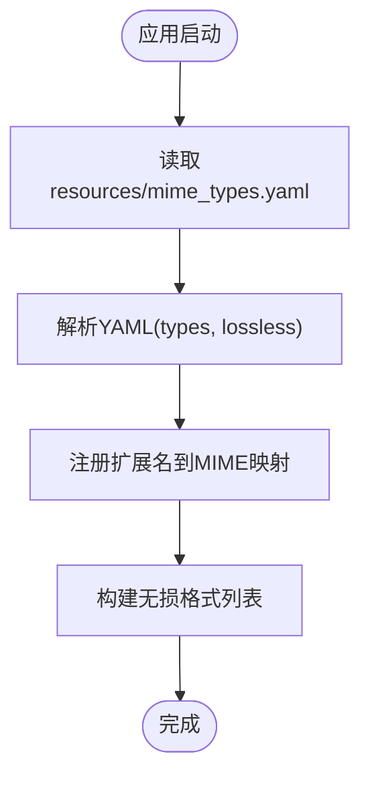

# MIME类型配置

<cite>
**本文引用的文件**
- [mime_types.go](file://conf/mime/mime_types.go)
- [mime_types.yaml](file://resources/mime_types.yaml)
- [media_streamer.go](file://core/media_streamer.go)
- [mediafile.go](file://model/mediafile.go)
- [transcoding.go](file://model/transcoding.go)
- [media_streamer_Internal_test.go](file://core/media_streamer_Internal_test.go)
- [mock_transcoding_repo.go](file://tests/mock_transcoding_repo.go)
- [taglib_wrapper.cpp](file://adapters/taglib/taglib_wrapper.cpp)
</cite>

## 目录
1. [简介](#简介)
2. [项目结构](#项目结构)
3. [核心组件](#核心组件)
4. [架构总览](#架构总览)
5. [详细组件分析](#详细组件分析)
6. [依赖关系分析](#依赖关系分析)
7. [性能考量](#性能考量)
8. [故障排查指南](#故障排查指南)
9. [结论](#结论)
10. [附录](#附录)

## 简介
本文件围绕 Navidrome 的 MIME 类型配置展开，重点解释：
- 如何通过配置文件控制音频与图像文件的 MIME 类型识别
- MIME 配置如何影响音频文件的识别、转码决策与客户端播放体验
- 如何新增或修改音频格式的 MIME 映射
- 与转码功能的关联及性能优化建议（如精简不必要的 MIME 类型）

## 项目结构
与 MIME 类型配置直接相关的文件位于以下位置：
- 配置加载与初始化：conf/mime/mime_types.go
- 默认配置文件：resources/mime_types.yaml
- 流媒体与转码：core/media_streamer.go
- 媒体文件模型：model/mediafile.go
- 转码配置模型：model/transcoding.go
- 测试用例与示例：core/media_streamer_Internal_test.go、tests/mock_transcoding_repo.go
- 标签读取与属性提取：adapters/taglib/taglib_wrapper.cpp

图表来源
- [mime_types.go](file://conf/mime/mime_types.go#L1-L48)
- [mime_types.yaml](file://resources/mime_types.yaml#L1-L51)
- [mediafile.go](file://model/mediafile.go#L104-L106)
- [media_streamer.go](file://core/media_streamer.go#L133-L183)
- [transcoding.go](file://model/transcoding.go#L1-L19)
- [mock_transcoding_repo.go](file://tests/mock_transcoding_repo.go#L1-L24)
- [taglib_wrapper.cpp](file://adapters/taglib/taglib_wrapper.cpp#L1-L69)

章节来源
- [mime_types.go](file://conf/mime/mime_types.go#L1-L48)
- [mime_types.yaml](file://resources/mime_types.yaml#L1-L51)

## 核心组件
- MIME 类型加载器：在应用启动时从资源文件加载 YAML 配置，并通过标准库注册扩展名到 MIME 类型的映射；同时维护“无损音频格式”列表。
- 媒体文件模型：提供 ContentType() 方法，基于文件后缀查询 MIME 类型，用于响应头与客户端行为。
- 流媒体与转码：根据请求参数与默认策略选择是否转码，决定返回“原始流”还是“转码流”，并设置 Content-Type。
- 转码配置模型：定义目标格式、命令与默认比特率等，供转码流程使用。

章节来源
- [mime_types.go](file://conf/mime/mime_types.go#L13-L44)
- [mediafile.go](file://model/mediafile.go#L104-L106)
- [media_streamer.go](file://core/media_streamer.go#L133-L183)
- [transcoding.go](file://model/transcoding.go#L1-L19)

## 架构总览
下图展示了从配置加载到流媒体输出的关键路径，以及 MIME 类型在其中的作用。

图表来源
- [media_streamer.go](file://core/media_streamer.go#L51-L113)
- [media_streamer.go](file://core/media_streamer.go#L133-L183)
- [mediafile.go](file://model/mediafile.go#L104-L106)
- [transcoding.go](file://model/transcoding.go#L1-L19)

## 详细组件分析

### 组件A：MIME类型配置与加载
- 配置文件结构
  - types：键为扩展名（带点），值为 MIME 类型字符串。任何以 audio/* 开头的类型均被视为有效音频文件，但需得到标签解析与转码工具链的支持。
  - lossless：列出被视作“无损”的音频扩展名集合，不包含点号前缀。
- 加载流程
  - 应用初始化钩子触发，打开资源文件并解码 YAML。
  - 将每个扩展名注册到标准库的 MIME 映射表。
  - 收集无损格式列表，供上层逻辑判断。
- 影响范围
  - 影响媒体文件的 Content-Type 推断（用于响应头）。
  - 影响客户端对音频格式的兼容性与播放行为。
  - 影响扫描与元数据提取阶段对文件类型的识别。

图表来源
- [mime_types.go](file://conf/mime/mime_types.go#L20-L44)
- [mime_types.yaml](file://resources/mime_types.yaml#L1-L51)

章节来源
- [mime_types.go](file://conf/mime/mime_types.go#L13-L44)
- [mime_types.yaml](file://resources/mime_types.yaml#L1-L51)

### 组件B：媒体文件的 MIME 类型使用
- 在媒体文件模型中，ContentType() 基于文件后缀查询 MIME 类型，用于响应头设置。
- 这意味着即使配置文件未显式覆盖某些扩展名，标准库也会给出默认值；但通过自定义配置可以确保一致性和预期行为。

图表来源
- [mediafile.go](file://model/mediafile.go#L104-L106)

章节来源
- [mediafile.go](file://model/mediafile.go#L104-L106)

### 组件C：转码与 MIME 的关联
- 选择转码选项的策略
  - 若请求格式为 raw，则直接返回原始流。
  - 若请求格式与原格式相同且无需降采样，则返回原始流。
  - 否则根据请求参数、默认转码配置与播放器最大比特率，确定目标格式与比特率。
  - 若最终目标格式与原格式相同且比特率不低于原值，则回退为原始流。
- Content-Type 设置
  - 原始流：使用原始后缀对应的 MIME 类型。
  - 转码流：使用目标格式后缀对应的 MIME 类型。
- 客户端体验
  - 正确的 Content-Type 可提升浏览器与播放器的兼容性与缓冲策略。
  - 对于不支持的原始格式，转码可显著改善播放体验。

图表来源
- [media_streamer.go](file://core/media_streamer.go#L133-L183)

章节来源
- [media_streamer.go](file://core/media_streamer.go#L51-L113)
- [media_streamer.go](file://core/media_streamer.go#L133-L183)

### 组件D：测试与示例
- 测试用例验证了多种场景下的转码选择逻辑，包括：
  - 请求 raw 时直接返回原始流
  - 当目标格式与原格式相同且比特率不高于原值时返回原始流
  - 按默认转码配置与播放器最大比特率选择目标格式
- 测试中使用的转码配置示例来源于模拟仓库，展示了不同格式的默认比特率。

章节来源
- [media_streamer_Internal_test.go](file://core/media_streamer_Internal_test.go#L1-L162)
- [mock_transcoding_repo.go](file://tests/mock_transcoding_repo.go#L1-L24)

### 组件E：标签与属性提取对 MIME 的间接影响
- 标签读取器会从文件中提取音频属性（如采样率、声道数、位深等），这些属性用于后续的转码与播放决策。
- 即使 MIME 类型正确，若底层工具链不支持该格式，仍可能导致无法播放或转码失败。

章节来源
- [taglib_wrapper.cpp](file://adapters/taglib/taglib_wrapper.cpp#L1-L69)

## 依赖关系分析
- 配置加载依赖标准库 MIME 注册与资源文件系统。
- 流媒体模块依赖转码仓库以获取目标格式的命令与默认比特率。
- 媒体文件模型依赖 MIME 查询以生成正确的 Content-Type。
- 标签读取器为转码与播放提供必要的音频属性。

图表来源
- [mime_types.go](file://conf/mime/mime_types.go#L1-L48)
- [mime_types.yaml](file://resources/mime_types.yaml#L1-L51)
- [mediafile.go](file://model/mediafile.go#L104-L106)
- [media_streamer.go](file://core/media_streamer.go#L133-L183)
- [transcoding.go](file://model/transcoding.go#L1-L19)
- [taglib_wrapper.cpp](file://adapters/taglib/taglib_wrapper.cpp#L1-L69)

## 性能考量
- 精简不必要的 MIME 类型
  - 减少注册的扩展名数量可降低 MIME 查询表规模，从而略微提升查找效率。
  - 仅保留实际使用的音频与图像扩展名，避免冗余条目。
- 合理的 Content-Type
  - 使用准确的 MIME 类型有助于浏览器与播放器的预加载与缓冲策略，减少首播延迟。
- 转码缓存与命中
  - 转码流通常会被缓存，合理配置缓存大小与目录可提升重复播放的性能。
- 无损格式判定
  - 正确维护无损格式列表有助于在需要时启用更高保真度的播放路径。

[本节为通用指导，不直接分析具体文件]

## 故障排查指南
- 常见问题
  - 播放器无法播放特定格式：检查该扩展名是否在配置中被识别为音频类型，且转码仓库中是否存在对应的目标格式配置。
  - Content-Type 异常：确认媒体文件后缀与配置中的映射一致，必要时在配置中显式覆盖。
  - 原始流与转码流混用：核对转码选择逻辑，确保在不需要降采样的情况下返回原始流。
- 定位步骤
  - 检查配置文件是否正确加载（启动日志中应有相关记录）。
  - 在流媒体模块的日志中查看最终选择的格式与比特率。
  - 验证转码仓库中是否存在目标格式的配置项。

章节来源
- [media_streamer.go](file://core/media_streamer.go#L60-L113)
- [media_streamer_Internal_test.go](file://core/media_streamer_Internal_test.go#L1-L162)

## 结论
- MIME 类型配置是 Navidrome 音频识别与播放体验的基础之一。通过在配置文件中明确声明扩展名与 MIME 类型，可确保 Content-Type 的一致性与客户端的兼容性。
- 转码流程与 MIME 类型紧密相关：目标格式的后缀决定了最终响应的 Content-Type，进而影响播放器的行为。
- 新增或修改音频格式支持的关键在于：
  - 在配置文件中添加扩展名到 MIME 类型的映射
  - 在转码仓库中配置目标格式与默认比特率
  - 确保底层工具链（标签解析与转码器）支持该格式

[本节为总结，不直接分析具体文件]

## 附录

### 实际案例：为罕见音频格式添加支持
- 场景：希望支持一种不常见的音频格式（例如某类专业音频容器）
- 步骤
  1) 在配置文件中添加该格式的扩展名与 MIME 类型映射
  2) 在转码仓库中为该目标格式配置命令与默认比特率
  3) 确认底层工具链（标签解析与转码器）对该格式的支持情况
  4) 重启服务并进行播放测试，观察 Content-Type 与播放效果
- 注意事项
  - 若该格式为“音频/ogg”家族成员，可复用现有 MIME 类型；否则请明确新增映射
  - 若客户端不支持该格式，建议提供一个兼容的转码目标格式作为回退

章节来源
- [mime_types.yaml](file://resources/mime_types.yaml#L1-L51)
- [transcoding.go](file://model/transcoding.go#L1-L19)
- [media_streamer.go](file://core/media_streamer.go#L133-L183)