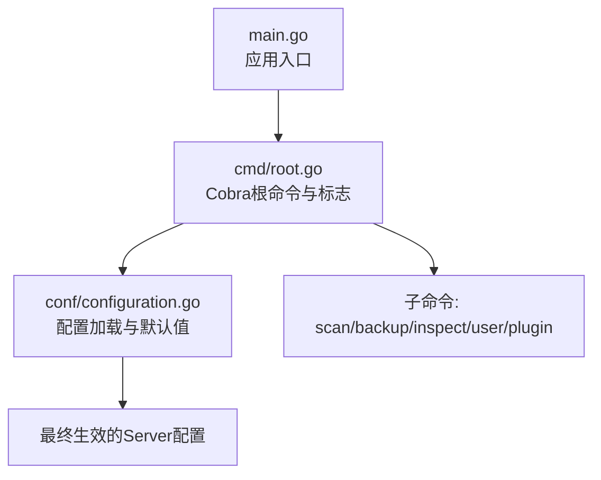
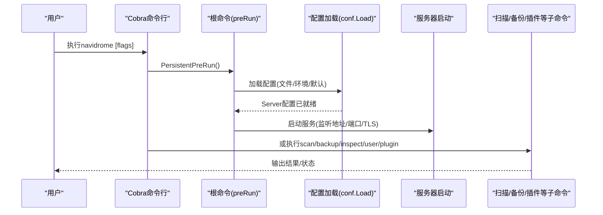
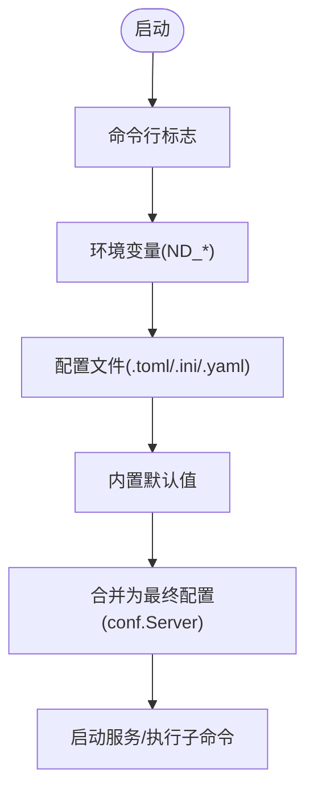

# 命令行参数

<cite>
**本文引用的文件**
- [main.go](file://main.go)
- [cmd/root.go](file://cmd/root.go)
- [conf/configuration.go](file://conf/configuration.go)
- [cmd/scan.go](file://cmd/scan.go)
- [cmd/backup.go](file://cmd/backup.go)
- [cmd/inspect.go](file://cmd/inspect.go)
- [cmd/user.go](file://cmd/user.go)
- [cmd/plugin.go](file://cmd/plugin.go)
- [release/linux/navidrome.toml](file://release/linux/navidrome.toml)
- [conf/testdata/cfg.toml](file://conf/testdata/cfg.toml)
</cite>

## 目录
1. [简介](#简介)
2. [项目结构与入口](#项目结构与入口)
3. [核心组件：命令行参数定义与加载](#核心组件命令行参数定义与加载)
4. [架构总览：命令行到配置的映射](#架构总览命令行到配置的映射)
5. [详细参数说明](#详细参数说明)
6. [依赖关系与优先级](#依赖关系与优先级)
7. [性能与最佳实践](#性能与最佳实践)
8. [故障排查指南](#故障排查指南)
9. [结论](#结论)
10. [附录：常用用法示例](#附录常用用法示例)

## 简介
本文面向Navidrome的命令行用户与自动化脚本作者，系统梳理并解释由Cobra框架在cmd/root.go中定义的所有命令行标志（flags），包括：
- 根命令与持久性标志（如配置文件、音乐目录、日志级别等）
- 服务器运行相关标志（地址、端口、TLS、基础路径等）
- 运行时行为控制标志（会话超时、缓存大小、转码配置等）
- Prometheus指标暴露开关与路径
- 子命令：scan、backup、inspect、user、plugin等

同时，本文将说明命令行参数与配置文件、环境变量之间的优先级关系，并给出实用的使用示例与最佳实践。

## 项目结构与入口
- 应用入口位于main.go，调用cmd.Execute()启动Cobra根命令。
- 根命令在cmd/root.go中定义，包含持久性标志与全局行为（如预运行加载配置、后运行日志输出）。
- 配置加载逻辑集中在conf/configuration.go，负责解析配置文件、设置默认值、绑定环境变量、校验与规范化配置。

图表来源
- [main.go](file://main.go#L1-L20)
- [cmd/root.go](file://cmd/root.go#L346-L405)
- [conf/configuration.go](file://conf/configuration.go#L667-L720)

章节来源
- [main.go](file://main.go#L1-L20)
- [cmd/root.go](file://cmd/root.go#L346-L405)
- [conf/configuration.go](file://conf/configuration.go#L667-L720)

## 核心组件：命令行参数定义与加载
- 根命令通过PersistentFlags定义全局标志，通过Flags定义仅对根命令生效的标志。
- 所有标志均通过viper.BindPFlag绑定到对应的配置键，确保命令行参数可直接覆盖配置文件与环境变量。
- 预运行阶段（PersistentPreRun）调用conf.Load加载配置，使命令行参数在运行前即生效。

章节来源
- [cmd/root.go](file://cmd/root.go#L346-L405)
- [conf/configuration.go](file://conf/configuration.go#L667-L720)

## 架构总览：命令行到配置的映射
下图展示从命令行参数到最终配置对象的映射关系，以及关键运行时行为如何受配置影响。

图表来源
- [cmd/root.go](file://cmd/root.go#L346-L405)
- [conf/configuration.go](file://conf/configuration.go#L254-L382)

## 详细参数说明
以下参数按类别整理，包含名称、别名、默认值、作用与典型使用场景。默认值来源于viper默认集，可在配置文件或环境变量中覆盖。

### 全局持久性标志（全局有效）
- --configfile, -c
  - 类型：字符串
  - 默认值：无（默认使用当前目录下的navidrome配置文件）
  - 作用：指定配置文件路径；若未找到则回退到环境变量ND_CONFIGFILE
  - 使用场景：容器化部署或多实例管理
- --nobanner, -n
  - 类型：布尔
  - 默认值：false
  - 作用：不打印启动横幅
  - 使用场景：CI/日志自动化

### 音乐与数据目录
- --musicfolder
  - 类型：字符串
  - 默认值：当前目录下的music
  - 作用：音乐库根目录
  - 使用场景：自定义媒体目录
- --datafolder
  - 类型：字符串
  - 默认值：当前目录
  - 作用：应用数据存储目录（数据库、索引等）
  - 使用场景：分离日志与数据
- --cachefolder
  - 类型：字符串
  - 默认值：空（自动使用datafolder/cache）
  - 作用：缓存目录（转码、图片等）
  - 使用场景：SSD高速缓存

### 日志与调试
- --loglevel, -l
  - 类型：字符串
  - 默认值：info
  - 取值：error, info, debug, trace
  - 作用：日志级别
  - 使用场景：生产环境建议info，问题定位建议debug/trace
- --logfile
  - 类型：字符串
  - 默认值：空（stderr）
  - 作用：日志文件路径
  - 使用场景：集中收集日志

### 服务器运行参数
- --address, -a
  - 类型：字符串
  - 默认值：0.0.0.0
  - 作用：监听地址
  - 使用场景：仅内网访问或特定网卡
- --port, -p
  - 类型：整数
  - 默认值：4533
  - 作用：HTTP端口
  - 使用场景：反向代理或防火墙策略
- --baseurl
  - 类型：字符串
  - 默认值：空
  - 作用：反向代理基础路径或完整URL
  - 使用场景：Nginx/Caddy前置代理
- --tlscert
  - 类型：字符串
  - 默认值：空
  - 作用：TLS证书路径（启用HTTPS）
  - 使用场景：启用HTTPS
- --tlskey
  - 类型：字符串
  - 默认值：空
  - 作用：TLS私钥路径
  - 使用场景：启用HTTPS
- --unixsocketperm
  - 类型：字符串
  - 默认值：0660
  - 作用：Unix套接字权限
  - 使用场景：本地进程直连

### 会话与UI行为
- --sessiontimeout
  - 类型：持续时间
  - 默认值：应用常量
  - 作用：Web UI空闲会话超时
  - 使用场景：安全策略
- --scaninterval
  - 类型：持续时间
  - 默认值：应用常量
  - 作用：库变更扫描间隔
  - 使用场景：实时性要求
- --uiloginbackgroundurl
  - 类型：字符串
  - 默认值：内置默认值
  - 作用：登录页背景图URL
  - 使用场景：个性化界面
- --enabletranscodingconfig
  - 类型：布尔
  - 默认值：false
  - 作用：允许在UI中配置转码
  - 使用场景：管理员开放转码设置
- --enabletranscodingcancellation
  - 类型：布尔
  - 默认值：false
  - 作用：允许取消转码请求
  - 使用场景：高并发场景
- --transcodingcachesize
  - 类型：字符串
  - 默认值：100MB
  - 作用：转码缓存大小
  - 使用场景：内存紧张或高并发
- --imagecachesize
  - 类型：字符串
  - 默认值：100MB
  - 作用：封面缓存大小（设为0禁用）
  - 使用场景：磁盘空间有限
- --albumplaycountmode
  - 类型：字符串
  - 默认值：absolute
  - 取值：absolute, normalized
  - 作用：专辑播放次数计算模式
  - 使用场景：统计一致性
- --autoimportplaylists
  - 类型：布尔
  - 默认值：true
  - 作用：自动导入.m3u播放列表
  - 使用场景：保留旧播放列表

### Prometheus指标
- --prometheus.enabled
  - 类型：布尔
  - 默认值：false
  - 作用：启用Prometheus指标端点
  - 使用场景：监控集成
- --prometheus.metricspath
  - 类型：字符串
  - 默认值：应用常量
  - 作用：指标端点路径
  - 使用场景：与Prometheus抓取配置一致

### 子命令：scan（扫描）
- --full, -f
  - 类型：布尔
  - 默认值：false
  - 作用：全量扫描（忽略时间戳）
  - 使用场景：首次导入或修复
- --target, -t
  - 类型：字符串数组
  - 默认值：空
  - 作用：指定库ID:目录对（可重复）
  - 使用场景：选择性扫描
- --target-file
  - 类型：字符串
  - 默认值：空
  - 作用：从文件读取目标列表
  - 使用场景：批量目标管理

### 子命令：backup（备份）
- 备份创建
  - --backup-dir, -d
  - 类型：字符串
  - 默认值：空（使用配置中的Backup.Path）
  - 作用：手动备份目录
- 备份修剪
  - --backup-dir, -d
  - --keep-count, -k
  - --force, -f
  - 作用：按规则清理旧备份
- 恢复
  - --backup-file, -b
  - --force, -f
  - 作用：离线恢复数据库

### 子命令：inspect（标签检查）
- --format, -f
  - 类型：字符串
  - 默认值：jsonindent
  - 取值：pretty, toml, yaml, json, jsonindent
  - 作用：输出格式
  - 使用场景：调试与排障

### 子命令：user（用户管理）
- 创建用户
  - --username, -u
  - --email, -e
  - --library-ids, -i
  - --admin, -a
  - --name
  - 作用：创建用户并设置权限与库访问
- 删除用户
  - --user, -u
  - 作用：删除用户
- 编辑用户
  - --user, -u
  - --set-admin / --set-regular
  - --email / --remove-email
  - --name / --remove-name
  - --set-password
  - --library-ids, -i
  - 作用：修改用户属性与权限
- 列表用户
  - --format, -f
  - 取值：csv, json
  - 作用：导出用户信息

### 子命令：plugin（插件管理）
- list/info/install/remove/update/refresh/dev
  - 作用：插件生命周期管理
  - 使用场景：开发与运维

章节来源
- [cmd/root.go](file://cmd/root.go#L346-L405)
- [cmd/scan.go](file://cmd/scan.go#L21-L44)
- [cmd/backup.go](file://cmd/backup.go#L16-L74)
- [cmd/inspect.go](file://cmd/inspect.go#L16-L33)
- [cmd/user.go](file://cmd/user.go#L22-L76)
- [cmd/plugin.go](file://cmd/plugin.go#L31-L94)

## 依赖关系与优先级
- 配置来源顺序（从高到低）：
  1) 命令行标志（通过viper.BindPFlag绑定）
  2) 环境变量（ND_前缀，点号替换为下划线）
  3) 配置文件（TOML/INI/YAML）
  4) 内置默认值（viper.SetDefault）
- 关键行为：
  - 配置文件搜索：命令行--configfile优先；否则尝试ND_CONFIGFILE；最后在当前目录查找navidrome配置文件。
  - 环境变量：通过viper.SetEnvPrefix("ND")与SetEnvKeyReplacer(".")绑定，例如musicfolder对应ND_MUSICFOLDER。
  - 服务器启动：根命令Run阶段读取conf.Server中的最终配置，决定监听地址、端口、TLS、Prometheus等。

图表来源
- [conf/configuration.go](file://conf/configuration.go#L667-L720)
- [cmd/root.go](file://cmd/root.go#L346-L405)

章节来源
- [conf/configuration.go](file://conf/configuration.go#L667-L720)
- [cmd/root.go](file://cmd/root.go#L346-L405)

## 性能与最佳实践
- 缓存与转码
  - 合理设置--transcodingcachesize与--imagecachesize，避免频繁I/O。
  - 在资源受限环境中，可将--imagecachesize设为0以禁用图片缓存。
- 扫描策略
  - 首次导入使用--full进行全量扫描；日常维护使用增量扫描（默认行为）。
  - 对于大型库，结合--target/--target-file进行分批扫描。
- 监控与可观测性
  - 开启--prometheus.enabled并配置--prometheus.metricspath，便于Prometheus抓取。
- 安全与网络
  - 生产环境建议使用--tlscert与--tlskey启用HTTPS。
  - 通过--baseurl配合反向代理，统一入口与路径。
- 日志与调试
  - 生产环境保持--loglevel为info；问题定位时临时提升至debug/trace，并将--logfile指向文件以便收集。

[本节为通用建议，无需代码引用]

## 故障排查指南
- 配置文件未找到
  - 确认--configfile或ND_CONFIGFILE是否正确指向存在且可读的配置文件。
  - 若两者均未设置，系统将提示使用默认值并建议显式指定配置文件。
- 端口占用
  - 调整--port或停止占用进程；确认--address绑定的网卡可达。
- TLS错误
  - 确保--tlscert与--tlskey路径正确且权限允许；证书与私钥匹配。
- 扫描失败
  - 查看日志级别与--logfile；必要时使用--full重扫；检查--target与--target-file格式。
- 备份/恢复
  - 确保数据库文件存在；备份目录可写；恢复需离线执行。

章节来源
- [conf/configuration.go](file://conf/configuration.go#L345-L362)
- [cmd/backup.go](file://cmd/backup.go#L76-L104)

## 结论
Navidrome通过Cobra与Viper实现了灵活而强大的命令行配置体系。命令行标志直接映射到conf.Server，支持从配置文件、环境变量到命令行的多层覆盖。合理使用这些参数，可以快速适配不同部署环境与运维需求，并为自动化脚本提供稳定可靠的接口。

[本节为总结，无需代码引用]

## 附录：常用用法示例
- 启动服务（指定配置文件、日志级别、端口）
  - 示例：navidrome --configfile ./navidrome.toml --loglevel debug --port 8080
- 启用HTTPS与反向代理
  - 示例：navidrome --address 0.0.0.0 --port 443 --tlscert /etc/ssl/certs/xxx.crt --tlskey /etc/ssl/private/xxx.key --baseurl /music
- 手动扫描（全量/选择性）
  - 全量：navidrome scan --full
  - 选择性：navidrome scan --target 1:/Music/Rock --target 2:/Music/Jazz
  - 文件输入：navidrome scan --target-file ./targets.txt
- 备份/修剪/恢复
  - 备份：navidrome backup create --backup-dir /var/lib/navidrome/backups
  - 修剪：navidrome backup prune --keep-count 5 --force
  - 恢复：navidrome backup restore --backup-file /var/lib/navidrome/backups/xxx.db
- 插件管理
  - 列表：navidrome plugin list
  - 信息：navidrome plugin info my-plugin
  - 安装：navidrome plugin install ./my-plugin.ndp
  - 更新：navidrome plugin update ./my-plugin.ndp
  - 刷新：navidrome plugin refresh my-plugin
  - 开发：navidrome plugin dev /path/to/dev/folder
- 用户管理
  - 创建：navidrome user create --username alice --email alice@example.com --admin
  - 编辑：navidrome user edit --user alice --set-password --library-ids 1,2
  - 删除：navidrome user delete --user alice
  - 列表：navidrome user list --format json

章节来源
- [cmd/root.go](file://cmd/root.go#L346-L405)
- [cmd/scan.go](file://cmd/scan.go#L21-L44)
- [cmd/backup.go](file://cmd/backup.go#L16-L74)
- [cmd/inspect.go](file://cmd/inspect.go#L16-L33)
- [cmd/user.go](file://cmd/user.go#L22-L76)
- [cmd/plugin.go](file://cmd/plugin.go#L31-L94)
- [release/linux/navidrome.toml](file://release/linux/navidrome.toml#L1-L3)
- [conf/testdata/cfg.toml](file://conf/testdata/cfg.toml#L1-L9)