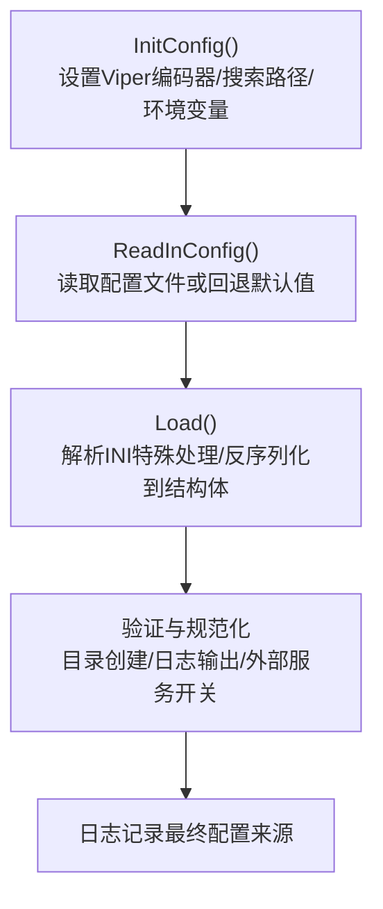
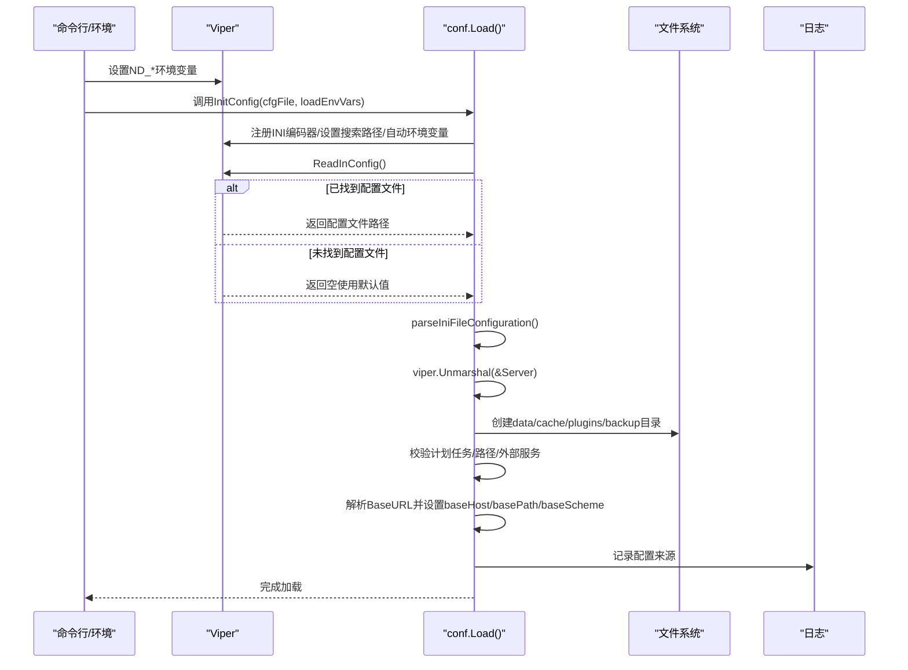
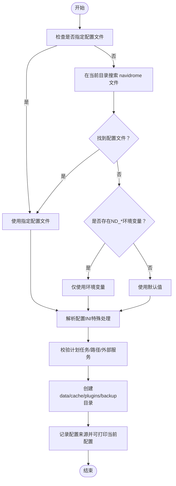

# 配置文件格式

<cite>
**本文引用的文件列表**
- [configuration.go](file://conf/configuration.go)
- [configuration_test.go](file://conf/configuration_test.go)
- [cfg.toml](file://conf/testdata/cfg.toml)
- [cfg.yaml](file://conf/testdata/cfg.yaml)
- [cfg.json](file://conf/testdata/cfg.json)
- [navidrome.toml（发行版示例）](file://release/linux/navidrome.toml)
- [navidrome-test.toml（测试示例）](file://tests/navidrome-test.toml)
- [consts.go](file://consts/consts.go)
</cite>

## 目录
1. [简介](#简介)
2. [项目结构与配置入口](#项目结构与配置入口)
3. [核心组件：配置模型与默认值](#核心组件配置模型与默认值)
4. [架构总览：配置加载与解析流程](#架构总览配置加载与解析流程)
5. [详细组件分析：TOML/YAML/JSON语法与示例](#详细组件分析tomlyamljson语法与示例)
6. [依赖关系与环境变量映射](#依赖关系与环境变量映射)
7. [性能与最佳实践](#性能与最佳实践)
8. [故障排查指南](#故障排查指南)
9. [结论](#结论)

## 简介
本文件面向Navidrome用户与运维人员，系统性说明配置文件格式（TOML、YAML、JSON），解释Viper配置管理的加载优先级与搜索路径，梳理从配置文件到运行时配置的解析流程，并给出各section的语义说明与关键参数设置方法（如数据库、服务器端口、SSL证书等）。同时提供初学者的格式转换指南与高级用户的复杂配置最佳实践。

## 项目结构与配置入口
- 配置核心位于 conf/configuration.go，包含：
  - 配置结构体定义（含多层嵌套）
  - Viper初始化、默认值设置、环境变量绑定
  - 配置文件加载、校验与日志输出
- 测试样例位于 conf/testdata/，覆盖了TOML、YAML、JSON三种格式的最小可用示例。
- 发行版与测试提供了实际可参考的配置文件示例。

图表来源
- [configuration.go](file://conf/configuration.go#L671-L720)
- [configuration.go](file://conf/configuration.go#L244-L382)

章节来源
- [configuration.go](file://conf/configuration.go#L671-L720)
- [configuration_test.go](file://conf/configuration_test.go#L19-L56)

## 核心组件：配置模型与默认值
- 配置根结构体包含大量字段，涵盖服务器、数据库、日志、扫描器、外部服务、插件、Prometheus、Jukebox、备份、子sonic兼容等。
- 大量默认值通过 viper.SetDefault 在初始化阶段注册，确保未显式配置时系统仍可正常启动。
- 关键字段举例（非完整列表）：
  - 服务器与网络：address、port、baseURL、tlsCert、tlsKey、basePath、baseHost、baseScheme、unixSocketPerm
  - 数据与缓存：musicFolder、dataFolder、cacheFolder、dbPath
  - 日志：logLevel、logFile、enableLogRedacting
  - 扫描器：scanner.enabled、scanner.schedule、scanner.extractor、scanner.watcherWait、scanner.scanOnStartup、scanner.followSymlinks、scanner.purgeMissing
  - 外部服务：lastfm、spotify、deezer、listenbrainz、agents、enableExternalServices
  - 插件：plugins.enabled、plugins.folder、plugins.cachesize
  - Prometheus：prometheus.enabled、prometheus.metricsPath、prometheus.password
  - Jukebox：jukebox.enabled、jukebox.devices、jukebox.default、jukebox.adminOnly
  - 备份：backup.path、backup.schedule、backup.count
  - 其他：enableTranscodingConfig、enableDownloads、enableSharing、enableInsightsCollector、enableMediaFileCoverArt、enableReplayGain、enableGravatar、enableFavourites、enableStarRating、enableUserEditing、enableNowPlaying、enableCoverAnimation、enableScrobbleHistory、httpHeaders.frameOptions、pid.track、pid.album、inspect.*、dev* 开关等

章节来源
- [configuration.go](file://conf/configuration.go#L22-L137)
- [configuration.go](file://conf/configuration.go#L526-L665)
- [consts.go](file://consts/consts.go#L1-L177)

## 架构总览：配置加载与解析流程
- 初始化阶段
  - 注册INI编码器（支持转义选项）
  - 设置搜索路径与配置名（若无显式指定）
  - 绑定环境变量前缀ND_，点号替换为下划线
  - 自动读取环境变量
- 加载阶段
  - 读取配置文件（若存在）
  - INI格式特殊处理：将[default]合并至根
  - 反序列化到结构体
  - 创建必要目录（data、cache、plugins、backup）
  - 校验计划任务表达式、路径合法性、外部服务开关
  - 解析baseURL并拆分baseHost/basePath/baseScheme
  - 记录配置来源（文件或仅环境变量）
  - 可选打印当前配置（调试级别）

图表来源
- [configuration.go](file://conf/configuration.go#L671-L720)
- [configuration.go](file://conf/configuration.go#L244-L382)

章节来源
- [configuration.go](file://conf/configuration.go#L244-L382)
- [configuration.go](file://conf/configuration.go#L671-L720)

## 详细组件分析：TOML/YAML/JSON语法与示例

### TOML格式
- 特点
  - 键名大小写敏感；字符串需加引号（除非是裸键且符合规则）
  - 嵌套使用点号分隔（如 Tags.artist.split）
  - 数组使用方括号
  - 支持注释
- 示例要点
  - 基础键值对：如 musicFolder、uiWelcomeMessage
  - 嵌套对象：如 Tags.artist.split
  - 数组：如 Tags.custom.aliases
  - 旧配置项映射：如 ReverseProxyUserHeader 映射到 ExtAuth.UserHeader
- 参考示例
  - [cfg.toml](file://conf/testdata/cfg.toml#L1-L9)
  - [navidrome.toml（发行版示例）](file://release/linux/navidrome.toml#L1-L3)
  - [navidrome-test.toml（测试示例）](file://tests/navidrome-test.toml#L1-L8)

章节来源
- [cfg.toml](file://conf/testdata/cfg.toml#L1-L9)
- [navidrome.toml（发行版示例）](file://release/linux/navidrome.toml#L1-L3)
- [navidrome-test.toml（测试示例）](file://tests/navidrome-test.toml#L1-L8)

### YAML格式
- 特点
  - 使用缩进表示层级
  - 字符串通常无需引号（裸字符串）
  - 数组使用短横线列表
  - 支持注释
- 示例要点
  - 基础键值对：如 musicFolder、uiWelcomeMessage
  - 嵌套对象：如 Tags.artist.split
  - 数组：如 Tags.custom.aliases
  - 旧配置项映射：如 reverseProxyUserHeader 映射到 ExtAuth.UserHeader
- 参考示例
  - [cfg.yaml](file://conf/testdata/cfg.yaml#L1-L11)

章节来源
- [cfg.yaml](file://conf/testdata/cfg.yaml#L1-L11)

### JSON格式
- 特点
  - 结构严格，必须使用双引号
  - 对象与数组语法明确
  - 不支持注释
- 示例要点
  - 基础键值对：如 musicFolder、uiWelcomeMessage
  - 嵌套对象：如 Tags.artist.split
  - 数组：如 Tags.custom.aliases
  - 旧配置项映射：如 reverseProxyUserHeader 映射到 ExtAuth.UserHeader
- 参考示例
  - [cfg.json](file://conf/testdata/cfg.json#L1-L16)

章节来源
- [cfg.json](file://conf/testdata/cfg.json#L1-L16)

### 配置文件加载优先级与搜索路径
- 搜索顺序
  - 若显式传入配置文件路径，则直接使用该文件
  - 否则在当前工作目录查找名为 navidrome 的文件（无扩展名）
  - 支持的扩展名：TOML、YAML、JSON、INI（通过Viper编码器注册INI）
- 环境变量
  - 默认绑定ND_前缀，点号替换为下划线
  - 例如：server.port -> ND_PORT
  - 例如：extauth.userheader -> ND_EXTAUTH_USERHEADER
- 优先级
  - 显式配置文件 > 环境变量 > 默认值
  - 当未找到配置文件且无ND_*环境变量时，系统会记录警告并使用默认值

章节来源
- [configuration.go](file://conf/configuration.go#L671-L720)
- [configuration_test.go](file://conf/configuration_test.go#L29-L56)

### INI格式的特殊处理
- INI需要[default]节，Viper会将其合并到根级
- 用于兼容历史配置风格

章节来源
- [configuration.go](file://conf/configuration.go#L410-L433)

### 关键参数与section说明（按用途分类）
- 服务器与网络
  - address、port、baseURL、basePath、baseHost、baseScheme、unixSocketPerm
  - tlsCert、tlsKey（用于HTTPS）
- 数据与缓存
  - musicFolder、dataFolder、cacheFolder、dbPath
- 日志
  - logLevel、logFile、enableLogRedacting
- 扫描器
  - scanner.enabled、scanner.schedule、scanner.extractor、scanner.watcherWait、scanner.scanOnStartup、scanner.followSymlinks、scanner.purgeMissing
- 外部服务
  - lastfm.*、spotify.*、deezer.*、listenbrainz.*、agents、enableExternalServices
- 插件
  - plugins.enabled、plugins.folder、plugins.cachesize
- Prometheus
  - prometheus.enabled、prometheus.metricsPath、prometheus.password
- Jukebox
  - jukebox.enabled、jukebox.devices、jukebox.default、jukebox.adminOnly
- 备份
  - backup.path、backup.schedule、backup.count
- 其他常用
  - enableTranscodingConfig、enableDownloads、enableSharing、enableInsightsCollector、enableMediaFileCoverArt、enableReplayGain、enableGravatar、enableFavourites、enableStarRating、enableUserEditing、enableNowPlaying、enableCoverAnimation、enableScrobbleHistory、httpHeaders.frameOptions、pid.track、pid.album、inspect.*、dev* 开关

章节来源
- [configuration.go](file://conf/configuration.go#L22-L137)
- [configuration.go](file://conf/configuration.go#L526-L665)
- [consts.go](file://consts/consts.go#L1-L177)

## 依赖关系与环境变量映射
- Viper默认值与字段映射
  - 多数字段通过 viper.SetDefault 注册默认值
  - 环境变量键名采用ND_前缀，点号替换为下划线
- 旧配置项映射
  - ReverseProxyWhitelist -> ExtAuth.TrustedSources
  - ReverseProxyUserHeader -> ExtAuth.UserHeader
  - HTTPSecurityHeaders.CustomFrameOptionsValue -> HTTPHeaders.FrameOptions
- 验证与规范化
  - 计划任务表达式校验（cron格式或“@every”持续间隔）
  - 路径匹配校验（PlaylistsPath）
  - purgeMissing 选项值域校验

图表来源
- [configuration.go](file://conf/configuration.go#L671-L720)
- [configuration.go](file://conf/configuration.go#L244-L382)

章节来源
- [configuration.go](file://conf/configuration.go#L244-L382)
- [configuration.go](file://conf/configuration.go#L402-L410)

## 性能与最佳实践
- 初学者建议
  - 使用发行版提供的示例配置作为起点，逐步添加所需项
  - 保持键名大小写一致，避免因大小写导致的解析失败
  - 使用裸键（不带引号）以减少歧义
- 高级用户建议
  - 将敏感信息（如API密钥、密码）置于环境变量（ND_前缀），避免提交到版本控制
  - 使用数组与嵌套对象时，确保语法正确（TOML/YAML/JSON差异）
  - 合理设置扫描器参数（watcherWait、followSymlinks、purgeMissing）以平衡性能与数据完整性
  - 对于生产环境，启用TLS（tlsCert、tlsKey），并配置合适的日志级别与日志文件路径
  - 使用计划任务表达式（如 cron）精确控制扫描与备份频率
  - 启用/禁用外部服务以降低依赖风险（enableExternalServices）

[本节为通用指导，不直接分析具体文件]

## 故障排查指南
- 常见问题与定位
  - 配置文件无法打开：检查路径是否存在、权限是否足够
  - 配置解析错误：核对TOML/YAML/JSON语法，尤其是嵌套与数组写法
  - 旧配置项失效：确认已使用新字段名（如 ExtAuth.UserHeader）
  - 计划任务无效：检查cron表达式或“@every”间隔格式
  - 目录创建失败：确认dataFolder/cacheFolder/pluginsFolder/backupPath可写
  - 外部服务不可用：关闭enableExternalServices或检查对应API凭据
- 日志与诊断
  - 启用调试日志级别以查看最终配置
  - 启用日志脱敏以保护敏感信息
  - 关注加载配置来源的日志提示（文件/环境变量/默认值）

章节来源
- [configuration.go](file://conf/configuration.go#L332-L362)
- [configuration.go](file://conf/configuration.go#L477-L509)
- [configuration.go](file://conf/configuration.go#L448-L475)

## 结论
Navidrome通过Viper实现了灵活的配置管理，支持多种格式与环境变量注入，并提供完善的默认值与校验机制。理解配置加载优先级、搜索路径与字段映射，有助于快速搭建稳定可靠的部署。建议从发行版示例入手，结合环境变量管理敏感信息，并根据业务需求调整扫描器、外部服务与监控参数。