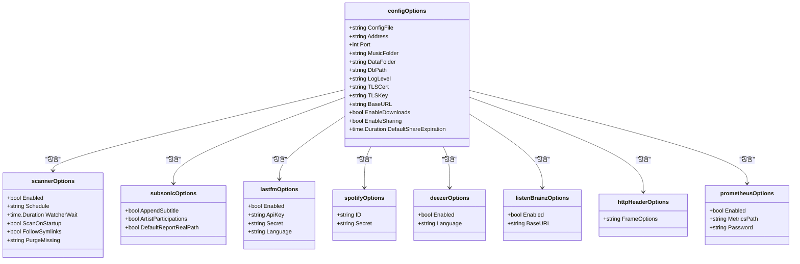
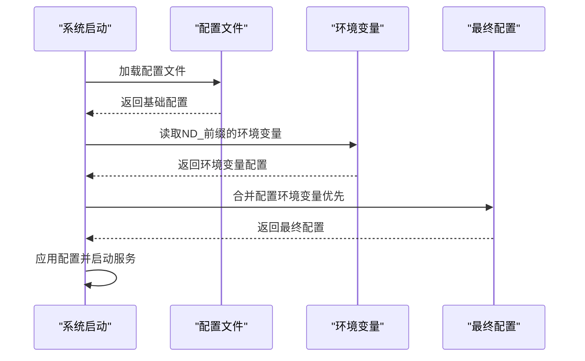

# 配置管理

<cite>
**本文档中引用的文件**  
- [configuration.go](file://conf/configuration.go)
- [cfg.toml](file://conf/testdata/cfg.toml)
- [cfg.yaml](file://conf/testdata/cfg.yaml)
- [cfg.json](file://conf/testdata/cfg.json)
- [navidrome.toml](file://release/linux/navidrome.toml)
- [mime_types.yaml](file://resources/mime_types.yaml)
- [mappings.yaml](file://resources/mappings.yaml)
- [configuration_test.go](file://conf/configuration_test.go)
- [mime_types.go](file://conf/mime/mime_types.go)
</cite>

## 目录
1. [配置文件格式](#配置文件格式)
2. [配置选项详解](#配置选项详解)
3. [环境变量覆盖](#环境变量覆盖)
4. [实际配置示例](#实际配置示例)
5. [MIME类型配置](#mime类型配置)
6. [初学者指南](#初学者指南)
7. [高级优化建议](#高级优化建议)

## 配置文件格式

Navidrome支持多种配置文件格式，包括TOML、YAML、JSON和INI。系统会按照特定优先级加载配置文件。配置文件的格式使用方法和优先级如下：

- **TOML**: 推荐使用的格式，具有良好的可读性和结构化特性
- **YAML**: 支持复杂的数据结构，适合需要嵌套配置的场景
- **JSON**: 适合程序生成和解析的配置文件
- **INI**: 传统格式，主要用于向后兼容

配置文件的加载优先级为：命令行参数 > 环境变量 > 指定的配置文件 > 默认值。当使用`--configfile`参数或设置`ND_CONFIGFILE`环境变量时，系统会优先加载指定的配置文件。


**Diagram sources**
- [configuration.go](file://conf/configuration.go#L667-L720)
- [configuration_test.go](file://conf/configuration_test.go#L19-L54)

**Section sources**
- [configuration.go](file://conf/configuration.go#L667-L720)
- [configuration_test.go](file://conf/configuration_test.go#L19-L54)

## 配置选项详解

Navidrome提供了丰富的配置选项，涵盖了数据库设置、音乐库路径、网络端口和安全选项等各个方面。

### 数据库设置

数据库配置选项控制Navidrome如何存储和访问数据：

- **DbPath**: 数据库文件的路径，默认位于数据文件夹中的`navidrome.db`
- **DataFolder**: 主数据文件夹路径，包含数据库、缓存和其他持久化数据
- **CacheFolder**: 缓存文件夹路径，可自定义以优化性能

### 音乐库路径

音乐库相关配置定义了音乐文件的存储位置和扫描方式：

- **MusicFolder**: 音乐文件的根目录路径
- **PlaylistsPath**: 播放列表文件的搜索路径，支持通配符
- **Scanner.FollowSymlinks**: 是否在扫描时跟随符号链接

### 网络端口

网络配置选项控制Navidrome的网络访问：

- **Address**: 绑定的IP地址，默认为`0.0.0.0`（所有接口）
- **Port**: HTTP服务端口，默认为4533
- **UnixSocketPerm**: Unix域套接字的权限设置

### 安全选项

安全相关配置提供了多种安全机制：

- **ExtAuth.TrustedSources**: 受信任的反向代理源
- **ExtAuth.UserHeader**: 用于传递认证用户的HTTP头
- **HTTPHeaders.FrameOptions**: X-Frame-Options头的值，用于防止点击劫持
- **PasswordEncryptionKey**: 密码加密密钥，用于保护用户密码

### 其他重要配置

- **BaseURL**: 基础URL，用于反向代理场景
- **TLSCert** 和 **TLSKey**: TLS证书和密钥文件路径，用于启用HTTPS
- **EnableDownloads**: 是否允许下载音乐文件
- **EnableSharing**: 是否启用分享功能
- **DefaultShareExpiration**: 分享链接的默认过期时间



**Diagram sources**
- [configuration.go](file://conf/configuration.go#L22-L137)
- [configuration.go](file://conf/configuration.go#L139-L237)

**Section sources**
- [configuration.go](file://conf/configuration.go#L22-L237)

## 环境变量覆盖

Navidrome允许使用环境变量来覆盖配置文件中的设置。所有配置选项都可以通过环境变量进行设置，环境变量的命名规则为`ND_`前缀加上配置项名称的大写形式，其中点号`.`替换为下划线`_`。

例如：
- `ND_PORT=8080` 会覆盖配置文件中的`port`设置
- `ND_MUSICFOLDER=/music` 会覆盖`musicFolder`设置
- `ND_SCANNER_SCHEDULE=daily` 会覆盖`scanner.schedule`设置

环境变量的优先级高于配置文件，这意味着即使在配置文件中设置了某个选项，环境变量的值也会覆盖它。这种机制特别适合在容器化部署中动态调整配置。



**Diagram sources**
- [configuration.go](file://conf/configuration.go#L691-L697)
- [aboutUtils.js](file://ui/src/dialogs/aboutUtils.js#L11-L86)

**Section sources**
- [configuration.go](file://conf/configuration.go#L691-L697)
- [aboutUtils.js](file://ui/src/dialogs/aboutUtils.js#L11-L86)

## 实际配置示例

### HTTPS配置

要启用HTTPS，需要提供TLS证书和密钥文件：

```toml
# 启用HTTPS
TLSCert = "/path/to/certificate.crt"
TLSKey = "/path/to/private.key"

# 或者使用加密的密钥文件
# TLSKey = "/path/to/encrypted.key"

# 绑定到标准HTTPS端口
Port = 443
```

### 外部代理配置

当Navidrome位于反向代理（如Nginx、Caddy或Traefik）后面时，需要正确配置：

```yaml
# 使用反向代理时的配置
baseURL: "https://music.example.com"
address: "127.0.0.1"
port: 4533

# 配置受信任的代理源和用户头
extAuth:
  trustedSources: "192.168.1.0/24,10.0.0.1"
  userHeader: "X-Forwarded-User"
```

### 多音乐库配置

支持配置多个音乐库路径：

```json
{
  "musicFolder": "/music/classical:/music/rock:/music/jazz",
  "scanner": {
    "enabled": true,
    "schedule": "@daily",
    "followSymlinks": true
  }
}
```

### Prometheus监控配置

启用Prometheus监控：

```toml
[Prometheus]
Enabled = true
MetricsPath = "/metrics"
Password = "secure_password_here"
```

**Section sources**
- [cfg.toml](file://conf/testdata/cfg.toml)
- [cfg.yaml](file://conf/testdata/cfg.yaml)
- [cfg.json](file://conf/testdata/cfg.json)
- [navidrome.toml](file://release/linux/navidrome.toml)

## MIME类型配置

MIME类型配置文件`mime_types.yaml`控制Navidrome如何处理不同类型的文件。该文件定义了音频和图像文件的MIME类型映射，以及哪些音频格式被视为无损格式。

### 文件结构

```yaml
types:
  # 音频格式
  .mp3: audio/mpeg
  .flac: audio/flac
  .wav: audio/x-wav
  
  # 图像格式
  .jpg: image/jpeg
  .png: image/png
  .webp: image/webp

# 无损音频格式列表
lossless:
  - .flac
  - .alac
  - .wav
```

### 影响文件处理

MIME类型配置直接影响文件处理方式：

1. **音频文件识别**: 系统根据扩展名确定文件是否为有效音频文件
2. **转码决策**: 无损格式列表用于决定是否需要转码
3. **封面艺术处理**: 图像MIME类型用于识别有效的封面艺术文件
4. **流媒体优化**: 根据MIME类型选择适当的流媒体策略

当添加新的音频或图像格式时，需要相应地更新`mime_types.yaml`文件。任何以`audio/*`开头的MIME类型都被视为有效音频文件，但需要`taglib`或`ffmpeg`支持才能正确处理。任何以`image/*`开头的MIME类型都被视为有效的封面艺术文件。


**Diagram sources**
- [mime_types.yaml](file://resources/mime_types.yaml)
- [mime_types.go](file://conf/mime/mime_types.go#L13-L48)

**Section sources**
- [mime_types.yaml](file://resources/mime_types.yaml)
- [mime_types.go](file://conf/mime/mime_types.go#L13-L48)

## 初学者指南

对于初学者，建议从简单的配置开始，逐步添加复杂功能。

### 基础配置步骤

1. **创建配置文件**: 在Navidrome运行目录创建`navidrome.toml`文件
2. **设置音乐文件夹**: 指定音乐文件的存储位置
3. **配置数据文件夹**: 设置数据库和缓存的存储位置
4. **启动服务**: 运行Navidrome并访问Web界面

### 基础配置示例

```toml
# 基础配置
MusicFolder = "/path/to/your/music"
DataFolder = "/path/to/navidrome/data"
Port = 4533
Address = "0.0.0.0"
LogLevel = "info"
```

### 常见问题解决

- **无法访问Web界面**: 检查`Address`和`Port`设置，确保防火墙允许相应端口
- **音乐文件未扫描**: 确认`MusicFolder`路径正确，检查文件权限
- **播放问题**: 确保`ffmpeg`已安装并可访问

**Section sources**
- [configuration.go](file://conf/configuration.go#L526-L665)
- [navidrome.toml](file://release/linux/navidrome.toml)

## 高级优化建议

对于高级用户，可以通过以下方式优化Navidrome的性能和功能。

### 性能优化

- **缓存设置**: 调整`TranscodingCacheSize`和`ImageCacheSize`以平衡内存使用和性能
- **扫描优化**: 配置`Scanner.Schedule`和`Scanner.WatcherWait`以减少资源消耗
- **数据库优化**: 定期备份和优化数据库性能

### 安全增强

- **启用HTTPS**: 使用有效的TLS证书保护数据传输
- **限制访问**: 配置`ExtAuth.TrustedSources`限制访问来源
- **监控配置**: 启用Prometheus监控以跟踪系统性能

### 高级功能配置

- **外部服务集成**: 配置Last.fm、Spotify等外部服务以增强功能
- **插件系统**: 启用插件系统以扩展Navidrome的功能
- **自定义标签映射**: 修改`mappings.yaml`以适应特定的音乐文件标签习惯


**Diagram sources**
- [configuration.go](file://conf/configuration.go)
- [mappings.yaml](file://resources/mappings.yaml)

**Section sources**
- [configuration.go](file://conf/configuration.go)
- [mappings.yaml](file://resources/mappings.yaml)