# 项目概述

<cite>
**本文引用的文件**
- [main.go](file://main.go)
- [README.md](file://README.md)
- [go.mod](file://go.mod)
- [cmd/root.go](file://cmd/root.go)
- [server/server.go](file://server/server.go)
- [scanner/controller.go](file://scanner/controller.go)
- [core/library.go](file://core/library.go)
- [server/subsonic/api.go](file://server/subsonic/api.go)
- [plugins/manager.go](file://plugins/manager.go)
- [db/db.go](file://db/db.go)
- [conf/configuration.go](file://conf/configuration.go)
- [model/mediafile.go](file://model/mediafile.go)
- [ui/src/App.jsx](file://ui/src/App.jsx)
</cite>

## 目录
1. [引言](#引言)
2. [项目结构](#项目结构)
3. [核心组件](#核心组件)
4. [架构总览](#架构总览)
5. [详细组件分析](#详细组件分析)
6. [依赖关系分析](#依赖关系分析)
7. [性能考量](#性能考量)
8. [故障排查指南](#故障排查指南)
9. [结论](#结论)
10. [附录](#附录)

## 引言
Navidrome 是一个开源的自托管音乐服务器与流媒体平台，支持通过浏览器或移动设备访问个人音乐收藏。它提供类似“私人版 Spotify”的体验，具备大容量音乐库处理能力、广泛的音频格式支持、强大的元数据读取与展示、多用户权限体系、低资源占用以及跨平台部署能力（含 Docker）。Navidrome 的后端采用 Go 实现，前端基于 React，并通过 WASM 插件系统扩展能力，同时提供与 Subsonic/Madsonic/Airsonic 生态兼容的 API 接口，便于与现有客户端无缝对接。

本概述面向初学者与资深开发者，既给出清晰的概念性介绍，也包含代码级的结构与流程分析，帮助快速理解系统设计与运行机制。

## 项目结构
Navidrome 采用模块化分层组织：
- 入口与命令行：main.go 负责程序入口；cmd 包负责 CLI 子命令与服务编排。
- Web 服务与路由：server 包提供 HTTP 服务器、中间件、认证、UI 资源托管与 API 路由。
- 核心业务：core 包含媒体库管理、播放、歌词、封面、外部服务代理、指标等。
- 扫描器：scanner 包负责音乐库扫描、目录监控与增量更新。
- 数据库：db 包封装 SQLite 连接、迁移与优化。
- 配置：conf 包负责配置加载、校验与默认值设置。
- 模型：model 定义数据结构与仓库接口。
- 插件系统：plugins 包实现 WASM 插件发现、编译、适配与生命周期管理。
- 前端：ui 目录包含 React 应用，通过 dataProvider 与后端交互。

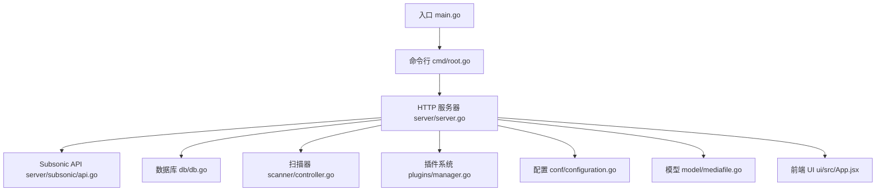

图表来源
- [main.go](file://main.go#L1-L20)
- [cmd/root.go](file://cmd/root.go#L1-L120)
- [server/server.go](file://server/server.go#L1-L120)
- [server/subsonic/api.go](file://server/subsonic/api.go#L1-L120)
- [db/db.go](file://db/db.go#L1-L120)
- [scanner/controller.go](file://scanner/controller.go#L1-L120)
- [plugins/manager.go](file://plugins/manager.go#L1-L120)
- [conf/configuration.go](file://conf/configuration.go#L1-L120)
- [model/mediafile.go](file://model/mediafile.go#L1-L120)
- [ui/src/App.jsx](file://ui/src/App.jsx#L1-L80)

章节来源
- [main.go](file://main.go#L1-L20)
- [README.md](file://README.md#L1-L89)

## 核心组件
- 自托管音乐服务器与流媒体服务
  - 提供音乐库浏览、播放、下载、书签、评分、收藏、播放队列、电台、分享等功能。
  - 支持多种音频格式，可按需转码输出。
- 音乐库管理
  - 自动扫描与目录监控，支持符号链接跟随、增量更新与缺失项清理策略。
  - 多库支持、用户库授权、路径校验与唯一性约束。
- 用户权限控制
  - 管理员与普通用户权限分离，用户库绑定、访问控制与会话超时。
- Subsonic API 兼容性
  - 提供完整 Subsonic 协议端点，兼容 Madsonic/Airsonic 客户端。
- WASM 插件系统
  - 通过能力接口（元数据代理、Scrobbler、调度回调、WebSocket 回调、生命周期）扩展功能。
- 技术栈
  - 后端：Go + Chi 路由 + SQLite + Goose 迁移。
  - 前端：React + Redux + Material UI + react-admin。
  - 插件：Wazero WASM 运行时 + Protobuf 协议。

章节来源
- [README.md](file://README.md#L44-L79)
- [go.mod](file://go.mod#L1-L147)

## 架构总览
下图展示了从进程启动到服务就绪的关键交互：main 调用 cmd.Execute，初始化配置与数据库，启动 HTTP 服务器并挂载多套路由（Native API、Subsonic API、Public、Prometheus、背景图等），同时并发启动扫描器、定时任务、播放器、插件管理器与洞察收集器。

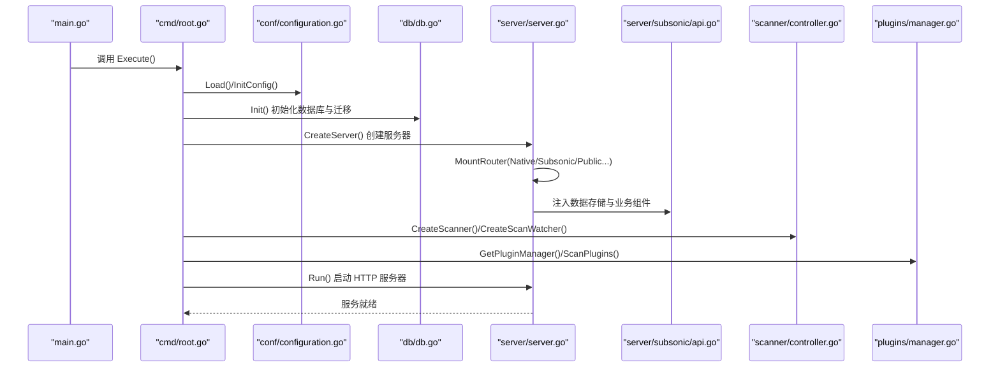

图表来源
- [main.go](file://main.go#L1-L20)
- [cmd/root.go](file://cmd/root.go#L60-L140)
- [conf/configuration.go](file://conf/configuration.go#L244-L382)
- [db/db.go](file://db/db.go#L73-L115)
- [server/server.go](file://server/server.go#L61-L145)
- [server/subsonic/api.go](file://server/subsonic/api.go#L49-L120)
- [scanner/controller.go](file://scanner/controller.go#L29-L71)
- [plugins/manager.go](file://plugins/manager.go#L111-L141)

## 详细组件分析

### 组件一：命令行与服务编排（cmd/root.go）
- 职责
  - 解析 CLI 参数与环境变量，加载配置。
  - 并发启动 HTTP 服务器、扫描器、定时任务、播放器、插件管理器、洞察收集器等。
  - 提供初始扫描、周期扫描、备份与数据库优化等调度任务。
- 关键流程
  - runNavidrome：使用 errgroup 并发启动多个服务，统一在信号量中断时优雅退出。
  - startServer：挂载 Native API、Subsonic API、Public、Prometheus、背景图等路由。
  - runInitialScan：根据迁移标记、PID 变更与扫描状态决定是否执行全量或增量扫描。
  - schedulePeriodicScan/schedulePeriodicBackup/scheduleDBOptimizer：基于 Cron 表达式调度后台任务。
  - startPluginManager/startInsightsCollector/startPlaybackServer：按配置启用插件、洞察与 Jukebox。
- 错误处理
  - 对扫描、备份、优化等任务进行错误记录与日志输出，避免单点故障影响整体服务。

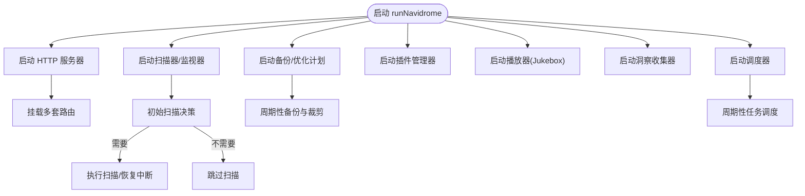

图表来源
- [cmd/root.go](file://cmd/root.go#L71-L162)
- [cmd/root.go](file://cmd/root.go#L176-L220)
- [cmd/root.go](file://cmd/root.go#L237-L285)
- [cmd/root.go](file://cmd/root.go#L316-L344)

章节来源
- [cmd/root.go](file://cmd/root.go#L60-L162)
- [cmd/root.go](file://cmd/root.go#L176-L220)
- [cmd/root.go](file://cmd/root.go#L237-L285)
- [cmd/root.go](file://cmd/root.go#L316-L344)

### 组件二：HTTP 服务器与路由（server/server.go）
- 职责
  - 创建 HTTP/HTTPS 服务器，支持 Unix Socket 与 TLS。
  - 统一中间件链：安全头、CORS、压缩、请求日志、心跳、鉴权等。
  - 挂载前端静态资源、认证路由、事件广播与 API 路由。
- 关键流程
  - Run：根据地址类型选择监听方式，启动服务并在错误时返回；优雅关闭时禁用 KeepAlive 并等待超时。
  - initRoutes：构建默认中间件组，按需启用活动面板与事件订阅。
  - mountAuthenticationRoutes：登录与管理员创建接口，支持登录限流。
  - frontendAssetsHandler：托管前端构建产物，根路径重定向至 UI。
- 安全与可用性
  - TLS 证书与私钥校验，拒绝加密私钥；支持 Unix Socket 权限设置。

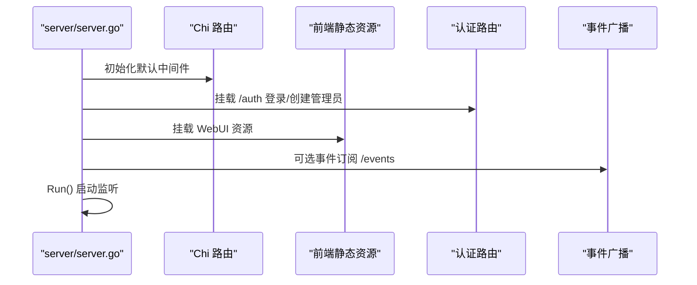

图表来源
- [server/server.go](file://server/server.go#L169-L205)
- [server/server.go](file://server/server.go#L207-L235)
- [server/server.go](file://server/server.go#L237-L243)
- [server/server.go](file://server/server.go#L61-L145)

章节来源
- [server/server.go](file://server/server.go#L61-L145)
- [server/server.go](file://server/server.go#L169-L205)
- [server/server.go](file://server/server.go#L207-L235)
- [server/server.go](file://server/server.go#L237-L243)

### 组件三：音乐库扫描与监控（scanner/controller.go）
- 职责
  - 控制扫描流程，限制并发，跟踪进度与变更，向事件总线广播扫描状态。
  - 支持外部/内置扫描器切换，提供扫描状态查询与计数统计。
- 关键流程
  - ScanFolders/ScanAll：加锁防止重复扫描，构造上下文并委派给具体扫描器实现。
  - trackProgress：聚合进度信息，按节流策略发送事件，最终汇总总数并广播结束事件。
  - IsScanning：全局原子标志位，确保同一时刻仅一次扫描。
- 事件与指标
  - 通过事件总线发送扫描状态与刷新通知；扫描完成后写入指标。

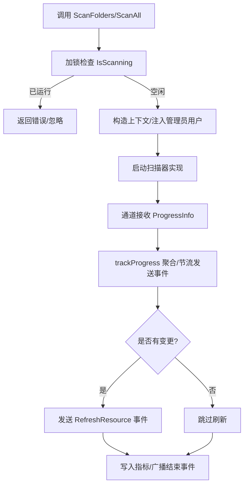

图表来源
- [scanner/controller.go](file://scanner/controller.go#L198-L249)
- [scanner/controller.go](file://scanner/controller.go#L265-L311)

章节来源
- [scanner/controller.go](file://scanner/controller.go#L29-L71)
- [scanner/controller.go](file://scanner/controller.go#L198-L249)
- [scanner/controller.go](file://scanner/controller.go#L265-L311)

### 组件四：库管理与用户权限（core/library.go）
- 职责
  - 管理用户与库的关联、访问校验、库的增删改与路径校验。
  - 在库变更时触发监控与扫描，并广播刷新事件。
- 关键流程
  - GetUserLibraries/SetUserLibraries：非管理员至少分配一个库，管理员不可手动分配。
  - ValidateLibraryAccess：管理员可访问全部，普通用户仅能访问被授权的库。
  - 仓库包装器 Save/Update/Delete：在保存/更新/删除后重启监控、触发扫描并广播刷新事件。
- 路径校验
  - 绝对路径、目录存在性、可访问性与权限检查，结合存储抽象 FS 校验。

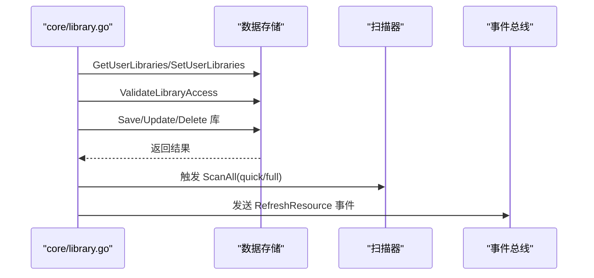

图表来源
- [core/library.go](file://core/library.go#L30-L131)
- [core/library.go](file://core/library.go#L132-L276)

章节来源
- [core/library.go](file://core/library.go#L30-L131)
- [core/library.go](file://core/library.go#L132-L276)

### 组件五：Subsonic API 兼容层（server/subsonic/api.go）
- 职责
  - 提供完整的 Subsonic 协议端点，按控制器分组组织（浏览、播放、评分、播放列表、用户、扫描、封面、歌词、分享、Jukebox 等）。
  - 中间件链：参数校验、鉴权、玩家注入、速率限制、统计记录。
  - 响应格式：支持 XML/JSON/JSONP，错误映射与日志记录。
- 关键流程
  - routes：按控制器分组挂载端点，按配置启用/禁用部分功能（如分享、Jukebox）。
  - hr/h：通用处理器，处理响应与错误，支持流式输出（如 stream/getCoverArt）。
  - sendResponse/sendError：根据 f 参数选择输出格式并记录调试/警告日志。

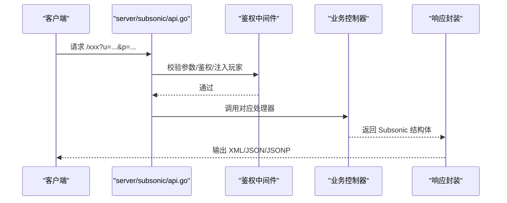

图表来源
- [server/subsonic/api.go](file://server/subsonic/api.go#L73-L223)
- [server/subsonic/api.go](file://server/subsonic/api.go#L225-L358)

章节来源
- [server/subsonic/api.go](file://server/subsonic/api.go#L73-L223)
- [server/subsonic/api.go](file://server/subsonic/api.go#L225-L358)

### 组件六：WASM 插件系统（plugins/manager.go）
- 职责
  - 发现、注册、编译与加载 WASM 插件，按能力类型（元数据代理、Scrobbler、调度回调、WebSocket 回调、生命周期）创建适配器。
  - 管理插件生命周期（OnInit）、编译缓存、并发加载与错误处理。
- 关键流程
  - ScanPlugins：扫描插件目录，解析清单，注册插件与适配器，后台预编译并初始化生命周期。
  - LoadPlugin/LoadMediaAgent/LoadScrobbler：按名称与能力加载插件实例。
  - SetSubsonicRouter：将 Subsonic 路由注入插件生态。

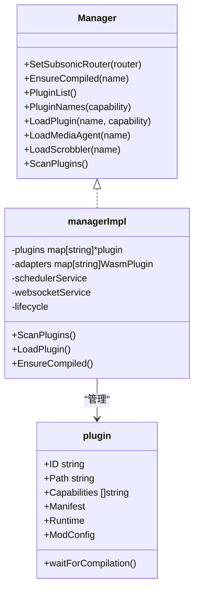

图表来源
- [plugins/manager.go](file://plugins/manager.go#L85-L141)
- [plugins/manager.go](file://plugins/manager.go#L142-L211)
- [plugins/manager.go](file://plugins/manager.go#L235-L300)
- [plugins/manager.go](file://plugins/manager.go#L347-L404)

章节来源
- [plugins/manager.go](file://plugins/manager.go#L85-L141)
- [plugins/manager.go](file://plugins/manager.go#L142-L211)
- [plugins/manager.go](file://plugins/manager.go#L235-L300)
- [plugins/manager.go](file://plugins/manager.go#L347-L404)

### 组件七：数据库与迁移（db/db.go）
- 职责
  - 封装 SQLite 连接、驱动钩子（自定义函数）、连接池大小、迁移与优化。
  - 初始化时应用迁移，关闭前执行优化；支持内存模式与 PRAGMA optimize。
- 关键流程
  - Db/Init：注册自定义驱动、打开数据库、应用迁移、记录日志。
  - Optimize：遍历连接池逐个执行 PRAGMA optimize。
  - Close：关闭前优化并关闭数据库。

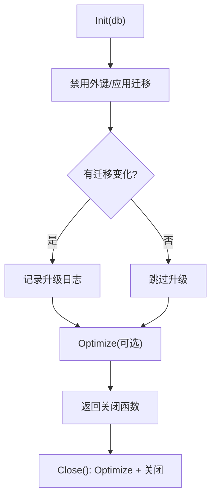

图表来源
- [db/db.go](file://db/db.go#L73-L115)
- [db/db.go](file://db/db.go#L117-L146)
- [db/db.go](file://db/db.go#L58-L72)

章节来源
- [db/db.go](file://db/db.go#L19-L57)
- [db/db.go](file://db/db.go#L73-L115)
- [db/db.go](file://db/db.go#L117-L146)
- [db/db.go](file://db/db.go#L58-L72)

### 组件八：配置系统（conf/configuration.go）
- 职责
  - 加载配置文件（INI/TOML/YAML/JSON），合并环境变量，设置默认值，校验与转换（如 Cron 表达式）。
  - 维护服务器、扫描器、Subsonic、插件、备份、外部服务、开发调试等配置项。
- 关键流程
  - InitConfig：确定配置文件来源，注册 INI 编解码器，自动环境变量绑定。
  - Load：反序列化配置、创建目录、设置日志级别与输出、校验计划任务与路径。
  - setViperDefaults：集中设置默认值，覆盖开发调试开关与外部服务开关。

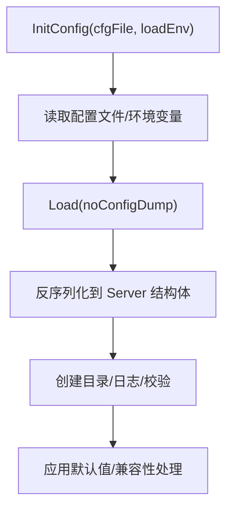

图表来源
- [conf/configuration.go](file://conf/configuration.go#L667-L720)
- [conf/configuration.go](file://conf/configuration.go#L244-L382)
- [conf/configuration.go](file://conf/configuration.go#L526-L666)

章节来源
- [conf/configuration.go](file://conf/configuration.go#L244-L382)
- [conf/configuration.go](file://conf/configuration.go#L526-L666)
- [conf/configuration.go](file://conf/configuration.go#L667-L720)

### 组件九：数据模型（model/mediafile.go）
- 职责
  - 定义媒体文件、专辑、艺术家、播放队列、用户、播放器等核心实体与仓库接口。
  - 提供媒体文件标题拼接、内容类型推断、封面 ID 计算、哈希比较、等价性判断、绝对路径拼接等工具方法。
- 关键点
  - MediaFile 结构体包含标签、参与人、 ReplayGain、时间戳等字段，支持多库与多盘集合聚合。
  - MediaFileRepository 接口定义了扫描器专用的缺失标记、最近匹配查找等方法。

章节来源
- [model/mediafile.go](file://model/mediafile.go#L22-L120)
- [model/mediafile.go](file://model/mediafile.go#L135-L159)
- [model/mediafile.go](file://model/mediafile.go#L160-L252)
- [model/mediafile.go](file://model/mediafile.go#L354-L378)

### 组件十：前端应用（ui/src/App.jsx）
- 职责
  - 基于 react-admin 构建管理界面，集成主题、国际化、热键、拖拽、播放器等。
  - 通过 dataProvider 与后端交互，按权限渲染资源与菜单。
- 关键流程
  - 创建 Redux Store，注册自定义 reducer。
  - 渲染 Admin 组件，按权限显示用户、播放器、转码、库、缺失文件等资源。
  - 集成 GA 统计与分享播放器。

章节来源
- [ui/src/App.jsx](file://ui/src/App.jsx#L1-L80)
- [ui/src/App.jsx](file://ui/src/App.jsx#L80-L173)

## 依赖关系分析
- 外部依赖
  - Web 框架：Chi 路由、CORS、限流、安全中间件。
  - 数据库：SQLite + mattn 驱动 + goose 迁移。
  - 日志：Logrus + 自定义脱敏。
  - 插件：Wazero WASM 运行时 + Protobuf 协议。
  - 媒体：FFmpeg（播放器/转码）、TagLib（元数据读取）。
- 内部模块耦合
  - server 依赖 conf、db、scanner、plugins、core 等模块。
  - scanner 依赖 core.artwork、core.playlists、metrics、events。
  - subsonic 路由依赖 core.MediaStreamer、Archiver、Players、Playlists、Share、Playback、Metrics 等。
  - plugins 依赖 core.agents、core.scrobbler、metrics。

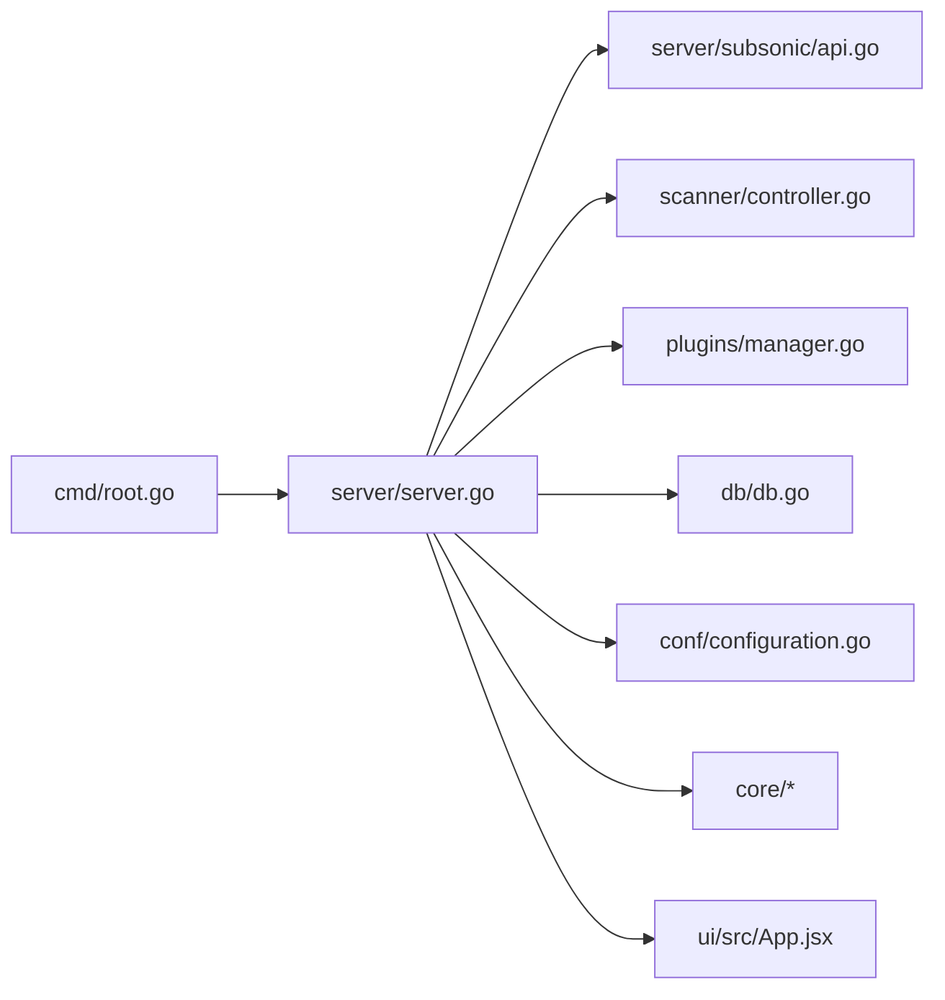

图表来源
- [cmd/root.go](file://cmd/root.go#L110-L136)
- [server/server.go](file://server/server.go#L53-L60)
- [server/subsonic/api.go](file://server/subsonic/api.go#L49-L71)
- [scanner/controller.go](file://scanner/controller.go#L29-L43)
- [plugins/manager.go](file://plugins/manager.go#L111-L141)
- [db/db.go](file://db/db.go#L30-L57)
- [conf/configuration.go](file://conf/configuration.go#L244-L382)
- [ui/src/App.jsx](file://ui/src/App.jsx#L1-L80)

章节来源
- [go.mod](file://go.mod#L1-L147)

## 性能考量
- 数据库优化
  - 连接池大小与 CPU 核数相关；迁移后可选 PRAGMA optimize；关闭前执行优化。
- 扫描与监控
  - 扫描加锁避免并发冲突；进度节流减少事件风暴；支持符号链接跟随与增量更新。
- 转码与缓存
  - 可配置转码缓存大小与图片缓存大小；支持 Opus 等编码；ReplayGain 支持。
- API 限流与节流
  - 登录限流、封面请求节流与回压，降低热点资源压力。
- 插件编译缓存
  - 预编译与缓存提升插件加载速度，避免重复编译开销。

章节来源
- [db/db.go](file://db/db.go#L43-L57)
- [db/db.go](file://db/db.go#L117-L146)
- [scanner/controller.go](file://scanner/controller.go#L29-L43)
- [server/server.go](file://server/server.go#L169-L205)
- [server/subsonic/api.go](file://server/subsonic/api.go#L173-L183)
- [plugins/manager.go](file://plugins/manager.go#L235-L300)

## 故障排查指南
- TLS 私钥加密问题
  - 若私钥为加密格式，服务器启动会报错并提示使用 openssl 解密。
- 数据库无法打开或迁移失败
  - 检查数据库路径权限、迁移脚本是否嵌入成功、迁移日志与错误输出。
- 扫描未执行或重复扫描
  - 查看扫描锁状态与日志；确认扫描计划、监视器等待时间与 PID 配置变更。
- 插件加载失败
  - 检查插件清单、能力类型、编译缓存初始化与超时；查看编译错误日志。
- API 响应异常
  - 检查参数校验、鉴权中间件、响应格式与错误映射；开启调试日志定位问题。

章节来源
- [server/server.go](file://server/server.go#L263-L315)
- [db/db.go](file://db/db.go#L88-L115)
- [scanner/controller.go](file://scanner/controller.go#L251-L263)
- [plugins/manager.go](file://plugins/manager.go#L70-L83)
- [server/subsonic/api.go](file://server/subsonic/api.go#L281-L358)

## 结论
Navidrome 通过清晰的模块划分与稳健的工程实践，实现了从音乐库扫描、元数据提取、权限控制到 API 兼容与插件扩展的完整闭环。其并发编排、事件驱动与可观测性设计，使得在中小规模到中大规模音乐库场景下均能稳定运行。对于初学者，建议从配置与初始扫描入手；对于开发者，可围绕扫描器、Subsonic 兼容层与插件系统进行深度定制与扩展。

## 附录
- 新用户使用案例（启动与扫描）
  - 步骤
    1) 准备音乐目录与数据/缓存目录，确保写权限。
    2) 启动服务：执行命令行程序，默认监听地址与端口，支持 TLS 与 Unix Socket。
    3) 初始扫描：根据配置决定是否在启动时扫描，或等待周期扫描任务触发。
    4) 访问 Web UI：登录后即可浏览音乐库、创建播放列表、设置转码与播放器。
  - 参考路径
    - [cmd/root.go](file://cmd/root.go#L316-L344)
    - [server/server.go](file://server/server.go#L61-L145)
    - [scanner/controller.go](file://scanner/controller.go#L198-L249)
    - [conf/configuration.go](file://conf/configuration.go#L244-L382)